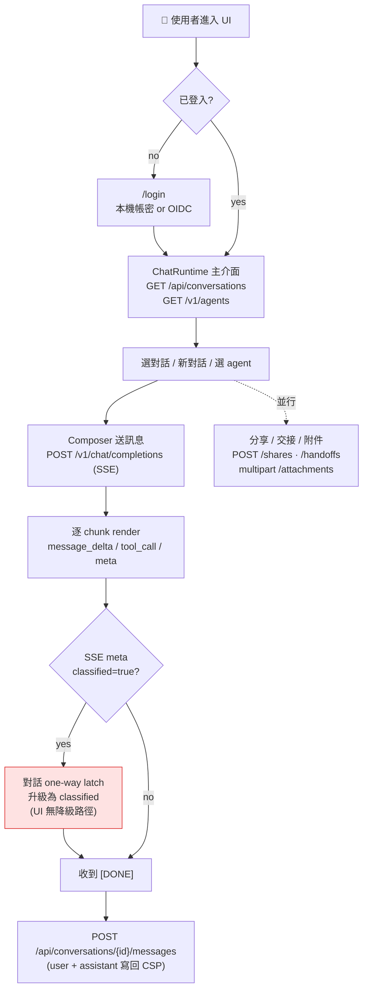

# ANILA Runtime UI

ANILA 平台的前端 Runtime（React + Vite），讓終端使用者登入後與 agent 對話、分享對話、交接、上傳附件、使用 `anila-router` pseudo-agent 讓主 LLM 自動分派。

> 關於平台整體架構、compose 啟動、環境變數參照請看 repo 根 [`README.md`](../../README.md) 與 [`anila_plan.md`](../../anila_plan.md)。本 README 聚焦 UI 子專案本身。

---

## 對接對象

| 對象 | 路徑 | 認證 |
|---|---|---|
| **CSP Control Plane** | `/api/*` | JWT（自動 refresh） |
| **CSP Data Plane** | `/v1/*` | CSP API Key（`sk-...`） |
| **ANILA Router** | `/v1/*` | CSP API Key（pseudo-agent `anila-router`） |

---

## UI 運作流程



<details>
<summary>📄 ASCII 版本</summary>

```
┌─────────────────────────────────────────────────────────────┐
│                      使用者進入 UI                            │
└──────────────────────────┬──────────────────────────────────┘
                           │ 未登入？
                           ▼
            ┌──────────────────────────────┐
            │  /login（帳密 or OIDC）       │
            │  - 本機帳號 → 後端 /api/auth/ │
            │    login 取 JWT              │
            │  - OIDC → 後端 callback 直接  │
            │    回傳 JWT + 24h API Key     │
            └──────────────┬───────────────┘
                           │ JWT 放 localStorage
                           │ API Key 放 sessionStorage
                           ▼
            ┌──────────────────────────────┐
            │     主介面 ChatRuntime        │
            │  - GET /api/conversations    │
            │    載入對話列表               │
            │  - GET /v1/agents             │
            │    載入 agent manifest        │
            │    （含 requires_encryption） │
            └──────────────┬───────────────┘
                           │
                           ▼
    ┌──────────────────────────────────────────────────────┐
    │  使用者選對話 / 按「新對話」／選 agent               │
    └────────────┬───────────────────────────────┬─────────┘
                 │                               │
                 ▼                               ▼
      ┌─────────────────────┐         ┌─────────────────────┐
      │ Composer 送訊息      │         │ 附件 / 分享 / 交接   │
      │ POST /v1/chat/       │         │ 見下方區塊           │
      │ completions (SSE)    │         └─────────────────────┘
      │   ↓                  │
      │ 逐 chunk render       │
      │   ↓                  │
      │ SSE meta classified? │──Yes──▶ 整個對話 one-way
      │                      │         latch 為 classified
      │   ↓                  │         （UI 不能降級）
      │ 收到 [DONE]           │
      │   ↓                  │
      │ POST /api/            │
      │ conversations/{id}/   │
      │ messages              │ 把 user / assistant 訊息
      │ (persist)             │ 寫回 CSP
      └──────────────────────┘
```

</details>

### 分享 / 交接 / 附件

```
分享：      ShareDialog → POST /api/conversations/{id}/shares
            → 回傳 /s/c/<token> 連結

交接：      HandoffMenu → POST /api/handoffs
            → 對方於 /handoffs 頁接受（accept）/ 拒絕（reject）

附件：      Composer onAttach → POST /api/attachments (multipart)
            → 回傳 attachment_id → 一併送進 /v1/chat/completions
```

<!-- Wave 2 / Sprint 7 X 相關過時內容已於 Sprint 8 X / Phase H 從本檔
     全面同步，不再需要警語提醒。如要追溯舊版寫法，看 git log。 -->

---

## 先決條件

- Node **20+**（Dockerfile 固定 22）
- 可連線的 CSP（`myCSPPlatform` `:8000`）
- 可連線的 Router（`anila-core-router` `:9000`）
- 一個落地 LLM endpoint（供 CSP 轉發）

---

## 安裝與啟動

```bash
cd ANILA_UI/anila-ui
cp .env.example .env.local
# 編輯 .env.local（若 CSP / Router 不在 localhost）
npm install
npm run dev
```

打開 <http://localhost:5173>，首次進入會重導到 `/login`：

1. 用 CSP 帳號登入（本機帳密或 OIDC）。SPA 完全走 cookie session（Wave 2 / Sprint 7 X 後不再需要、也不再支援前端輸入 API Key）。
2. 登入完即可直接開始對話 — 所有 `/api/*` + `/v1/*` 請求都用 httpOnly cookie 認證。
3. SDK / curl 路徑仍可走 `Authorization: Bearer sk-…`；但這條 path 不在 SPA 的職責內，要用 SDK 請至 CSP `/api-keys` 自行 provision。

## 環境變數

| 變數 | 用途 | 預設 |
|---|---|---|
| `VITE_CSP_BASE_URL` | Control Plane（JWT `/api/*`）+ Data Plane（`/v1/*`）基底 | `http://localhost:8000` |
| `VITE_ROUTER_BASE_URL` | ANILA Router 基底（`anila-router` pseudo-agent） | `http://localhost:9000` |

若其中任一未設，`src/runtime/api.js` 會在 boot 時 `console.warn` 標示缺失。空值會 fallback 成相對路徑，只有在反向代理同時 front 這兩個服務時才能正常運作。

## Scripts

| 指令 | 作用 |
|---|---|
| `npm run dev` | Vite dev server（HMR）`:5173` |
| `npm run build` | Production build 到 `dist/` |
| `npm run preview` | 在本機跑 production build |
| `npm test` | Vitest 測試（目前範圍逐步擴大中 — 見 `anila_plan.md` Wave D） |

---

## 專案結構

```
src/
├── app.jsx              # ChatRuntime — agent 選擇、送訊息、persist 對接
├── chat.jsx             # Sidebar、MessageBubble、Composer
├── collab.jsx           # ShareDialog、HandoffMenu、TagEditor
├── trust.jsx            # CitationsDrawer、ConfidentialWatermark
├── multiagent.jsx       # ParallelCompareView（2-3 個 agent 並排比對）
├── login.jsx            # Login 頁（本機 + OIDC）
├── tweaks.jsx           # 視覺微調 panel（storyboard）
├── main.jsx             # ReactDOM 掛載入口
├── markdown.jsx         # ReactMarkdown 包裝 + KaTeX / highlight.js 設定
├── components.jsx       # 共用 UI 元件（lock badge、attachment chip 等）
├── icons.jsx            # 自製 SVG icon set
├── data.jsx             # mock / placeholder data 給 EmptyState 等
└── runtime/
    ├── api.js           # fetch wrapper + cookie + CSRF + multipart helper
    ├── auth.jsx         # AuthProvider + useAuth hook
    ├── conversations.js # CSP control-plane endpoint wrappers
    ├── sse.js           # SSE parser（/v1/chat/completions）
    ├── classified.js    # one-way latch helper（meta → conversation）
    ├── classifyRetryQueue.js  # Sprint 8 X / Phase K — sessionStorage retry
    │                          # queue + page-focus flush 確保 latch 永遠抵達 CSP
    ├── messageMeta.js   # 訊息 metadata 正規化
    ├── searchSynonyms.js # tag 搜尋同義詞展開（特休 → 年假 / HR）
    ├── time.js          # 相對時間 / ISO 格式 helper
    └── titleClean.js    # LLM 自動產出標題的後處理（去重、placeholder 黑名單）
```

> 註：本 repo 沒有 `src/styles.css` 或 Tailwind import — 全 UI 仰賴 inline 元件樣式 + `index.html` 內含的 base CSS。要全域改 token 請改 `tokens.css`（在主 frontend 或本 SPA 的 index.html）。

---

## 後端端點對應

所有後端 schema 在 `myCSPPlatform/backend/app/api/`：

- `GET/POST /api/conversations` ＋ `GET/PUT/DELETE /api/conversations/{id}`
- `POST /api/conversations/{id}/messages`
- `POST /api/conversations/{id}/shares`（含 `GET` / `DELETE`）
- `POST /api/attachments`（multipart）
- `POST /api/handoffs` ＋ `/accept` `/reject` `/cancel`
- `POST /v1/chat/completions`（SSE）— CSP 或 Router

**Classified 規則由後端決定：** 當 agent `requires_encryption=true` 或 SSE meta 帶 `classified=true`，對話會 one-way latch 成 classified，UI 無降級介面。

---

## Docker

### 單獨 build

```bash
docker build \
  --build-arg VITE_CSP_BASE_URL=http://csp.example:8000 \
  --build-arg VITE_ROUTER_BASE_URL=http://router.example:9000 \
  -t anila-runtime-ui .
docker run -p 8080:80 anila-runtime-ui
```

### 與 CSP、Router 一起跑

**推薦使用 repo 根 [`docker-compose.yml`](../../docker-compose.yml)**，會一起拉起 `csp-db` + `csp` + `redis` + `ingestion-worker` + `router` + `anila-ui` + `anilalm` + `pptx-renderer` + `nginx`：

```bash
cd ../../
docker compose up -d
# UI 經 nginx 對外，預設 https://localhost:4443/ （HTTP 80 / HTTPS 443 也都通）。
# anila-ui container 自身只 expose: 80，沒有 host port mapping —
# 不要去打 localhost:3001（那是舊版部署 doc 的遺跡）。
```

---

## 開發備忘

### 登入流程（Wave 2 / Sprint 7 X 後）

```
POST /api/auth/login          (credentials: include)
  { username, password }
    ↓
  Set-Cookie: anila_access_token  (httpOnly, SameSite=Lax)
              anila_refresh_token (httpOnly, SameSite=Lax)
              anila_csrf          (NOT httpOnly — JS 讀來放 X-CSRF-Token)
    ↓
SPA 後續 /api/* 與 /v1/* 全用 cookie；POST/PUT/DELETE 自動帶 X-CSRF-Token。
```

SPA **不再** 持有任何 plaintext token 或 API Key — 完全沒有 localStorage / sessionStorage 寫入路徑。OIDC callback 也不再 mint 24h 短效 API Key（Wave 2 廢除）。

### Token refresh

`runtime/api.js` 攔截 401，呼叫 `POST /api/auth/refresh`（cookie 自動帶 refresh token），成功後重送原請求；失敗則踢回 `/login`。整段不經前端 JS — refresh token 全程在 httpOnly cookie 裡。

### SSE parsing

`runtime/sse.js` 解析 `data: {...}` 行，產生 `{ type, payload }` stream。支援：

| event | 用途 |
|---|---|
| `message_delta` | 文字片段 |
| `tool_call_started` / `tool_call_finished` | 工具呼叫（UI trace） |
| `meta` | 含 `classified`、`agent_id`、`citations` 等 |
| `usage_update` | token 使用量 |
| `stream_done` | 結束 |
| `error` | 錯誤 |

### Classified latch 實作

`app.jsx` 的 `applyMeta()`：只在收到 `classified=true` 時把 conversation 升級為 classified，**永不**從 `true` 降回 `false`。這是對應平台規格的 one-way 規則。

Sprint 8 X / Phase K 後，latch 的後端持久化（`POST /api/conversations/:id/classify`）走以下 pipeline：

1. SSE meta 抵達 → React state 立刻 latch（不阻塞 UI）。
2. 若當下 `convId` 已是 numeric server id → 直接打 classify endpoint。失敗進 retry queue。
3. 若 `convId` 還是 client temp string id（offline / 尚未 reconcile）→ 直接 enqueue，待 `ensureConversation` 拿到 numeric id 後 `resolveTempId` replay。
4. Window focus 觸發 `flushAll`，把 retry queue 裡所有可送的 entry 重打。

對應檔：`runtime/classifyRetryQueue.js`（sessionStorage 為 backing store）。後端的 `POST /api/conversations/:id/declassify` endpoint 已在 Phase K 移除 — 平台對 classified 的 invariant 是真的單向。

---

## Release Notes

### Sprint 8 X — Phase K（2026-05-01）— Classified latch reload-escape hotfix

- `applyMeta()` 拿掉 `typeof convId === "number"` 死 guard 與 `.catch(() => {})` 吞失敗的問題；改成失敗 / temp-id 都 enqueue 到 `runtime/classifyRetryQueue.js`，window focus 觸發 flush，`ensureConversation` 拿到 numeric id 後 `resolveTempId` replay。修正使用者實測「重整 → 鎖被解除」的 P0 bug。
- 後端 `POST /api/conversations/:id/declassify` 整支 endpoint + service method 一起拔掉 — 違反平台 one-way latch invariant。如真有誤標需處理，走 admin manual ops + audit 而非 HTTP API。
- 11 個新 vitest case 覆蓋 retry queue（enqueue / replay / focus flush / 失敗 re-queue / corrupt sessionStorage 容錯）。

### Sprint 7 X — anila-ui API Key UI 全面下架（2026-04-27）

- 拔掉 `ApiKeyPopover` / `ApiKeyTab` / `maskApiKey` / 對應 icon imports；`streamChatCompletion` 的 legacy `apiKey` 參數同步移除。
- header 的 `sk-…` dropdown、Settings 的「API Key」tab、chat menu 的「API Key」項目全部不再存在 — 比保留死 UI 更安全：使用者無從填入 prod key 後得到「✓ 已儲存」的假成功訊息。
- 對應 commit：`0b8509e` / `0b22f54`。

### Sprint 5 X / 6 X — SSO 地基 + 全面資安修補（2026-04-27）

- OIDC：PKCE (S256) + nonce + JWKS 驗 `id_token`；`alg=none` 拒收；`email_verified` 強制；email-only 帳號合併禁止；`next_path` 集中 `sanitize_next_path` 擋 open-redirect。
- LDAP 完整下線（migration `0021` DROP `auth_providers.ldap_*`）。
- `users.local_password_disabled` flag（migration `0022`）讓 admin 對個別使用者切 SSO-only。
- Wave 2 cookie 流程接續鞏固：CSRF middleware 改 `hmac.compare_digest`；Bearer 路徑豁免 CSRF；nginx 6 個安全 header 全到位。

### Wave 2 — Auth / Session（2026-03）

- SPA 移除 localStorage JWT 與 sessionStorage API Key，完全改走 **httpOnly cookie + CSRF**。
- OIDC callback 不再發 short-lived API Key。
- 新增 `POST /api/auth/logout`。

### 2026-04-24 — AgenticRAG template 同步 + chat UI 改版

- Cross-reference 更新：`AgenticRAG` 為「**官方 RAG agent template**」。
- Chat bubble 重設計：Claude.ai-style flat rounded；Assistant 無頭列框、工具列 hover-reveal。
- `ReasoningSummary`：合併 routing trace + thinking 成單行 ghost row。
- Conversation sidebar：title 兩行 clamp；dropdown 改 `position: fixed` 避 overflow 切斷。
- 搜尋框 `×` clear button + Esc；tag 搜尋 + 同義詞展開（`特休` 可找到 `年假` / `HR`）。
- Composer：`@` autocomplete 下拉實際可用 agent；paste 優先 `text/*` 避免文字被 fallback 截圖當附件。
- EmptyState 改為單卡「ANILA 可以做什麼？」，prompt 由實際 agent 清單動態產出。
- Router 系統 prompt 新增「ambiguous → clarify」規則；`_normalize_clarify_bullets` 把 inline `·` 分隔的候選 agent 轉成 markdown bullet。

### 測試覆蓋

- Vitest: **80 tests**（69 原有 + Phase K 新增 11）。`messageMeta` / `titleClean` / `searchSynonyms` / `classified` / `sse` / `normalizeAgents` / `classifyRetryQueue`。

---

## 相關文件

- 平台整體：[`../../README.md`](../../README.md)
- CSP（本 UI 的 backend）：[`../../myCSPPlatform/README.md`](../../myCSPPlatform/README.md)
- Router（`anila-router` pseudo-agent 的實作端）：[`../../anila-core-router/README.md`](../../anila-core-router/README.md)
- **官方 RAG agent template**（可註冊被本 UI 分派）：[`../../AgenticRAG/README.md`](../../AgenticRAG/README.md)
- 路線圖：[`../../anila_plan.md`](../../anila_plan.md)
- Service-token cutover runbook：[`../../docs/runbooks/service-token-cutover.md`](../../docs/runbooks/service-token-cutover.md)

---

## License

見 repo 根 [`LICENSE`](../../LICENSE)。

---

**Last updated**: 2026-05-01 (Sprint 8 X — Phase K + README rewrite) · **Framework**: React + Vite · **Talks to**: CSP (`/api/*` + `/v1/*` cookie) + Router (`/v1/chat/completions` cookie + `model=anila-router`) — both fronted by `nginx`
