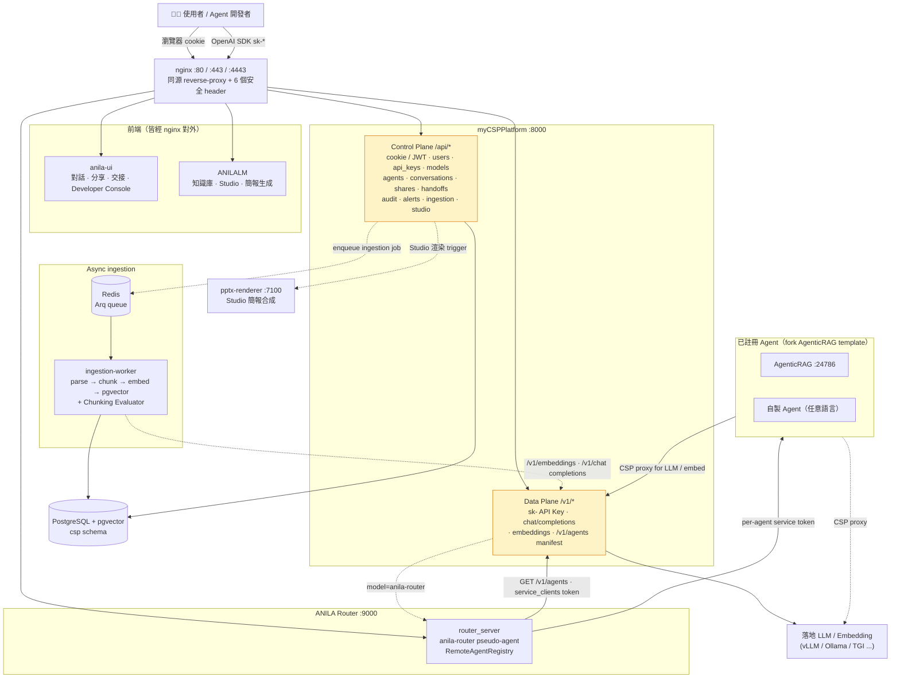

# ANILA 平台

> **Runtime-first、On-prem 多 Agent 平台。** 三個服務、一個落地 LLM，docker compose 一鍵啟動。

ANILA 是一套企業內部的多 Agent 平台：統一管理模型與 API Key、對外以 OpenAI 相容介面提供推論、讓開發者基於樣板複製出自己的 Agent 並註冊進來、讓終端使用者透過統一 UI 與所有 Agent 對話，並以「主 LLM 未加密 → 遇到加密 agent 整段對話升級為加密」的單向閂鎖（one-way latch）處理敏感資料。

平台層內建**使用者記憶**：每輪對話自動萃取個人事實 + embed 訊息片段，下次對話自動帶入，跨 agent 共享；agent 也可透過 service token 呼叫 `/api/memory/users/{id}/facts` 主動讀取使用者背景做個人化（route 3，[`docs/briefing/anila-memory-layer-rfc.md`](./docs/briefing/anila-memory-layer-rfc.md)）。

| 子專案 | 角色 | 預設 Port |
|---|---|---|
| [`myCSPPlatform`](./myCSPPlatform/) | **CSP**（Control & Data Plane）— 使用者 / API Key / 模型 / Agent 註冊 / 對話 / 附件 / 分享 / 交接 / 審計 / Studio (PPTX & 報告) / Ingestion (Knowledge Collections + Evaluator) / OpenAI 相容代理 | `:8000` |
| [`anila-core`](./anila-core/) | **Runtime foundation（SDK）** — Python agent runtime 基座（api / registry / engine / tools / providers / storage / **memory（short_term + long_term + backends + clients）**／ compact / cli / **security** / ingestion 共用 chunking_plugins）。Router 與所有 agent 共用 | — |
| [`anila-core-router`](./anila-core-router/) | **Router** — OpenAI 相容分派器；依請求自動路由到註冊的 Agent；Sprint 8 X 起以 `service_clients.router-primary` per-credential token 走 s2s | `:9000` |
| [`anila-agent`](./anila-agent/) | **官方 sub-agent 模板**（git subtree from [`zzw09773/anila-agent`](https://github.com/zzw09773/anila-agent)）— 基於 openai-agents SDK + LiteLLM，移植 Claude Code 的 memdir 長期記憶、hook 介面、slash-command CLI。開發者 fork 上游 repo 當起點，ANILA 透過 subtree 同步本地 copy；CSP 把這個目錄當 template 提供下載 | `:24786`（獨立執行時） |
| [`ingestion-worker`](./ingestion-worker/) | **Async pipeline worker** — Arq + Redis backbone；CSP 推 job 進 queue 後 worker 解析 → 分塊 → embed → 寫 pgvector，並跑 Chunking Evaluator 的 LLM-as-judge | （無 host port） |
| [`ANILA_UI/anila-ui`](./ANILA_UI/anila-ui/) | **Chat Runtime UI** — React 聊天介面，cookie + SSE，串 CSP 與 Router；經由 nginx 對外（dev 直跑 `:5173`） | nginx 前 |
| [`ANILALM`](./ANILALM/) | **Knowledge-base 前端 + Studio** — Vite + React + TS SPA；CSP `/api/ingestion/*` + `/api/conversations/*` + Studio 入口；mount 在 nginx `/anilalm/` 子路徑 | nginx 前 |
| [`ANILALM/pptx-skill`](./ANILALM/pptx-skill/) | **PPTX render service** — Node.js + pptxgenjs；Studio 生簡報的後端；CSP 透過 internal network 觸發 | `:7100`（internal） |
| **`nginx`**（compose service） | 對外閘道；同源 reverse-proxy `/api`、`/v1`、`/router`、`/anilalm/`、`/static`、`/uploads`；6 個安全 header（HSTS / CSP / Permissions-Policy / Referrer-Policy / X-Frame-Options / X-Content-Type-Options） | `:80` / `:443` / `:4443` |
| **`redis`**（compose service） | ingestion-worker 的 queue backing store；不對外暴露 | （無 host port） |
| [`runtime_logic`](./runtime_logic/) | **TS Runtime 參考材料**（READ-ONLY）— 用來對照移植到 `anila-core` 的 agent runtime 設計原本；原始碼 gitignored | — |

> **唯一的規劃文件（single source of truth）**：[`anila_plan.md`](./anila_plan.md)。
>
> **Onyx 已搬離本 repo**（2026-04-27）：原本 `onyx/` 是 upstream clone，現由 agent 開發團隊在他們自己的 repo 維護。我方僅保留 handover 文件 [`docs/onyx-target-system-api-spec.md`](./docs/onyx-target-system-api-spec.md) 與 [`docs/onyx-application-plan.md`](./docs/onyx-application-plan.md)。完整變更原因見 [`docs/changelog/2026-04-27-onyx-handover.md`](./docs/changelog/2026-04-27-onyx-handover.md)。需要 Onyx 原始碼請 `git clone` 對方專案。

---

## 整體架構



<details>
<summary>📄 ASCII 版本（離線 / email / 舊 Markdown renderer）</summary>

```
        使用者 / Agent 開發者 / OpenAI SDK / curl
                       │ cookie (SPA) · sk- (SDK)
                       ▼
        ┌──────────────────────────────────────┐
        │  nginx :80 / :443 / :4443             │
        │  reverse-proxy + 6 安全 header        │
        └─┬──────────┬─────────┬─────────┬─────┘
          │          │         │         │
          ▼          ▼         ▼         ▼
        anila-ui  ANILALM    CSP        Router
        (SPA chat) (KB+Studio) :8000    :9000
                                │         │
        /api/*  cookie/JWT      │         │
        /v1/*   cookie/sk-      │         │
                                │         │
                    ┌───────────┴────┐    │
                    │  Control plane │    │ /v1/chat/completions
                    │  Data plane    │◀───┘    model=anila-router
                    │  Studio API    │   per-agent service token
                    │  /api/ingestion│         │
                    └─────┬──────────┘         │
                          │ enqueue            ▼
                          ▼              已註冊 Agent
                       Redis ─────▶ ingestion-worker
                       (Arq queue)   parse · chunk
                                     · embed · index
                                     · evaluator
                          │                    │
                          ▼                    ▼
                     PostgreSQL +         CSP /v1/* (callback
                     pgvector              for LLM / embeddings)
                                                │
                                                ▼
                                     落地 LLM / Embedding
                                     (vLLM / Ollama / TGI ...)

  Studio 簡報生成：CSP 內部呼叫 pptx-renderer :7100 (internal)
```

</details>

**核心資料流（一次聊天請求）：**

```
使用者於 UI 送訊息
  │
  ├─ UI POST /v1/chat/completions  model="anila-router"  →  Router
  │
  │   Router 用 caller 的 Bearer API Key 呼叫 CSP:
  │     - GET  /v1/agents              取 agent manifest（requires_encryption 等）
  │     - POST /v1/chat/completions    主 LLM 判斷要不要分派
  │
  ├─ 主 LLM 回 "我需要叫 agent X"
  │     Router 以 caller 的 API Key 轉發到 agent X 的 endpoint_url
  │     agent X 內部可再呼叫 CSP /v1/* 拿 RAG、Embedding 等
  │
  ├─ Router / CSP 將 SSE 逐 chunk forward 回 UI
  │     同時在 meta 標注 classified=true（若 agent requires_encryption）
  │
  └─ UI 收到 classified=true → 對話永久閂鎖為加密模式（one-way latch，不可降級）
```

---

## 快速開始（compose 一鍵啟動）

### 1. 準備落地（on-prem）LLM

ANILA **不含雲端 LLM fallback，也不做 token/request quota**。把 `LOCAL_LLM_BASE_URL` 指向任何 OpenAI 相容 endpoint 即可：

| 後端 | `LOCAL_LLM_BASE_URL` | `LOCAL_LLM_MODEL` |
|---|---|---|
| 宿主機 Ollama | `http://host.docker.internal:11434/v1` | `llama3.2` |
| 叢集內 vLLM | `http://vllm.llm.svc.cluster.local:8000/v1` | 你部署時設定的模型名稱 |
| 本機 llama.cpp | `http://host.docker.internal:8080/v1` | `local-model` |

Embedding endpoint (`LOCAL_EMBEDDING_BASE_URL`) 若未設則預設等同 LLM URL。

### 2. 啟動整個 stack

```bash
# 於 repo 根目錄。需要 Docker + Compose v2。
cp .env.example .env       # 範本含全部必設變數註解；填好真值
docker compose up -d
```

`.env` 至少要填：

| 變數 | 為什麼必要 |
|---|---|
| `ANILA_ALLOW_DEV_SECRET=1` | dev 才設；正式環境拿掉以啟用 startup_security 對 dev 預設值的拒絕 |
| `CSP_SECRET_KEY` | JWT 簽署 + credential AES-GCM 主鑰；換值會讓所有加密 row 失效 |
| `CSP_SERVICE_TOKEN` | CSP ↔ agent 的 s2s token |
| `CODESERVER_PASSWORD` | compose `:?required` — 不設就拒絕啟動 |
| `CODESERVER_WORKSPACE` | compose `:?required` — 必須指向非機密目錄（範例：`./share/codeserver-sandbox`） |
| `INTERNAL_PLATFORM_API_KEY` | ingestion-worker 系統帳號 API Key |
| `LOCAL_LLM_BASE_URL` / `LOCAL_LLM_MODEL` | 落地 LLM endpoint（OpenAI 相容）|

啟動順序（由 healthcheck 串接）：`csp-db` → `csp` + `redis` → `ingestion-worker` → `router` → `anila-ui` + `anilalm` + `pptx-renderer` → `nginx`（最後對外閘道）。首次啟動約 30 秒（含 alembic migration 至 `0029` + 自動 seed smoke 使用者與 API Key）。

> **正式環境**：把 `.env` 移除 `ANILA_ALLOW_DEV_SECRET=1`，所有 dev 預設值（`SECRET_KEY=dev-secret-key-change-in-prod` / `ADMIN_PASSWORD=changeme` / `CSP_SERVICE_TOKEN=dev-service-token` / `DB_PASSWORD=csp_password` / `INTERNAL_PLATFORM_API_KEY=sk-internal-worker-changeme` / `CODESERVER_PASSWORD=changeme-codeserver`）都會被 `app/services/startup_security.py` 拒絕，container 直接開不起來，避免無聲帶 dev secret 上線。

### 3. 驗證各服務

```bash
curl http://localhost:8000/health    # CSP
curl http://localhost:9000/health    # Router（會回報 cached_agents 與 last_refresh_error）
start http://localhost:3001          # UI (Windows) / macOS: open / Linux: xdg-open
```

> Router 的 `/health` 會暴露 `last_refresh_error`。若非 null 代表 Router 抓不到 CSP 的 agent 清單 — 通常是 `CSP_BASE_URL` 或 API Key 設錯。

### 4. Smoke test（真實打本地 LLM）

```bash
curl -N -X POST http://localhost:9000/v1/chat/completions \
  -H "Authorization: Bearer $SMOKE_USER_API_KEY" \
  -H "Content-Type: application/json" \
  -d '{"model":"anila-router","messages":[{"role":"user","content":"say hi"}],"stream":true}'
```

會看到 SSE chunk 從 `落地 LLM → CSP → Router → 你的終端` 逐段吐出。若已註冊 agent 且主 LLM 判定該分派，Router 會把 agent 自身的 SSE stream 即時 forward 回來。

---

## 本地開發（不使用 Docker）

每個服務可獨立跑，各讀自己的 env（詳見各子專案 README）：

```bash
# 1) CSP
cd myCSPPlatform
cp .env.example .env   # 改 SECRET_KEY / ADMIN_PASSWORD / AUTO_REGISTER_MODELS
./start.sh up          # 或 uv run uvicorn backend.app.main:app --reload --port 8000

# 2) Router
cd anila-core-router
pip install -e "../anila-core"          # pure runtime（不需要 RAG extras）
export CSP_BASE_URL=http://localhost:8000
uvicorn main:app --reload --port 9000

# 3) UI
cd ANILA_UI/anila-ui
cp .env.example .env.local
npm install && npm run dev   # :5173
```

---

## 維護 anila-agent（sub-agent 模板）

[`anila-agent/`](./anila-agent/) 是用 **git subtree** 從 [`zzw09773/anila-agent`](https://github.com/zzw09773/anila-agent) 拉進來的 — 雙向同步、不是 submodule（沒有 `.gitmodules`、build context 看到的是普通檔案、新人 `git clone ANILA` 就拿到全部內容）。

### 第一次 setup remote（每台機器一次）

```bash
git remote add anila-agent https://github.com/zzw09773/anila-agent.git
git fetch anila-agent
```

> `git remote -v` 看不到 `anila-agent` 才需要這步；既有的 ANILA clone 從 push 後拉下來不會自動帶 remote。

### 把上游更新拉進 ANILA

```bash
git subtree pull --prefix=anila-agent anila-agent main
```

會產生一個合併 commit（記錄上游 SHA，subtree 之後比對 diff 用）。**不要 squash 也不要 rebase 這條 commit** — 會讓下次 `subtree pull` 找不到 base，整段 history 重新匯入。

### 把 ANILA 這邊的修改推回上游

```bash
git subtree push --prefix=anila-agent anila-agent <branch-name>
```

通常推到一條 feature branch、在 anila-agent repo 開 PR，而不是直接推 `main`。

### 注意事項

- `anila-agent/` 是 **template 內容**，不是 ANILA runtime 程式碼。改 ANILA 的 agent 邏輯 (router / memory / tools 等) 不該動這裡。
- 修這個目錄等同修上游模板，其他基於 anila-agent 的專案下次 sync 都會吃到。建議先在 anila-agent repo 開 PR 討論再 push。
- CSP 的 `/app/anila-template` mount 直接吃這個目錄（[`docker-compose.yml`](./docker-compose.yml) `csp.volumes`），所以 subtree pull 後**不用重 build CSP**，只要 `docker compose restart csp` 重新讀 volume 就生效。

---

## 專案結構

```
ANILA/
├── myCSPPlatform/        # CSP：FastAPI + SQLAlchemy + Alembic + Vue 管理 UI
│                         # 含 Studio (PPTX/報告) + Ingestion (KB) + Evaluator
├── anila-core/           # Runtime foundation（SDK）：api / registry / engine /
│                         # tools / providers / storage / memory / compact / cli /
│                         # security / ingestion 共用 chunking_plugins
├── anila-core-router/    # Router（thin shell + primary-LLM TTL refresh +
│                         # service-token state file management）
├── anila-agent/          # 官方 sub-agent template（git subtree；上游：zzw09773/anila-agent）
├── ingestion-worker/     # Arq async pipeline worker（Redis backbone）
├── ANILA_UI/anila-ui/    # React 對話 SPA
├── ANILALM/              # 知識庫 + Studio SPA（Vite + React + TS）
│   └── pptx-skill/       # Node.js + pptxgenjs；Studio 簡報合成服務
├── runtime_logic/        # TS runtime 參考材料（gitignored；只追蹤 README）
├── docs/
│   ├── runbooks/
│   │   ├── service-token-cutover.md      # Sprint 8 X cutover stage 0–4
│   │   ├── legacy-agent-bootstrap.md     # Tier 0/1/2 + Python/Go/Node 範例
│   │   └── rotate-tls-cert.md
│   ├── changelog/
│   ├── sso-migration.md
│   ├── sprint-7x-plan.md
│   └── ...
├── scripts/
│   ├── reencrypt-credentials.py          # PBKDF2 v1→v2 一次性 re-encrypt
│   ├── reissue-tls-cert.sh
│   └── phase1-e2e.sh
├── share/                # nginx 對外 /static、/uploads 後備（gitignored data）
├── docker-compose.yml    # 9 active services（csp-db / csp / redis /
│                         # ingestion-worker / router / nginx / pptx-renderer /
│                         # anilalm / anila-ui）+ 3 commented (codeserver / n8n / gitlab)
├── anila_plan.md         # 單一事實來源：決策、Wave 計畫、架構
└── README.md             # 本檔
```

---

## 環境變數速查

| 變數 | 使用者 | 用途 |
|---|---|---|
| `LOCAL_LLM_BASE_URL` | CSP | 落地 LLM 的 OpenAI 相容 endpoint |
| `LOCAL_LLM_MODEL` | CSP, Router | 上面 endpoint 服務的模型名稱 |
| `LOCAL_EMBEDDING_BASE_URL` | CSP | Embedding endpoint（未設則同 LLM） |
| `LOCAL_EMBEDDING_MODEL` | CSP | Embedding 模型名稱 |
| `MEMORY_LLM_MODEL` | CSP | （v0.13）使用者記憶事實萃取用的模型；預設 `gemma4` |
| `MEMORY_EMBEDDING_MODEL` | CSP | （v0.13）記憶 chunk 的 embedding 模型；預設 `nvidia/NV-embed-V2` |
| `MEMORY_RETRIEVE_TOP_K` / `MEMORY_RETRIEVE_MIN_COSINE` | CSP | （v0.13）跨對話 RAG 檢索門檻；預設 3 / 0.4 |
| `ANILA_CSP_BASE_URL` | Agent | （v0.13）agent 反呼 CSP 拉使用者記憶用；`HttpUserFactReader` 從這裡決定 base URL |
| `CSP_SECRET_KEY` | CSP, ingestion-worker | JWT 簽署 + credential AES-GCM 主鑰 — 上線務必輪換；輪換需配合 `scripts/reencrypt-credentials.py` |
| `CSP_SERVICE_TOKEN` | CSP + Agent + Router | Legacy fleet-shared service token；Sprint 8 X 起每支 agent / Router 走 per-credential bootstrap，這條改為 fallback。完整 cutover 流程見 [`docs/runbooks/service-token-cutover.md`](./docs/runbooks/service-token-cutover.md) |
| `CSP_BOOTSTRAP_TOKEN` | Agent + Router | （Sprint 8 X / Phase C/D）首次啟動 bootstrap 用；entrypoint 寫進 state file 後即失效 |
| `ANILA_AGENT_STATE_DIR` / `ANILA_ROUTER_STATE_DIR` | Agent / Router | 持久化 service token 的目錄（mode 0600）；K8s 用 PVC、docker-compose 用 named volume |
| `ADMIN_PASSWORD` | CSP | auto_seed 用；正式環境必覆寫，否則 `startup_security` 拒絕啟動 |
| `INTERNAL_PLATFORM_API_KEY` | CSP, ingestion-worker | seed 的內部 system 帳號 API Key；正式環境必覆寫 |
| `ANILA_ALLOW_DEV_SECRET` | CSP, ingestion-worker | 設 `1` 時 `startup_security` 對 dev 預設值僅 warn；正式環境必拿掉 |
<!-- CODESERVER_* 已隨 codeserver service 一同在 compose 內被 commented-out；
     見 docker-compose.yml `# ── code-server ──` 區段。 -->
<!-- code-server / n8n / gitlab 都已在 docker-compose.yml 預設 commented-out。
     若要 enable 對應服務，請取消註解並參考 docker-compose.yml 上方註解內的環境變數說明，
     不再列在本表以避免「設了 env 但沒效果」的誤解。 -->
| `SMOKE_USER_API_KEY` | CSP | 自動 seed 的 smoke 使用者 API Key（僅 dev） |
| `ANILA_PUBLIC_CSP_BASE_URL` | UI build | 瀏覽器用來打 CSP 的對外 URL |
| `ANILA_PUBLIC_ROUTER_BASE_URL` | UI build | 瀏覽器用來打 Router 的對外 URL |

> 完整範本見 [`.env.example`](./.env.example)；變更歷史見 [`docs/sso-migration.md`](./docs/sso-migration.md)、[`docs/sprint-7x-plan.md`](./docs/sprint-7x-plan.md)。

---

## 安全設計要點

- **On-prem runtime-first**：所有 LLM 流量進自家落地 endpoint，無雲端 fallback、無 token/request quota（Wave 0 已完整移除 quota/rate-limit 子系統）。
- **Service-to-service 認證**：Agent 驗 `CSP_SERVICE_TOKEN`（`hmac.compare_digest` constant-time）。`AgenticRAG` 樣板的 middleware **import 失敗會 fail-fast**（Wave A 硬化），不再 silent fallback 成 no-op。AgenticRAG `ApiKeyMiddleware` 在 `API_KEY` 未設 + `API_DEV_MODE=False` 時也 **fail-closed 503**（Sprint 5 X / H3）。
- **Classified 單向閂鎖**：只要 agent `requires_encryption=true` 或 SSE meta 帶 `classified=true`，CSP + Router + UI 三層都把該對話鎖成 classified；**UI 側無任何降級路徑**。並在 UI 持久化時透過 `applyMeta` fire-and-forget 呼叫 `POST /api/conversations/{id}/classify`，重載後 DB 仍保留 classified 旗標。
- **SPA 認證（Wave 2 + Sprint 7 X）**：瀏覽器 session 完全走 **httpOnly cookie**（`anila_access_token` / `anila_refresh_token` / 非 httpOnly 的 `anila_csrf`）。SPA 完全不持有 API Key — anila-ui 7 X 已下架所有 ApiKey 輸入 UI、Settings 的「API Key」tab、header 的 `sk-…` dropdown，避免使用者誤填造成洩漏。CSRF 用 **double-submit cookie pattern**，middleware 對 cookie 認證的 POST/PUT/DELETE 用 `hmac.compare_digest` 檢查 `X-CSRF-Token` header。帶 `Authorization: Bearer` 的 SDK / curl 路徑豁免 CSRF 檢查（非 browser-originated）。
- **雙軌認證**：`/v1/chat/completions` 及其他 `/v1/*` 資料面由 `Caller` dependency 同時接受 JWT（SPA path）與 `sk-*` API Key（SDK path），兩者都歸屬到同一個 `user_id`；僅 API Key 路徑會填 `token_usage.api_key_id`，JWT 路徑落入「Web UI」bucket。
- **OIDC SSO**（Sprint 5 X / 6 X）：authorization request 帶 PKCE (S256) + nonce；callback 必驗 `id_token` 簽章（透過 IdP 的 JWKS）+ iss / aud / azp / exp / nonce + 確認 `id_token.sub == userinfo.sub`。`alg=none` 一律拒絕。`email_verified=true` 強制；email 衝突時不自動合併（避免被 IdP 接管 admin），raise 給 admin 手動處理。`next_path` 經 `sanitize_next_path` 白名單（必須 `/` 開頭、第二字元不能是 `/` 或 `\`、無 CRLF、≤200 字）擋 open-redirect。OIDC `client_secret` 改 AES-256-GCM envelope 儲存（`enc::v1::` 前綴），API 回應一律 mask 為 `***`。
- **本地登入逐步退場**：`users.local_password_disabled` flag（migration `0022`，預設 False）讓 admin 對個別使用者切 SSO-only；切換後密碼正確也回 403。完整 SSO cutover 三階段見 [`docs/sso-migration.md`](./docs/sso-migration.md)。**LDAP 已自系統下線**（Sprint 5 X），全部欄位由 migration `0021` DROP；`/api/auth/login` 對 `auth_source=ldap` 直接回 400。
- **Credential 加密**：`anila_core.security.credential_crypto` 用 AES-256-GCM；KDF 為 PBKDF2-HMAC-SHA256 600k iter（OWASP 2024）。寫一律新 key；讀失敗自動 fallback 100k legacy key 並計數 — 既有 v1 row 持續可用，等 `scripts/reencrypt-credentials.py` 跑完統一升 v2。`SECRET_KEY` 為 dev 預設值且 `ANILA_ALLOW_DEV_SECRET≠1` 時 raise。
- **SSRF guard**：`anila_core.security.url_guard.validate_outbound_url` 集中 deny-list（loopback / private / link-local / cloud-metadata / docker service name / `*.internal` / `*.local` 等），對 user-supplied `endpoint_url` 一律驗證。Agent register / update + 使用者 LLM credential 都接此 guard；agent endpoint 變更時 `approval_status` 自動退回 `pending` 強制 admin 重新核可。
- **啟動安全檢查**：`app/services/startup_security.assert_no_dev_defaults()` 在 lifespan 開始時跑，正式環境（沒設 `ANILA_ALLOW_DEV_SECRET=1`）若 `SECRET_KEY` / `ADMIN_PASSWORD` / `CSP_SERVICE_TOKEN` / DB password / `INTERNAL_PLATFORM_API_KEY` / `CODESERVER_PASSWORD` 仍是已知 dev 預設值就 raise，container 直接開不起來。空 `SECRET_KEY` 即使 dev 模式也 fatal。
- **Nginx 安全 header**（兩個 server block 都覆蓋）：`Strict-Transport-Security`、`Content-Security-Policy`（baseline `default-src 'self'`）、`Permissions-Policy`（關閉 sensor / 媒體 API）、`Referrer-Policy: strict-origin-when-cross-origin`、`X-Frame-Options: SAMEORIGIN`、`X-Content-Type-Options: nosniff`。HSTS 啟用前須先確定憑證已切到非自簽。
- **檔案上傳防護**：`/api/attachments` 改 allow-list（副檔名 + MIME prefix），`/api/ingestion/.../zip` 加 1 GB 累計解壓上限與 filename sanitize（strip `..`、CRLF、NUL，截斷長度），避免 zip-bomb 與 Content-Disposition header injection。
- **路徑遍歷防護**：CSP backend 的 SPA fallback `serve_spa` 用 `Path.resolve()` + `relative_to(_frontend_root)` 確保任何 `../` 解析後仍在 dist 子樹中。
- **TLS 私鑰治理**：舊 `myCSPPlatform/docker/certs/server.key{,.bak}` 已從 git index 移除並加 per-dir `.gitignore`；歷史改寫流程與重簽 script 見 [`docs/runbooks/rotate-tls-cert.md`](./docs/runbooks/rotate-tls-cert.md)。
- **API Key 驗證**：建立時後端強制 `name.strip()` 非空 + 至少綁一個 model。
- **審計日誌**：所有 admin 管理操作（登入 / 登出 / 建立 / 停用 / 改密碼 / 刪除 agent / 刪除 model / health check / encryption toggle / SSO-only 切換 / OIDC 登入失敗 等）自動寫 `audit_logs`，IP 一律從 `X-Forwarded-For` 或 `request.client.host` 填入。
- **使用者最後登入**：`users.last_login_at` 在每次本機 / OIDC 登入時更新，admin 可從 UsersView 看到休眠帳號。

---

## 最近更新

### 2026-05-11 — anila-agent subtree + owner-tier RBAC 全面修補 + Phase 2 guide

把 sub-agent 模板從 vendored AgenticRAG 切到 anila-agent subtree（升到 **0.2.1**），順手把 migration `0032` 加 owner role 後遺漏的 RBAC 漏網之魚一次掃完，Developer Guide 重寫對齊新 runtime 架構。

- **anila-agent subtree（取代 AgenticRAG）**：舊 `AgenticRAG/` 是 monorepo 內 vendored OpenAI Agents SDK + 自家 framework (47 個 runtime 模組)；改為 git subtree 從 `github.com/zzw09773/anila-agent` 拉。雙向同步、不是 submodule（新人 `git clone ANILA` 就拿到全部內容）。upstream 為「openai-agents runtime + Claude-Code-style memdir 長期記憶 + 5 個 hook event + 3 個 retriever 後端（Dummy / langchain pgvector / ANILA-native pgvector）」。CSP `/api/agents/template/download` 改 zip `./anila-agent/`，走 `ANILA_TEMPLATE_DIR` env + read-only docker mount，subtree pull 不需 rebuild CSP。維護指令見 §「維護 anila-agent」。
- **owner-tier RBAC 全面修補**：新 helper `auth_service.is_admin_tier(user) -> bool`（沿用 `_ADMIN_TIER_ROLES = ("admin", "owner")`），把「admin 看全部 / 管全部」的閘門收斂在單點。14 個檔共 28 處 `role == "admin"` / `role != "admin"` 一律換成 `is_admin_tier(user)`：`agents.py` / `proxy.py` / `users.py` / `platform_links.py` / `api_keys.py` / `usage.py` / `ingestion/{collections,credentials}.py` + service 層 `access_control` / `api_key_service` / `conversation_service` / `handoff_service` / `attachment_service`。修掉症狀「CSP UI 只列 owner 註冊的 2 個 agent，但 ANILA UI 透過 `UserAgentPermission` JOIN 看到 3 個」(資源沒被刪，只是被 CSP UI 藏起來)。`users.py` 的 admin 降級偵測同步改成 `was_admin_tier` — 避免 owner → admin 被誤判降級。
- **DeveloperGuideView 整份重寫**（對齊 anila-agent 0.2.x）：砍掉舊 AgenticRAG vendored framework 章節（TraceMiddleware / Coordinator / BgTaskRunner / Skills loader / MCP / enforce_citations — 已不存在於 anila-agent）。重寫 retriever 三選、`@anila_tool` 裝飾器、5 個 hook event、memdir 長期記憶 + SQLiteSession 短期 + auto extraction。**新增「包 FastAPI service」段** — anila-agent 是 CLI/library 不是 service，開發者必須自包一層 OpenAI-compat HTTP wrapper 才能讓 CSP router 找到；guide 給 bridge boilerplate。保留 anila-core 平台 primitives（ToolDefinition + permission / workspace + caps / guardrails / RuntimeConfigPoller / ask_user + plan_mode + todo_write）、bootstrap / service token 流程、runtime_config 三分頁。
- **bug 修補**：`_require_developer_or_admin` 加 `owner` — owner 不再被擋 403（download template / register agent / runtime config 編輯）；`_TEMPLATE_DIR` fallback path `AgenticRAG/` → `anila-agent/`（容器內靠 env 蓋過，影響的是本地 dev）；models.py purge / endpoint_url 編輯端點 owner-only；ANILA UI 加 window-focus 重抓 `/v1/agents` 並做 15 秒節流 — 管理員在 CSP 改 agent 後使用者切回 ANILA UI 自動同步，不用 hard refresh。
- **anila-agent 0.2.1 內容**：upstream cleanup pass — `configs/agent.yaml` `name` 從 `anila` → `my-agent`、prompts/system.md + agent.md 拿掉 `Anila` identity 行改成 TODO 佔位符、`examples/rag_agent.py` seeded corpus 換成天文/地理/物理三條中性事實、`.env.example` 重組成 Flavour A (langchain) / Flavour B (ANILA platform) 兩塊、`anila_pgvector.py` docstring 用 `<host>` / `<port>` / `<collection_id>` 佔位符。讓 CSP template download 吐給開發者的 baseline 不再帶 ANILA 內部 hardcoded 字串。
- 對應 commits：`36861b9` / `1be1c4b` / `5495385`（subtree 引入）+ `09f0b1c`（0.2.0 pull）+ `9ab4a2c`（0.2.1 pull）+ 待 commit（RBAC sweep + guide 重寫 + 上述 bug fix）。

### Sprint 14 — Unified user-tenant memory layer（route 3，2026-05-04）

把「平台對使用者的長期記憶」做成第一類功能，跨對話 / 跨 agent / 跨 UI 共享。對應 anila-core **v0.13.0** + CSP migration **0030 / 0031**。

- **使用者記憶（CSP P1）**：每輪對話結束後背景跑事實萃取（key/value）+ 訊息向量化（halfvec(4000)），下次任何對話自動帶入相關記憶。Schema 兩張新表：`user_facts`（事實，per-user）+ `conversation_memory_chunks`（embedding，pgvector HNSW）。proxy 層在 LLM 呼叫前後注入 / 持久化，全程 graceful — 萃取或 embed 失敗不影響聊天本身。
- **管理 UI（CSP P2）**：ANILA_UI 設定面板加「**記憶**」tab — 列出已記住的事實（key/value/confidence）、刪除單筆、整批清空；對話片段索引 roll-up + 最近預覽。所有操作呼叫 `/api/memory/{facts,chunks}`，scoped to current user（GDPR / 個資法 surface）。
- **加密繼承閂鎖（CSP P3）**：採 Bell-LaPadula「no write down」— 任何對話只要透過記憶引用了原本加密來源的片段，就一次性 latch 為 classified 並標 `classification_inherited=true`。前端依 inherited vs originally classified 顯示不同色鎖頭 + 警示橫幅。Migration `0031` 加 `conversations.classification_inherited` 欄位。
- **anila-core 重組**：`memory/` 收成 `short_term/`（Session Protocol + adapters）+ `long_term/`（DTOs / extraction / embedding / adapter Protocol + `backends/{filesystem,postgres}` + `clients/`）+ `compact/` 三層 taxonomy。所有舊 import 路徑保留 shim。
- **跨租戶 agent → user 記憶讀取（route 3 Phase 3）**：CSP 加 `GET /api/memory/users/{user_id}/facts`，吃 agent service token (csk-)，audit-logged。anila-core 提供 `HttpUserFactReader` 客戶端 + `CallerContext` FastAPI dependency + `make_user_memory_reader` factory；agent 收到 CSP-forwarded 請求時自動拿到 user_id + token + reader，三行內就能讀使用者背景做個人化。`AgentContext.caller` 透過 `create_subagent_context` 傳給 sub-agents，讓多層 agent 服務同一使用者時記憶共享。
- **設計文件**：[`docs/briefing/anila-memory-layer-rfc.md`](./docs/briefing/anila-memory-layer-rfc.md) — 為什麼選路線 3（anila-core 擁有語意 + CSP 物理託管）、phase 拆解、與舊 memdir 的關係。
- **測試**：anila-core **655 pass**（+17 new）；CSP `test_memory_service.py` **8 pass**；端到端：simulated agent 透過完整 anila-core stack 拿到 smoke-user 的 fact，audit row 寫入確認。
- 完整 changelog：[`anila-core/CHANGELOG.md`](./anila-core/CHANGELOG.md) v0.13.0 區塊。

### Sprint 13 — Router resume + agent runtime hot-reload（2026-05-03）

把 Sprint 9-12 累積的 agent 互動原語跨層串到底：Router 認得 typed agent events、能代理 resume，agent 的 tool permission / workspace caps / guardrails 可在不重啟的情況下被改。對應 anila-core **v0.12.0**、CSP migration **0029**。

- **Router**（`anila-core/src/anila_core/api/router_server.py`）：`_stream_agent_sse` 重寫成正規 SSE parser（之前 `event:` header 一律被丟），把 Sprint 9-12 typed events（`interrupt_requested` / `resumed` / `todos_updated` / `follow_ups` / `tool_call_*`）統一 rename 成 `anila.*` 命名空間後 forward 給上層。新 endpoint `POST /v1/sessions/{sid}/answer` 讓使用者 UI 可以 resume 之前暫停的 turn — Router 從 `session_owners` 表查到擁有該 session 的 agent，再把 user 的 answer 透過 CSP forward 過去。
- **CSP**：migration `0029` 新 `agents.runtime_config` JSONB 欄位 + 3 個新 endpoint（owner/admin GET/PATCH + agent service-token 自取的 `me/runtime-config`）+ 新 resume proxy endpoint `POST /v1/agents/{a}/sessions/{sid}/answer`。新 admin view `AgentRuntimeConfigView.vue` 三段式編輯器（tool permissions / workspace caps / guardrails）。
- **anila-core**：`anila_core.runtime_config` 子套件 — `parse → apply → poller`。Agent 啟動時 inline 拉一次（lifespan 結束前 caps 已套好），之後每 30 秒 ETag-cached 增量。`apply_runtime_config` 動 `ToolRegistry`：swap allow/deny lists、flip per-tool `permission` 旗標、安裝 guardrail instance（標 `_runtime_marker` 不汙染 code-defined guardrails）。
- **ANILA_UI**：`runtime/sse.js` 加 `dispatchSseEvent` + 7 個新 callback；`runtime/api.js` 加 `getSessionState` / `submitSessionAnswer`；新元件 `agentic.jsx`（`InterruptCard` / `TodoChecklist` / `FollowUpChips` / `PausedBadge`）、`toolExecution.jsx`（Terminal / Diff / FileTree renderer）、`spanTree.jsx` dev-only viewer。
- **CSP UI**：`DeveloperGuideView` 新增 5 個中文章節（agentic loop / per-tool ASK / workspace / guardrails / runtime_config）。
- **classified latch 補洞**：`agent_as_tool` 之前不會把被諮詢的加密 agent 之 classified 旗標 propagate 回主 agent — 補了 `AgentContext.classified_latch`，dispatch 前用 manifest flag fail-closed flip，dispatch 後再以 response meta 雙重防線。template 內建讀 latch 並 OR 進 `anila_meta.classified`。
- **測試**：anila-core **624 pass / 5 pre-existing fails**（CJK Windows console + 老 mock，自 Sprint 12 起就在）；ANILA_UI **120 pass**。Net new: 24 runtime-config + 16 SSE pass-through + 7 classified-latch propagation + 6 resume proxy + 5 owner persistence + 60 ANILA_UI 元件測試。
- 完整 changelog：[`anila-core/CHANGELOG.md`](./anila-core/CHANGELOG.md) v0.12.0 區塊。

### Sprint 9-12 — agentic loop primitives（anila-core internal，2026-05-02 ~ 03）

四 sprint 在 `anila-core` 內擴增 agent runtime 能力，**未碰其他子專案**（Sprint 13 才把這些能力暴露到 UI / 管理面）：

| Sprint | 子系統 | 主要功能 |
|---|---|---|
| 9 | session / interrupts / todo board | `SqliteSession` adapter、`InterruptItem` + `RunPaused` + `resume_from_interrupt`、`ask_user` / `enter_plan_mode` + `exit_plan_mode` / `todo_write` 工具、`PromptSuggestion` post-turn hook |
| 10 | handoff + multi-turn dispatch | `HandoffRequest` 與 filters（NoFilter / LastNFilter / SummaryFilter）、`agent_as_tool` factory、Router 多輪 dispatch（`anila_multi_turn` opt-in）、`X-Anila-Session-Id` header |
| 11 | tracing + per-tool permission | `Span/Tracer/SpanProcessor/TracingHooks`、`RunHooks` 9-hook lifecycle、per-tool `ALLOW`/`ASK`/`DENY`（ASK 自動產生 `tool_approval` interrupt）、`bypass_gates` resume 路徑 |
| 12 | workspace + sandboxed tools + guardrails | `Workspace` + `WorkspaceCaps`（capability-scoped temp dir + `safe_path`）、`tools.{files,shell,apply_patch}`（V4A patch envelope）、`engine.guardrails`（`InputGuardrail`/`OutputGuardrail` Protocol + `RegexBlock` / `MaxLengthOutput` 內建） |

詳見 [`anila-core/CHANGELOG.md`](./anila-core/CHANGELOG.md) 的 v0.8.0 / 0.9.0 / 0.10.0 / 0.11.0 區塊。

### Sprint 8 X — Service-token bootstrap-then-provision + caller attribution（2026-05-01）

整支 fleet 從共用 env-var `CSP_SERVICE_TOKEN` 升級為 per-credential 系統，dev 視角依然只貼 1 條 token，但內部支援 issue / rotate / revoke / 24h grace 與 audit attribution。

- **Schema** (`migration 0027`)：新增 `agent_credentials`（1:N per agent；`enc::v1::` AES-GCM envelope + sha256 lookup hash + 24h previous-token grace）、`service_clients`（router / worker / admin-tool）、agents 加 4 個 bootstrap 欄位、token_usage 加 `caller_agent_id` / `caller_client_id` + 2 個 partial index。Backfill 既有 `CSP_SERVICE_TOKEN` 進每個 approved agent 與 router-primary，標 `is_legacy=true`。
- **CSP backend**：12 個新 endpoints（issue-bootstrap / bootstrap / issue-static / list / rotate / revoke / credentials/me + service_clients CRUD）；`auth_service.verify_service_token` 改 DB-backed + env-var fallback + audit；`proxy_service` 加 5-min in-memory token cache + 把 `target_agent_id` / `caller_agent_id` / `caller_client_id` thread 進 outgoing header + usage_writer。`usage_service` 新增 4 種 caller-attribution rollup（top-agents / by-base-model / by-client / agents/{id}）。
- **anila-core**：`!=` → `hmac.compare_digest`；新 `RotatingServiceTokenMiddleware`（state file 載入 + env-var fallback + 單次 hot-reload after 401 / 403）；新 CLI `anila-core agent bootstrap`（bsk- 換 csk- 並寫 state file mode 0600）。
- **Router**：3-priority startup（state file → CSP_BOOTSTRAP_TOKEN auto-bootstrap → legacy `CSP_SERVICE_TOKEN`），`/router/primary-status` debug endpoint 暴露 `service_token_source`。
- **AgenticRAG**：Dockerfile + entrypoint 自動跑 bootstrap；docker-compose named volume `anila-agent-state` 持久化 csk-；新文件 `BOOTSTRAP_DEPLOYMENT.md`（含 K8s StatefulSet + per-pod PVC + recovery 場景）。
- **CSP frontend**：`DeveloperAgentsView` detail modal 加完整 service-token 管理（issue bootstrap / issue static / rotate / revoke + secret banner + cred table）；新 `ServiceClientsView`（admin only，路由 `/service-clients`，sidebar 新行）；`UsageView` 加 top-agents + by-base-model 兩張卡；`DashboardView` 加 cutover 進度 widget（`legacy-token-stats`）+ top-5 agents 卡；`AuditLogsView` 加 7 個 service_token event-type quick filter。
- **Phase F — Tier 0 / 1 / 2** 文件：`docs/runbooks/legacy-agent-bootstrap.md`（決策樹 + Python / Go / Node.js reference impl）、`docs/runbooks/service-token-cutover.md`（4 stages，stage 2 拆 2a AgenticRAG / 2b legacy / 2c Router）。
- **Phase K — Classified latch reload-escape hotfix**：`runtime/classifyRetryQueue.js` 取代 fire-and-forget；`POST /api/conversations/:id/declassify` endpoint 與 service method 一起拔除（違反 README 多次強調的 one-way latch invariant）。
- **測試**：anila-core middleware 16 / 16 通過；ANILA UI classifyRetryQueue 11 / 11 通過；CSP 新增 `test_agent_credentials.py`（pure-helper 部分通過；DB 部分需 Postgres，與既有 test 一致）。
- 對應 commits：`4c20ea6` / `5a820ca` / `9c8a6b6` / `4eaad46`。完整 cutover 流程見 [`docs/runbooks/service-token-cutover.md`](./docs/runbooks/service-token-cutover.md)。

### Sprint 7 X — anila-ui API Key UI 下架（2026-04-27）

Wave 2 cookie 流程後 SPA 完全不持有 key，但 anila-ui 仍保留「Settings → API Key tab」、header 的 `sk-…` dropdown、chat menu 的「API Key」項目 — 全部是 dead code（`apiKey = ""` hardcoded、`updateApiKey` no-op）。比沒有 UI 更危險，使用者填入 production key 後會看到「✓ 已儲存」假成功訊息，可能從 dev tools / autofill / 截圖洩漏。本輪一次性移除 ApiKeyPopover / ApiKeyTab / maskApiKey / 對應 icon imports，並把 `streamChatCompletion` 的 legacy `apiKey` parameter 一併拿掉。Bundle 驗證 0 個 ApiKey 字串殘留。同 sprint 寫了 [`docs/sprint-7x-plan.md`](./docs/sprint-7x-plan.md) 規劃 8 X 工作（帳號合併工具、break-glass admin、`LOCAL_LOGIN_DISABLED` flag），未上線階段不做 dashboard / bulk tool 等 premature 工作。對應 commit：`0b8509e` / `0b22f54`。

### Sprint 6 X — 資安修補尾巴 + SSO 地基（2026-04-27）

Sprint 5 X 審查的尾巴清乾淨，並把 SSO 取代本地登入的地基鋪好（**本地登入仍可用，預設不切換**）。

- **Track A**：Alembic `0021` DROP `auth_providers.ldap_*` 欄位；PBKDF2 升 600k 並提供 v1→v2 雙 key 過渡 + `scripts/reencrypt-credentials.py` 一次性 re-encrypt 工具；OIDC 加 PKCE (S256) + nonce + `id_token` JWKS 驗簽；`startup_security` 寫成 pytest（順手修 `offenders` 永遠不被 raise 的 bug）；TLS 重簽 script `scripts/reissue-tls-cert.sh` + 歷史改寫 runbook。
- **Track B**：`users.local_password_disabled` flag（migration `0022`，預設 False）讓 admin 切 SSO-only；OIDC `next_path` 集中 sanitize 擋 open-redirect；`docs/sso-migration.md` 寫 cutover 三階段路線。
- **驗證**：32 個新 pytest 全 pass；E2E 確認 SSO-only 切換後本地登入回 403、LDAP path 回 400、6 個 nginx 安全 header 全到位。對應 commit：`e29316e`。

### Sprint 5 X — 全面資安審查 + 修補（2026-04-27）

對整個 repo 做 Critical / High / Medium / Low 分級審查與修補：

- **Critical**：移除 git 追蹤的 TLS 私鑰；n8n 全域關閉 TLS 驗證 + 開放任意 require → 收斂預設；code-server 強制 `:?required` password / workspace。
- **High**：OIDC `client_secret` 改 AES-GCM envelope 加密儲存 + API 回應 mask；OIDC 強制 `email_verified` 並停用 email-only 帳號合併（防 IdP-mixup admin 接管）；AgenticRAG middleware fail-closed + `hmac.compare_digest`；agent register / update 接 SSRF guard + 端點變更重置 approval；SPA 切 httpOnly cookie + CSRF（前端 stop writing localStorage）；**LDAP 完整移除**（後端 service / API / schema / 前端表單全清）。
- **Medium / Low**：startup_security 預設值阻擋；zip 上傳 1 GB 累計上限 + 檔名消毒；CSRF middleware constant-time；nginx 補 HSTS / CSP / Permissions-Policy；SPA fallback 路徑遍歷修補；`role` 改 `Literal`；附件改 allow-list；antiword `--` 分隔符；PBKDF2 註記升級條件（在 6 X 完成）。對應 commit：`143f89e` / `d2c74ca`。

### Onyx upstream 移出 monorepo（2026-04-27）

- 原本 `onyx/` 是 4690 個檔（61 MB）的 upstream clone，混在本 repo 已造成 diff/blame/search 雜訊
- agent 開發團隊明確要在他們自家 repo 維護 → 此 repo 不再追 Onyx 程式碼
- 走 `git filter-repo --invert-paths --path onyx/` 從**全 history** 清除（包括所有 branches）
- 結果：`.git` 從 34 MB 縮到 5.7 MB（-83%）、新 clone / fetch 速度顯著改善
- ⚠️ 所有 collaborator 需 `git fetch && git reset --hard origin/<branch>` 同步新 history
- 安全 backup tag：`pre-onyx-filter-repo-2026-04-27`（本地保留 14 天後可刪）
- 完整變更原因 + 操作步驟：[`docs/changelog/2026-04-27-onyx-handover.md`](./docs/changelog/2026-04-27-onyx-handover.md)
- 規格 handover 文件留下：[`docs/onyx-target-system-api-spec.md`](./docs/onyx-target-system-api-spec.md)、[`docs/onyx-application-plan.md`](./docs/onyx-application-plan.md)

### AgenticRAG 升格為官方 RAG Agent Template（2026-04-24）

- 舊的極簡 `anila-rag-sample`（627-line proxy）與獨立 repo `github.com/zzw09773/AgenticRAG`（framework 身份）合併為 **ANILA 平台官方 RAG agent template**
- 完整 framework（65 個 src 模組、23 支測試、tool-driven RAG、Hybrid Search、mxbai cross-encoder reranker、CJK tokenizer、Docling parser、vision pipeline、L1-L3 compact）搬進 monorepo
- 新增 `CspServiceTokenMiddleware` 雙路徑載入（優先 `anila-core` canonical → fallback 本地 in-package copy），保證獨立部署也能跑
- 新增 [`AgenticRAG/anila-agent.yaml`](./AgenticRAG/anila-agent.yaml)（CSP 註冊 manifest）與 [`AgenticRAG/docs/CSP_INTEGRATION.md`](./AgenticRAG/docs/CSP_INTEGRATION.md)（三種註冊方式、s2s auth、trusted user headers、多租戶檢索 patterns）
- `github.com/zzw09773/AgenticRAG` 已歸檔（`isArchived=true`），README 改為 notice 指向本 monorepo
- 對應 commits：`c4bf85a` / `9d5b052` / `59f05f6`

### Auth / Session 重構

- **Wave 1**：`/v1/*` 新增 `Caller` dependency，同時接受 JWT 與 API Key；`token_usage.api_key_id` 改為 `nullable`（migration `0010`），JWT 流量分桶到 dashboard 的 `web_ui_requests`。
- **Wave 2**：SPA 移除 localStorage JWT 與 sessionStorage API Key，完全改走 httpOnly cookie + CSRF；新增 `POST /api/auth/logout`；OIDC callback 不再發 short-lived API Key。
- `users.last_login_at`（migration `0011`）+ audit IP 一致性補齊。

### Agent Console 強化

- `PUT /api/agents/{id}` — owner / admin 可自行編輯 endpoint / description / capabilities / api_version / base_model_id；**刪除仍 admin 限定**，避免孤兒紀錄。
- `base_model_id` **註冊時必填**（原本 optional），並驗證指向 active 的 model_registry row。`AgentResponse` 增加 `base_model_name` / `owner_username` / `capabilities` 欄位。
- `health_status` 在 API 回傳前 normalize（`online` → `healthy`、`offline` → `unhealthy`），統一 dashboard 統計。
- 新增 `POST /api/agents/{id}/health-check` 主動檢查端點。

### UI（ANILA Runtime）

- Chat bubble 重設計：Claude.ai-style flat rounded，Assistant 無頭列框、工具列 hover-reveal、ReasoningSummary 合併 routing trace + thinking 成單行 ghost row。
- Conversation sidebar：title 兩行 clamp 而非截斷；dropdown 改用 `position: fixed` 避開 overflow 切斷；搜尋框 `×` clear button + Esc；tag 搜尋 + 同義詞展開（`特休` 可找到 `年假` / `HR`）。
- Composer：`@` autocomplete 下拉實際可用 agent；paste 時優先 `text/*` 避免文字被 browser fallback 截圖當圖片附件。
- EmptyState 改為單卡「ANILA 可以做什麼？」，prompt 由實際 agent 清單動態產出（不再有假 agent 卡片）。
- Router 系統 prompt 新增「ambiguous → clarify」規則；`_normalize_clarify_bullets` 後處理器把 inline `·` 分隔的候選 agent 轉成 markdown bullet。

### Admin UX 修復

- API Key 建立：前後端 trim 非空 + 至少一 model + `canCreate` disable button。
- Agent 詳情：Owner 顯示 `admin (ID: 1)`；`capabilities` 空時改顯示「尚未設定」。
- Usage chart legend 不再蓋住 x 軸標籤（`containLabel: true` + grid.bottom 留白）。
- Markdown numbered list 密度對齊 OpenWebUI（移除 inline style 與 `white-space: pre-wrap` 繼承）。
- 對話標題 LLM 重複輸出（`AA` pattern）自動 collapse；placeholder 白名單擋 Router fallback 文字汙染 title。

### 測試覆蓋

- 前端 vitest：69 tests（新增 `messageMeta` / `titleClean` / `searchSynonyms`）
- 後端 pytest：80+ tests。Sprint 6 X 新增 `test_startup_security`（7）/ `test_next_path_sanitize`（16）/ `test_oidc_pkce_nonce`（3）/ `test_local_password_disabled`（6）共 32 個資安回歸測試。

---

## 授權

見 [`LICENSE`](./LICENSE)。Onyx 原 upstream 程式碼已於 2026-04-27 搬離本 repo（詳見上方說明），其原授權由 agent 開發團隊在他們自己的 repo 維護。

---

**Last updated**: 2026-05-11（anila-agent 0.2.1 + owner-tier RBAC sweep）· **Maintainers**: ANILA 平台團隊 · **Single source of truth**: [`anila_plan.md`](./anila_plan.md) · **記憶層設計**：[`docs/briefing/anila-memory-layer-rfc.md`](./docs/briefing/anila-memory-layer-rfc.md) · **資安／SSO 規劃**：[`docs/sso-migration.md`](./docs/sso-migration.md)、[`docs/sprint-7x-plan.md`](./docs/sprint-7x-plan.md)、[`docs/runbooks/rotate-tls-cert.md`](./docs/runbooks/rotate-tls-cert.md) · **Service-token cutover**：[`docs/runbooks/service-token-cutover.md`](./docs/runbooks/service-token-cutover.md) · [`docs/runbooks/legacy-agent-bootstrap.md`](./docs/runbooks/legacy-agent-bootstrap.md)
