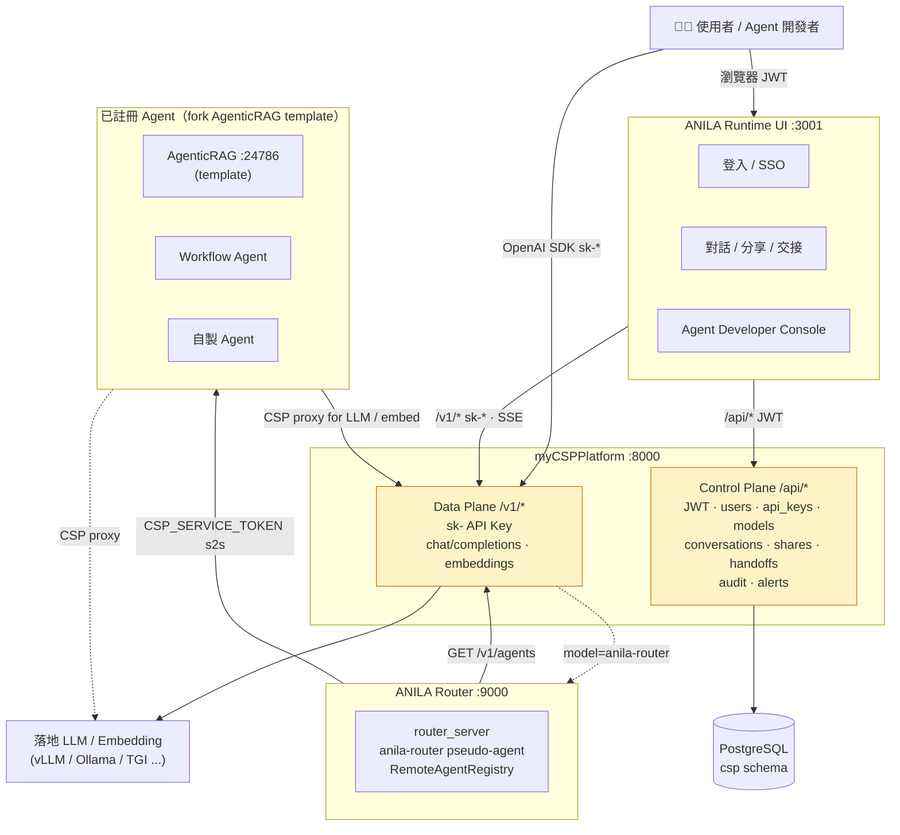

# ANILA 平台

> **Runtime-first、On-prem 多 Agent 平台。** 三個服務、一個落地 LLM，docker compose 一鍵啟動。

ANILA 是一套企業內部的多 Agent 平台：統一管理模型與 API Key、對外以 OpenAI 相容介面提供推論、讓開發者基於樣板複製出自己的 Agent 並註冊進來、讓終端使用者透過統一 UI 與所有 Agent 對話，並以「主 LLM 未加密 → 遇到加密 agent 整段對話升級為加密」的單向閂鎖（one-way latch）處理敏感資料。

| 子專案 | 角色 | 預設 Port |
|---|---|---|
| [`myCSPPlatform`](./myCSPPlatform/) | **CSP**（Control & Data Plane）— 使用者 / API Key / 模型 / 對話 / 附件 / 分享 / 交接 / 審計 / OpenAI 相容代理 | `:8000` |
| [`anila-core`](./anila-core/) | **Runtime foundation（SDK）** — Python agent runtime 基座（api / registry / engine / tools / providers / storage / memory / compact / cli）。Router 與所有 agent 共用 | — |
| [`anila-core-router`](./anila-core-router/) | **Router** — 薄殼部署入口；OpenAI 相容分派器，依請求自動路由到註冊的 Agent | `:9000` |
| [`ANILA_UI/anila-ui`](./ANILA_UI/anila-ui/) | **Runtime UI** — React 聊天介面，串 CSP（JWT + SSE）與 Router（`anila-router` pseudo-agent） | `:3001`（compose）/ `:5173`（dev） |
| [`AgenticRAG`](./AgenticRAG/) | **RAG Agent Template**（官方）— 完整 framework（tool-driven loop、hybrid search、cross-encoder reranker、vision pipeline、compact/memory）。以 `anila-core` 為基座；開發者 fork 這裡當起點 | `:24786`（獨立執行時） |
| [`runtime_logic`](./runtime_logic/) | **TS Runtime 參考材料**（READ-ONLY）— 用來對照移植到 `anila-core` 的 agent runtime 設計原本；原始碼 gitignored | — |

> **唯一的規劃文件（single source of truth）**：[`anila_plan.md`](./anila_plan.md)。
>
> **Onyx 已搬離本 repo**（2026-04-27）：原本 `onyx/` 是 upstream clone，現由 agent 開發團隊在他們自己的 repo 維護。我方僅保留 handover 文件 [`docs/onyx-target-system-api-spec.md`](./docs/onyx-target-system-api-spec.md) 與 [`docs/onyx-application-plan.md`](./docs/onyx-application-plan.md)。完整變更原因見 [`docs/changelog/2026-04-27-onyx-handover.md`](./docs/changelog/2026-04-27-onyx-handover.md)。需要 Onyx 原始碼請 `git clone` 對方專案。

---

## 整體架構



<details>
<summary>📄 ASCII 版本（離線 / email / 舊 Markdown renderer）</summary>

```
                ┌─────────────────────────────────────────────┐
                │             使用者 / Agent 開發者           │
                └──────────────┬───────────────┬──────────────┘
                               │               │
                   瀏覽器      │               │  OpenAI SDK / curl
                   (JWT)       │               │  (Bearer sk-...)
                               ▼               ▼
                      ┌──────────────────────────────┐
                      │   ANILA Runtime UI (:3001)   │
                      │   React + Vite (SPA)         │
                      │   - 登入 / SSO                │
                      │   - 對話 / 分享 / 交接         │
                      │   - Agent 開發者儀表板         │
                      └────────┬────────────┬────────┘
                               │            │
                    /api/*     │            │   /v1/chat/completions
                    (JWT)      │            │   (API Key, SSE)
                               ▼            ▼
              ┌───────────────────────────────────────────┐
              │           myCSPPlatform (:8000)            │
              │  ┌─────────────────────────────────────┐  │
              │  │ Control Plane  /api/*  (JWT)        │  │
              │  │   auth / users / api_keys / models   │  │
              │  │   conversations / attachments /      │  │
              │  │   shares / handoffs / audit / alerts │  │
              │  ├─────────────────────────────────────┤  │
              │  │ Data Plane  /v1/*  (API Key)        │  │
              │  │   chat/completions (LLM/VLM/Agent)   │  │
              │  │   embeddings v1/v2                   │  │
              │  └─────────────────────────────────────┘  │
              └───────┬───────────────────┬────────────────┘
                      │                   │
        ┌─────────────┘                   └──────────────┐
        ▼                                                ▼
┌──────────────────┐                    ┌───────────────────────────────┐
│ PostgreSQL       │                    │  ANILA Router (:9000)         │
│ (csp schema)     │                    │  anila_core.api.router_server │
│  - users         │                    │  - /v1/chat/completions       │
│  - api_keys      │                    │    (auto-dispatch pseudo-     │
│  - model_        │                    │     agent: anila-router)      │
│    registry      │                    │  - /health  (cached_agents +  │
│  - conversations │                    │    last_refresh_error)        │
│  - token_usage   │                    └──────┬────────────────────────┘
│  - audit_logs    │                           │
└──────────────────┘                           │ 動態從 CSP /v1/agents
                                               │ 撈清單、依需求分派
                                               ▼
                                ┌─────────────────────────────────────┐
                                │ 已註冊 Agent（以 AgenticRAG 為樣板）│
                                │  - RAG 知識助理                      │
                                │  - Workflow agent                    │
                                │  - 自製 agent（開發者 fork 樣板）    │
                                │                                      │
                                │  全部透過 CSP 分派，認證用           │
                                │  CSP_SERVICE_TOKEN 做 s2s            │
                                └─────────────────┬───────────────────┘
                                                  │
                                                  ▼
                                      ┌───────────────────────┐
                                      │  落地 LLM / Embedding  │
                                      │  (vLLM / Ollama /      │
                                      │   TGI / llama.cpp...) │
                                      │  OpenAI 相容 endpoint  │
                                      └───────────────────────┘
```

</details>

**核心資料流（一次聊天請求）：**

```
使用者於 UI 送訊息
  │
  ├─ UI POST /v1/chat/completions  model="anila-router"  →  Router
  │
  │   Router 用 caller 的 Bearer API Key 呼叫 CSP:
  │     - GET  /v1/agents              取 agent manifest（requires_encryption 等）
  │     - POST /v1/chat/completions    主 LLM 判斷要不要分派
  │
  ├─ 主 LLM 回 "我需要叫 agent X"
  │     Router 以 caller 的 API Key 轉發到 agent X 的 endpoint_url
  │     agent X 內部可再呼叫 CSP /v1/* 拿 RAG、Embedding 等
  │
  ├─ Router / CSP 將 SSE 逐 chunk forward 回 UI
  │     同時在 meta 標注 classified=true（若 agent requires_encryption）
  │
  └─ UI 收到 classified=true → 對話永久閂鎖為加密模式（one-way latch，不可降級）
```

---

## 快速開始（compose 一鍵啟動）

### 1. 準備落地（on-prem）LLM

ANILA **不含雲端 LLM fallback，也不做 token/request quota**。把 `LOCAL_LLM_BASE_URL` 指向任何 OpenAI 相容 endpoint 即可：

| 後端 | `LOCAL_LLM_BASE_URL` | `LOCAL_LLM_MODEL` |
|---|---|---|
| 宿主機 Ollama | `http://host.docker.internal:11434/v1` | `llama3.2` |
| 叢集內 vLLM | `http://vllm.llm.svc.cluster.local:8000/v1` | 你部署時設定的模型名稱 |
| 本機 llama.cpp | `http://host.docker.internal:8080/v1` | `local-model` |

Embedding endpoint (`LOCAL_EMBEDDING_BASE_URL`) 若未設則預設等同 LLM URL。

### 2. 啟動整個 stack

```bash
# 於 repo 根目錄。需要 Docker + Compose v2。
cp .env.example .env       # 範本含全部必設變數註解；填好真值
docker compose up -d
```

`.env` 至少要填：

| 變數 | 為什麼必要 |
|---|---|
| `ANILA_ALLOW_DEV_SECRET=1` | dev 才設；正式環境拿掉以啟用 startup_security 對 dev 預設值的拒絕 |
| `CSP_SECRET_KEY` | JWT 簽署 + credential AES-GCM 主鑰；換值會讓所有加密 row 失效 |
| `CSP_SERVICE_TOKEN` | CSP ↔ agent 的 s2s token |
| `CODESERVER_PASSWORD` | compose `:?required` — 不設就拒絕啟動 |
| `CODESERVER_WORKSPACE` | compose `:?required` — 必須指向非機密目錄（範例：`./share/codeserver-sandbox`） |
| `INTERNAL_PLATFORM_API_KEY` | ingestion-worker 系統帳號 API Key |
| `LOCAL_LLM_BASE_URL` / `LOCAL_LLM_MODEL` | 落地 LLM endpoint（OpenAI 相容）|

啟動順序（由 healthcheck 串接）：`csp-db` → `csp` → `router` → `anila-ui`。首次啟動約 30 秒（含 alembic migration 至 `0022` + 自動 seed smoke 使用者與 API Key）。

> **正式環境**：把 `.env` 移除 `ANILA_ALLOW_DEV_SECRET=1`，所有 dev 預設值（`SECRET_KEY=dev-secret-key-change-in-prod` / `ADMIN_PASSWORD=changeme` / `CSP_SERVICE_TOKEN=dev-service-token` / `DB_PASSWORD=csp_password` / `INTERNAL_PLATFORM_API_KEY=sk-internal-worker-changeme` / `CODESERVER_PASSWORD=changeme-codeserver`）都會被 `app/services/startup_security.py` 拒絕，container 直接開不起來，避免無聲帶 dev secret 上線。

### 3. 驗證各服務

```bash
curl http://localhost:8000/health    # CSP
curl http://localhost:9000/health    # Router（會回報 cached_agents 與 last_refresh_error）
start http://localhost:3001          # UI (Windows) / macOS: open / Linux: xdg-open
```

> Router 的 `/health` 會暴露 `last_refresh_error`。若非 null 代表 Router 抓不到 CSP 的 agent 清單 — 通常是 `CSP_BASE_URL` 或 API Key 設錯。

### 4. Smoke test（真實打本地 LLM）

```bash
curl -N -X POST http://localhost:9000/v1/chat/completions \
  -H "Authorization: Bearer $SMOKE_USER_API_KEY" \
  -H "Content-Type: application/json" \
  -d '{"model":"anila-router","messages":[{"role":"user","content":"say hi"}],"stream":true}'
```

會看到 SSE chunk 從 `落地 LLM → CSP → Router → 你的終端` 逐段吐出。若已註冊 agent 且主 LLM 判定該分派，Router 會把 agent 自身的 SSE stream 即時 forward 回來。

---

## 本地開發（不使用 Docker）

每個服務可獨立跑，各讀自己的 env（詳見各子專案 README）：

```bash
# 1) CSP
cd myCSPPlatform
cp .env.example .env   # 改 SECRET_KEY / ADMIN_PASSWORD / AUTO_REGISTER_MODELS
./start.sh up          # 或 uv run uvicorn backend.app.main:app --reload --port 8000

# 2) Router
cd anila-core-router
pip install -e "../anila-core"          # pure runtime（不需要 RAG extras）
export CSP_BASE_URL=http://localhost:8000
uvicorn main:app --reload --port 9000

# 3) UI
cd ANILA_UI/anila-ui
cp .env.example .env.local
npm install && npm run dev   # :5173
```

---

## 專案結構

```
ANILA/
├── myCSPPlatform/        # CSP：FastAPI + SQLAlchemy + Alembic + Vue 管理 UI
├── anila-core/           # Runtime foundation（SDK）：api / registry / engine / tools / providers / ...
├── anila-core-router/    # Router 薄殼（main.py = create_router_app()；image 不含 RAG extras）
├── AgenticRAG/           # 官方 RAG agent template（完整 framework；開發者 fork 起點）
├── ANILA_UI/anila-ui/    # React Runtime UI
├── docker-compose.yml    # CSP + Router + UI + PostgreSQL
├── anila_plan.md         # 單一事實來源：決策、Wave 計畫、架構
├── frontend_plan.md      # UI 設計決策
└── README.md             # 本檔
```

---

## 環境變數速查

| 變數 | 使用者 | 用途 |
|---|---|---|
| `LOCAL_LLM_BASE_URL` | CSP | 落地 LLM 的 OpenAI 相容 endpoint |
| `LOCAL_LLM_MODEL` | CSP, Router | 上面 endpoint 服務的模型名稱 |
| `LOCAL_EMBEDDING_BASE_URL` | CSP | Embedding endpoint（未設則同 LLM） |
| `LOCAL_EMBEDDING_MODEL` | CSP | Embedding 模型名稱 |
| `CSP_SECRET_KEY` | CSP, ingestion-worker | JWT 簽署 + credential AES-GCM 主鑰 — 上線務必輪換；輪換需配合 `scripts/reencrypt-credentials.py` |
| `CSP_SERVICE_TOKEN` | CSP + Agent | Service-to-service header，由 `CspServiceTokenMiddleware` 驗 |
| `ADMIN_PASSWORD` | CSP | auto_seed 用；正式環境必覆寫，否則 `startup_security` 拒絕啟動 |
| `INTERNAL_PLATFORM_API_KEY` | CSP, ingestion-worker | seed 的內部 system 帳號 API Key；正式環境必覆寫 |
| `ANILA_ALLOW_DEV_SECRET` | CSP, ingestion-worker | 設 `1` 時 `startup_security` 對 dev 預設值僅 warn；正式環境必拿掉 |
| `CODESERVER_PASSWORD` | code-server | compose `:?required` — 不設就拒絕啟動，且預設值會被 startup_security 拒絕 |
| `CODESERVER_WORKSPACE` | code-server | compose `:?required` — 工作目錄；不要指 repo root（會把 .env / 私鑰暴露） |
| `N8N_TLS_REJECT_UNAUTHORIZED` | n8n | 預設 `1`（嚴格驗 TLS）；要連自簽 endpoint 請設逐節點的 self-signed CA |
| `N8N_NODE_FUNCTION_ALLOW_EXTERNAL` | n8n | Code Node 允許 require 的 npm 模組（預設 `axios,lodash,dayjs`） |
| `N8N_NODE_FUNCTION_ALLOW_BUILTIN` | n8n | Code Node 允許 require 的 Node builtin（預設 `crypto,url`） |
| `SMOKE_USER_API_KEY` | CSP | 自動 seed 的 smoke 使用者 API Key（僅 dev） |
| `ANILA_PUBLIC_CSP_BASE_URL` | UI build | 瀏覽器用來打 CSP 的對外 URL |
| `ANILA_PUBLIC_ROUTER_BASE_URL` | UI build | 瀏覽器用來打 Router 的對外 URL |

> 完整範本見 [`.env.example`](./.env.example)；變更歷史見 [`docs/sso-migration.md`](./docs/sso-migration.md)、[`docs/sprint-7x-plan.md`](./docs/sprint-7x-plan.md)。

---

## 安全設計要點

- **On-prem runtime-first**：所有 LLM 流量進自家落地 endpoint，無雲端 fallback、無 token/request quota（Wave 0 已完整移除 quota/rate-limit 子系統）。
- **Service-to-service 認證**：Agent 驗 `CSP_SERVICE_TOKEN`（`hmac.compare_digest` constant-time）。`AgenticRAG` 樣板的 middleware **import 失敗會 fail-fast**（Wave A 硬化），不再 silent fallback 成 no-op。AgenticRAG `ApiKeyMiddleware` 在 `API_KEY` 未設 + `API_DEV_MODE=False` 時也 **fail-closed 503**（Sprint 5 X / H3）。
- **Classified 單向閂鎖**：只要 agent `requires_encryption=true` 或 SSE meta 帶 `classified=true`，CSP + Router + UI 三層都把該對話鎖成 classified；**UI 側無任何降級路徑**。並在 UI 持久化時透過 `applyMeta` fire-and-forget 呼叫 `POST /api/conversations/{id}/classify`，重載後 DB 仍保留 classified 旗標。
- **SPA 認證（Wave 2 + Sprint 7 X）**：瀏覽器 session 完全走 **httpOnly cookie**（`anila_access_token` / `anila_refresh_token` / 非 httpOnly 的 `anila_csrf`）。SPA 完全不持有 API Key — anila-ui 7 X 已下架所有 ApiKey 輸入 UI、Settings 的「API Key」tab、header 的 `sk-…` dropdown，避免使用者誤填造成洩漏。CSRF 用 **double-submit cookie pattern**，middleware 對 cookie 認證的 POST/PUT/DELETE 用 `hmac.compare_digest` 檢查 `X-CSRF-Token` header。帶 `Authorization: Bearer` 的 SDK / curl 路徑豁免 CSRF 檢查（非 browser-originated）。
- **雙軌認證**：`/v1/chat/completions` 及其他 `/v1/*` 資料面由 `Caller` dependency 同時接受 JWT（SPA path）與 `sk-*` API Key（SDK path），兩者都歸屬到同一個 `user_id`；僅 API Key 路徑會填 `token_usage.api_key_id`，JWT 路徑落入「Web UI」bucket。
- **OIDC SSO**（Sprint 5 X / 6 X）：authorization request 帶 PKCE (S256) + nonce；callback 必驗 `id_token` 簽章（透過 IdP 的 JWKS）+ iss / aud / azp / exp / nonce + 確認 `id_token.sub == userinfo.sub`。`alg=none` 一律拒絕。`email_verified=true` 強制；email 衝突時不自動合併（避免被 IdP 接管 admin），raise 給 admin 手動處理。`next_path` 經 `sanitize_next_path` 白名單（必須 `/` 開頭、第二字元不能是 `/` 或 `\`、無 CRLF、≤200 字）擋 open-redirect。OIDC `client_secret` 改 AES-256-GCM envelope 儲存（`enc::v1::` 前綴），API 回應一律 mask 為 `***`。
- **本地登入逐步退場**：`users.local_password_disabled` flag（migration `0022`，預設 False）讓 admin 對個別使用者切 SSO-only；切換後密碼正確也回 403。完整 SSO cutover 三階段見 [`docs/sso-migration.md`](./docs/sso-migration.md)。**LDAP 已自系統下線**（Sprint 5 X），全部欄位由 migration `0021` DROP；`/api/auth/login` 對 `auth_source=ldap` 直接回 400。
- **Credential 加密**：`anila_core.security.credential_crypto` 用 AES-256-GCM；KDF 為 PBKDF2-HMAC-SHA256 600k iter（OWASP 2024）。寫一律新 key；讀失敗自動 fallback 100k legacy key 並計數 — 既有 v1 row 持續可用，等 `scripts/reencrypt-credentials.py` 跑完統一升 v2。`SECRET_KEY` 為 dev 預設值且 `ANILA_ALLOW_DEV_SECRET≠1` 時 raise。
- **SSRF guard**：`anila_core.security.url_guard.validate_outbound_url` 集中 deny-list（loopback / private / link-local / cloud-metadata / docker service name / `*.internal` / `*.local` 等），對 user-supplied `endpoint_url` 一律驗證。Agent register / update + 使用者 LLM credential 都接此 guard；agent endpoint 變更時 `approval_status` 自動退回 `pending` 強制 admin 重新核可。
- **啟動安全檢查**：`app/services/startup_security.assert_no_dev_defaults()` 在 lifespan 開始時跑，正式環境（沒設 `ANILA_ALLOW_DEV_SECRET=1`）若 `SECRET_KEY` / `ADMIN_PASSWORD` / `CSP_SERVICE_TOKEN` / DB password / `INTERNAL_PLATFORM_API_KEY` / `CODESERVER_PASSWORD` 仍是已知 dev 預設值就 raise，container 直接開不起來。空 `SECRET_KEY` 即使 dev 模式也 fatal。
- **Nginx 安全 header**（兩個 server block 都覆蓋）：`Strict-Transport-Security`、`Content-Security-Policy`（baseline `default-src 'self'`）、`Permissions-Policy`（關閉 sensor / 媒體 API）、`Referrer-Policy: strict-origin-when-cross-origin`、`X-Frame-Options: SAMEORIGIN`、`X-Content-Type-Options: nosniff`。HSTS 啟用前須先確定憑證已切到非自簽。
- **檔案上傳防護**：`/api/attachments` 改 allow-list（副檔名 + MIME prefix），`/api/ingestion/.../zip` 加 1 GB 累計解壓上限與 filename sanitize（strip `..`、CRLF、NUL，截斷長度），避免 zip-bomb 與 Content-Disposition header injection。
- **路徑遍歷防護**：CSP backend 的 SPA fallback `serve_spa` 用 `Path.resolve()` + `relative_to(_frontend_root)` 確保任何 `../` 解析後仍在 dist 子樹中。
- **TLS 私鑰治理**：舊 `myCSPPlatform/docker/certs/server.key{,.bak}` 已從 git index 移除並加 per-dir `.gitignore`；歷史改寫流程與重簽 script 見 [`docs/runbooks/rotate-tls-cert.md`](./docs/runbooks/rotate-tls-cert.md)。
- **API Key 驗證**：建立時後端強制 `name.strip()` 非空 + 至少綁一個 model。
- **審計日誌**：所有 admin 管理操作（登入 / 登出 / 建立 / 停用 / 改密碼 / 刪除 agent / 刪除 model / health check / encryption toggle / SSO-only 切換 / OIDC 登入失敗 等）自動寫 `audit_logs`，IP 一律從 `X-Forwarded-For` 或 `request.client.host` 填入。
- **使用者最後登入**：`users.last_login_at` 在每次本機 / OIDC 登入時更新，admin 可從 UsersView 看到休眠帳號。

---

## 最近更新

### Sprint 7 X — anila-ui API Key UI 下架（2026-04-27）

Wave 2 cookie 流程後 SPA 完全不持有 key，但 anila-ui 仍保留「Settings → API Key tab」、header 的 `sk-…` dropdown、chat menu 的「API Key」項目 — 全部是 dead code（`apiKey = ""` hardcoded、`updateApiKey` no-op）。比沒有 UI 更危險，使用者填入 production key 後會看到「✓ 已儲存」假成功訊息，可能從 dev tools / autofill / 截圖洩漏。本輪一次性移除 ApiKeyPopover / ApiKeyTab / maskApiKey / 對應 icon imports，並把 `streamChatCompletion` 的 legacy `apiKey` parameter 一併拿掉。Bundle 驗證 0 個 ApiKey 字串殘留。同 sprint 寫了 [`docs/sprint-7x-plan.md`](./docs/sprint-7x-plan.md) 規劃 8 X 工作（帳號合併工具、break-glass admin、`LOCAL_LOGIN_DISABLED` flag），未上線階段不做 dashboard / bulk tool 等 premature 工作。對應 commit：`0b8509e` / `0b22f54`。

### Sprint 6 X — 資安修補尾巴 + SSO 地基（2026-04-27）

Sprint 5 X 審查的尾巴清乾淨，並把 SSO 取代本地登入的地基鋪好（**本地登入仍可用，預設不切換**）。

- **Track A**：Alembic `0021` DROP `auth_providers.ldap_*` 欄位；PBKDF2 升 600k 並提供 v1→v2 雙 key 過渡 + `scripts/reencrypt-credentials.py` 一次性 re-encrypt 工具；OIDC 加 PKCE (S256) + nonce + `id_token` JWKS 驗簽；`startup_security` 寫成 pytest（順手修 `offenders` 永遠不被 raise 的 bug）；TLS 重簽 script `scripts/reissue-tls-cert.sh` + 歷史改寫 runbook。
- **Track B**：`users.local_password_disabled` flag（migration `0022`，預設 False）讓 admin 切 SSO-only；OIDC `next_path` 集中 sanitize 擋 open-redirect；`docs/sso-migration.md` 寫 cutover 三階段路線。
- **驗證**：32 個新 pytest 全 pass；E2E 確認 SSO-only 切換後本地登入回 403、LDAP path 回 400、6 個 nginx 安全 header 全到位。對應 commit：`e29316e`。

### Sprint 5 X — 全面資安審查 + 修補（2026-04-27）

對整個 repo 做 Critical / High / Medium / Low 分級審查與修補：

- **Critical**：移除 git 追蹤的 TLS 私鑰；n8n 全域關閉 TLS 驗證 + 開放任意 require → 收斂預設；code-server 強制 `:?required` password / workspace。
- **High**：OIDC `client_secret` 改 AES-GCM envelope 加密儲存 + API 回應 mask；OIDC 強制 `email_verified` 並停用 email-only 帳號合併（防 IdP-mixup admin 接管）；AgenticRAG middleware fail-closed + `hmac.compare_digest`；agent register / update 接 SSRF guard + 端點變更重置 approval；SPA 切 httpOnly cookie + CSRF（前端 stop writing localStorage）；**LDAP 完整移除**（後端 service / API / schema / 前端表單全清）。
- **Medium / Low**：startup_security 預設值阻擋；zip 上傳 1 GB 累計上限 + 檔名消毒；CSRF middleware constant-time；nginx 補 HSTS / CSP / Permissions-Policy；SPA fallback 路徑遍歷修補；`role` 改 `Literal`；附件改 allow-list；antiword `--` 分隔符；PBKDF2 註記升級條件（在 6 X 完成）。對應 commit：`143f89e` / `d2c74ca`。

### Onyx upstream 移出 monorepo（2026-04-27）

- 原本 `onyx/` 是 4690 個檔（61 MB）的 upstream clone，混在本 repo 已造成 diff/blame/search 雜訊
- agent 開發團隊明確要在他們自家 repo 維護 → 此 repo 不再追 Onyx 程式碼
- 走 `git filter-repo --invert-paths --path onyx/` 從**全 history** 清除（包括所有 branches）
- 結果：`.git` 從 34 MB 縮到 5.7 MB（-83%）、新 clone / fetch 速度顯著改善
- ⚠️ 所有 collaborator 需 `git fetch && git reset --hard origin/<branch>` 同步新 history
- 安全 backup tag：`pre-onyx-filter-repo-2026-04-27`（本地保留 14 天後可刪）
- 完整變更原因 + 操作步驟：[`docs/changelog/2026-04-27-onyx-handover.md`](./docs/changelog/2026-04-27-onyx-handover.md)
- 規格 handover 文件留下：[`docs/onyx-target-system-api-spec.md`](./docs/onyx-target-system-api-spec.md)、[`docs/onyx-application-plan.md`](./docs/onyx-application-plan.md)

### AgenticRAG 升格為官方 RAG Agent Template（2026-04-24）

- 舊的極簡 `anila-rag-sample`（627-line proxy）與獨立 repo `github.com/zzw09773/AgenticRAG`（framework 身份）合併為 **ANILA 平台官方 RAG agent template**
- 完整 framework（65 個 src 模組、23 支測試、tool-driven RAG、Hybrid Search、mxbai cross-encoder reranker、CJK tokenizer、Docling parser、vision pipeline、L1-L3 compact）搬進 monorepo
- 新增 `CspServiceTokenMiddleware` 雙路徑載入（優先 `anila-core` canonical → fallback 本地 in-package copy），保證獨立部署也能跑
- 新增 [`AgenticRAG/anila-agent.yaml`](./AgenticRAG/anila-agent.yaml)（CSP 註冊 manifest）與 [`AgenticRAG/docs/CSP_INTEGRATION.md`](./AgenticRAG/docs/CSP_INTEGRATION.md)（三種註冊方式、s2s auth、trusted user headers、多租戶檢索 patterns）
- `github.com/zzw09773/AgenticRAG` 已歸檔（`isArchived=true`），README 改為 notice 指向本 monorepo
- 對應 commits：`c4bf85a` / `9d5b052` / `59f05f6`

### Auth / Session 重構

- **Wave 1**：`/v1/*` 新增 `Caller` dependency，同時接受 JWT 與 API Key；`token_usage.api_key_id` 改為 `nullable`（migration `0010`），JWT 流量分桶到 dashboard 的 `web_ui_requests`。
- **Wave 2**：SPA 移除 localStorage JWT 與 sessionStorage API Key，完全改走 httpOnly cookie + CSRF；新增 `POST /api/auth/logout`；OIDC callback 不再發 short-lived API Key。
- `users.last_login_at`（migration `0011`）+ audit IP 一致性補齊。

### Agent Console 強化

- `PUT /api/agents/{id}` — owner / admin 可自行編輯 endpoint / description / capabilities / api_version / base_model_id；**刪除仍 admin 限定**，避免孤兒紀錄。
- `base_model_id` **註冊時必填**（原本 optional），並驗證指向 active 的 model_registry row。`AgentResponse` 增加 `base_model_name` / `owner_username` / `capabilities` 欄位。
- `health_status` 在 API 回傳前 normalize（`online` → `healthy`、`offline` → `unhealthy`），統一 dashboard 統計。
- 新增 `POST /api/agents/{id}/health-check` 主動檢查端點。

### UI（ANILA Runtime）

- Chat bubble 重設計：Claude.ai-style flat rounded，Assistant 無頭列框、工具列 hover-reveal、ReasoningSummary 合併 routing trace + thinking 成單行 ghost row。
- Conversation sidebar：title 兩行 clamp 而非截斷；dropdown 改用 `position: fixed` 避開 overflow 切斷；搜尋框 `×` clear button + Esc；tag 搜尋 + 同義詞展開（`特休` 可找到 `年假` / `HR`）。
- Composer：`@` autocomplete 下拉實際可用 agent；paste 時優先 `text/*` 避免文字被 browser fallback 截圖當圖片附件。
- EmptyState 改為單卡「ANILA 可以做什麼？」，prompt 由實際 agent 清單動態產出（不再有假 agent 卡片）。
- Router 系統 prompt 新增「ambiguous → clarify」規則；`_normalize_clarify_bullets` 後處理器把 inline `·` 分隔的候選 agent 轉成 markdown bullet。

### Admin UX 修復

- API Key 建立：前後端 trim 非空 + 至少一 model + `canCreate` disable button。
- Agent 詳情：Owner 顯示 `admin (ID: 1)`；`capabilities` 空時改顯示「尚未設定」。
- Usage chart legend 不再蓋住 x 軸標籤（`containLabel: true` + grid.bottom 留白）。
- Markdown numbered list 密度對齊 OpenWebUI（移除 inline style 與 `white-space: pre-wrap` 繼承）。
- 對話標題 LLM 重複輸出（`AA` pattern）自動 collapse；placeholder 白名單擋 Router fallback 文字汙染 title。

### 測試覆蓋

- 前端 vitest：69 tests（新增 `messageMeta` / `titleClean` / `searchSynonyms`）
- 後端 pytest：80+ tests。Sprint 6 X 新增 `test_startup_security`（7）/ `test_next_path_sanitize`（16）/ `test_oidc_pkce_nonce`（3）/ `test_local_password_disabled`（6）共 32 個資安回歸測試。

---

## 授權

見 [`LICENSE`](./LICENSE)。Onyx 原 upstream 程式碼已於 2026-04-27 搬離本 repo（詳見上方說明），其原授權由 agent 開發團隊在他們自己的 repo 維護。

---

**Last updated**: 2026-04-27（Sprint 7 X 結束）· **Maintainers**: ANILA 平台團隊 · **Single source of truth**: [`anila_plan.md`](./anila_plan.md) · **資安／SSO 規劃**：[`docs/sso-migration.md`](./docs/sso-migration.md)、[`docs/sprint-7x-plan.md`](./docs/sprint-7x-plan.md)、[`docs/runbooks/rotate-tls-cert.md`](./docs/runbooks/rotate-tls-cert.md)
