# ANILA 平台 — `main`(開發 SSOT / single source of truth)

> **Runtime-first、On-prem 多 Agent 平台。** 三個核心服務、一個落地 LLM，`docker compose` 一鍵啟動。

> 🧭 **你正在看 `main` 分支** — 平台的**唯一事實來源（SSOT）**，預設開發分支。
> 所有新 feature 一律先進 `main`，再 sync 進各 downstream 部署分支；downstream 之間互不直接 sync。
>
> | Branch | 部署對象 | 認證 | 定位 |
> |---|---|---|---|
> | **`main`** ← *你在這* | 開發 SSOT（default） | 純帳密 | 所有 feature 的源頭 |
> | `prod-intranet-card` | 中科院內網 prod | SSO + 自然人憑證卡 | main + auth/SSO/card fork |
> | `prod-public-passwd` | 對外網 prod | 純帳密 | main + 外網 hardening |
> | `prod-military-passwd` | 國軍交付 prod | 純帳密 | main + military spec |
> | `dev-public` | 對外網 dev | 純帳密 | main + dev tooling |
> | `dev-military` | 國軍 dev | 純帳密 | dev-public + military 客製 |
> | `trial-military` | 國軍 trial / 展示 | 純帳密 | main 精簡子集（核心對話 + RAG + agent） |
>
> 完整 fork 區清單 + sync SOP 見 [`docs/branch-sync-backlog.md`](./docs/branch-sync-backlog.md)。
> branch restructure 之前的備份 tag：`pre-branch-restructure-2026-05-26`。

ANILA 是一套企業內部的多 Agent 平台：統一管理模型與 API Key、對外以 OpenAI 相容介面提供推論、讓開發者基於樣板複製出自己的 Agent 並註冊進來、讓終端使用者透過統一 UI 與所有 Agent 對話，並以「主 LLM 未加密 → 遇到加密 agent 整段對話升級為加密」的**單向閂鎖（one-way latch）**處理敏感資料。

平台層內建**使用者記憶**：每輪對話自動萃取個人事實 + embed 訊息片段，下次對話自動帶入，跨 agent 共享；agent 也可透過 service token 呼叫 `/api/memory/users/{id}/facts` 主動讀取使用者背景做個人化（route 3，見 [`docs/briefing/anila-memory-layer-rfc.md`](./docs/briefing/anila-memory-layer-rfc.md)）。

---

## 本分支定位（`main`）

- **角色**：single source of truth。功能開發、bugfix、文件一律先落在這裡。
- **認證**：純帳密（本地登入）。`main` **不含** SSO / 自然人憑證卡 fork — 那是 `prod-intranet-card` 專屬。
- **dev tooling**：`docker-compose.yml` 內含 code-server / n8n / GitLab 三個服務，**目前為 active 定義**（無 `profiles:` 閘控 → `docker compose up` 會一併啟動；code-server 以 `CODESERVER_PASSWORD:?` 強制設密）。`dev-*` 分支保留；各 `prod-*` 分支依其 hardening 取向移除部分（見各分支 README）。
- **同步方向**：`main` → downstream。downstream catch-up 用 `git merge origin/main`（content conflict 偏 `-X theirs`）。SOP 見 [`docs/branch-sync-backlog.md`](./docs/branch-sync-backlog.md)。
- **commit 標籤**：跨分支的 commit 用前綴標記分流（`[card-only]` / `[public-only]` / `[military-only]` / `[dev-only]` / `[security-all]`）。無標籤的 commit 預設四條 downstream 都該 sync。

| 子專案 | 角色 | 預設 Port |
|---|---|---|
| [`myCSPPlatform`](./myCSPPlatform/) | **CSP**（Control & Data Plane）— 使用者 / API Key / 模型 / Agent 註冊 / 對話 / 附件 / 分享 / 交接 / 審計 / Ingestion（Knowledge Collections + Evaluator）/ OpenAI 相容代理 / JWKS / token revocation publisher | `:8000` |
| [`anila-studio`](./anila-studio/) | **Studio service** — Deck 生成（RAG + LLM 大綱 + FLUX 圖像 + PPTX）；HTTP-only 對 CSP，本地驗 JWT（JWKS）+ Redis pub/sub revocation | `:8100`（internal） |
| [`anila-core`](./anila-core/) | **Runtime foundation（SDK）** — Python agent runtime 基座（api / registry / engine / tools / providers / storage / **memory** / compact / cli / **security** / ingestion 共用 chunking_plugins）。Router 與所有 agent 共用 | — |
| [`anila-core-router`](./anila-core-router/) | **Router** — OpenAI 相容分派器；依請求自動路由到註冊的 Agent；以 `service_clients.router-primary` per-credential token 走 s2s | `:9000` |
| [`anila-agent`](./anila-agent/) | **官方 sub-agent 模板**（git subtree from [`zzw09773/anila-agent`](https://github.com/zzw09773/anila-agent)）— openai-agents SDK + LiteLLM，移植 Claude Code 的 memdir 長期記憶、hook 介面、slash-command CLI | `:24786`（獨立執行時） |
| [`ingestion-worker`](./ingestion-worker/) | **Async pipeline worker** — Arq + Redis；CSP 推 job 進 queue 後解析 → 分塊 → embed → 寫 pgvector，並跑 Chunking Evaluator 的 LLM-as-judge | （無 host port） |
| [`ANILA_UI/anila-ui`](./ANILA_UI/anila-ui/) | **Chat Runtime UI** — React 聊天介面，cookie + SSE，串 CSP 與 Router | nginx 前 |
| [`ANILALM`](./ANILALM/) | **Knowledge-base 前端 + Studio** — Vite + React + TS SPA；mount 在 nginx `/anilalm/` 子路徑 | nginx 前 |
| [`ANILALM/pptx-skill`](./ANILALM/pptx-skill/) | **PPTX render service** — Node.js + pptxgenjs；Studio 生簡報的後端 | `:7100`（internal） |
| **`nginx`**（compose service） | 對外閘道；同源 reverse-proxy `/api`、`/v1`、`/router`、`/anilalm/`、`/static`、`/uploads`；7 個安全 header | `:80` / `:443` / `:4443` |
| **`redis`**（compose service） | ingestion-worker 的 queue backing store；不對外暴露 | （無 host port） |
| [`runtime_logic`](./runtime_logic/) | **TS Runtime 參考材料**（READ-ONLY）；原始碼 gitignored | — |

> **唯一的規劃文件**：[`anila_plan.md`](./anila_plan.md)。**Onyx 已於 2026-04-27 搬離本 repo**，僅保留 handover 文件於 [`docs/onyx/`](./docs/onyx/)。

---

## 整體架構

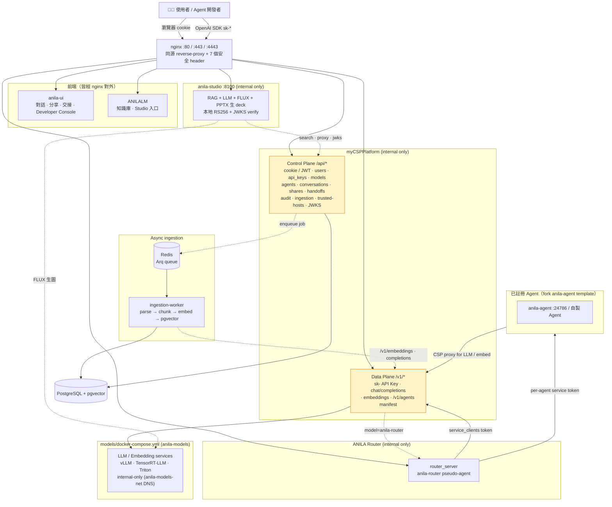
```mermaid
flowchart TB
    users["🧑‍💻 使用者 / Agent 開發者"]
    nginx["nginx :80 / :443 / :4443<br/>同源 reverse-proxy + 7 個安全 header"]

    subgraph spas["前端（皆經 nginx 對外）"]
        anila_ui["anila-ui<br/>對話 · 分享 · 交接 · Developer Console"]
        anilalm["ANILALM<br/>知識庫 · Studio 入口"]
    end

    subgraph csp["myCSPPlatform (internal only)"]
        csp_ctrl["Control Plane /api/*<br/>cookie / JWT · users · api_keys · models<br/>agents · conversations · shares · handoffs<br/>audit · ingestion · trusted-hosts · JWKS"]
        csp_data["Data Plane /v1/*<br/>sk- API Key · chat/completions<br/>· embeddings · /v1/agents manifest"]
    end

    subgraph studio["anila-studio :8100 (internal only)"]
        studio_api["RAG + LLM + FLUX + PPTX 生 deck<br/>本地 RS256 + JWKS verify"]
    end

    subgraph router["ANILA Router (internal only)"]
        router_core["router_server<br/>anila-router pseudo-agent"]
    end

    subgraph agents["已註冊 Agent（fork anila-agent template）"]
        rag["anila-agent :24786 / 自製 Agent"]
    end

    subgraph async["Async ingestion"]
        redis[("Redis<br/>Arq queue")]
        worker["ingestion-worker<br/>parse → chunk → embed → pgvector"]
    end

    subgraph models["models/docker-compose.yml (anila-models)"]
        llm["LLM / Embedding services<br/>vLLM · TensorRT-LLM · Triton<br/>internal-only (anila-models-net DNS)"]
    end

    db[("PostgreSQL + pgvector")]

    users -->|瀏覽器 cookie| nginx
    users -->|OpenAI SDK sk-*| nginx
    nginx --> anila_ui & anilalm & csp_ctrl & csp_data & router_core & studio_api

    csp_data -.->|model=anila-router| router_core
    router_core -->|service_clients token| csp_data
    router_core -->|per-agent service token| agents
    agents -->|CSP proxy for LLM / embed| csp_data

    csp_ctrl --> db
    csp_data --> llm
    csp_ctrl -.->|enqueue job| redis
    redis --> worker
    worker --> db
    worker -.->|/v1/embeddings · completions| csp_data
    studio_api -.->|search · proxy · jwks| csp_ctrl
    studio_api -.->|FLUX 生圖| llm

    classDef plane fill:#fef3c7,stroke:#d97706
    class csp_ctrl,csp_data plane
```

**核心資料流（一次聊天請求）：**

```
使用者於 UI 送訊息
  └─ UI POST /v1/chat/completions  model="anila-router"  →  Router
       Router 用 caller 的 Bearer API Key 呼叫 CSP：
         GET  /v1/agents            取 agent manifest（requires_encryption 等）
         POST /v1/chat/completions  主 LLM 判斷要不要分派
       主 LLM 回「我需要叫 agent X」→ Router 轉發到 agent X 的 endpoint_url
       agent X 內部可再呼叫 CSP /v1/* 拿 RAG、Embedding
       SSE 逐 chunk forward 回 UI；若 agent requires_encryption 則 meta 標 classified=true
  └─ UI 收到 classified=true → 對話永久閂鎖為加密模式（one-way latch，不可降級）
```

---

## 介面預覽

> 以下截圖取自運行中的 ANILA 平台：CSP 控制台（`:443`）、anila-ui 對話前端（`:4443`）、ANILALM 知識庫（`/anilalm/`）。

<table>
  <tr>
    <td width="50%">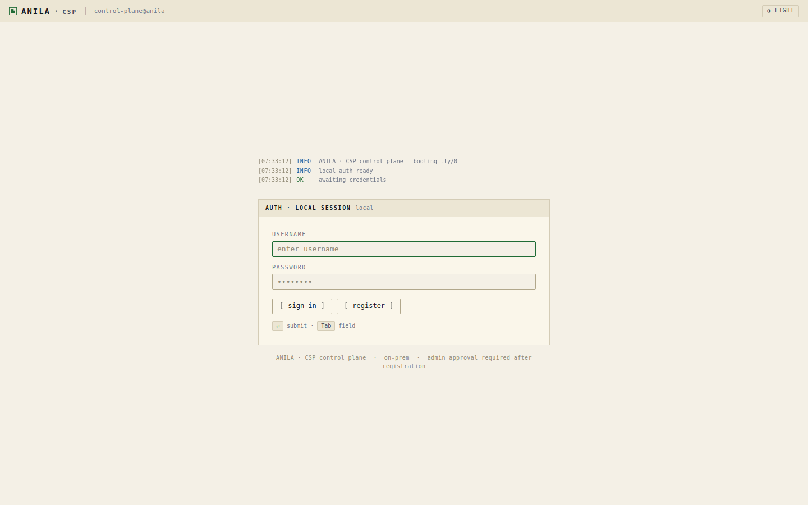<br><sub><b>統一登入</b>｜RS256 JWT + httpOnly cookie，CSRF double-submit</sub></td>
    <td width="50%">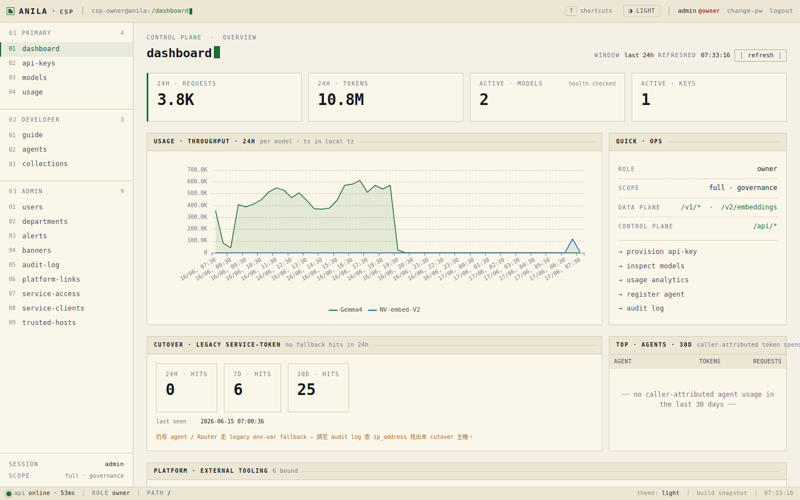<br><sub><b>CSP 控制台總覽</b>｜24h 用量 / 吞吐 / Top agents / legacy-token cutover 監控</sub></td>
  </tr>
  <tr>
    <td>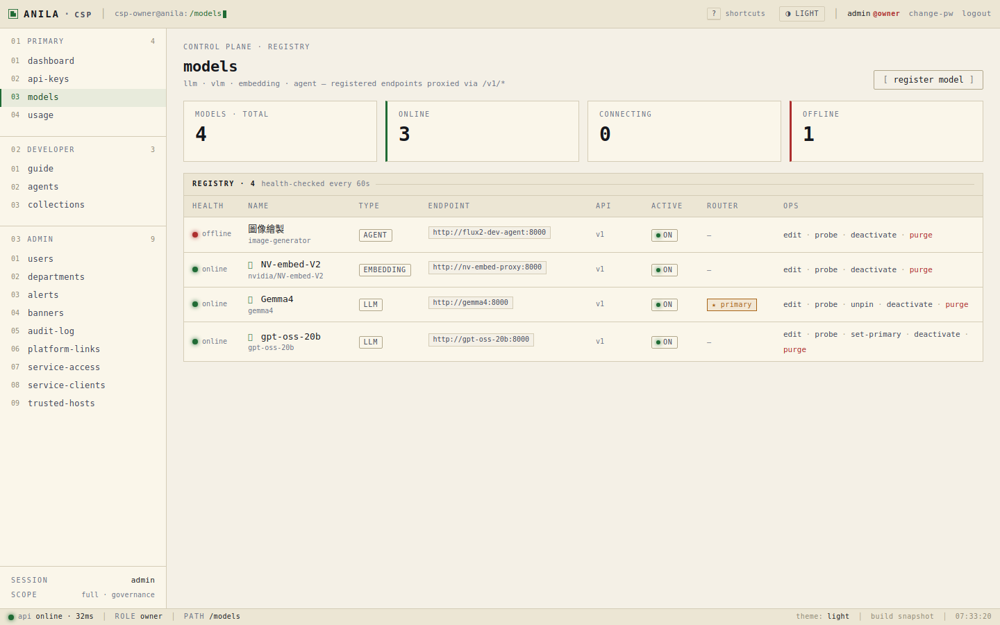<br><sub><b>模型 / API Key 管理</b>｜統一註冊 LLM / Embedding / Agent endpoint</sub></td>
    <td>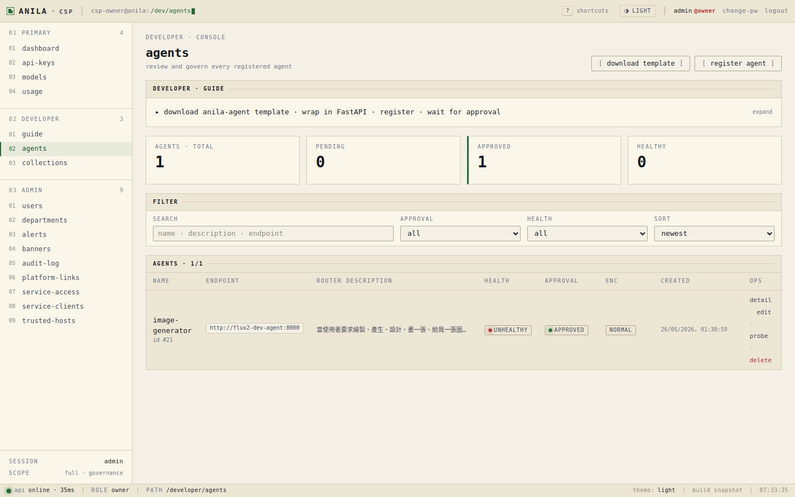<br><sub><b>Agent 註冊與核准</b>｜逐 agent 強制加密（classified latch 來源）</sub></td>
  </tr>
  <tr>
    <td>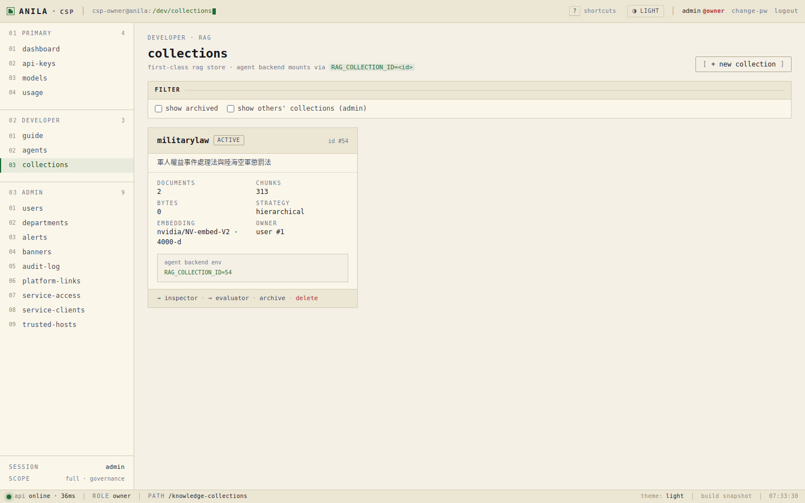<br><sub><b>知識庫 Collections</b>｜文件 → chunk → embed → pgvector 檢索（RAG）</sub></td>
    <td>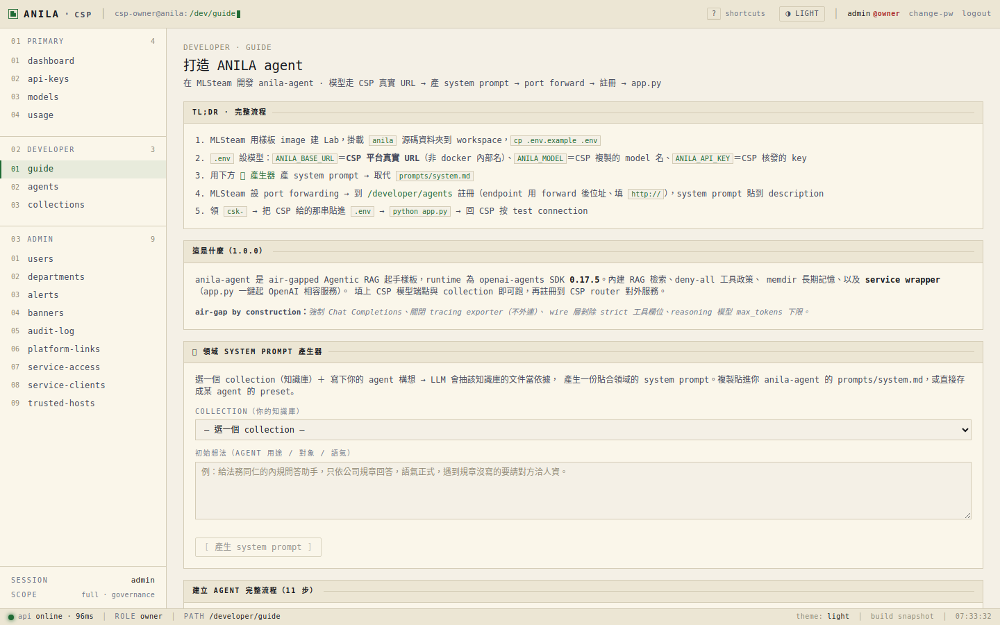<br><sub><b>開發者上手指南</b>｜對準 MLSteam 工作流的 agent 建置教學</sub></td>
  </tr>
  <tr>
    <td>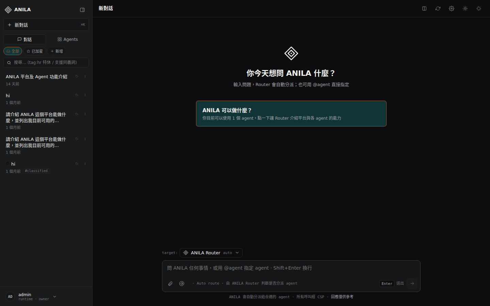<br><sub><b>anila-ui 對話前端</b>｜<code>anila-router</code> 自動分派、分享、交接</sub></td>
    <td>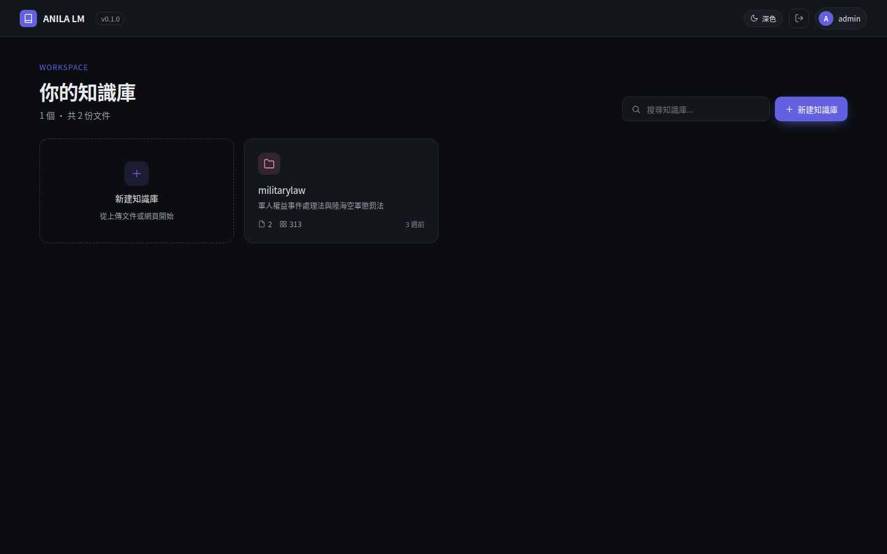<br><sub><b>ANILALM 知識庫 + Studio</b>｜文件 → 對話 → 簡報 / 報告 / 心智圖 等 artifact</sub></td>
  </tr>
  <tr>
    <td>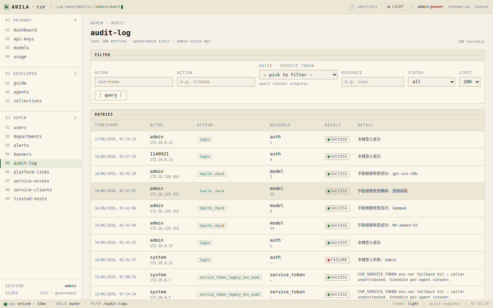<br><sub><b>審計日誌</b>｜所有 admin 操作自動寫 <code>audit_logs</code></sub></td>
    <td>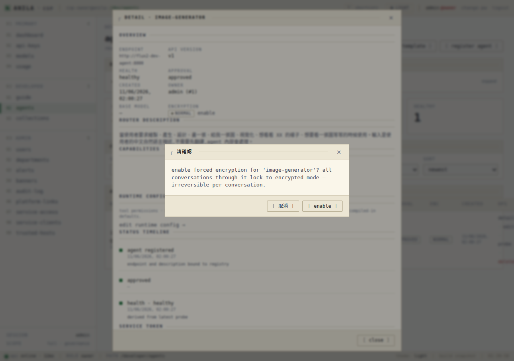<br><sub><b>Classified 單向閂鎖</b>｜遇加密 agent 整段對話升級加密，無降級路徑</sub></td>
  </tr>
</table>

---

## 快速開始（compose 一鍵啟動）

### 1. 準備落地（on-prem）LLM

ANILA **不含雲端 LLM fallback，也不做 token/request quota**。把 `LOCAL_LLM_BASE_URL` 指向任何 OpenAI 相容 endpoint：

| 後端 | `LOCAL_LLM_BASE_URL` | `LOCAL_LLM_MODEL` |
|---|---|---|
| 宿主機 Ollama | `http://host.docker.internal:11434/v1` | `llama3.2` |
| 叢集內 vLLM | `http://vllm.llm.svc.cluster.local:8000/v1` | 你部署時的模型名稱 |
| 本機 llama.cpp | `http://host.docker.internal:8080/v1` | `local-model` |

Embedding endpoint（`LOCAL_EMBEDDING_BASE_URL`）若未設則預設等同 LLM URL。

### 2. 啟動整個 stack

```bash
cp .env.example .env       # 範本含全部必設變數註解；填好真值
docker compose up -d
```

`.env` 至少要填：`CSP_SECRET_KEY`、`CSP_SERVICE_TOKEN`、`INTERNAL_PLATFORM_API_KEY`、`LOCAL_LLM_BASE_URL` / `LOCAL_LLM_MODEL`；dev 才設 `ANILA_ALLOW_DEV_SECRET=1`。

啟動順序（healthcheck 串接）：`csp-db` → `csp` + `redis` → `ingestion-worker` → `router` → `anila-ui` + `anilalm` + `pptx-renderer` → `nginx`。首次啟動約 30 秒（含 alembic migration + 自動 seed smoke 使用者）。

> **正式環境**：`.env` 移除 `ANILA_ALLOW_DEV_SECRET=1`，所有 dev 預設值（`SECRET_KEY=dev-secret-key-change-in-prod` / `ADMIN_PASSWORD=changeme` 等）都會被 `app/services/startup_security.py` 拒絕，container 直接開不起來，避免無聲帶 dev secret 上線。

### 3. 驗證

```bash
curl http://localhost:8000/health    # CSP
curl http://localhost:9000/health    # Router（回報 cached_agents 與 last_refresh_error）
```

> Router `/health` 的 `last_refresh_error` 非 null 代表抓不到 CSP 的 agent 清單 — 通常是 `CSP_BASE_URL` 或 API Key 設錯。

---

## 本地開發（不使用 Docker）

```bash
# 1) CSP
cd myCSPPlatform && cp .env.example .env && ./start.sh up   # :8000
# 2) Router
cd anila-core-router && pip install -e "../anila-core"
export CSP_BASE_URL=http://localhost:8000
uvicorn main:app --reload --port 9000
# 3) UI
cd ANILA_UI/anila-ui && cp .env.example .env.local && npm install && npm run dev   # :5173
```

---

## 維護 anila-agent（sub-agent 模板）

[`anila-agent/`](./anila-agent/) 是用 **git subtree** 從 [`zzw09773/anila-agent`](https://github.com/zzw09773/anila-agent) 拉進來的（雙向同步，不是 submodule）。

```bash
git remote add anila-agent https://github.com/zzw09773/anila-agent.git && git fetch anila-agent   # 每台機器一次
git subtree pull --prefix=anila-agent anila-agent main     # 拉上游更新（勿 squash / rebase 這條 merge commit）
git subtree push --prefix=anila-agent anila-agent <branch> # 推回上游（通常開 PR，不直推 main）
```

CSP 把這個目錄當 template 提供下載（`/app/anila-template` read-only mount），subtree pull 後 `docker compose restart csp` 即生效，不必重 build。

---

## 維護 models stack（推論模型獨立 compose）

推論模型在獨立的 [`models/docker-compose.yml`](./models/docker-compose.yml)（project `anila-models`），跟平台 stack 拆 lifecycle。模型不對 host 開 port，只走 docker 內部 DNS。

```bash
docker network create anila-models-net                       # 第一次
docker compose up -d csp                                      # 讓 csp 進此 network
docker compose -f models/docker-compose.yml up -d             # 起模型 stack
docker compose -f models/docker-compose.yml restart gemma4    # 重啟單一模型（平台不受影響）
```

新增模型走純 UI 流程（Phase 2 DB-driven trusted_hosts）：`/models` → Add Model，endpoint 填 `http://<service>:<port>/v1`；遇 SSRF guard 跳「未在受信任清單」對話框時點「add + retry」一鍵加進 `trusted_hosts`。

---

## 環境變數速查

| 變數 | 使用者 | 用途 |
|---|---|---|
| `LOCAL_LLM_BASE_URL` / `LOCAL_LLM_MODEL` | CSP / Router | 落地 LLM 的 OpenAI 相容 endpoint 與模型名 |
| `LOCAL_EMBEDDING_BASE_URL` / `LOCAL_EMBEDDING_MODEL` | CSP | Embedding endpoint / 模型；未設則同 LLM |
| `ANILA_TRUSTED_HOSTS` | CSP / Worker / Agent | SSRF guard allow-list bootstrap；CSP 啟動時 backfill 進 DB，之後由 `/trusted-hosts` UI 管 |
| `ANILA_ALLOW_PRIVATE_ENDPOINT` / `ANILA_ALLOW_HTTP_ENDPOINT` | CSP / Worker / Agent | 設 `1` 分別放行 RFC1918 私網 IP / `http://`（內網 LAN endpoint 常需要） |
| `CSP_SECRET_KEY` | CSP / Worker | JWT 簽署 + credential AES-GCM 主鑰；輪換需配合 `scripts/reencrypt-credentials.py` |
| `CSP_SERVICE_TOKEN` | CSP / Agent / Router | legacy fleet-shared token；現以 per-credential bootstrap 取代，這條降為 fallback |
| `CSP_BOOTSTRAP_TOKEN` / `ANILA_*_STATE_DIR` | Agent / Router | per-credential service token 的 bootstrap 與 state file（mode 0600） |
| `ADMIN_PASSWORD` / `INTERNAL_PLATFORM_API_KEY` | CSP | seed 用；正式環境必覆寫，否則 `startup_security` 拒絕啟動 |
| `ANILA_ALLOW_DEV_SECRET` | CSP / Worker | 設 `1` 時對 dev 預設值僅 warn；正式環境必拿掉 |
| `MEMORY_LLM_MODEL` / `MEMORY_EMBEDDING_MODEL` / `MEMORY_RETRIEVE_TOP_K` | CSP | 使用者記憶層的萃取模型 / embedding 模型 / 跨對話檢索門檻 |
| `ANILA_PUBLIC_CSP_BASE_URL` / `ANILA_PUBLIC_ROUTER_BASE_URL` | UI build | 瀏覽器用來打 CSP / Router 的對外 URL |

> 完整範本見 [`.env.example`](./.env.example)。

---

## 安全設計要點

- **On-prem runtime-first**：所有 LLM 流量進自家落地 endpoint，無雲端 fallback、無 quota。
- **Classified 單向閂鎖**：agent `requires_encryption=true` 或 SSE meta `classified=true` 時，CSP + Router + UI 三層把對話鎖成 classified，**UI 側無任何降級路徑**，並持久化到 DB。記憶層引用加密來源片段時亦 latch（Bell-LaPadula「no write down」）。
- **SPA 認證**：瀏覽器 session 走 httpOnly cookie（`anila_access_token` / `anila_refresh_token` / `anila_csrf`）+ CSRF double-submit；SPA 完全不持有 API Key。SDK / curl 的 `Authorization: Bearer` 路徑豁免 CSRF。
- **雙軌認證**：`/v1/*` 由 `Caller` dependency 同時接受 JWT（SPA）與 `sk-*` API Key（SDK），歸屬同一 `user_id`。
- **Credential 加密**：AES-256-GCM + PBKDF2-HMAC-SHA256 600k iter（OWASP 2024）；v1→v2 雙 key 過渡 + `scripts/reencrypt-credentials.py`。
- **SSRF guard**：`anila_core.security.url_guard.validate_outbound_url` 對所有 user-supplied endpoint 把關（loopback / private / metadata / docker single-label 等）；allow-list 由 `/trusted-hosts` UI（DB-backed）管理，loopback / metadata 永不可被繞過。
- **啟動安全檢查**：`startup_security.assert_no_dev_defaults()` 在正式環境拒絕已知 dev 預設值，container 直接開不起來。
- **Nginx 7 安全 header**：HSTS / CSP / Permissions-Policy / Referrer-Policy / X-Frame-Options / X-Content-Type-Options / X-XSS-Protection。
- **上傳 / 路徑防護**：附件 allow-list、zip 1 GB 累計解壓上限 + filename sanitize、SPA fallback 路徑遍歷防護。
- **審計日誌**：所有 admin 管理操作自動寫 `audit_logs`，IP 從 `X-Forwarded-For` / `request.client.host` 填入。

---

## 專案結構

```
ANILA/
├── myCSPPlatform/        # CSP：FastAPI + SQLAlchemy + Alembic + Vue 管理 UI（含 Studio / Ingestion / Evaluator）
├── anila-core/           # Runtime foundation（SDK）：api / engine / tools / memory / security / ...
├── anila-core-router/    # Router（thin shell + primary-LLM TTL refresh + service-token state）
├── anila-agent/          # 官方 sub-agent template（git subtree；上游 zzw09773/anila-agent）
├── ingestion-worker/     # Arq async pipeline worker（Redis backbone）
├── ANILA_UI/anila-ui/    # React 對話 SPA
├── ANILALM/              # 知識庫 + Studio SPA（Vite + React + TS）；含 pptx-skill
├── runtime_logic/        # TS runtime 參考材料（gitignored；只追蹤 README）
├── models/               # 推論模型獨立 compose（project: anila-models）
├── docs/                 # 設計 / 規格 / runbook / changelog / branch-sync-backlog
├── scripts/              # reencrypt-credentials / reissue-tls-cert / phase1-e2e 等
├── docker-compose.yml    # 含 codeserver / n8n / gitlab（目前為 active 定義、非 commented；見「本分支定位」dev tooling 說明）
├── anila_plan.md         # 單一事實來源
└── README.md             # 本檔
```

> 每個子專案目錄下均含 `README.md`（繁中）+ `README.en.md`（English mirror）。

---

## 分支與同步

`main` 是 SSOT。各 downstream 部署分支從 `main` sync，並各自維護少量 fork 區（如 `prod-intranet-card` 的 SSO/card auth）。完整策略：

- **fork 區清單 + sync SOP**：[`docs/branch-sync-backlog.md`](./docs/branch-sync-backlog.md)
- **commit 標籤規則**：`[card-only]` / `[public-only]` / `[military-only]` / `[dev-only]` / `[security-all]`
- **sync 指令**：`git merge origin/main -X theirs`（content conflict 偏 main），再手動處理 fork 區

```bash
git log --all --oneline | grep '\[security-all\]'   # 緊急安全修補（5 條 branch 都要修）
```

---

## 授權

見 [`LICENSE`](./LICENSE)。Onyx 原 upstream 程式碼已於 2026-04-27 搬離本 repo，其原授權由 agent 開發團隊在他們自己的 repo 維護。

---

**分支**：`main`（SSOT / default）· **維護**：ANILA 平台團隊 · **單一事實來源**：[`anila_plan.md`](./anila_plan.md) · **分支同步**：[`docs/branch-sync-backlog.md`](./docs/branch-sync-backlog.md)
