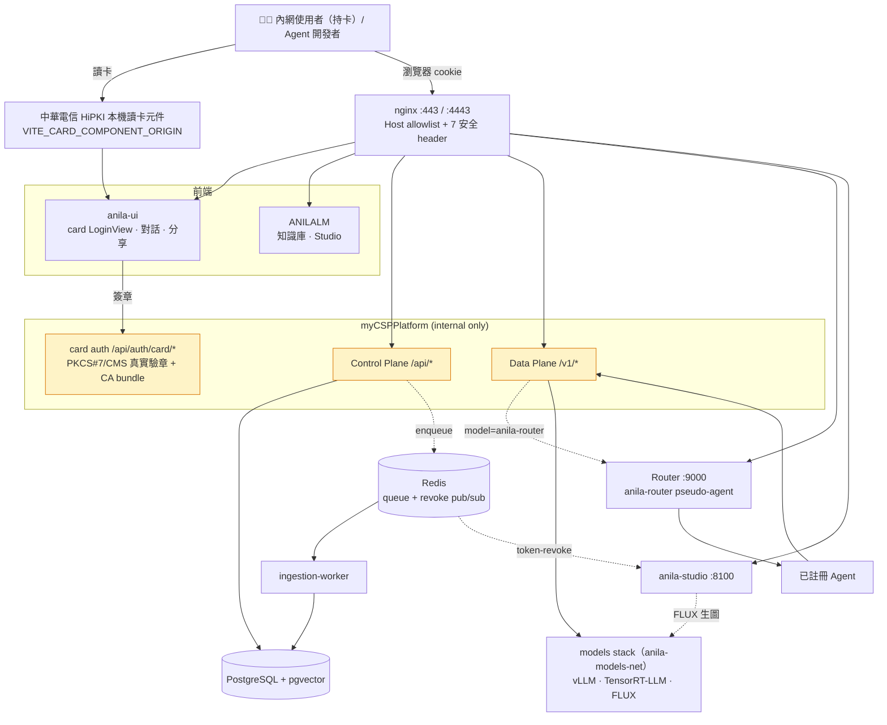

# ANILA 平台 — `prod-intranet-card`(中科院內網部署版)

> **Runtime-first、On-prem 多 Agent 平台。** 三個核心服務、一個落地 LLM，docker compose 一鍵啟動。

> ⚠️ **你正在看 `prod-intranet-card` 分支**(中科院內網 + 自然人憑證卡)。這是**唯一**含 SSO / card auth fork 的分支。
>
> | Branch | 部署對象 | 認證 | 定位 |
> |---|---|---|---|
> | `main` | 開發 SSOT（default） | 純帳密 | 所有 feature 的源頭 |
> | **`prod-intranet-card`** ← *你在這* | 中科院內網 prod | **SSO + 中科院 PKI 卡** | main + auth/SSO/card fork |
> | `prod-public-passwd` | 對外網 prod | 純帳密 | main + 外網 hardening |
> | `prod-military-passwd` | 國軍交付 prod | 純帳密 | main + military spec |
> | `dev-public` | 對外網 dev | 純帳密 | main + dev tooling |
> | `dev-military` | 國軍 dev | 純帳密 | dev-public + military 客製 |
> | `trial-military` | 國軍 trial / 展示 | 純帳密 | main 精簡子集 |
>
> **`main` 是 SSOT** — 新 feature 先進 main 再 sync 進此分支。**改 SSO / card 相關檔(`auth.py` / `users.py` / `auth_providers.py` / `user.py` 等 fork 區)不要往 main 或其他 downstream 推**；其他改動(anila-studio / ANILA_UI / docs / 一般 bugfix)優先進 main 再 sync。
> 完整 fork 區清單 + sync SOP 見 [`docs/branch-sync-backlog.md`](./docs/branch-sync-backlog.md)。Backup tag：`pre-branch-restructure-2026-05-26`。

ANILA 是一套企業內部的多 Agent 平台：統一管理模型與 API Key、對外以 OpenAI 相容介面提供推論、讓開發者基於樣板複製出自己的 Agent 並註冊進來、讓終端使用者透過統一 UI 與所有 Agent 對話，並以「主 LLM 未加密 → 遇到加密 agent 整段對話升級為加密」的**單向閂鎖（one-way latch）**處理敏感資料。

平台層內建**使用者記憶**：每輪對話自動萃取個人事實 + embed 訊息片段，下次對話自動帶入，跨 agent 共享（route 3，見 [`docs/briefing/anila-memory-layer-rfc.md`](./docs/briefing/anila-memory-layer-rfc.md)）。

---

## 本分支定位（`prod-intranet-card`）

| 面向 | 內容 |
|---|---|
| **部署對象** | 中科院內網（air-gapped，機房無外網） |
| **認證** | **中科院自然人憑證卡（PKI 卡）**為唯一登入路徑；SSO/OIDC fork 一併存在 |
| **登入鎖定** | `REQUIRE_CARD_LOGIN_ONLY=true` — 本機帳密 / OIDC / 自助註冊 endpoints 全回 404 |
| **break-glass** | `CARD_INITIAL_OWNERS`(員工編號 CSV)列出者首次刷卡建為 `owner` + 已核准，其餘走 pending → admin 核准 |
| **fork 區** | `auth.py` / `users.py` / `auth_providers.py` / `models/{user,auth_provider,external_identity}.py` 等 — **不回推 main** |
| **治理** | 對齊 ISO/IEC 42001:2023，文件集中於 [`docs/governance/`](./docs/governance/) |

**自然人憑證卡登入流程**：前端透過中華電信 HiPKI 本機元件（`VITE_CARD_COMPONENT_ORIGIN`，預設 `http://localhost:16888`）讀卡 → 取得 PKCS#7/CMS 簽章 → CSP `/api/auth/card/*` 做**真實 PKCS#7/CMS 簽章驗證**（含 CA bundle 鏈驗證 + 撤銷檢查）→ 簽發平台 JWT。**不是**只比對卡號的假驗證。

| 子專案 | 角色 | 預設 Port |
|---|---|---|
| [`myCSPPlatform`](./myCSPPlatform/) | **CSP**（Control & Data Plane）— 使用者 / API Key / 模型 / Agent / 對話 / 附件 / 分享 / 交接 / 審計 / Ingestion / OpenAI 相容代理 / **card + SSO auth** / JWKS / token revocation publisher | `:8000`（internal） |
| [`anila-studio`](./anila-studio/) | **Studio service** — Deck 生成（RAG + LLM + FLUX + PPTX）；本地驗 JWT（JWKS）+ Redis pub/sub revocation | `:8100`（internal） |
| [`anila-core`](./anila-core/) | **Runtime foundation（SDK）** — api / registry / engine / tools / providers / storage / **memory** / compact / cli / **security** | — |
| [`anila-core-router`](./anila-core-router/) | **Router** — OpenAI 相容分派器；per-credential service token 走 s2s | `:9000`（internal） |
| [`anila-agent`](./anila-agent/) | **官方 sub-agent 模板**（git subtree；上游 [`zzw09773/anila-agent`](https://github.com/zzw09773/anila-agent)） | `:24786`（獨立執行時） |
| [`ingestion-worker`](./ingestion-worker/) | **Async pipeline worker** — Arq + Redis；parse → chunk → embed → pgvector + Chunking Evaluator | （無 host port） |
| [`ANILA_UI/anila-ui`](./ANILA_UI/anila-ui/) | **Chat Runtime UI** — React；含 card 登入畫面（LoginView） | nginx 前 |
| [`ANILALM`](./ANILALM/) | **Knowledge-base + Studio SPA**；mount 在 nginx `/anilalm/` | nginx 前 |
| **`nginx`** | 對外閘道；**Host allowlist + 內網 hardening**；7 個安全 header | `:443` / `:4443` |
| **`redis`** | ingestion-worker queue + token-revoke pub/sub | （無 host port） |

> **唯一規劃文件**：[`anila_plan.md`](./anila_plan.md)。**AI 治理**：[`docs/governance/iso-42001-compliance.md`](./docs/governance/iso-42001-compliance.md)。

---

## 整體架構


```mermaid
flowchart TB
    users["🧑‍💻 內網使用者（持卡）/ Agent 開發者"]
    card["中華電信 HiPKI 本機讀卡元件<br/>VITE_CARD_COMPONENT_ORIGIN"]
    nginx["nginx :443 / :4443<br/>Host allowlist + 7 安全 header"]

    subgraph spas["前端"]
        anila_ui["anila-ui<br/>card LoginView · 對話 · 分享"]
        anilalm["ANILALM<br/>知識庫 · Studio"]
    end

    subgraph csp["myCSPPlatform (internal only)"]
        csp_auth["card auth /api/auth/card/*<br/>PKCS#7/CMS 真實驗章 + CA bundle"]
        csp_ctrl["Control Plane /api/*"]
        csp_data["Data Plane /v1/*"]
    end

    studio["anila-studio :8100"]
    router_core["Router :9000<br/>anila-router pseudo-agent"]
    agents["已註冊 Agent"]
    redis[("Redis<br/>queue + revoke pub/sub")]
    worker["ingestion-worker"]
    llm["models stack（anila-models-net）<br/>vLLM · TensorRT-LLM · FLUX"]
    db[("PostgreSQL + pgvector")]

    users -->|讀卡| card --> anila_ui
    users -->|瀏覽器 cookie| nginx --> anila_ui & anilalm & csp_ctrl & csp_data & router_core & studio
    anila_ui -->|簽章| csp_auth
    csp_data -.->|model=anila-router| router_core --> agents --> csp_data
    csp_ctrl --> db
    csp_data --> llm
    csp_ctrl -.->|enqueue| redis --> worker --> db
    studio -.->|FLUX 生圖| llm
    redis -.->|token-revoke| studio

    classDef plane fill:#fef3c7,stroke:#d97706
    class csp_ctrl,csp_data,csp_auth plane
```

---

## 介面預覽

> 以下截圖取自運行中的 ANILA 平台 CSP 控制台、anila-ui 對話前端與 ANILALM 知識庫。本分支登入為中科院自然人憑證卡（PKCS#7/CMS 驗章），與截圖環境的帳密登入不同，故登入畫面未列入。

<table>
  <tr>
    <td width="50%"><br><sub><b>CSP 控制台總覽</b>｜24h 用量 / 吞吐 / Top agents / legacy-token cutover 監控</sub></td>
    <td width="50%"><br><sub><b>模型 / API Key 管理</b>｜統一註冊 LLM / Embedding / Agent endpoint</sub></td>
  </tr>
  <tr>
    <td><br><sub><b>Agent 註冊與核准</b>｜逐 agent 強制加密（classified latch 來源）</sub></td>
    <td><br><sub><b>知識庫 Collections</b>｜文件 → chunk → embed → pgvector 檢索（RAG）</sub></td>
  </tr>
  <tr>
    <td><br><sub><b>開發者上手指南</b>｜對準 MLSteam 工作流的 agent 建置教學</sub></td>
    <td><br><sub><b>anila-ui 對話前端</b>｜<code>anila-router</code> 自動分派、分享、交接</sub></td>
  </tr>
  <tr>
    <td><br><sub><b>ANILALM 知識庫 + Studio</b>｜文件 → 對話 → 簡報 / 報告 / 心智圖 等 artifact</sub></td>
    <td><br><sub><b>審計日誌</b>｜所有 admin 操作自動寫 <code>audit_logs</code></sub></td>
  </tr>
  <tr>
    <td colspan="2"><br><sub><b>Classified 單向閂鎖</b>｜遇加密 agent 整段對話升級加密，無降級路徑</sub></td>
  </tr>
</table>

---

## 內網快速部署（prod 主流程）

內網部署一律走 [`scripts/deploy-prod.sh`](./scripts/deploy-prod.sh)，**不直接打 `docker compose up`**。腳本內含 pre-flight 檢查（branch / docker / env / network / models stack），避免在 main 上跑、避免 dev fallback 值偷渡上線、避免漏起模型 stack。

```bash
# 0. 確認在本分支
git checkout prod-intranet-card && git pull origin prod-intranet-card
# 1. 載入 prod 環境變數（secret 從你的 prod .env，不要 commit 進 repo）
set -a; source /path/to/prod.env; set +a
# 2. 一鍵部署（preflight + build + up + 等 healthy + verify）
bash scripts/deploy-prod.sh
```

`deploy-prod.sh` 子指令：`deploy`（預設）/ `preflight` / `up` / `down`（保留 named volumes）/ `restart` / `rebuild <svc>` / `status` / `logs <svc>` / `verify`（含 `/api/auth/revocations` 檢查）。

**Pre-flight 檢查（每項 fail 即停）**：① git branch 是三條 prod 分支之一（`prod-intranet-card` / `prod-public-passwd` / `prod-military-passwd`；腳本會印出本分支特性，避免誤在 main 上跑）② docker + compose v2 可用 ③ 必要 env（`CSP_SERVICE_TOKEN` / `INTERNAL_PLATFORM_API_KEY` 等）非空且非 dev/changeme/placeholder ④ `anila-models-net` external network 存在（含 remote-models 模式）⑤ 模型服務（`gemma4` / `flux2-dev` / `flux2-dev-agent` / `nv-embed-proxy`）healthy ⑥ `share/uploads/flux` 目錄存在。

### 離線打包（外網 → 內網）

中科院機房無外網，先在有外網的開發機把所有 image 打包，再帶進內網 `docker load`：

```bash
# 外網開發機：
bash scripts/build-and-export-for-intranet.sh
# → /tmp/anila-images-export/{01-anila-built,02-base,03-cold,04-models}.tar.gz + INTRANET-LOAD.sh

# 內網（複製 export 目錄 + repo 進來）：
bash /path/to/INTRANET-LOAD.sh                       # docker load 全部 image
docker network create anila-models-net               # 第一次
docker compose -f models/docker-compose.yml up -d    # 起模型 stack（獨立 lifecycle）
bash scripts/deploy-prod.sh                           # 起 app stack
```

> 相關離線腳本：[`scripts/download-intranet-models.sh`](./scripts/download-intranet-models.sh)、[`scripts/download-intranet-toolkit.sh`](./scripts/download-intranet-toolkit.sh)、[`scripts/intranet-quantize-nvfp4.py`](./scripts/intranet-quantize-nvfp4.py)、[`scripts/pack-chunks.sh`](./scripts/pack-chunks.sh) / [`unpack-chunks.sh`](./scripts/unpack-chunks.sh)（大檔分塊搬運）。V1.0.0 部署細節見 [`docs/runbooks/`](./docs/runbooks/)。

### 服務不健康時的排查

```bash
bash scripts/deploy-prod.sh status               # 哪個 service 不 healthy？
bash scripts/deploy-prod.sh logs <service>       # 看最新 logs
bash scripts/deploy-prod.sh rebuild <service>    # 改完 source 後單獨重 build
```

常見問題：
- **csp ModuleNotFoundError**：多半是 fork 區 sync 漏 — `git diff origin/prod-intranet-card -- myCSPPlatform/backend/app/{api,models,schemas,services}/` 對照 [`docs/branch-sync-backlog.md`](./docs/branch-sync-backlog.md) 的「永久 fork 區」清單。
- **anila-studio cold-start JSONDecodeError**：csp 缺 `/api/auth/revocations`。確認 `auth.py` 有 `TOKEN_REVOCATION_RETENTION_DAYS` + `list_revocations`。
- **`${VAR:?must be set}` 報錯**：該 env 必設，見 pre-flight 第 3 條。

---

## 開發者：本地 dev 啟動（不走部署腳本）

```bash
cp .env.example .env       # dev 才設 ANILA_ALLOW_DEV_SECRET=1
docker compose up -d
```

card 登入需要本機 HiPKI 讀卡元件；本地 dev 若無實體卡，可暫不設 `REQUIRE_CARD_LOGIN_ONLY`（保留帳密登入測試其餘功能），但**勿把該設定推上 prod 環境檔**。

---

## 環境變數速查（本分支特有 + 共用核心）

| 變數 | 使用者 | 用途 |
|---|---|---|
| `ENABLE_CARD_LOGIN` | CSP | **branch SSO**：是否註冊 `/api/auth/card/*`。內網 prod 必開（`true`） |
| `REQUIRE_CARD_LOGIN_ONLY` | CSP | **branch SSO**：內網 prod 必開（`true`）。啟用後帳密 / OIDC / 自助註冊全回 404。`startup_security` 強制 `ENABLE_CARD_LOGIN` 也須 `true`，否則 fail-fast（避免 bricked 無人能登入） |
| `CARD_INITIAL_OWNERS` | CSP | **branch SSO**：員工編號 CSV；列入者首次刷卡建為 `owner` + `is_approved=True`（bootstrap） |
| `VITE_CARD_COMPONENT_ORIGIN` | UI build | **branch SSO**：HiPKI 本機元件 origin，預設 `http://localhost:16888` |
| `CSP_SECRET_KEY` | CSP / Worker | JWT 簽署 + credential AES-GCM 主鑰；輪換配合 `scripts/reencrypt-credentials.py` |
| `CSP_SERVICE_TOKEN` / `CSP_BOOTSTRAP_TOKEN` | CSP / Agent / Router | s2s token；以 per-credential bootstrap + state file（0600）為主 |
| `LOCAL_LLM_BASE_URL` / `LOCAL_EMBEDDING_BASE_URL` | CSP | 落地 LLM / Embedding endpoint（OpenAI 相容） |
| `ANILA_TRUSTED_HOSTS` | CSP / Worker | SSRF guard allow-list bootstrap；之後由 `/trusted-hosts` UI 管 |
| `ANILA_ALLOW_PRIVATE_ENDPOINT` / `ANILA_ALLOW_HTTP_ENDPOINT` | CSP | 內網 LAN endpoint 常需開 |
| `ADMIN_PASSWORD` / `INTERNAL_PLATFORM_API_KEY` | CSP | seed 用；prod 必覆寫。`SMOKE_USER_API_KEY` prod 已從 `AUTO_SEED_API_KEYS` 移除 |
| `ANILA_ALLOW_DEV_SECRET` | CSP / Worker | dev 才設 `1`；prod 必拿掉（或設 `0`） |

> 完整範本見 [`.env.example`](./.env.example)。

---

## AI 治理（ISO/IEC 42001:2023）

ANILA 內網部署對齊 ISO/IEC 42001:2023（AI Management System），治理文件集中在 [`docs/governance/`](./docs/governance/)，以 [`iso-42001-compliance.md`](./docs/governance/iso-42001-compliance.md) 為主索引，盤點 Clause 4–10 與 Annex A 控制的現況、差距、收斂計畫。

| 文件 | 對應 ISO 42001 | 用途 |
|---|---|---|
| [`iso-42001-compliance.md`](./docs/governance/iso-42001-compliance.md) | Clause 4–10 + Annex A | 合規主索引；每季 review |
| [`ai-policy.md`](./docs/governance/ai-policy.md) | 5.2 / A.2.2 | 平台 AI 政策（需簽核） |
| [`roles-responsibilities.md`](./docs/governance/roles-responsibilities.md) | 5.3 / A.3.2 | RACI + 能力要求 |
| [`risk-register.md`](./docs/governance/risk-register.md) | 6.1.2 / 8.3 | 風險登錄簿 |
| [`aiia-template.md`](./docs/governance/aiia-template.md) | 6.1.4 / A.5.2 | AI Impact Assessment 範本 — 每個 production agent 必填 |
| [`model-card-template.md`](./docs/governance/model-card-template.md) | A.6.2.7 | Model card 範本 — 每個 production model 必填 |
| [`data-governance.md`](./docs/governance/data-governance.md) | A.7.x | 資料分類、來源、品質、生命週期 |
| [`ai-incident-response.md`](./docs/governance/ai-incident-response.md) | 10.1 / A.8.3 | AI 事件 4-tier 分級 + 回應流程 |
| [`third-party-ai-register.md`](./docs/governance/third-party-ai-register.md) | A.10 | 第三方 AI 供應商登錄 + 評估 |

**Schema 對應**：`agents.{source_commit_sha, last_reviewer_id, vv_status, aiia_doc_path}` + `model_registry.{model_card_url, training_dataset_ref, weights_sha256, intended_use, limitations}`（migration `0035_iso_42001_traceability.py`）。

---

## 安全設計要點（含本分支 hardening）

- **自然人憑證卡真實驗章**：`/api/auth/card/*` 做真實 PKCS#7/CMS 簽章驗證 + CA bundle 鏈驗證，非比對卡號的假驗證（V1.0.0 closed auth-bypass CRITICAL）。
- **登入面收斂**：`REQUIRE_CARD_LOGIN_ONLY=true` 時帳密 / OIDC / 自助註冊 endpoints 回 404；唯一登入路徑是 PKI 卡。
- **nginx Host allowlist + 內網 hardening**：對外入口縮成 nginx `:443`，強制 HTTPS。
- **Classified 單向閂鎖**：CSP + Router + UI 三層鎖 classified，UI 無降級路徑，持久化到 DB。
- **Credential 加密**：AES-256-GCM + PBKDF2 600k；SSRF guard 對所有 user-supplied endpoint 把關（`/trusted-hosts` UI 管 allow-list，loopback / metadata 永不可繞過）。
- **啟動安全檢查**：`startup_security` 在 prod 拒絕 dev 預設值與 card-login 矛盾設定，container 直接開不起來。
- **TLS 私鑰治理**：rotated material（`.revoked-*`）已 gitignore；重簽流程見 [`docs/runbooks/rotate-tls-cert.md`](./docs/runbooks/rotate-tls-cert.md)。
- **審計日誌**：所有 admin 操作 + card 登入 / OIDC 失敗自動寫 `audit_logs`。

---

## 分支與同步

- **本分支是唯一的 SSO/card fork**。fork 區檔案（`auth.py` / `users.py` / `auth_providers.py` / `models/{user,auth_provider,external_identity}.py` 等）**不回推 main**。
- 其他改動先進 `main`，再 `git merge origin/main -X theirs` sync 進本分支，手動處理 fork 區衝突。
- 完整 fork 區清單 + sync SOP：[`docs/branch-sync-backlog.md`](./docs/branch-sync-backlog.md)。
- 緊急安全修補標 `[security-all]`，5 條 branch 都要修。

---

## 授權

見 [`LICENSE`](./LICENSE)。Onyx 原 upstream 程式碼已於 2026-04-27 搬離本 repo。

---

**分支**：`prod-intranet-card`（中科院內網 / 自然人憑證卡）· **部署**：`bash scripts/deploy-prod.sh` · **治理**：[`docs/governance/iso-42001-compliance.md`](./docs/governance/iso-42001-compliance.md) · **分支同步**：[`docs/branch-sync-backlog.md`](./docs/branch-sync-backlog.md)
