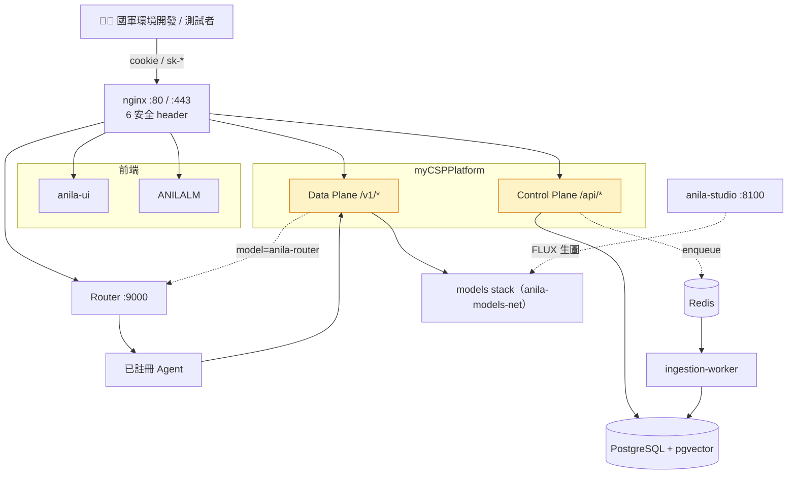

# ANILA 平台 — `dev-military`(國軍開發 / 測試版)

> **Runtime-first、On-prem 多 Agent 平台。** 三個核心服務、一個落地 LLM，docker compose 一鍵啟動。

> 🧪🪖 **你正在看 `dev-military` 分支**(國軍 dev，純帳密)。= `dev-public` + military 客製，給國軍環境功能的開發 / 測試前置使用。
>
> | Branch | 部署對象 | 認證 | 定位 |
> |---|---|---|---|
> | `main` | 開發 SSOT（default） | 純帳密 | 所有 feature 的源頭 |
> | `prod-intranet-card` | 中科院內網 prod | SSO + 自然人憑證卡 | main + auth/SSO/card fork |
> | `prod-public-passwd` | 對外網 prod | 純帳密 | main + 外網 hardening |
> | `prod-military-passwd` | 國軍交付 prod | 純帳密 | main + military spec |
> | `dev-public` | 對外網 dev | 純帳密 | main + dev tooling |
> | **`dev-military`** ← *你在這* | 國軍 dev | 純帳密 | dev-public + military 客製 |
> | `trial-military` | 國軍 trial / 展示 | 純帳密 | main 精簡子集 |
>
> **`main` 是 SSOT** — 新 feature 先進 main 再 sync。本分支是 `prod-military-passwd` 交付前的開發 / 測試前置，`[military-only]` / `[dev-only]` 兩類 commit 在此交會。完整 SOP 見 [`docs/branch-sync-backlog.md`](./docs/branch-sync-backlog.md)。

ANILA 是一套企業內部的多 Agent 平台：統一管理模型與 API Key、對外以 OpenAI 相容介面提供推論、讓開發者基於樣板複製出自己的 Agent 並註冊進來、讓終端使用者透過統一 UI 與所有 Agent 對話，並以「主 LLM 未加密 → 遇到加密 agent 整段對話升級為加密」的**單向閂鎖（one-way latch）**處理敏感資料。

平台層內建**使用者記憶**：每輪對話自動萃取個人事實 + embed 訊息片段，下次對話自動帶入，跨 agent 共享。

---

## 本分支定位（`dev-military`）

| 面向 | 內容 |
|---|---|
| **用途** | 國軍環境功能的開發 / 測試；`prod-military-passwd` 交付前的前置驗證 |
| **認證** | 純帳密（本地登入）；dev 可開 `ANILA_ALLOW_DEV_SECRET=1` |
| **與 dev-public 差異** | 套用 military 客製；對齊 `prod-military-passwd` 的服務組成（移除 n8n / GitLab / code-server 等對外開發工具，貼近 air-gapped 交付樣態） |
| **與 prod-military-passwd 關係** | 本分支驗證過的 military 客製，整理為 `[military-only]` commit 後進 prod-military 線 |
| **同步** | 從 main sync 取通用 feature；military 客製不回 main |

> ⚠️ **dev 分支，僅供開發 / 測試。** 國軍交付正式環境請用 `prod-military-passwd`。

| 子專案 | 角色 | 預設 Port |
|---|---|---|
| [`myCSPPlatform`](./myCSPPlatform/) | **CSP**（Control & Data Plane）— 使用者 / API Key / 模型 / Agent / 對話 / 附件 / 分享 / 交接 / 審計 / Ingestion / OpenAI 相容代理 / JWKS | `:8000` |
| [`anila-studio`](./anila-studio/) | **Studio service** — Deck 生成（RAG + LLM + FLUX + PPTX） | `:8100`（internal） |
| [`anila-core`](./anila-core/) | **Runtime foundation（SDK）** — api / engine / tools / memory / security / ... | — |
| [`anila-core-router`](./anila-core-router/) | **Router** — OpenAI 相容分派器 | `:9000` |
| [`anila-agent`](./anila-agent/) | **官方 sub-agent 模板**（git subtree；上游 [`zzw09773/anila-agent`](https://github.com/zzw09773/anila-agent)） | `:24786`（獨立執行時） |
| [`ingestion-worker`](./ingestion-worker/) | **Async pipeline worker** — Arq + Redis | （無 host port） |
| [`ANILA_UI/anila-ui`](./ANILA_UI/anila-ui/) | **Chat Runtime UI** — React | nginx 前 |
| [`ANILALM`](./ANILALM/) | **Knowledge-base + Studio SPA** | nginx 前 |
| **`nginx`** | 對外閘道；6 個安全 header | `:80` / `:443` / `:4443` |
| **`redis`** | ingestion-worker queue + token-revoke pub/sub | （無 host port） |

> ⛔ 相對 `main` / `dev-public`：對齊 military 交付樣態，**移除** n8n / GitLab / code-server dev tooling。

> **唯一規劃文件**：[`anila_plan.md`](./anila_plan.md)。

---

## 整體架構


```mermaid
flowchart TB
    devs["🧑‍💻 國軍環境開發 / 測試者"]
    nginx["nginx :80 / :443<br/>6 安全 header"]

    subgraph spas["前端"]
        anila_ui["anila-ui"]
        anilalm["ANILALM"]
    end

    subgraph csp["myCSPPlatform"]
        csp_ctrl["Control Plane /api/*"]
        csp_data["Data Plane /v1/*"]
    end

    studio["anila-studio :8100"]
    router_core["Router :9000"]
    agents["已註冊 Agent"]
    redis[("Redis")]
    worker["ingestion-worker"]
    llm["models stack（anila-models-net）"]
    db[("PostgreSQL + pgvector")]

    devs -->|cookie / sk-*| nginx --> anila_ui & anilalm & csp_ctrl & csp_data & router_core
    csp_data -.->|model=anila-router| router_core --> agents --> csp_data
    csp_ctrl --> db
    csp_data --> llm
    csp_ctrl -.->|enqueue| redis --> worker --> db
    studio -.->|FLUX 生圖| llm

    classDef plane fill:#fef3c7,stroke:#d97706
    class csp_ctrl,csp_data plane
```

**核心資料流**：UI POST `/v1/chat/completions`（`model=anila-router`）→ Router 取 agent manifest + 問主 LLM 是否分派 → 必要時轉發 agent → SSE forward 回 UI；agent `requires_encryption` 時對話永久閂鎖加密。

---

## 快速開始（dev 一鍵啟動）

```bash
cp .env.example .env       # dev 可設 ANILA_ALLOW_DEV_SECRET=1
docker compose up -d
docker network create anila-models-net               # 第一次
docker compose -f models/docker-compose.yml up -d    # 起模型 stack
```

把 `LOCAL_LLM_BASE_URL` 指向你的測試 LLM。military 客製項（air-gap 模擬 / FLUX 啟用與否）依測試需求調整，驗證後整理為 `[military-only]` commit。

### 本地開發（不使用 Docker）

```bash
cd myCSPPlatform && cp .env.example .env && ./start.sh up           # CSP :8000
cd anila-core-router && pip install -e "../anila-core" && uvicorn main:app --reload --port 9000
cd ANILA_UI/anila-ui && cp .env.example .env.local && npm install && npm run dev   # :5173
```

---

## 維護 anila-agent / models stack

```bash
git subtree pull --prefix=anila-agent anila-agent main       # 同步 sub-agent 模板
docker compose -f models/docker-compose.yml up -d             # 起模型 stack（獨立 lifecycle）
```

---

## 環境變數速查

| 變數 | 使用者 | 用途 |
|---|---|---|
| `LOCAL_LLM_BASE_URL` / `LOCAL_LLM_MODEL` | CSP / Router | 測試 LLM endpoint 與模型名 |
| `LOCAL_EMBEDDING_BASE_URL` / `LOCAL_EMBEDDING_MODEL` | CSP | Embedding；未設則同 LLM |
| `ANILA_ALLOW_DEV_SECRET` | CSP / Worker | dev 設 `1` 時對 dev 預設值僅 warn |
| `CSP_SECRET_KEY` / `CSP_SERVICE_TOKEN` | CSP / Agent / Router | JWT 主鑰 / s2s token |
| `ANILA_TRUSTED_HOSTS` | CSP / Worker | SSRF guard allow-list bootstrap |
| `ANILA_ALLOW_PRIVATE_ENDPOINT` / `ANILA_ALLOW_HTTP_ENDPOINT` | CSP | 設 `1` 放行私網 IP / `http://` |
| `ADMIN_PASSWORD` / `INTERNAL_PLATFORM_API_KEY` | CSP | seed 用 |

> 完整範本見 [`.env.example`](./.env.example)。military-only 客製 env 依測試需求。

---

## 安全設計要點

- **dev 取向**：`ANILA_ALLOW_DEV_SECRET=1` 時 dev 預設值不擋。**國軍交付正式請用 `prod-military-passwd`**。
- 平台核心安全機制（與 main 同）：Classified 單向閂鎖、httpOnly cookie + CSRF、AES-256-GCM credential 加密 + PBKDF2 600k、SSRF guard、nginx 6 安全 header、上傳 allow-list、審計日誌。
- 已對齊 military 交付樣態移除對外 dev tooling，降低與 prod-military 的漂移。

---

## 分支與同步

- 本分支 = `dev-public` + military 客製。
- 從 main sync 取通用 feature：`git merge origin/main -X theirs`。
- `[military-only]` commit 進 `prod-military-passwd` / `dev-military` 兩條；`[dev-only]` 進 `dev-public` / `dev-military`。
- military 客製驗證後整理進 `prod-military-passwd`。
- 完整 SOP：[`docs/branch-sync-backlog.md`](./docs/branch-sync-backlog.md)。

---

## 授權

見 [`LICENSE`](./LICENSE)。Onyx 原 upstream 程式碼已於 2026-04-27 搬離本 repo。

---

**分支**：`dev-military`（國軍 dev / 純帳密）· **部署**：`docker compose up -d`（dev）· **國軍交付正式請用**：`prod-military-passwd` · **分支同步**：[`docs/branch-sync-backlog.md`](./docs/branch-sync-backlog.md)
