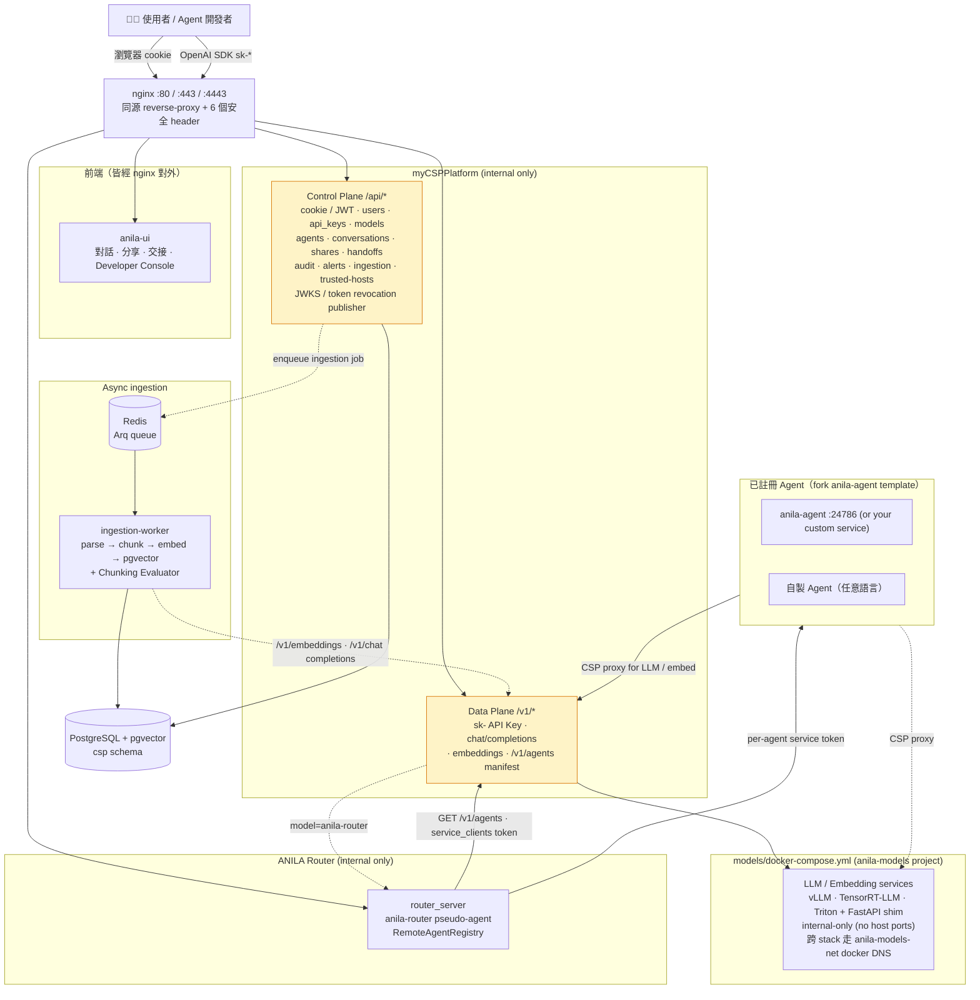

# ANILA 平台

> **Runtime-first、On-prem 多 Agent 平台。** docker compose 一鍵啟動。

ANILA 是一套企業內部的多 Agent 平台：統一管理模型與 API Key、對外以 OpenAI 相容介面提供推論、讓開發者基於樣板複製出自己的 Agent 並註冊進來、讓終端使用者透過統一 UI 與所有 Agent 對話，並以「主 LLM 未加密 → 遇到加密 agent 整段對話升級為加密」的單向閂鎖（one-way latch）處理敏感資料。

平台層內建**使用者記憶**：每輪對話自動萃取個人事實 + embed 訊息片段，下次對話自動帶入，跨 agent 共享；agent 也可透過 service token 呼叫 `/api/memory/users/{id}/facts` 主動讀取使用者背景做個人化。

| 子專案 | 角色 | 預設 Port |
|---|---|---|
| [`myCSPPlatform`](./myCSPPlatform/) | **CSP**（Control & Data Plane）— 使用者 / API Key / 模型 / Agent 註冊 / 對話 / 附件 / 分享 / 交接 / 審計 / Ingestion (Knowledge Collections + Evaluator) / OpenAI 相容代理 / JWKS / token revocation publisher | `:8000` |
| [`anila-core`](./anila-core/) | **Runtime foundation（SDK）** — Python agent runtime 基座（api / registry / engine / tools / providers / storage / **memory（short_term + long_term + backends + clients）**／ compact / cli / **security** / ingestion 共用 chunking_plugins）。Router 與所有 agent 共用 | — |
| [`anila-core-router`](./anila-core-router/) | **Router** — OpenAI 相容分派器；依請求自動路由到註冊的 Agent；Sprint 8 X 起以 `service_clients.router-primary` per-credential token 走 s2s | `:9000` |
| [`anila-agent`](./anila-agent/) | **官方 sub-agent 模板**（git subtree from [`zzw09773/anila-agent`](https://github.com/zzw09773/anila-agent)）— 基於 openai-agents SDK + LiteLLM，移植 Claude Code 的 memdir 長期記憶、hook 介面、slash-command CLI。開發者 fork 上游 repo 當起點，ANILA 透過 subtree 同步本地 copy；CSP 把這個目錄當 template 提供下載 | `:24786`（獨立執行時） |
| [`ingestion-worker`](./ingestion-worker/) | **Async pipeline worker** — Arq + Redis backbone；CSP 推 job 進 queue 後 worker 解析 → 分塊 → embed → 寫 pgvector，並跑 Chunking Evaluator 的 LLM-as-judge | （無 host port） |
| [`ANILA_UI/anila-ui`](./ANILA_UI/anila-ui/) | **Chat Runtime UI** — React 聊天介面，cookie + SSE，串 CSP 與 Router；經由 nginx 對外（dev 直跑 `:5173`） | nginx 前 |
| **`nginx`**（compose service） | 對外閘道；同源 reverse-proxy `/api`、`/v1`、`/router`、`/static`、`/uploads`；6 個安全 header（HSTS / CSP / Permissions-Policy / Referrer-Policy / X-Frame-Options / X-Content-Type-Options） | `:80` / `:443` / `:4443` |
| **`redis`**（compose service） | ingestion-worker 的 queue backing store；不對外暴露 | （無 host port） |
| [`runtime_logic`](./runtime_logic/) | **TS Runtime 參考材料**（READ-ONLY）— 用來對照移植到 `anila-core` 的 agent runtime 設計原本；原始碼 gitignored | — |

---

## 整體架構


```mermaid
flowchart TB
    users["🧑‍💻 使用者 / Agent 開發者"]
    nginx["nginx :80 / :443 / :4443<br/>同源 reverse-proxy + 6 個安全 header"]

    subgraph spas["前端（皆經 nginx 對外）"]
        anila_ui["anila-ui<br/>對話 · 分享 · 交接 · Developer Console"]
    end

    subgraph csp["myCSPPlatform (internal only)"]
        csp_ctrl["Control Plane /api/*<br/>cookie / JWT · users · api_keys · models<br/>agents · conversations · shares · handoffs<br/>audit · alerts · ingestion · trusted-hosts<br/>JWKS / token revocation publisher"]
        csp_data["Data Plane /v1/*<br/>sk- API Key · chat/completions<br/>· embeddings · /v1/agents manifest"]
    end

    subgraph router["ANILA Router (internal only)"]
        router_core["router_server<br/>anila-router pseudo-agent<br/>RemoteAgentRegistry"]
    end

    subgraph agents["已註冊 Agent（fork anila-agent template）"]
        rag["anila-agent :24786 (or your custom service)"]
        custom["自製 Agent（任意語言）"]
    end

    subgraph async["Async ingestion"]
        redis[("Redis<br/>Arq queue")]
        worker["ingestion-worker<br/>parse → chunk → embed → pgvector<br/>+ Chunking Evaluator"]
    end

    subgraph models["models/docker-compose.yml (anila-models project)"]
        llm["LLM / Embedding services<br/>vLLM · TensorRT-LLM · Triton + FastAPI shim<br/>internal-only (no host ports)<br/>跨 stack 走 anila-models-net docker DNS"]
    end

    db[("PostgreSQL + pgvector<br/>csp schema")]

    users -->|瀏覽器 cookie| nginx
    users -->|OpenAI SDK sk-*| nginx
    nginx --> anila_ui
    nginx --> csp_ctrl
    nginx --> csp_data
    nginx --> router_core

    csp_data -.->|model=anila-router| router_core
    router_core -->|GET /v1/agents · service_clients token| csp_data
    router_core -->|per-agent service token| agents
    agents -->|CSP proxy for LLM / embed| csp_data

    csp_ctrl --> db
    csp_data --> llm
    csp_ctrl -.->|enqueue ingestion job| redis
    redis --> worker
    worker --> db
    worker -.->|/v1/embeddings · /v1/chat completions| csp_data
    agents -.CSP proxy.-> llm

    classDef plane fill:#fef3c7,stroke:#d97706
    class csp_ctrl,csp_data plane
```

<details>
<summary>📄 ASCII 版本（離線 / email / 舊 Markdown renderer）</summary>

```
        使用者 / Agent 開發者 / OpenAI SDK / curl
                       │ cookie (SPA) · sk- (SDK)
                       ▼
        ┌──────────────────────────────────────┐
        │  nginx :80 / :443 / :4443             │
        │  reverse-proxy + 6 安全 header        │
        └─┬──────────┬─────────┬─────┘
          │          │         │
          ▼          ▼         ▼
        anila-ui    CSP        Router
        (SPA chat)  :8000      :9000
                    (internal) (internal)
        /api/*  cookie/JWT      │         │
        /v1/*   cookie/sk-      │         │
                                │         │
                    ┌───────────┴────┐    │
                    │  Control plane │    │ /v1/chat/completions
                    │  Data plane    │◀───┘    model=anila-router
                    │  /api/ingestion│   per-agent service token
                    └─────┬──────────┘         │
                          │ enqueue            ▼
                          ▼              已註冊 Agent
                       Redis ─────▶ ingestion-worker
                       (Arq queue)   parse · chunk
                                     · embed · index
                                     · evaluator
                          │                    │
                          ▼                    ▼
                     PostgreSQL +         CSP /v1/* (callback
                     pgvector              for LLM / embeddings)
                                                │
                                                ▼
                                     落地 LLM / Embedding
                                     (models/docker-compose.yml
                                      anila-models-net,
                                      internal docker DNS only)
```

</details>

**核心資料流（一次聊天請求）：**

```
使用者於 UI 送訊息
  │
  ├─ UI POST /v1/chat/completions  model="anila-router"  →  Router
  │
  │   Router 用 caller 的 Bearer API Key 呼叫 CSP:
  │     - GET  /v1/agents              取 agent manifest（requires_encryption 等）
  │     - POST /v1/chat/completions    主 LLM 判斷要不要分派
  │
  ├─ 主 LLM 回 "我需要叫 agent X"
  │     Router 以 caller 的 API Key 轉發到 agent X 的 endpoint_url
  │     agent X 內部可再呼叫 CSP /v1/* 拿 RAG、Embedding 等
  │
  ├─ Router / CSP 將 SSE 逐 chunk forward 回 UI
  │     同時在 meta 標注 classified=true（若 agent requires_encryption）
  │
  └─ UI 收到 classified=true → 對話永久閂鎖為加密模式（one-way latch，不可降級）
```

---

## 快速開始（compose 一鍵啟動）

### 1. 準備落地（on-prem）LLM

ANILA **不含雲端 LLM fallback，也不做 token/request quota**。把 `LOCAL_LLM_BASE_URL` 指向任何 OpenAI 相容 endpoint 即可：

| 後端 | `LOCAL_LLM_BASE_URL` | `LOCAL_LLM_MODEL` |
|---|---|---|
| 宿主機 Ollama | `http://host.docker.internal:11434/v1` | `llama3.2` |
| 叢集內 vLLM | `http://vllm.llm.svc.cluster.local:8000/v1` | 你部署時設定的模型名稱 |
| 本機 llama.cpp | `http://host.docker.internal:8080/v1` | `local-model` |

Embedding endpoint (`LOCAL_EMBEDDING_BASE_URL`) 若未設則預設等同 LLM URL。

### 2. 啟動整個 stack

```bash
# 於 repo 根目錄。需要 Docker + Compose v2。
cp .env.example .env       # 範本含全部必設變數註解；填好真值
docker compose up -d
```

`.env` 至少要填：

| 變數 | 為什麼必要 |
|---|---|
| `ANILA_ALLOW_DEV_SECRET=1` | dev 才設；正式環境拿掉以啟用 startup_security 對 dev 預設值的拒絕 |
| `CSP_SECRET_KEY` | JWT 簽署 + credential AES-GCM 主鑰；換值會讓所有加密 row 失效 |
| `CSP_SERVICE_TOKEN` | CSP ↔ agent 的 s2s token |
| `CODESERVER_PASSWORD` | compose `:?required` — 不設就拒絕啟動 |
| `CODESERVER_WORKSPACE` | compose `:?required` — 必須指向非機密目錄（範例：`./share/codeserver-sandbox`） |
| `INTERNAL_PLATFORM_API_KEY` | ingestion-worker 系統帳號 API Key |
| `LOCAL_LLM_BASE_URL` / `LOCAL_LLM_MODEL` | 落地 LLM endpoint（OpenAI 相容）|

啟動順序（由 healthcheck 串接）：`csp-db` → `csp` + `redis` → `ingestion-worker` → `router` → `anila-ui` → `nginx`（最後對外閘道）。首次啟動約 30 秒（含 alembic migration + 自動 seed smoke 使用者與 API Key）。

> **正式環境**：把 `.env` 移除 `ANILA_ALLOW_DEV_SECRET=1`，所有 dev 預設值（`SECRET_KEY=dev-secret-key-change-in-prod` / `ADMIN_PASSWORD=changeme` / `CSP_SERVICE_TOKEN=dev-service-token` / `DB_PASSWORD=csp_password` / `INTERNAL_PLATFORM_API_KEY=sk-internal-worker-changeme` / `CODESERVER_PASSWORD=changeme-codeserver`）都會被 `app/services/startup_security.py` 拒絕，container 直接開不起來，避免無聲帶 dev secret 上線。

### 3. 驗證各服務

```bash
curl http://localhost:8000/health    # CSP
curl http://localhost:9000/health    # Router（會回報 cached_agents 與 last_refresh_error）
start http://localhost:3001          # UI (Windows) / macOS: open / Linux: xdg-open
```

> Router 的 `/health` 會暴露 `last_refresh_error`。若非 null 代表 Router 抓不到 CSP 的 agent 清單 — 通常是 `CSP_BASE_URL` 或 API Key 設錯。

### 4. Smoke test（真實打本地 LLM）

```bash
curl -N -X POST http://localhost:9000/v1/chat/completions \
  -H "Authorization: Bearer $SMOKE_USER_API_KEY" \
  -H "Content-Type: application/json" \
  -d '{"model":"anila-router","messages":[{"role":"user","content":"say hi"}],"stream":true}'
```

會看到 SSE chunk 從 `落地 LLM → CSP → Router → 你的終端` 逐段吐出。若已註冊 agent 且主 LLM 判定該分派，Router 會把 agent 自身的 SSE stream 即時 forward 回來。

---

## 本地開發（不使用 Docker）

每個服務可獨立跑，各讀自己的 env（詳見各子專案 README）：

```bash
# 1) CSP
cd myCSPPlatform
cp .env.example .env   # 改 SECRET_KEY / ADMIN_PASSWORD / AUTO_REGISTER_MODELS
./start.sh up          # 或 uv run uvicorn backend.app.main:app --reload --port 8000

# 2) Router
cd anila-core-router
pip install -e "../anila-core"          # pure runtime（不需要 RAG extras）
export CSP_BASE_URL=http://localhost:8000
uvicorn main:app --reload --port 9000

# 3) UI
cd ANILA_UI/anila-ui
cp .env.example .env.local
npm install && npm run dev   # :5173
```

---

## 維護 anila-agent（sub-agent 模板）

[`anila-agent/`](./anila-agent/) 是用 **git subtree** 從 [`zzw09773/anila-agent`](https://github.com/zzw09773/anila-agent) 拉進來的 — 雙向同步、不是 submodule（沒有 `.gitmodules`、build context 看到的是普通檔案、新人 `git clone ANILA` 就拿到全部內容）。

### 第一次 setup remote（每台機器一次）

```bash
git remote add anila-agent https://github.com/zzw09773/anila-agent.git
git fetch anila-agent
```

> `git remote -v` 看不到 `anila-agent` 才需要這步；既有的 ANILA clone 從 push 後拉下來不會自動帶 remote。

### 把上游更新拉進 ANILA

```bash
git subtree pull --prefix=anila-agent anila-agent main
```

會產生一個合併 commit（記錄上游 SHA，subtree 之後比對 diff 用）。**不要 squash 也不要 rebase 這條 commit** — 會讓下次 `subtree pull` 找不到 base，整段 history 重新匯入。

### 把 ANILA 這邊的修改推回上游

```bash
git subtree push --prefix=anila-agent anila-agent <branch-name>
```

通常推到一條 feature branch、在 anila-agent repo 開 PR，而不是直接推 `main`。

### 注意事項

- `anila-agent/` 是 **template 內容**，不是 ANILA runtime 程式碼。改 ANILA 的 agent 邏輯 (router / memory / tools 等) 不該動這裡。
- 修這個目錄等同修上游模板，其他基於 anila-agent 的專案下次 sync 都會吃到。建議先在 anila-agent repo 開 PR 討論再 push。
- CSP 的 `/app/anila-template` mount 直接吃這個目錄（[`docker-compose.yml`](./docker-compose.yml) `csp.volumes`），所以 subtree pull 後**不用重 build CSP**，只要 `docker compose restart csp` 重新讀 volume 就生效。

---

## 維護 models stack（推論模型獨立 compose）

Phase 1 把推論模型搬到獨立的 [`models/docker-compose.yml`](./models/docker-compose.yml)，跟平台 stack 拆 lifecycle。平台 `docker compose restart csp` 不會碰模型；模型重啟也不會影響平台。模型不對 host 開 port，只走 docker 內部 DNS（`http://gemma4:8000/v1` 之類），主機外網完全打不到。

### 第一次 setup（每台機器一次）

```bash
# 1. 建 cross-project external network
docker network create anila-models-net

# 2. 平台 csp 容器已宣告加入此 network — 重啟一次讓它真的進去
docker compose up -d csp

# 3. 啟動模型 stack（讀 models/docker-compose.yml）
docker compose -f models/docker-compose.yml up -d
```

> 同主機目前用 4 張 GPU 中的 3 張: `gpt-oss-20b` (GPU 2 / TensorRT-LLM)、`gemma4` (GPU 3 / vLLM)、`nv-embed-triton` (GPU 0 / Triton) + `nv-embed-proxy` (FastAPI shim, 無 GPU)。GPU 1 保留作 scale-out。

### 日常操作

```bash
# 看狀態
docker compose -f models/docker-compose.yml ps

# 看 log
docker compose -f models/docker-compose.yml logs -f gemma4

# 重啟單一模型（平台完全不受影響）
docker compose -f models/docker-compose.yml restart gemma4

# 整個模型 stack 停下（平台還是跑著）
docker compose -f models/docker-compose.yml down

# 平台維護不會碰模型（不同 project name: anila-platform vs anila-models）
docker compose restart csp           # 模型 uptime 不變
docker compose down                  # 模型還在跑
```

### 新增一個模型

Phase 2 (DB-driven trusted_hosts) 後流程已純 UI,不用編 yaml / 重啟 csp:

1. 在 [`models/docker-compose.yml`](./models/docker-compose.yml) 加 service block（參考既有 `gemma4` 等寫法，記得 `expose:` 不要 `ports:`）
2. `docker compose -f models/docker-compose.yml up -d <service-name>`
3. CSP UI `/models` → Add Model,填 endpoint = `http://<service-name>:<port>/v1`,`internal` checkbox 預設勾起
4. 若 SSRF guard 跳出「hostname 未在受信任清單」對話框,點「add <name> + retry」一鍵加進 trusted_hosts + 立即重試;不必離開頁面
5. 60 秒內 health 轉綠

之前 (Phase 1) 還需要手動編 docker-compose.yml 的 `ANILA_TRUSTED_HOSTS` env + `docker compose up -d csp` 重啟,現在被 `/trusted-hosts` 管理 UI 取代了 (env 變 deprecated bootstrap-only fallback)。

### 端到端連線驗證

```bash
# 從外網主機（或主機 shell）打應該全部 refused
curl http://<本機-LAN-IP>:8000/v1/models     # connection refused

# 從 CSP container 內走 docker DNS 應該 200
docker compose exec csp curl http://gemma4:8000/v1/models
docker compose exec csp curl http://gpt-oss-20b:8000/v1/models
docker compose exec csp curl http://nv-embed-proxy:8000/v1/models
```

### 注意事項

- **SSRF guard**: 模型 endpoint URL 註冊現在會被 [`anila_core.security.validate_outbound_url()`](./anila-core/src/anila_core/security/url_guard.py) 守門。docker service name 屬 single-label hostname 預設被擋,需在 [`/trusted-hosts`](./myCSPPlatform/frontend/src/views/TrustedHostsView.vue) UI (或 model 註冊時的 inline confirm modal) 顯式加入 allow-list。loopback / metadata / private IP 等非 fixable 失敗仍維持 plain string 400,不會跳 confirm modal。
- **`is_internal` flag**: model_registry 新增 column（migration 0033）標記端點是否在 anila-models-net 內。預設新模型 API 註冊勾 true；非 owner viewer 看 endpoint 會看到 `<internal>` 而非 `<owner-only>`。歷史 row 保持 false（手動到 UI 勾起）。
- **`nv-embed-triton` 沒 expose**: Triton 講自家協定不是 OpenAI v1，CSP 從不直接連 — 只有 `nv-embed-proxy` 在同 network 內透過 docker DNS 找它。Triton 連 `expose:` 都不開，container-to-container traffic only。
- **HF model cache**: 用絕對路徑 `/home/aia/c1147259/project/Huggingface/...` mount，跟 my-openai-frontend stack 共用同一份 download；換 host 時記得遷移或修路徑。
- **GPU 排程**: 用 `device_ids: ["N"]` 顯式綁卡，一卡一 service。要 replica scale 在 compose 加新 service entry 指到不同 `device_ids`（plan §3.4）。

---

## 維護 trusted_hosts (SSRF guard allow-list)

`/api/trusted-hosts` + UI 頁 [`/trusted-hosts`](./myCSPPlatform/frontend/src/views/TrustedHostsView.vue) 是 Phase 2 加的 DB-backed 管理介面,取代「編 `ANILA_TRUSTED_HOSTS` env + 重啟 csp」的 Phase 1 流程。

### 架構

```
┌─ anila-core.security.url_guard ──────────┐
│   _trusted_hosts() = env ∪ providers     │
│                              ▲           │
│                              │ provider  │
│                              │ hook      │
└──────────────────────────────┘
                               │
┌─ CSP backend ─────────────────────────────┐
│  trusted_host_service:                    │
│   - in-memory set + 30s TTL cache         │
│   - mutation 立即 invalidate              │
│   - startup 把 env 一次性 backfill 進 DB   │
│  /api/trusted-hosts:                      │
│    GET  admin+owner / POST DELETE owner-only
└────────────────────────────────────────────┘
```

env (`ANILA_TRUSTED_HOSTS`) 仍是 anila-core 預設 fallback,給 agent / worker / ingestion 等不接 CSP DB 的場景留 escape hatch。CSP boot 時把 env 內容 backfill 進 DB (idempotent on UNIQUE),之後管理員透過 UI 增刪;env 可以留著,但不再是「唯一事實來源」。

### 操作流程

| 動作 | 入口 | 權限 |
|------|------|------|
| 看清單 | UI `/trusted-hosts` 或 `GET /api/trusted-hosts` | admin + owner |
| 新增 | UI Add button 或 `POST /api/trusted-hosts` | **owner-only** |
| 移除 | UI remove button 或 `DELETE /api/trusted-hosts/{id}` | **owner-only** |
| 註冊模型遇到 untrusted_host | inline confirm modal 一鍵加 + retry | **owner-only** |

每次 add / delete 都會寫一筆 `audit_log` row,resource_type=`trusted_host`,action=`trusted_host.create` / `trusted_host.delete`。

### Typed 400 流程

當 admin 在 `/models` 註冊新端點碰到 SSRF guard:
- **Fixable** (single-label hostname / `.internal` / `.local` / `.cluster.local` 等內部 zone) → backend 回 typed detail dict `{code:"untrusted_host", host:"foobar", reason:"single_label", message, hint}`,前端跳 confirm modal,owner 一鍵把 host 加進 trusted_hosts 後自動 retry。
- **Non-fixable** (loopback / metadata / link-local / scheme 不對) → backend 回 plain string detail,前端走原本的 alert 路徑。`<127.0.0.1>` / `<169.254.169.254>` 永遠不能用「加進 trusted_hosts」繞過。

### Cache 行為

每個 CSP worker 內存一份 trusted_hosts set + 30 秒 TTL。同 worker 的 mutation 立即 invalidate cache;**跨 worker 的 mutation 最壞要 30 秒才看到**。這是「不引入 Redis pub/sub」的取捨,對 admin-driven 慢操作可接受。DB 抖一下時 cache 返回上次成功的 snapshot 而不 raise (fail-safe),env fallback 仍持續 enforce 守門。

---

## 專案結構

```
ANILA/
├── myCSPPlatform/        # CSP：FastAPI + SQLAlchemy + Alembic + Vue 管理 UI
│                         # 含 Ingestion (KB) + Evaluator
├── anila-core/           # Runtime foundation（SDK）：api / registry / engine /
│                         # tools / providers / storage / memory / compact / cli /
│                         # security / ingestion 共用 chunking_plugins
├── anila-core-router/    # Router（thin shell + primary-LLM TTL refresh +
│                         # service-token state file management）
├── anila-agent/          # 官方 sub-agent template（git subtree；上游：zzw09773/anila-agent）
├── ingestion-worker/     # Arq async pipeline worker（Redis backbone）
├── ANILA_UI/anila-ui/    # React 對話 SPA
├── runtime_logic/        # TS runtime 參考材料（gitignored；只追蹤 README）
├── models/               # 推論模型獨立 compose（project: anila-models）：
│                         # gpt-oss-20b（LLM）+ NV-embed-V2（embedding）
├── docs/                 # 依主題分組，每組可含設計/規格文件
│   ├── agent-framework/  # agent runtime 架構、csp-agent bootstrap 協定
│   ├── anila-core/       # anila-core 邊界、runtime 設計
│   ├── ingestion/        # ingestion 平台設計、parent-child RAG
│   ├── guides/           # developer guide
│   └── runbooks/         # 維運手冊（token cutover / TLS / legacy bootstrap）
├── scripts/
│   ├── reencrypt-credentials.py          # PBKDF2 v1→v2 一次性 re-encrypt
│   ├── reissue-tls-cert.sh
│   └── phase1-e2e.sh
├── share/                # nginx 對外 /static、/uploads 後備（gitignored data）
├── docker-compose.yml    # active services（csp-db / csp / redis /
│                         # ingestion-worker / router / nginx / anila-ui）
│                         # + codeserver / n8n / gitlab
└── README.md             # 本檔
```

> 每個子專案（`myCSPPlatform` / `anila-core` / `anila-core-router` / `anila-agent` / `ANILA_UI/anila-ui` / `ingestion-worker` / `models` / `runtime_logic`）目錄下均含 `README.md`（繁中為主）+ `README.en.md`（English mirror），各自說明用途、架構、啟動與整合。

---

## 環境變數速查

| 變數 | 使用者 | 用途 |
|---|---|---|
| `LOCAL_LLM_BASE_URL` | CSP | 落地 LLM 的 OpenAI 相容 endpoint;預設 `http://gpt-oss-20b:8000/v1`(`models/docker-compose.yml` 內部 service);override 後 `AUTO_REGISTER_MODELS` 自動帶到 model_registry |
| `LOCAL_LLM_MODEL` | CSP, Router | 上面 endpoint 服務的模型名稱 |
| `LOCAL_EMBEDDING_BASE_URL` | CSP | Embedding endpoint;預設 `http://nv-embed-proxy:8000/v1`(FastAPI shim,轉 Triton)。未設則同 LLM |
| `LOCAL_EMBEDDING_MODEL` | CSP | Embedding 模型名稱 |
| `ANILA_TRUSTED_HOSTS` | CSP / Worker / Agent | SSRF guard allow-list bootstrap (comma-separated)。CSP 啟動時把這些 backfill 進 `trusted_hosts` 表;之後新增由 `/trusted-hosts` UI 管。Worker / agent 等無 CSP DB 場景靠這條當 fallback |
| `ANILA_ALLOW_PRIVATE_ENDPOINT` | CSP / Worker / Agent | 設 `1` 放行 RFC 1918 私網 IP(`10/8` / `172.16/12` / `192.168/16`);on-prem LAN endpoint 註冊必開 |
| `ANILA_ALLOW_HTTP_ENDPOINT` | CSP / Worker / Agent | 設 `1` 放行 http://(預設只接受 https://);內網 + TLS terminating proxy 前才開 |
| `MEMORY_LLM_MODEL` | CSP | （v0.13）使用者記憶事實萃取用的模型；預設 `gemma4` |
| `MEMORY_EMBEDDING_MODEL` | CSP | （v0.13）記憶 chunk 的 embedding 模型；預設 `nvidia/NV-embed-V2` |
| `MEMORY_RETRIEVE_TOP_K` / `MEMORY_RETRIEVE_MIN_COSINE` | CSP | （v0.13）跨對話 RAG 檢索門檻；預設 3 / 0.4 |
| `ANILA_CSP_BASE_URL` | Agent | （v0.13）agent 反呼 CSP 拉使用者記憶用；`HttpUserFactReader` 從這裡決定 base URL |
| `CSP_SECRET_KEY` | CSP, ingestion-worker | JWT 簽署 + credential AES-GCM 主鑰 — 上線務必輪換；輪換需配合 `scripts/reencrypt-credentials.py` |
| `CSP_SERVICE_TOKEN` | CSP + Agent + Router | Legacy fleet-shared service token；Sprint 8 X 起每支 agent / Router 走 per-credential bootstrap，這條改為 fallback。完整 cutover 流程見 [`docs/runbooks/service-token-cutover.md`](./docs/runbooks/service-token-cutover.md) |
| `CSP_BOOTSTRAP_TOKEN` | Agent + Router | （Sprint 8 X / Phase C/D）首次啟動 bootstrap 用；entrypoint 寫進 state file 後即失效 |
| `ANILA_AGENT_STATE_DIR` / `ANILA_ROUTER_STATE_DIR` | Agent / Router | 持久化 service token 的目錄（mode 0600）；K8s 用 PVC、docker-compose 用 named volume |
| `ADMIN_PASSWORD` | CSP | auto_seed 用；正式環境必覆寫，否則 `startup_security` 拒絕啟動 |
| `INTERNAL_PLATFORM_API_KEY` | CSP, ingestion-worker | seed 的內部 system 帳號 API Key；正式環境必覆寫 |
| `ANILA_ALLOW_DEV_SECRET` | CSP, ingestion-worker | 設 `1` 時 `startup_security` 對 dev 預設值僅 warn；正式環境必拿掉 |
<!-- CODESERVER_* 已隨 codeserver service 一同在 compose 內被 commented-out；
     見 docker-compose.yml `# ── code-server ──` 區段。 -->
<!-- code-server / n8n / gitlab 都已在 docker-compose.yml 預設 commented-out。
     若要 enable 對應服務，請取消註解並參考 docker-compose.yml 上方註解內的環境變數說明，
     不再列在本表以避免「設了 env 但沒效果」的誤解。 -->
| `SMOKE_USER_API_KEY` | CSP | 自動 seed 的 smoke 使用者 API Key（僅 dev） |
| `ANILA_PUBLIC_CSP_BASE_URL` | UI build | 瀏覽器用來打 CSP 的對外 URL |
| `ANILA_PUBLIC_ROUTER_BASE_URL` | UI build | 瀏覽器用來打 Router 的對外 URL |

> 完整範本見 [`.env.example`](./.env.example)。

---

## 安全設計要點

- **On-prem runtime-first**：所有 LLM 流量進自家落地 endpoint，無雲端 fallback、無 token/request quota（Wave 0 已完整移除 quota/rate-limit 子系統）。
- **Service-to-service 認證**：Agent 驗 `CSP_SERVICE_TOKEN`（`hmac.compare_digest` constant-time）。`AgenticRAG` 樣板的 middleware **import 失敗會 fail-fast**（Wave A 硬化），不再 silent fallback 成 no-op。AgenticRAG `ApiKeyMiddleware` 在 `API_KEY` 未設 + `API_DEV_MODE=False` 時也 **fail-closed 503**（Sprint 5 X / H3）。
- **Classified 單向閂鎖**：只要 agent `requires_encryption=true` 或 SSE meta 帶 `classified=true`，CSP + Router + UI 三層都把該對話鎖成 classified；**UI 側無任何降級路徑**。並在 UI 持久化時透過 `applyMeta` fire-and-forget 呼叫 `POST /api/conversations/{id}/classify`，重載後 DB 仍保留 classified 旗標。
- **SPA 認證（Wave 2 + Sprint 7 X）**：瀏覽器 session 完全走 **httpOnly cookie**（`anila_access_token` / `anila_refresh_token` / 非 httpOnly 的 `anila_csrf`）。SPA 完全不持有 API Key — anila-ui 7 X 已下架所有 ApiKey 輸入 UI、Settings 的「API Key」tab、header 的 `sk-…` dropdown，避免使用者誤填造成洩漏。CSRF 用 **double-submit cookie pattern**，middleware 對 cookie 認證的 POST/PUT/DELETE 用 `hmac.compare_digest` 檢查 `X-CSRF-Token` header。帶 `Authorization: Bearer` 的 SDK / curl 路徑豁免 CSRF 檢查（非 browser-originated）。
- **雙軌認證**：`/v1/chat/completions` 及其他 `/v1/*` 資料面由 `Caller` dependency 同時接受 JWT（SPA path）與 `sk-*` API Key（SDK path），兩者都歸屬到同一個 `user_id`；僅 API Key 路徑會填 `token_usage.api_key_id`，JWT 路徑落入「Web UI」bucket。
- **OIDC SSO**（Sprint 5 X / 6 X）：authorization request 帶 PKCE (S256) + nonce；callback 必驗 `id_token` 簽章（透過 IdP 的 JWKS）+ iss / aud / azp / exp / nonce + 確認 `id_token.sub == userinfo.sub`。`alg=none` 一律拒絕。`email_verified=true` 強制；email 衝突時不自動合併（避免被 IdP 接管 admin），raise 給 admin 手動處理。`next_path` 經 `sanitize_next_path` 白名單（必須 `/` 開頭、第二字元不能是 `/` 或 `\`、無 CRLF、≤200 字）擋 open-redirect。OIDC `client_secret` 改 AES-256-GCM envelope 儲存（`enc::v1::` 前綴），API 回應一律 mask 為 `***`。
- **本地登入逐步退場**：`users.local_password_disabled` flag（migration `0022`，預設 False）讓 admin 對個別使用者切 SSO-only；切換後密碼正確也回 403。**LDAP 已自系統下線**（Sprint 5 X），全部欄位由 migration `0021` DROP；`/api/auth/login` 對 `auth_source=ldap` 直接回 400。
- **Credential 加密**：`anila_core.security.credential_crypto` 用 AES-256-GCM；KDF 為 PBKDF2-HMAC-SHA256 600k iter（OWASP 2024）。寫一律新 key；讀失敗自動 fallback 100k legacy key 並計數 — 既有 v1 row 持續可用，等 `scripts/reencrypt-credentials.py` 跑完統一升 v2。`SECRET_KEY` 為 dev 預設值且 `ANILA_ALLOW_DEV_SECRET≠1` 時 raise。
- **SSRF guard**：`anila_core.security.url_guard.validate_outbound_url` 集中 deny-list（loopback / private / link-local / cloud-metadata / docker service name / `*.internal` / `*.local` 等），對 user-supplied `endpoint_url` 一律驗證。Agent register / update + 使用者 LLM credential + **model registry** 都接此 guard;agent endpoint 變更時 `approval_status` 自動退回 `pending` 強制 admin 重新核可。Phase 2 後 allow-list 由 admin 透過 `/trusted-hosts` UI 管理 (DB-backed),`ANILA_TRUSTED_HOSTS` env 降格為 bootstrap fallback (給 agent / worker 等不接 CSP DB 的 process 用)。Provider hook (`register_trusted_host_provider`) 設計成 fail-safe — DB 抖時 cache 返回 last good snapshot 不 raise,env 永遠 enforce。**Fixable** 失敗 (single-label hostname / `.internal` zone) backend 回 typed 400 dict 給前端跳 inline confirm modal;**non-fixable** (loopback / metadata / link-local / private IP) 仍 plain string 拒絕,絕不能用「加進 trusted_hosts」繞過。
- **模型 stack 與平台 lifecycle 解耦**:Phase 1 把推論模型搬到獨立 `models/docker-compose.yml` (project `anila-models`),走 `expose:` 不對 host 開埠,CSP 透過共用 external network `anila-models-net` 走 docker DNS。平台 `docker compose restart csp` 不碰模型;反之亦然。`nv-embed-triton` (Triton 協定 backend) 連 `expose:` 都不開,只在 network 內讓 `nv-embed-proxy` (FastAPI shim) 看到。`csp` / `router` 服務本身也拿掉 host port (`8000` / `9000`),只在 docker network 內可達,**外部入口縮成 nginx `:443` 一條,強制 HTTPS + API Key 雙重門**。`model_registry.is_internal` (migration 0033) 標記哪些 endpoint 在內部 docker DNS;non-owner viewer 看到 `<internal>` 而非 `<owner-only>` sentinel。
- **啟動安全檢查**：`app/services/startup_security.assert_no_dev_defaults()` 在 lifespan 開始時跑，正式環境（沒設 `ANILA_ALLOW_DEV_SECRET=1`）若 `SECRET_KEY` / `ADMIN_PASSWORD` / `CSP_SERVICE_TOKEN` / DB password / `INTERNAL_PLATFORM_API_KEY` / `CODESERVER_PASSWORD` 仍是已知 dev 預設值就 raise，container 直接開不起來。空 `SECRET_KEY` 即使 dev 模式也 fatal。
- **Nginx 安全 header**（兩個 server block 都覆蓋）：`Strict-Transport-Security`、`Content-Security-Policy`（baseline `default-src 'self'`）、`Permissions-Policy`（關閉 sensor / 媒體 API）、`Referrer-Policy: strict-origin-when-cross-origin`、`X-Frame-Options: SAMEORIGIN`、`X-Content-Type-Options: nosniff`。HSTS 啟用前須先確定憑證已切到非自簽。
- **檔案上傳防護**：`/api/attachments` 改 allow-list（副檔名 + MIME prefix），`/api/ingestion/.../zip` 加 1 GB 累計解壓上限與 filename sanitize（strip `..`、CRLF、NUL，截斷長度），避免 zip-bomb 與 Content-Disposition header injection。
- **路徑遍歷防護**：CSP backend 的 SPA fallback `serve_spa` 用 `Path.resolve()` + `relative_to(_frontend_root)` 確保任何 `../` 解析後仍在 dist 子樹中。
- **TLS 私鑰治理**：舊 `myCSPPlatform/docker/certs/server.key{,.bak}` 已從 git index 移除並加 per-dir `.gitignore`；歷史改寫流程與重簽 script 見 [`docs/runbooks/rotate-tls-cert.md`](./docs/runbooks/rotate-tls-cert.md)。
- **API Key 驗證**：建立時後端強制 `name.strip()` 非空 + 至少綁一個 model。
- **審計日誌**：所有 admin 管理操作（登入 / 登出 / 建立 / 停用 / 改密碼 / 刪除 agent / 刪除 model / health check / encryption toggle / SSO-only 切換 / OIDC 登入失敗 等）自動寫 `audit_logs`，IP 一律從 `X-Forwarded-For` 或 `request.client.host` 填入。
- **使用者最後登入**：`users.last_login_at` 在每次本機 / OIDC 登入時更新，admin 可從 UsersView 看到休眠帳號。

---

## 授權

見 [`LICENSE`](./LICENSE)。

---

**Maintainers**: ANILA 平台團隊 · **維運手冊**：[`docs/runbooks/service-token-cutover.md`](./docs/runbooks/service-token-cutover.md)、[`docs/runbooks/rotate-tls-cert.md`](./docs/runbooks/rotate-tls-cert.md)、[`docs/runbooks/legacy-agent-bootstrap.md`](./docs/runbooks/legacy-agent-bootstrap.md)
