# ANILA 平台

> **內網（air-gapped）NotebookLM 式知識／生產力平台 · 中科院自然人憑證卡登入 · CSP 治理底座。**
> 開發線 `main`（自 2026-07-28 redesign 收斂點重啟）。**專案權威＝[`PLAN.md`](./PLAN.md)**（現況與執行順序）、規格＝[`SYSTEM-MAP.md`](./SYSTEM-MAP.md)。
> 設計沿革（redesign 收斂期的決策紀錄，非現行准入依據）見 [`docs/anila-redesign-docs/`](./docs/anila-redesign-docs/)。

ANILA 是一套部署於**中科院內網（air-gapped，機房無外網）** 的 NotebookLM 式知識／生產力平台。它的北極星是：**以任務為入口，以個人／專案／組織知識與專案入口為來源，以受控的模型／Agent／GUI Service 為能力，以 CSP 治理層（權限、四級分類、引用、full trace、審計）為底座。** 正式使用者透過統一的 **ANILA Shell** 與所有能力互動；登入採**中科院自然人憑證卡（PKI 卡）** 做真實 PKCS#7/CMS 簽章驗證。ANILA 不是聊天機器人、不是入口頁拼盤、也不是 Agent marketplace — 它把「受控 AI 能力」收斂到單一治理底座的內網工作台。air-gap／PKI／機敏分類是它的**安全脈絡**，不是產品目的。

---


## 現在怎麼跑

看 [`docs/CURRENT-STATUS.md`](docs/CURRENT-STATUS.md)：開發線 `main`、測試入口、尚未上線項目。
下面「唯一產品入口／Launch Token」有一部分是 redesign 期的產品語彙或已收斂的舊架構，**不要當成 2026-09 的實作清單**。Agent 審批是三態（已註冊／已核准／已停用），沒有七態，也沒有 trace-test 閘門。

## 唯一產品入口

正式使用者只看到 **ANILA**，四個一級入口（產品語彙見 [憲法 §4](./docs/anila-redesign-docs/00-product-constitution.md)）：

```text
ANILA
├── 任務中心      （anila-shell：任務工作台、對話、分享、交接）
├── 我的知識庫    （anilalm：個人／專案／組織知識工作區）
├── 產出中心      （anila-studio：報告 / 簡報 / 心智圖 / 資訊圖 / 資料表）
└── 專案入口      （Service Registry：其他小組具 GUI 的服務，經 Launch Token 啟動）
```

**治理中心（CSP）** 不是一般使用者入口，而是 Admin / Developer / Service Admin 的控制面：身份與角色、模型治理、Agent Registry、Service Registry、知識治理、機敏分類與單向閂鎖、Trace / Audit / Usage。

---

## 介面重設計（`anila-redesign` · 官方藍 institutional）

> 治理中心（CSP）視覺全面去終端／駭客風，改為**淺色優先・官方藍**的中性專業語彙：系統 sans 字型（等寬只保留給 ID／數字／代碼）、溫圓角、去霓虹綠與開機 log cosplay；登入頁改**自然人憑證卡優先**（帳密／SSO 收進「其他登入方式」）；機敏對話浮水印改為反映**真實四級分類**（密／機密）而非固定英文，全螢幕水印帶洩漏溯源（使用者＋trace_id）。設計語彙見 [`docs/anila-redesign-docs/12-frontend-visual-redesign.md`](docs/anila-redesign-docs/12-frontend-visual-redesign.md)。

<table>
  <tr>
    <td width="50%">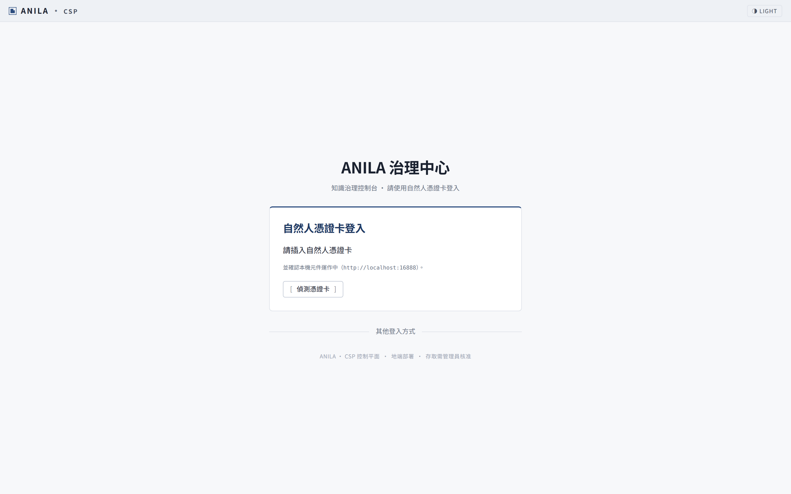<br><sub><b>登入頁 · 卡登優先</b>｜自然人憑證卡為主視覺，帳密／SSO 收「其他登入方式」</sub></td>
    <td width="50%">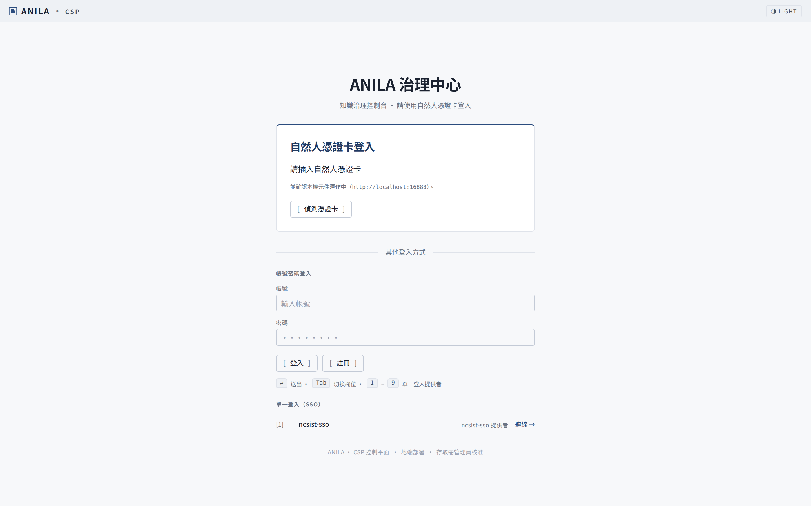<br><sub><b>其他登入方式</b>｜展開後的帳密登入 + 單一登入（SSO）次要路徑</sub></td>
  </tr>
  <tr>
    <td>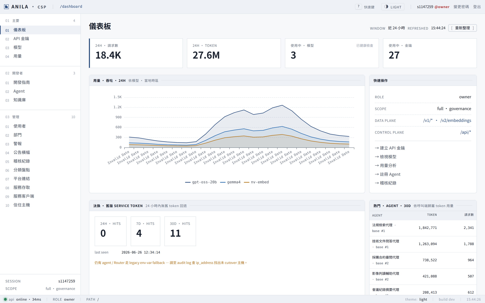<br><sub><b>治理中心總覽</b>｜24h 用量 / 吞吐 / Top agents（官方藍・淺色）</sub></td>
    <td>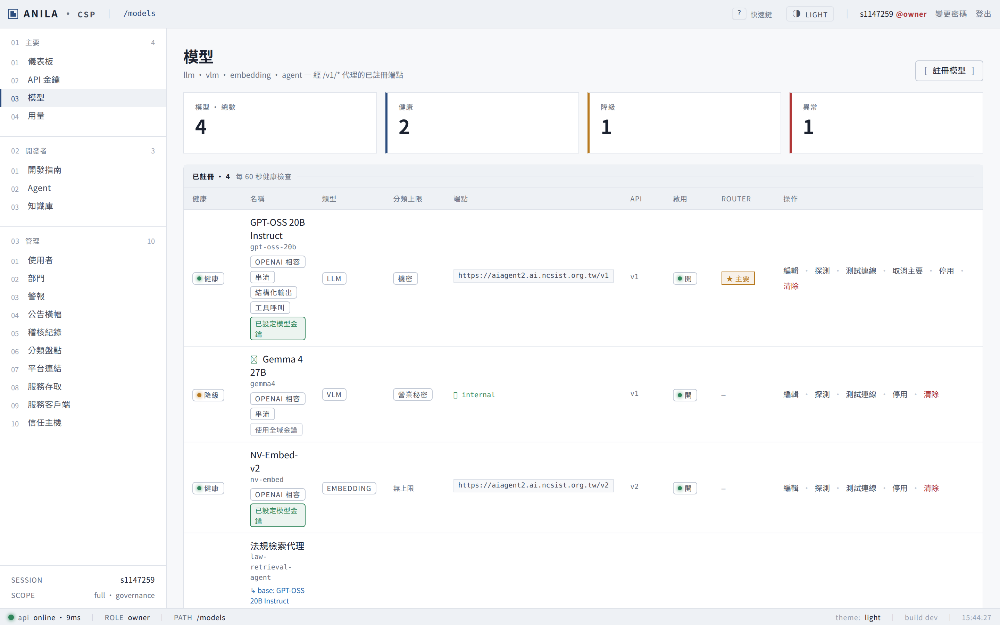<br><sub><b>模型治理</b>｜五態健康 / 分類上限 / per-model 金鑰狀態（Slice 6）</sub></td>
  </tr>
  <tr>
    <td>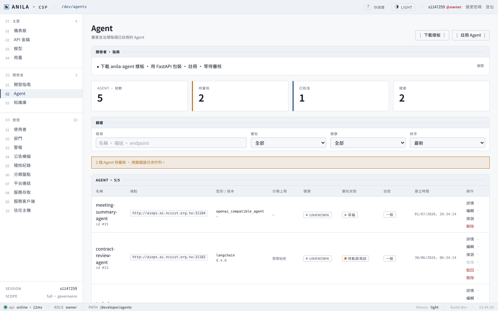<br><sub><b>Agent Registry</b>｜三態審批（已註冊／已核准／已停用），無 trace-test 閘門</sub></td>
    <td>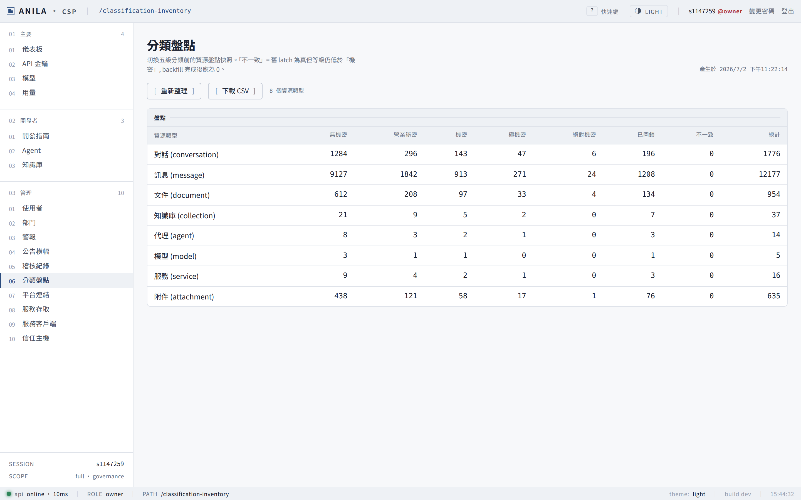<br><sub><b>分類盤點</b>｜舊截圖。治理中心已下線此頁（2026-09-14），`classification-inventory` 導回儀表板</sub></td>
  </tr>
  <tr>
    <td>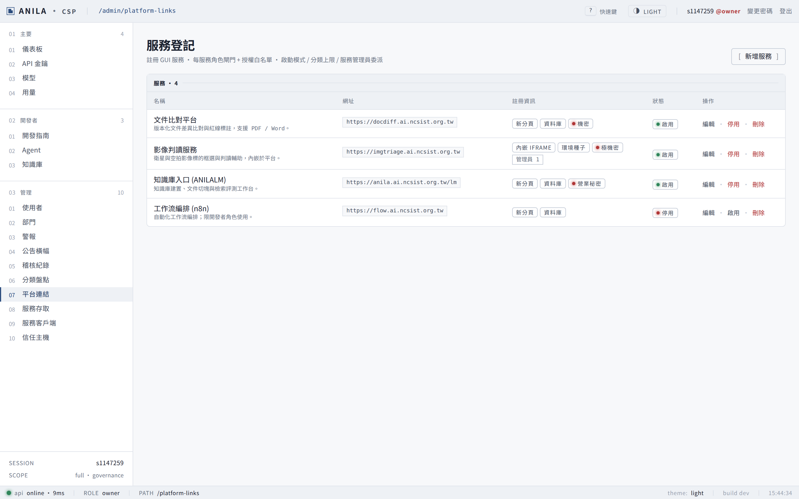<br><sub><b>服務登記</b>｜Launch Gateway 服務管理（Slice 7）</sub></td>
    <td>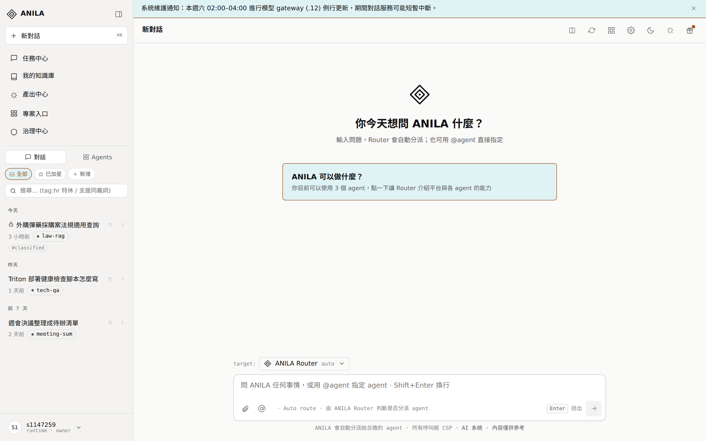<br><sub><b>ANILA 任務中心</b>｜四入口導覽：任務中心／我的知識庫／產出中心／專案入口（Slice 9）</sub></td>
  </tr>
  <tr>
    <td colspan="2">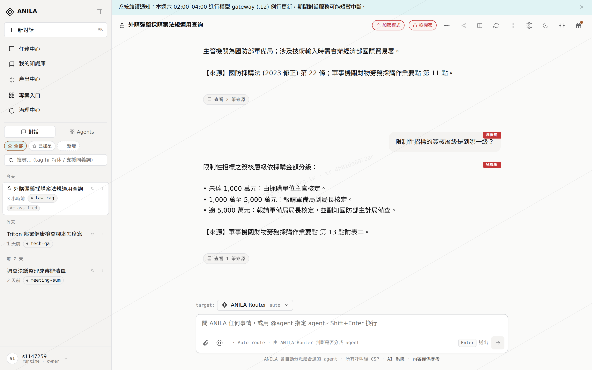<br><sub><b>機敏模式真分類浮水印</b>｜真級別「密」角標 + 全螢幕對角洩漏溯源水印（使用者＋trace_id），取代固定英文 CONFIDENTIAL</sub></td>
  </tr>
  <tr>
    <td colspan="2">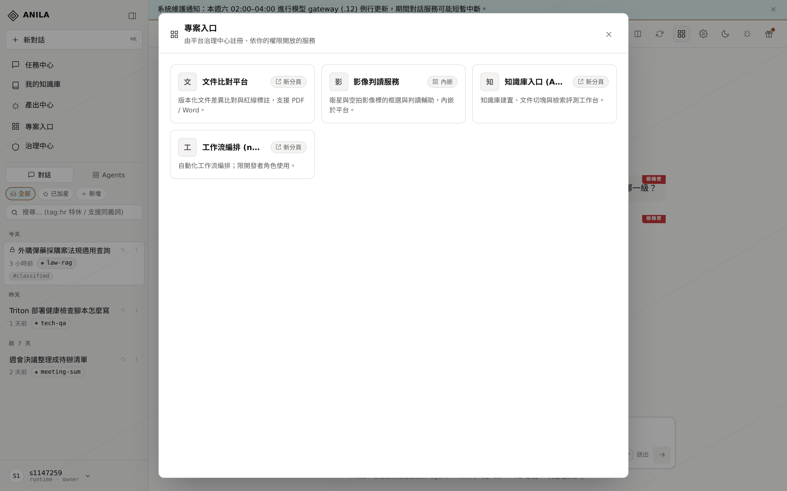<br><sub><b>專案入口</b>｜從 Service Registry 讀取的服務卡片，iframe / 新分頁啟動（Slice 7 / 9）</sub></td>
  </tr>
</table>

> 截圖取自 `anila-redesign` 分支的本機 fixture 環境（mock API + vite dev，未碰觸線上 stack）；登入頁的偵測憑證卡流程與內網卡登一致，帳密區為次要路徑。

---

## 系統架構

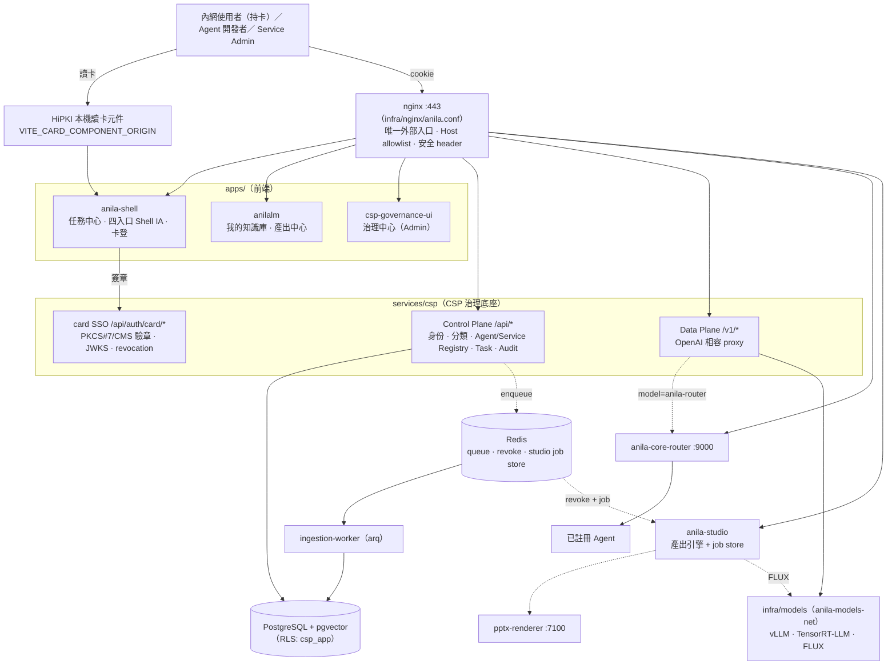
```mermaid
flowchart TB
    users["內網使用者（持卡）／ Agent 開發者／ Service Admin"]
    card["HiPKI 本機讀卡元件<br/>VITE_CARD_COMPONENT_ORIGIN"]
    nginx["nginx :443（infra/nginx/anila.conf）<br/>唯一外部入口 · Host allowlist · 安全 header"]

    subgraph apps["apps/（前端）"]
        shell["anila-shell<br/>任務中心 · 四入口 Shell IA · 卡登"]
        alm["anilalm<br/>我的知識庫 · 產出中心"]
        gov["csp-governance-ui<br/>治理中心（Admin）"]
    end

    subgraph csp["services/csp（CSP 治理底座）"]
        ctrl["Control Plane /api/*<br/>身份 · 分類 · Agent/Service Registry · Task · Audit"]
        data["Data Plane /v1/*<br/>OpenAI 相容 proxy"]
        auth["card SSO /api/auth/card/*<br/>PKCS#7/CMS 驗章 · JWKS · revocation"]
    end

    router["anila-core-router :9000"]
    studio["anila-studio<br/>產出引擎 + job store"]
    pptx["pptx-renderer :7100"]
    worker["ingestion-worker（arq）"]
    agents["已註冊 Agent"]
    redis[("Redis<br/>queue · revoke · studio job store")]
    db[("PostgreSQL + pgvector（RLS: csp_app）")]
    models["infra/models（anila-models-net）<br/>vLLM · TensorRT-LLM · FLUX"]

    users -->|讀卡| card --> shell
    users -->|cookie| nginx --> shell & alm & gov & ctrl & data & router & studio
    shell -->|簽章| auth
    data -.->|model=anila-router| router --> agents
    ctrl --> db
    data --> models
    ctrl -.->|enqueue| redis --> worker --> db
    studio -.-> pptx
    studio -.->|FLUX| models
    redis -.->|revoke + job| studio
```

### 目錄佈局（§17.1）

搬遷決策見 [ADR-0006](./docs/anila-redesign-docs/adr/ADR-0006-layout-migration-deviations.md) 與 [doc 10 §17.1](./docs/anila-redesign-docs/10-migration-and-development-guardrails.md)。

**`services/`** — 可部署後端服務

| 目錄 | 說明 | 對外 port |
|---|---|---|
| [`csp`](./services/csp/) | CSP 治理底座：Control Plane（`/api/*`）＋ Data Plane（`/v1/*`）— 身份／分類／Agent／Service Registry／Task／Trace／Audit／Usage／OpenAI 相容 proxy ＋ card SSO / JWKS / revocation | `:8000`（internal） |
| [`anila-core-router`](./services/anila-core-router/) | Router 部署 wrapper：`app = create_router_app()`（實作在 `anila-core`）＋ service-token bootstrap | `:9000`（internal） |
| [`anila-studio`](./services/anila-studio/) | 產出中心引擎：報告／簡報／心智圖／資訊圖／資料表 artifact；本地驗 JWKS ＋ Redis revocation ＋ durable job store | `:8100`（internal） |
| [`ingestion-worker`](./services/ingestion-worker/) | 知識入庫 worker：arq ＋ Redis；parse → chunk → embed → pgvector | 無 host port |
| [`pptx-renderer`](./services/pptx-renderer/) | PPTX 渲染 service（Node），由 anila-studio server-to-server 呼叫 | `:7100`（internal） |
| [`flux2-dev`](./services/flux2-dev/) · [`flux2-dev-agent`](./services/flux2-dev-agent/) | FLUX 影像生成 service 與 image-generator agent shim（僅 dev／繪圖用；無外部 auth，須置於 CSP／內網後） | internal |

**`apps/`** — 前端

| 目錄 | 說明 | 技術 |
|---|---|---|
| [`anila-shell`](./apps/anila-shell/) | ANILA 任務中心：四入口 Shell IA、對話、分享、卡登 LoginView | React / Vite / Vitest |
| [`anilalm`](./apps/anilalm/) | 我的知識庫 ＋ 產出中心 SPA（Studio / artifacts 承載） | React / Vite |
| [`csp-governance-ui`](./apps/csp-governance-ui/) | 治理中心 Admin UI | Vue 3 / Vite |

**`packages/`** — 共用函式庫 / 模板

| 目錄 | 說明 |
|---|---|
| [`anila-core`](./packages/anila-core/) | Runtime foundation SDK：`api` / `registry` / `engine` / `tools` / `providers` / `storage` / `memory` / `tracing` / `security` / `router` / `ingestion`。Router、CSP、ingestion-worker 皆安裝它 |
| [`anila-agent`](./packages/anila-agent/) | 官方 sub-agent 模板（git subtree）；root compose 唯讀掛入 CSP 的 `/app/anila-template` |

**`infra/`** — compose / 部署 / 閘道 / CI / 模型

| 目錄 | 說明 |
|---|---|
| [`compose`](./infra/compose/) | `platform.yml`（`anila`）＋ `dev.yml`（`anila-dev`）；由 root `compose.yaml` / `compose.dev.yaml` shim `include` |
| [`deployment/scripts`](./infra/deployment/scripts/) | prod 生命週期：`deploy-prod.sh` ＋ `reissue-tls-cert.sh`／`reencrypt-credentials.py` 等 |
| [`deployment/intranet`](./infra/deployment/intranet/) | air-gap 離線工具鏈：`intranet-deploy.sh`（card bootstrap）＋ `build-and-export-for-intranet.sh` ＋ 模型 / toolkit 下載與分塊搬運 |
| [`nginx`](./infra/nginx/) | `anila.conf`（唯一外部入口設定）＋ `certs/`（live 憑證為 untracked） |
| [`ci`](./infra/ci/) | `lint-zh-tw.sh`（繁中政策 gate，doc 11）＋ `lint-boundaries.sh`（CSP module boundary gate，doc 10 §14） |
| [`models`](./infra/models/) | 模型 stack compose topology（獨立 lifecycle，external network `anila-models-net`） |
| [`docker`](./infra/docker/) | `csp.Dockerfile`（正式 CSP image；root build context COPY `anila-core` ＋ CSP backend ＋ 前端 build） |

---

## 重構能力總覽（Slice 0–9）

下表能力皆可於程式碼核對。契約的收斂過程記錄在 [`docs/anila-redesign-docs/`](./docs/anila-redesign-docs/)（設計沿革）；**現行規格以 [`SYSTEM-MAP.md`](./SYSTEM-MAP.md) 為準**，進度與執行順序見 [`PLAN.md`](./PLAN.md)。

| Slice | 能力 | 落地位置（可核對） | 設計文件 |
|---|---|---|---|
| 1A | §17.1 目錄搬遷（`services/ apps/ packages/ infra/`）＋ root compose shim | repo 樹狀 ＋ [`compose.yaml`](./compose.yaml) | doc 10 §17.1 / ADR-0006 |
| 1B | CSP 骨架：`tasks` / `policy` / `launch` module 互不 import ＋ 契約 schema | `services/csp/app/modules/*` ＋ `.importlinter` | doc 02 / doc 10 §14 |
| 2 | Task 中樞 ＋ Source Snapshot；`X-ANILA-Task-Id` 貫穿 proxy／usage | `services/csp/app/services/proxy/task_link.py` | doc 09 |
| 3 | 四級分類（無機密 < 營業秘密 < 密 < 機密）＋ 單向閂鎖 ＋ 降級審批（雙人原則） | `services/csp/app/models/classification.py` | doc 08 |
| 4 | 無 Full Trace span 收攏（現行樹沒有 `app/api/traces.py`，也沒有 `POST /v1/traces/{trace_id}/spans`） | — | — |
| 5 | Agent Registry：三態審批（`registered` / `approved` / `disabled`），無 trace-test 閘門 | `services/csp/app/models/agent.py`、`apps/csp-governance-ui/src/utils/approvalStatus.js` | SYSTEM-MAP |
| 6 | Model Gateway：per-model 金鑰（僅露 boolean presence）＋ 五態健康 ＋ http endpoint 預設拒收、由 `ANILA_ALLOW_HTTP_ENDPOINT=1` 明確放行（PLAN.md P0.2，production 與 dev 同準） | `services/csp/app/api/models.py` | doc 04 |
| 7 | Service Registry ＋ launch token（Project Entry；`platform_links` 擴充為 `registered_services`） | `services/csp/app/models/service_launch.py` | doc 07 |
| 8 | Studio artifact 契約 ＋ Redis durable job store（Redis 中斷則降級為 in-process） | `services/anila-studio/app/services/job_store.py` | doc 09 |
| 9 | ANILA Shell 四入口 IA ＋ 繁中語言政策（唯一介面語言）＋ 官方藍視覺重設計 | `apps/anila-shell/src/shellNav.jsx`、`infra/ci/lint-zh-tw.sh` | doc 11 / 12 |

---

## 快速開始

### 本地 dev（compose shim）

repo 根保有 `docker compose up -d` 錨點：root `compose.yaml` 以 `include:` 指向 `infra/compose/platform.yml`（需 Compose ≥ 2.20）。

```bash
cp .env.example .env       # dev 才設 ANILA_ALLOW_DEV_SECRET=1
docker compose up -d       # = compose.yaml → infra/compose/platform.yml
docker compose -f compose.dev.yaml up -d   # dev stack（anila-dev，獨立 ports/volumes）
```

card 登入需本機 HiPKI 讀卡元件；本地 dev 若無實體卡，將 `ANILA_AUTH_MODE=password`（或 `mixed`）保留帳密流程，但**勿把開發模式推上內網 production 環境檔**。

### 內網 / prod 部署（走部署腳本，不直接 `docker compose up`）

prod 一律走 [`infra/deployment/scripts/deploy-prod.sh`](./infra/deployment/scripts/deploy-prod.sh)：內含 pre-flight（branch / docker / env / `anila-models-net` / 模型 stack health），避免在錯的分支跑、dev fallback 值偷渡、漏起模型 stack。

```bash
set -a; source /path/to/prod.env; set +a        # secret 從你的 prod .env，勿 commit
bash infra/deployment/scripts/deploy-prod.sh     # preflight + build + up + 等 healthy + verify
```

子指令：`deploy`（預設）/ `preflight` / `up` / `down`（保留 named volumes）/ `restart` / `rebuild <svc>` / `status` / `logs <svc>` / `verify` / `wait`。

### air-gap 離線交付（外網打包 → 內網 load）

中科院機房無外網：先在有外網的機器打包所有 image，再帶進內網。card 一次性 bootstrap 走 [`infra/deployment/intranet/intranet-deploy.sh`](./infra/deployment/intranet/intranet-deploy.sh)（從 `server.pfx` 抽 TLS 憑證、產 secrets、組 `.env`、接 CSPKI model-CA、產 JWT keypair），收尾交棒 `deploy-prod.sh` 做日常 lifecycle。

```bash
# 外網機：
bash infra/deployment/intranet/build-and-export-for-intranet.sh
# 內網（複製 export 目錄 + repo 進來）：
docker network create anila-models-net                        # 第一次
docker compose -f infra/models/docker-compose.yml up -d        # 模型 stack（獨立 lifecycle）
bash infra/deployment/intranet/intranet-deploy.sh              # card bootstrap
bash infra/deployment/scripts/deploy-prod.sh                   # app stack lifecycle
```

離線工具鏈（皆在 [`infra/deployment/intranet/`](./infra/deployment/intranet/)）：`download-intranet-models.sh`、`download-intranet-toolkit.sh`、`intranet-quantize-nvfp4.py`、`pack-chunks.sh` / `unpack-chunks.sh`（大檔分塊搬運）。部署細節見 [`docs/runbooks/`](./docs/runbooks/)。

---

## 預設出貨姿態（進內網前）

這是**尚未打包進 `.15`** 的出貨樹應長成的樣子。打包／打 tag 是後續步驟，不在這份 README 當完成條件。

- Compose 專案名跟 `.env` 的 `COMPOSE_PROJECT_NAME`（Lab 常用 `anila`）。不要再用 `anila-restart` 當出貨 project。
- **GitLab 已拿掉**（2026-09-26）：compose 不宣告服務與 volume，nginx 沒有 `/gitlab`。主機上的舊 volume `anila-platform_gitlab_data` 留著，由擁有者以後自行移除。
- **預設不起 n8n**：`COMPOSE_PROFILES=ops`。nginx `/n8n` 在容器沒起時會 502。要自動化再顯式開 ops。
- **code-server 預設開**：密碼 + 掛 `docker.sock`，不走卡片 SSO；這是擁有者接受的維運面，不是一般使用者入口。
- 使用者提供的模型／agent／憑證 URL：**禁止** `host.docker.internal`。LAN embedding 用明確 IP/FQDN（例如 Triton gRPC `9001`，不要把 ASR `9000` 當成 embedding）。
- 內網 production 卡登：**不要設** `CARD_CA_BUNDLE_PATH`；用映像內 `cspki_ca_bundle.pem`。Lab 的 `secrets/dev-card-ca/` 是 mock，絕不可帶進 `.15`。

## 測試矩陣

各子專案獨立測試入口（新路徑）。CI 另跑兩道 lint gate。高價值可重用測試清單見 [doc 10 §17.2](./docs/anila-redesign-docs/10-migration-and-development-guardrails.md)。

| 子專案 | 指令（於 repo 根執行） |
|---|---|
| CSP | `cd services/csp && .venv/bin/python -m pytest` |
| anila-core | `cd packages/anila-core && pip install -e '.[dev,rag]' && pytest`（RLS 類另 `pytest -m integration`；品質 `ruff check src tests` / `mypy src`） |
| ingestion-worker | `cd services/ingestion-worker && pip install -e '../../packages/anila-core[rag]' -e '.[dev]' && pytest` |
| anila-studio | `cd services/anila-studio && pip install -e '.[dev]' && pytest` |
| anila-agent | `cd packages/anila-agent && make install && make test && make lint`（live 端點才 `make test-live`） |
| anila-shell | `cd apps/anila-shell && npm install && npm test && npm run build` |
| anilalm | `cd apps/anilalm && npm install && npm run typecheck && npm run build`（schema 改動先 `npm run gen:studio-types`） |
| csp-governance-ui | `cd apps/csp-governance-ui && npm install && npm run build`（無 test script，以 build 作 gate） |
| pptx-renderer | `cd services/pptx-renderer && node tests/test_cover_hero_guard.js`（無 npm test，手動跑） |
| flux2-dev · flux2-dev-agent | `cd services/flux2-dev && pip install -e '.[test]' && pytest`（mock pipeline，不載大型權重） |
| CI gate | `bash infra/ci/lint-zh-tw.sh`（繁中政策）· `bash infra/ci/lint-boundaries.sh`（CSP module boundary） |

> 現況無 repo-wide coverage gate，也無可信整體覆蓋率數字（doc 10 §17.2）；每步以「不新增紅字」為 gate。

---

## 分支模型

**你正在看 `main`** — 2026-07-28 重啟後的**單一開發線**（工作 worktree 分支除外；歷史名 `restart/from-redesign`）。它自 redesign 收斂點分出，保留成熟骨架（card SSO / RS256 JWT / JWKS / revocation / CSRF / RLS / SSRF guard / proxy），採用新佈局與 Task／Trace／四級分類／Registry 新契約。

🔴 **`main` 作為 SSOT 的 7 分支部署模型已不存在。** 該模型（`main` / `prod-intranet-card` / `prod-public-passwd` / `prod-military-passwd` / `dev-public` / `dev-military` / `trial-military`）已於 2026-07-28 重啟時進 attic；描述它的 [`AGENTS.md`](./AGENTS.md) §2–3 （現行單一 `main`；舊七分支模型已失效，見根目錄 README） **同樣已失效**，兩份皆已標示。在 PLAN 排到之前**不要**重建部署分支。

現行狀態與執行順序見 [`PLAN.md`](./PLAN.md)（專案權威），重啟脈絡與 attic 取回方式見 [`RESTART-FROM-REDESIGN.md`](./RESTART-FROM-REDESIGN.md)。歷史上依 [ADR-0006](./docs/anila-redesign-docs/adr/ADR-0006-layout-migration-deviations.md)，本線與舊 `main` 的 cherry-pick 互通已**刻意中斷**——這是一條全新基線，不是又一條 delta 分支。

---

## 權威文件與治理

- **專案權威**：[`PLAN.md`](./PLAN.md)（現況與執行順序，2026-08-17 擁有者裁定）；**規格**：[`SYSTEM-MAP.md`](./SYSTEM-MAP.md)（系統應該長什麼樣）。PR 准入檢查對照這兩份，見 [`.github/pull_request_template.md`](./.github/pull_request_template.md)。
- **設計沿革／收斂紀錄**：[`docs/anila-redesign-docs/`](./docs/anila-redesign-docs/) — 12 份 redesign 系統設計文件（版本狀態 `architecture-baseline-v0.2`）＋ ADR。**已於 2026-08-17 列為歷史紀錄，不再是准入依據**；保留是因為它記載了各項決策「為什麼這樣定」，程式碼註解亦多處回指。重啟脈絡見 [`RESTART-FROM-REDESIGN.md`](./RESTART-FROM-REDESIGN.md)。
- **繁中語言政策**：唯一介面語言為繁體中文（台灣用語），identifiers 不譯；由 CI `infra/ci/lint-zh-tw.sh` 把關（此為現行約束），規範沿革見 [doc 11](./docs/anila-redesign-docs/11-frontend-zh-tw-language-policy.md)。
- **AI 治理（ISO/IEC 42001:2023）**：治理文件集中於 [`docs/governance/`](./docs/governance/)，主索引 [`iso-42001-compliance.md`](./docs/governance/iso-42001-compliance.md)（Clause 4–10 ＋ Annex A：AI 政策、RACI、風險登錄、AIIA、model card、資料治理、事件回應、第三方登錄）。

---

## 安全設計要點

- **自然人憑證卡真實驗章**：`/api/auth/card/*` 做真實 PKCS#7/CMS 簽章驗證 ＋ 釘死 CSPKI CA 鏈驗證 ＋ nonce 綁定，非比對卡號的假驗證。氣隙下不做 CRL/OCSP；離職靠收卡 + `User.is_active`。`host.docker.internal` / `*.docker.internal` 是 SSRF 結構性拒絕，trusted-hosts 解不開。
- **登入面收斂**：`ANILA_AUTH_MODE=card-only` 時帳密／OIDC／自助註冊 endpoints 回 404（owner 帳密 break-glass 除外），唯一日常登入路徑是 PKI 卡。compose 預設 card-only；`startup_security` 只擋未知 enum，不會因為 password/mixed 而拒開容器。
- **code-server 是高權限維運面**：它可寫入整個 repo、讀取未遮蔽的 `secrets/`，並掛載 Docker socket；只准平台管理員使用，密碼必須是部署 secret，不可與一般帳號共用。
- **四級分類單向閂鎖**：等級序 `無機密 < 營業秘密 < 密 < 機密`；CSP ＋ Router ＋ UI 三層鎖 classified，無自動降級路徑，降級採雙人原則（申請人 ≠ 核准人），持久化到 DB。
- **模型出向預設拒 http**：model endpoint 由 `ANILA_ALLOW_HTTP_ENDPOINT=1` 明確放行（PLAN.md P0.2，production 與 dev 同準）；per-model 金鑰僅以 boolean presence 對外，不外洩。
- **Credential 加密 ＋ SSRF guard**：AES-256-GCM ＋ PBKDF2；SSRF guard 對所有 user-supplied endpoint 把關，loopback / metadata 永不可繞過。
- **唯一外部入口**：nginx `:443`（`infra/nginx/anila.conf`）Host allowlist ＋ 安全 header；runtime DB 以 `csp_app` role（非 superuser）連線以維持 RLS。
- **審計**：所有 admin 操作 ＋ card 登入 / OIDC 失敗自動寫 `audit_logs`。沒有 Full Trace span 收攏。

---

## 介面預覽（重設計前）

> 以下為重設計前的舊版截圖（終端／碳黑風），保留作前後對照。取自運行中的 ANILA 平台 CSP 控制台、anila-ui 對話前端與 ANILALM 知識庫。

<table>
  <tr>
    <td width="50%"><br><sub><b>CSP 控制台總覽</b>｜24h 用量 / 吞吐 / Top agents / legacy-token cutover 監控</sub></td>
    <td width="50%"><br><sub><b>模型 / API Key 管理</b>｜統一註冊 LLM / Embedding / Agent endpoint</sub></td>
  </tr>
  <tr>
    <td><br><sub><b>Agent 註冊與核准</b>｜逐 agent 強制加密（classified latch 來源）</sub></td>
    <td><br><sub><b>知識庫 Collections</b>｜文件 → chunk → embed → pgvector 檢索（RAG）</sub></td>
  </tr>
  <tr>
    <td><br><sub><b>開發者上手指南</b>｜對準 MLSteam 工作流的 agent 建置教學</sub></td>
    <td><br><sub><b>anila-ui 對話前端</b>｜<code>anila-router</code> 自動分派、分享、交接</sub></td>
  </tr>
  <tr>
    <td><br><sub><b>ANILALM 知識庫 + Studio</b>｜文件 → 對話 → 簡報 / 報告 / 心智圖 等 artifact</sub></td>
    <td><br><sub><b>審計日誌</b>｜所有 admin 操作自動寫 <code>audit_logs</code></sub></td>
  </tr>
  <tr>
    <td colspan="2"><br><sub><b>Classified 單向閂鎖</b>｜遇加密 agent 整段對話升級加密，無降級路徑</sub></td>
  </tr>
</table>

---

## 授權

見 [`LICENSE`](./LICENSE)。Onyx 原 upstream 程式碼已於 2026-04-27 搬離本 repo。

---

**開發線**：`restart/from-redesign`（單一線） · **部署**：`bash infra/deployment/scripts/deploy-prod.sh` · **專案權威**：[`PLAN.md`](./PLAN.md) · **規格**：[`SYSTEM-MAP.md`](./SYSTEM-MAP.md) · **設計沿革**：[`docs/anila-redesign-docs/`](./docs/anila-redesign-docs/) · **治理**：[`docs/governance/iso-42001-compliance.md`](./docs/governance/iso-42001-compliance.md)
