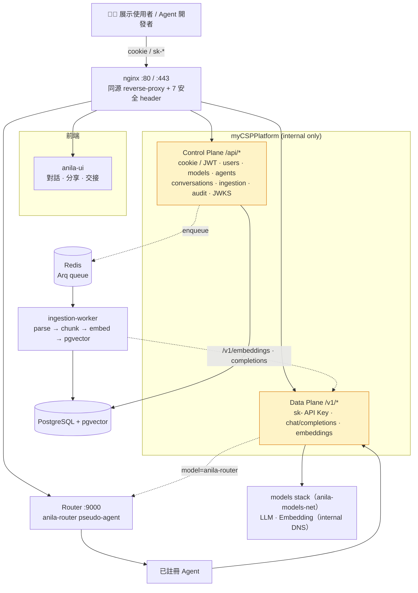

# ANILA 平台 — `trial-military`(國軍試用 / 展示精簡版)

> **Runtime-first、On-prem 多 Agent 平台。** docker compose 一鍵啟動。

> 🎯 **你正在看 `trial-military` 分支**(國軍 trial / 展示，純帳密)。這是 `main` 的**精簡子集** — 保留核心對話 + RAG + agent 路由，**移除 Studio / FLUX 簡報生成、知識庫管理 SPA（ANILALM）、以及多數進階管理頁**，讓展示 / 試用環境最小化、好起、好懂。
>
> | Branch | 部署對象 | 認證 | 定位 |
> |---|---|---|---|
> | `main` | 開發 SSOT（default） | 純帳密 | 所有 feature 的源頭 |
> | `prod-intranet-card` | 中科院內網 prod | SSO + 自然人憑證卡 | main + auth/SSO/card fork |
> | `prod-public-passwd` | 對外網 prod | 純帳密 | main + 外網 hardening |
> | `prod-military-passwd` | 國軍交付 prod | 純帳密 | main + military spec |
> | `dev-public` | 對外網 dev | 純帳密 | main + dev tooling |
> | `dev-military` | 國軍 dev | 純帳密 | dev-public + military 客製 |
> | **`trial-military`** ← *你在這* | 國軍 trial / 展示 | 純帳密 | **main 精簡子集** |
>
> **`main` 是 SSOT** — 本分支是 main 的精簡分流，只挑展示必要的功能。**完整功能（Studio / 知識庫管理 / 進階 agent 治理）請看 `main` 或對應 prod 分支。** 完整分支策略見 [`docs/branch-sync-backlog.md`](./docs/branch-sync-backlog.md)。

ANILA 是一套企業內部的多 Agent 平台：統一管理模型與 API Key、對外以 OpenAI 相容介面提供推論、讓開發者基於樣板複製出自己的 Agent 並註冊進來、讓終端使用者透過統一 UI 與所有 Agent 對話，並以「主 LLM 未加密 → 遇到加密 agent 整段對話升級為加密」的**單向閂鎖（one-way latch）**處理敏感資料。

平台層內建**使用者記憶**：每輪對話自動萃取個人事實 + embed 訊息片段，下次對話自動帶入，跨 agent 共享。

---

## 本分支定位（`trial-military`）

| 面向 | 內容 |
|---|---|
| **用途** | 國軍試用 / 功能展示（demo）；最小可運作集合 |
| **認證** | 純帳密（本地登入） |
| **保留** | 核心對話（anila-ui）、RAG ingestion（pgvector）、agent 註冊與路由（Router + anila-agent）、使用者記憶、OpenAI 相容代理、審計 |
| **移除** | **Studio / FLUX 簡報生成（anila-studio + pptx-skill）**、**知識庫管理 SPA（ANILALM）**、以及多個進階管理頁（Developer Agents / Evaluator / Banners / Departments / Service Access / Chunking Preview / Agent Runtime Config / Developer Guide）與部分校準 / 部署腳本 |
| **同步** | 從 main 取核心功能；精簡剪裁不回 main |

> 這個分支的目標是「**最少組件、最快起、最易展示**」。需要完整能力時切回 `main` 或相應 prod 分支。

| 子專案 | 角色 | 預設 Port |
|---|---|---|
| [`myCSPPlatform`](./myCSPPlatform/) | **CSP**（Control & Data Plane）— 使用者 / API Key / 模型 / Agent / 對話 / 附件 / 分享 / 交接 / 審計 / Ingestion / OpenAI 相容代理 / JWKS / token revocation publisher | `:8000` |
| [`anila-core`](./anila-core/) | **Runtime foundation（SDK）** — api / registry / engine / tools / providers / storage / **memory** / compact / cli / **security** | — |
| [`anila-core-router`](./anila-core-router/) | **Router** — OpenAI 相容分派器；per-credential service token 走 s2s | `:9000` |
| [`anila-agent`](./anila-agent/) | **官方 sub-agent 模板**（git subtree；上游 [`zzw09773/anila-agent`](https://github.com/zzw09773/anila-agent)） | `:24786`（獨立執行時） |
| [`ingestion-worker`](./ingestion-worker/) | **Async pipeline worker** — Arq + Redis；parse → chunk → embed → pgvector + Chunking Evaluator | （無 host port） |
| [`ANILA_UI/anila-ui`](./ANILA_UI/anila-ui/) | **Chat Runtime UI** — React 聊天介面，cookie + SSE | nginx 前 |
| **`nginx`** | 對外閘道；同源 reverse-proxy `/api`、`/v1`、`/router`、`/static`、`/uploads`；7 個安全 header | `:80` / `:443` / `:4443` |
| **`redis`** | ingestion-worker queue backing store；不對外暴露 | （無 host port） |

> ⛔ 相對 `main`：**不含** `anila-studio`、`ANILALM`、`pptx-skill`、FLUX 簡報，以及多個進階管理頁。

> **唯一規劃文件**：[`anila_plan.md`](./anila_plan.md)。

---

## 整體架構（精簡）


```mermaid
flowchart TB
    users["🧑‍💻 展示使用者 / Agent 開發者"]
    nginx["nginx :80 / :443<br/>同源 reverse-proxy + 7 安全 header"]

    subgraph spas["前端"]
        anila_ui["anila-ui<br/>對話 · 分享 · 交接"]
    end

    subgraph csp["myCSPPlatform (internal only)"]
        csp_ctrl["Control Plane /api/*<br/>cookie / JWT · users · models · agents<br/>conversations · ingestion · audit · JWKS"]
        csp_data["Data Plane /v1/*<br/>sk- API Key · chat/completions · embeddings"]
    end

    router_core["Router :9000<br/>anila-router pseudo-agent"]
    agents["已註冊 Agent"]
    redis[("Redis<br/>Arq queue")]
    worker["ingestion-worker<br/>parse → chunk → embed → pgvector"]
    llm["models stack（anila-models-net）<br/>LLM · Embedding（internal DNS）"]
    db[("PostgreSQL + pgvector")]

    users -->|cookie / sk-*| nginx --> anila_ui & csp_ctrl & csp_data & router_core
    csp_data -.->|model=anila-router| router_core --> agents --> csp_data
    csp_ctrl --> db
    csp_data --> llm
    csp_ctrl -.->|enqueue| redis --> worker --> db
    worker -.->|/v1/embeddings · completions| csp_data

    classDef plane fill:#fef3c7,stroke:#d97706
    class csp_ctrl,csp_data plane
```

**核心資料流**：UI POST `/v1/chat/completions`（`model=anila-router`）→ Router 取 agent manifest + 問主 LLM 是否分派 → 必要時轉發 agent → SSE 逐 chunk forward 回 UI；agent `requires_encryption` 時對話永久閂鎖加密（one-way latch）。

---

## 介面預覽

> 以下截圖取自運行中的 ANILA 平台：CSP 控制台（`:443`）與 anila-ui 對話前端（`:4443`）。本精簡分支不含 ANILALM 知識庫 SPA、Studio 與部分進階管理頁，故未列入。

<table>
  <tr>
    <td width="50%"><br><sub><b>統一登入</b>｜RS256 JWT + httpOnly cookie，CSRF double-submit</sub></td>
    <td width="50%"><br><sub><b>CSP 控制台總覽</b>｜24h 用量 / 吞吐 / Top agents 監控</sub></td>
  </tr>
  <tr>
    <td><br><sub><b>模型 / API Key 管理</b>｜統一註冊 LLM / Embedding / Agent endpoint</sub></td>
    <td><br><sub><b>知識庫 Collections（RAG）</b>｜文件 → chunk → embed → pgvector 檢索</sub></td>
  </tr>
  <tr>
    <td><br><sub><b>anila-ui 對話前端</b>｜<code>anila-router</code> 自動分派、分享、交接</sub></td>
    <td><br><sub><b>審計日誌</b>｜所有 admin 操作自動寫 <code>audit_logs</code></sub></td>
  </tr>
  <tr>
    <td colspan="2"><br><sub><b>Classified 單向閂鎖</b>｜遇加密 agent 整段對話升級加密，無降級路徑</sub></td>
  </tr>
</table>

---

## 快速開始（compose 一鍵啟動）

```bash
cp .env.example .env       # 填好真值
docker compose up -d
docker network create anila-models-net               # 第一次（模型 stack）
docker compose -f models/docker-compose.yml up -d    # 起模型 stack
```

把 `LOCAL_LLM_BASE_URL` 指向任何 OpenAI 相容 endpoint（vLLM / Ollama / llama.cpp）；`LOCAL_EMBEDDING_BASE_URL` 未設則同 LLM。`.env` 至少要填 `CSP_SECRET_KEY`、`CSP_SERVICE_TOKEN`、`INTERNAL_PLATFORM_API_KEY`、`LOCAL_LLM_BASE_URL` / `LOCAL_LLM_MODEL`。

### 驗證

```bash
curl http://localhost:8000/health    # CSP
curl http://localhost:9000/health    # Router
```

### Smoke test（真實打本地 LLM）

```bash
curl -N -X POST http://localhost:9000/v1/chat/completions \
  -H "Authorization: Bearer $SMOKE_USER_API_KEY" -H "Content-Type: application/json" \
  -d '{"model":"anila-router","messages":[{"role":"user","content":"say hi"}],"stream":true}'
```

---

## 維護 anila-agent / models stack

```bash
git subtree pull --prefix=anila-agent anila-agent main       # 同步 sub-agent 模板
docker compose -f models/docker-compose.yml restart <model>  # 重啟單一模型（平台不受影響）
```

新增模型走純 UI（`/models` → Add Model），遇 SSRF guard 跳對話框時點「add + retry」加進 `trusted_hosts`。

---

## 環境變數速查

| 變數 | 使用者 | 用途 |
|---|---|---|
| `LOCAL_LLM_BASE_URL` / `LOCAL_LLM_MODEL` | CSP / Router | 落地 LLM endpoint 與模型名 |
| `LOCAL_EMBEDDING_BASE_URL` / `LOCAL_EMBEDDING_MODEL` | CSP | Embedding；未設則同 LLM |
| `CSP_SECRET_KEY` / `CSP_SERVICE_TOKEN` | CSP / Agent / Router | JWT 主鑰 / s2s token |
| `ANILA_TRUSTED_HOSTS` | CSP / Worker | SSRF guard allow-list bootstrap |
| `ANILA_ALLOW_PRIVATE_ENDPOINT` / `ANILA_ALLOW_HTTP_ENDPOINT` | CSP | 設 `1` 放行私網 IP / `http://` |
| `ADMIN_PASSWORD` / `INTERNAL_PLATFORM_API_KEY` | CSP | seed 用；正式環境必覆寫 |
| `ANILA_ALLOW_DEV_SECRET` | CSP / Worker | dev 才設 `1`；正式必拿掉 |

> 完整範本見 [`.env.example`](./.env.example)。本分支因移除 Studio，不需 FLUX / pptx 相關 env。

---

## 安全設計要點

- **On-prem runtime-first**：LLM 流量全進落地 endpoint，無雲端 fallback、無 quota。
- **Classified 單向閂鎖**：CSP + Router + UI 三層鎖 classified，UI 無降級路徑，持久化到 DB。
- **SPA 認證**：httpOnly cookie + CSRF double-submit；SPA 不持有 API Key。
- **Credential 加密**：AES-256-GCM + PBKDF2 600k；SSRF guard 把關所有 user-supplied endpoint。
- **啟動安全檢查**：`startup_security` 在正式環境拒絕 dev 預設值。
- **nginx 7 安全 header** + 上傳 allow-list + 審計日誌。

---

## 分支與同步

- 本分支是 `main` 的精簡子集，只挑展示必要功能。
- 需要完整功能（Studio / 知識庫管理 SPA / 進階 agent 治理 / 國軍交付 hardening）請切到 `main` 或 `prod-military-passwd`。
- 從 main 取核心 feature；精簡剪裁不回 main。
- 完整分支策略：[`docs/branch-sync-backlog.md`](./docs/branch-sync-backlog.md)。

---

## 授權

見 [`LICENSE`](./LICENSE)。Onyx 原 upstream 程式碼已於 2026-04-27 搬離本 repo。

---

**分支**：`trial-military`（國軍 trial / 精簡展示版）· **部署**：`docker compose up -d` · **完整功能請用**：`main` / `prod-military-passwd` · **分支同步**：[`docs/branch-sync-backlog.md`](./docs/branch-sync-backlog.md)
