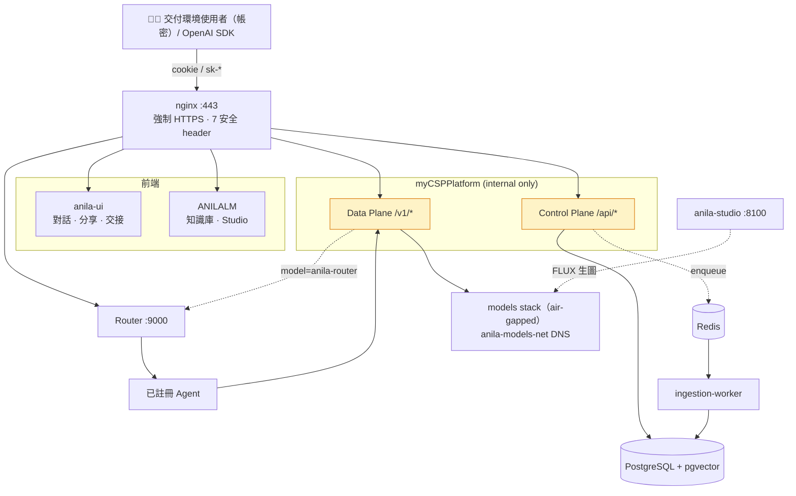

# ANILA 平台 — `prod-military-passwd`(國軍交付正式部署版)

> **Runtime-first、On-prem 多 Agent 平台。** 三個核心服務、一個落地 LLM，docker compose 一鍵啟動。

> 🪖 **你正在看 `prod-military-passwd` 分支**(國軍交付 prod，純帳密)。= `main` + military spec，**移除 n8n / GitLab dev tooling**，面向 air-gapped 交付。
>
> ⚠️ **注意**：code-server 目前**仍保留於本分支**（compose 服務 + nginx `/codeserver` 路由 + admin 導覽連結）。要貫徹「無 dev tooling」交付樣態須另行移除——見下方 hardening 清單。
>
> | Branch | 部署對象 | 認證 | 定位 |
> |---|---|---|---|
> | `main` | 開發 SSOT（default） | 純帳密 | 所有 feature 的源頭 |
> | `prod-intranet-card` | 中科院內網 prod | SSO + 自然人憑證卡 | main + auth/SSO/card fork |
> | `prod-public-passwd` | 對外網 prod | 純帳密 | main + 外網 hardening |
> | **`prod-military-passwd`** ← *你在這* | 國軍交付 prod | 純帳密 | main + military spec |
> | `dev-public` | 對外網 dev | 純帳密 | main + dev tooling |
> | `dev-military` | 國軍 dev | 純帳密 | dev-public + military 客製 |
> | `trial-military` | 國軍 trial / 展示 | 純帳密 | main 精簡子集 |
>
> **`main` 是 SSOT** — 新 feature 先進 main，再 `git merge origin/main -X theirs` sync 進本分支。本分支 fork 區為「移除 dev tooling + military 客製」，**不含 SSO/card auth**。`[military-only]` 標籤的 commit 只進 `prod-military-passwd` / `dev-military` 兩條。完整 SOP 見 [`docs/branch-sync-backlog.md`](./docs/branch-sync-backlog.md)。

ANILA 是一套企業內部的多 Agent 平台：統一管理模型與 API Key、對外以 OpenAI 相容介面提供推論、讓開發者基於樣板複製出自己的 Agent 並註冊進來、讓終端使用者透過統一 UI 與所有 Agent 對話，並以「主 LLM 未加密 → 遇到加密 agent 整段對話升級為加密」的**單向閂鎖（one-way latch）**處理敏感資料。

平台層內建**使用者記憶**：每輪對話自動萃取個人事實 + embed 訊息片段，下次對話自動帶入，跨 agent 共享。

---

## 本分支定位（`prod-military-passwd`）

| 面向 | 內容 |
|---|---|
| **部署對象** | 國軍交付環境（air-gapped，無外網） |
| **認證** | 純帳密（本地登入）；**無** SSO / card auth fork |
| **與 main 差異** | `docker-compose.yml` + `nginx.conf` **移除 n8n / GitLab**（交付環境減少外部開發工具）；**code-server 仍保留**，視交付需求自行移除；保留 military spec 客製空間 |
| **military spec** | air-gap config / 離線部署 / FLUX 啟用與否依交付規格定（詳見交付文件與 [`docs/branch-sync-backlog.md`](./docs/branch-sync-backlog.md) 「military-only」fork 區） |
| **同步** | 從 main sync；`[military-only]` commit 不進 main |

> 交付環境通常 air-gapped，image 需離線打包帶入（同 `prod-intranet-card` 的離線流程概念）。落地 LLM / Embedding endpoint 指向交付環境內的推論服務。

| 子專案 | 角色 | 預設 Port |
|---|---|---|
| [`myCSPPlatform`](./myCSPPlatform/) | **CSP**（Control & Data Plane）— 使用者 / API Key / 模型 / Agent / 對話 / 附件 / 分享 / 交接 / 審計 / Ingestion / OpenAI 相容代理 / JWKS | `:8000`（internal） |
| [`anila-studio`](./anila-studio/) | **Studio service** — Deck 生成（RAG + LLM + FLUX + PPTX） | `:8100`（internal） |
| [`anila-core`](./anila-core/) | **Runtime foundation（SDK）** — api / engine / tools / memory / security / ... | — |
| [`anila-core-router`](./anila-core-router/) | **Router** — OpenAI 相容分派器 | `:9000`（internal） |
| [`anila-agent`](./anila-agent/) | **官方 sub-agent 模板**（git subtree；上游 [`zzw09773/anila-agent`](https://github.com/zzw09773/anila-agent)） | `:24786`（獨立執行時） |
| [`ingestion-worker`](./ingestion-worker/) | **Async pipeline worker** — Arq + Redis | （無 host port） |
| [`ANILA_UI/anila-ui`](./ANILA_UI/anila-ui/) | **Chat Runtime UI** — React | nginx 前 |
| [`ANILALM`](./ANILALM/) | **Knowledge-base + Studio SPA** | nginx 前 |
| **`nginx`** | 對外閘道；強制 HTTPS；7 個安全 header | `:443` / `:4443` |
| **`redis`** | ingestion-worker queue + token-revoke pub/sub | （無 host port） |

> ⛔ 相對 `main`：**已移除** `/n8n`、`/gitlab` 路由與對應 compose 服務。
> ⚠️ `code-server` 服務與 `/codeserver` 路由**尚未移除**（仍在 `docker-compose.yml` 與 `myCSPPlatform/docker/nginx.conf`）。

> **唯一規劃文件**：[`anila_plan.md`](./anila_plan.md)。

---

## 整體架構


```mermaid
flowchart TB
    users["🧑‍💻 交付環境使用者（帳密）/ OpenAI SDK"]
    nginx["nginx :443<br/>強制 HTTPS · 7 安全 header"]

    subgraph spas["前端"]
        anila_ui["anila-ui<br/>對話 · 分享 · 交接"]
        anilalm["ANILALM<br/>知識庫 · Studio"]
    end

    subgraph csp["myCSPPlatform (internal only)"]
        csp_ctrl["Control Plane /api/*"]
        csp_data["Data Plane /v1/*"]
    end

    studio["anila-studio :8100"]
    router_core["Router :9000"]
    agents["已註冊 Agent"]
    redis[("Redis")]
    worker["ingestion-worker"]
    llm["models stack（air-gapped）<br/>anila-models-net DNS"]
    db[("PostgreSQL + pgvector")]

    users -->|cookie / sk-*| nginx --> anila_ui & anilalm & csp_ctrl & csp_data & router_core
    csp_data -.->|model=anila-router| router_core --> agents --> csp_data
    csp_ctrl --> db
    csp_data --> llm
    csp_ctrl -.->|enqueue| redis --> worker --> db
    studio -.->|FLUX 生圖| llm

    classDef plane fill:#fef3c7,stroke:#d97706
    class csp_ctrl,csp_data plane
```

**核心資料流**：UI POST `/v1/chat/completions`（`model=anila-router`）→ Router 取 agent manifest + 問主 LLM 是否分派 → 必要時轉發 agent → SSE forward 回 UI；agent `requires_encryption` 時對話永久閂鎖加密。

---

## 介面預覽

> 以下截圖取自運行中的 ANILA 平台：CSP 控制台（`:443`）、anila-ui 對話前端（`:4443`）、ANILALM 知識庫（`/anilalm/`）。

<table>
  <tr>
    <td width="50%"><br><sub><b>統一登入</b>｜RS256 JWT + httpOnly cookie，CSRF double-submit</sub></td>
    <td width="50%"><br><sub><b>CSP 控制台總覽</b>｜24h 用量 / 吞吐 / Top agents / legacy-token cutover 監控</sub></td>
  </tr>
  <tr>
    <td><br><sub><b>模型 / API Key 管理</b>｜統一註冊 LLM / Embedding / Agent endpoint</sub></td>
    <td><br><sub><b>Agent 註冊與核准</b>｜逐 agent 強制加密（classified latch 來源）</sub></td>
  </tr>
  <tr>
    <td><br><sub><b>知識庫 Collections</b>｜文件 → chunk → embed → pgvector 檢索（RAG）</sub></td>
    <td><br><sub><b>開發者上手指南</b>｜對準 MLSteam 工作流的 agent 建置教學</sub></td>
  </tr>
  <tr>
    <td><br><sub><b>anila-ui 對話前端</b>｜<code>anila-router</code> 自動分派、分享、交接</sub></td>
    <td><br><sub><b>ANILALM 知識庫 + Studio</b>｜文件 → 對話 → 簡報 / 報告 / 心智圖 等 artifact</sub></td>
  </tr>
  <tr>
    <td><br><sub><b>審計日誌</b>｜所有 admin 操作自動寫 <code>audit_logs</code></sub></td>
    <td><br><sub><b>Classified 單向閂鎖</b>｜遇加密 agent 整段對話升級加密，無降級路徑</sub></td>
  </tr>
</table>

---

## 快速開始 / 交付部署

### 離線打包（air-gapped 交付）

交付環境無外網，先在有外網的環境把所有 image 打包，帶進交付環境 `docker load`，再起 stack。整體流程同內網離線部署概念，依交付規格調整模型 stack 內容。（離線打包腳本目前維護在 `prod-intranet-card` 分支；military 交付如需可比照其流程或依交付規格自備。）

### 正式部署（建議走部署腳本）

[`scripts/deploy-prod.sh`](./scripts/deploy-prod.sh) 支援三條 prod 分支（含本分支），內含 pre-flight 檢查（branch / docker / 必要 env 非 dev 值 / `anila-models-net` / 模型服務 healthy）：

```bash
git checkout prod-military-passwd && git pull origin prod-military-passwd
set -a; source /path/to/military-prod.env; set +a    # secret 不 commit 進 repo
docker network create anila-models-net               # 第一次
docker compose -f models/docker-compose.yml up -d    # 起模型 stack（air-gapped 內部 DNS）
bash scripts/deploy-prod.sh                           # preflight + build + up + 等 healthy + verify
```

子指令：`deploy`（預設）/ `preflight` / `up` / `down` / `restart` / `rebuild <svc>` / `status` / `logs <svc>` / `verify`。也可改用直接 `docker compose up -d`（dev / 簡易）。`.env` 至少要填：`CSP_SECRET_KEY`、`CSP_SERVICE_TOKEN`、`INTERNAL_PLATFORM_API_KEY`、`LOCAL_LLM_BASE_URL` / `LOCAL_LLM_MODEL`；**勿設** `ANILA_ALLOW_DEV_SECRET`。

> **正式環境**：`.env` **不要**設 `ANILA_ALLOW_DEV_SECRET=1`，所有 dev 預設值會被 `startup_security` 拒絕，container 直接開不起來。

### 驗證

```bash
curl https://<交付主機>/api/health      # CSP
curl https://<交付主機>/router/health   # Router
```

---

## 交付環境 hardening 檢查清單

- [ ] **air-gap 確認**：無對外網路出口；所有相依 image / 模型權重已離線帶入。
- [ ] **n8n / GitLab 已移除**：compose 無 `n8n` / `gitlab`、nginx 無 `/n8n` / `/gitlab` 路由（本分支已移除）。
- [ ] **評估 code-server 對外暴露**：本分支**仍保留** `codeserver`（compose 服務 + nginx `/codeserver` + admin 導覽連結）。air-gapped 交付若不需要，移除對應 compose 服務、nginx `location` 與 `AUTO_REGISTER_LINKS` 連結。
- [ ] `ANILA_ALLOW_DEV_SECRET` **未設**；所有 secret 為交付規格指定的真值。
- [ ] CSP / Router / 模型 stack **無 host port**，外部只能經 nginx `:443`。
- [ ] 憑證為交付規格指定（非自簽）後再開 HSTS；7 個 nginx 安全 header 全到位。
- [ ] military spec 客製項（air-gap config / FLUX 啟用與否）依交付文件確認。
- [ ] SSRF guard allow-list 只含必要內部 docker service name。

---

## 維護 anila-agent / models stack

與 `main` 相同（離線環境下 subtree 同步需在有外網的開發機進行後一併打包帶入）：

```bash
git subtree pull --prefix=anila-agent anila-agent main      # 同步 sub-agent 模板（外網環境）
docker compose -f models/docker-compose.yml up -d            # 起模型 stack（獨立 lifecycle）
```

---

## 環境變數速查

| 變數 | 使用者 | 用途 |
|---|---|---|
| `LOCAL_LLM_BASE_URL` / `LOCAL_LLM_MODEL` | CSP / Router | 交付環境內落地 LLM endpoint 與模型名 |
| `LOCAL_EMBEDDING_BASE_URL` / `LOCAL_EMBEDDING_MODEL` | CSP | Embedding；未設則同 LLM |
| `CSP_SECRET_KEY` | CSP / Worker | JWT 簽署 + credential AES-GCM 主鑰 |
| `CSP_SERVICE_TOKEN` / `CSP_BOOTSTRAP_TOKEN` | CSP / Agent / Router | s2s token + per-credential bootstrap state file（0600） |
| `ANILA_TRUSTED_HOSTS` | CSP / Worker | SSRF guard allow-list bootstrap；之後由 `/trusted-hosts` UI 管 |
| `ANILA_ALLOW_PRIVATE_ENDPOINT` / `ANILA_ALLOW_HTTP_ENDPOINT` | CSP | 內部 LAN endpoint 常需開 |
| `ADMIN_PASSWORD` / `INTERNAL_PLATFORM_API_KEY` | CSP | seed 用；交付環境必覆寫 |
| `ANILA_ALLOW_DEV_SECRET` | CSP / Worker | **交付環境必拿掉**（dev 才設 `1`） |

> 完整範本見 [`.env.example`](./.env.example)。military-only 客製 env 依交付文件。

---

## 安全設計要點

- **On-prem runtime-first + air-gap**：LLM 流量全進交付環境內落地 endpoint，無雲端 fallback、無外部出口。
- **最小攻擊面**：CSP / Router / 模型 stack 無 host port；對外只開 nginx `:443`。**dev tooling 僅餘 code-server**（n8n / GitLab 已移除，code-server 待評估移除）。
- **Classified 單向閂鎖**：CSP + Router + UI 三層鎖 classified，UI 無降級路徑，持久化到 DB。
- **SPA 認證**：httpOnly cookie + CSRF double-submit；SPA 不持有 API Key。
- **Credential 加密**：AES-256-GCM + PBKDF2 600k；SSRF guard 把關所有 user-supplied endpoint（loopback / metadata 永不可繞過）。
- **啟動安全檢查**：`startup_security` 在 prod 拒絕 dev 預設值。
- **nginx 7 安全 header** + 上傳 allow-list + zip 解壓上限 + 路徑遍歷防護。
- **審計日誌**：所有 admin 操作自動寫 `audit_logs`。

---

## 分支與同步

- 本分支 = `main` + military spec（移除 n8n / GitLab；code-server 待移除）。**不含 SSO/card auth**。
- 從 main sync：`git merge origin/main -X theirs`，再確認 dev tooling 區段沒被 merge 回來、保留 military-only 客製。
- `[military-only]` 標籤的 commit 只進 `prod-military-passwd` / `dev-military` 兩條。
- 完整 SOP：[`docs/branch-sync-backlog.md`](./docs/branch-sync-backlog.md)。

---

## 授權

見 [`LICENSE`](./LICENSE)。Onyx 原 upstream 程式碼已於 2026-04-27 搬離本 repo。

---

**分支**：`prod-military-passwd`（國軍交付 prod / 純帳密 / air-gap）· **部署**：離線打包 + `docker compose up -d` · **分支同步**：[`docs/branch-sync-backlog.md`](./docs/branch-sync-backlog.md)
