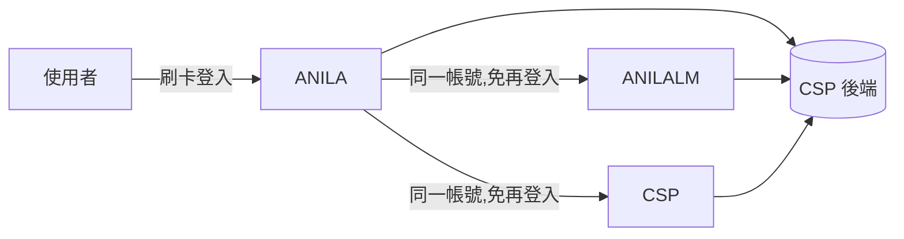
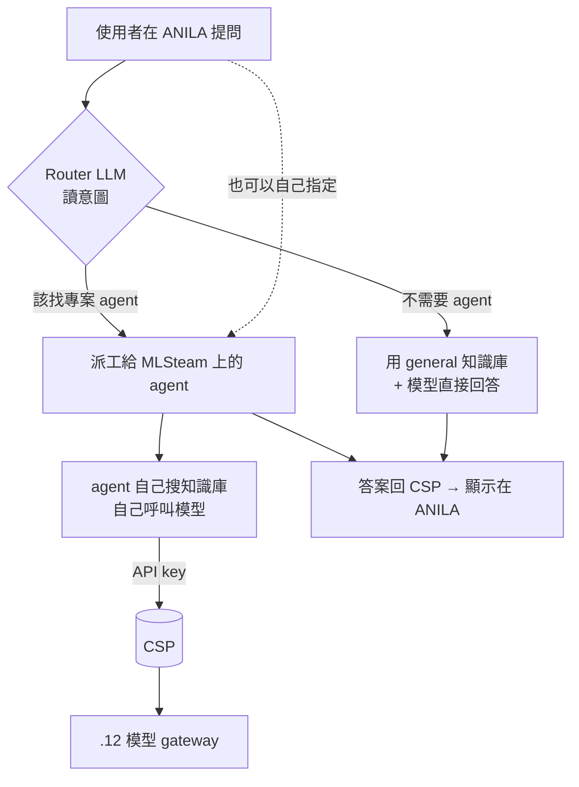

# ANILA 系統圖譜

> 2026-07-29,依平台擁有者逐題確認的需求重建(Q1–Q28)。
> **這份取代先前所有規劃文件的權威地位。** 與其他文件衝突時以本檔為準。
> 🟣 **2026-08-17 定位**:本檔＝**規格權威**(應然——系統該有什麼能力、受什麼約束);
> **現況與執行順序的權威＝`PLAN.md`**(實然——現在做到哪、下一步做什麼)。
> 兩者分工,不互相取代;問「該長什麼樣」看本檔,問「現在是什麼、接下來做什麼」看 `PLAN.md`。
> **8 月底 = 上線給全院用**(不只開發完成)。

---

## 0. 一句話與最重要的約束

**給中科院全院用的 AI 助理平台**,後台是為了發 API key、看用量等營運需要。

**最重要的約束:這個系統由一個人維運。** 偶爾有一位幫忙。
任何需要專人照顧的機制(守衛、儀式、多步驟部署)都是負債,
除非它換來的東西大於「一個人要維護它」的成本。

---

## 1. 三個網站,一個後端,一次登入



| 網站 | 是什麼 | 給誰 |
|---|---|---|
| **ANILA** | 像 ChatGPT / claude.ai 的聊天平台。**登入入口、所有人的落地頁** | 全院 ~3000 人 |
| **ANILALM** | 像 NotebookLM 的**個人**知識庫 | 想整理自己資料的人 |
| **CSP 後台** | 治理:建知識庫、註冊 agent/模型、發 key、看用量 | admin / dev / 單位管理員 |

- 刷一次卡,三個都能進。同一個帳號。
- **CSP 沒有聊天介面。** 聊天只發生在 ANILA 與 ANILALM,兩邊的對話**各自獨立、互不出現**。
- 一般使用者的用量應該直接放進 ANILA(像 Claude 那樣),讓一般人不用去 CSP。

### 功能範圍

| | ANILA | ANILALM |
|---|---|---|
| 純聊天 | ✓ | ✓(對個人知識庫) |
| 選 agent / router 自動派 | ✓ | — |
| 文件 | ✓ 丟 PDF 直接叫 LLM 分析 | ✓ NotebookLM 式知識庫 |
| 對話管理 | ✓ | ✓ |
| 訊息樹(編輯重生) | ✓ | — |
| 語音輸入 | ✓ | ✓ |
| Studio 產出 | — | ✓(可延後) |
| 生圖 | ✓ | — |
| 長期記憶 | ✓ | **—(只在同一 session 內,不跨 session)** |
| 分享 | ✓ | ✓ |
| 匯出 | ✓ | — |

---

## 2. 人與權限

| 角色 | 人數 | 能做什麼 |
|---|---|---|
| **一般使用者** | 絕大多數 | 聊天、丟附件、用被指派的 agent 與模型、看自己的用量 |
| **dev** | 少數 | 建知識庫、灌文件、註冊 agent 與模型;經授權可指派權限 |
| **admin** | 極少數 | 上述 + 核准帳號、指派 dev、**指派一般使用者可用的 agent/模型** |
| **owner** | 系統維運者 | 全部 |
| **單位管理員** | 每單位 **最多 3 人** | 綁在部門節點，權限涵蓋該節點以下。見 `services/csp/app/models/unit_admin_assignment.py` |

### 單位管理員(新角色)

通常是該單位資安官。**綁在部門樹的某個節點,權限涵蓋該節點以下全部。**

| 能看 | 能做 | **不能** |
|---|---|---|
| 自己單位的用量 | 核准自己單位的新帳號 | ❌ 看對話明文 |
| 自己單位有哪些人、狀態 | 停用/恢復自己單位的帳號 | ❌ 指派 agent/模型權限(admin 才行) |
| 自己單位**用了哪些 agent** | 調整自己單位內的額度分配 | |

- **怎麼指派**:外單位來文,由本組指派
- **可以跨單位**(院級長官可能同時管多個節點)
- 他自己也可以當一般使用者用

### ⚠ 部門是三層樹,用量要逐層加總

```
院 ── 所 ── 組
```

部門是 `parent_id` 樹（根節點 parent 為空），用量範圍含自身與子孫。見 `services/csp/app/models/department.py`、`services/csp/app/services/department_tree.py`、`services/csp/app/services/usage_service.py`。

### 部門歸屬怎麼來

- **憑證裡沒有單位** —— 只有員工編號、姓名、email
- 所以靠 **單位管理員核准帳號時確認** —— 他認得自己單位的人,**核准這個動作本身就是驗證**
- 未來人資介接是加值,不是前提
- ⚠ **核准不是安全把關,是確保部門歸屬正確**(因為用量要按部門算),所以不能自動核准
- ⚠ **需要批次核准**:一次選整個單位。3000 人一個一個按會癱瘓

---

## 3. 主線:一句話問題怎麼被回答



**Router**:一個 LLM 讀使用者意圖,比對各 agent 的**自我描述**,決定派工或自己答。
- 為什麼需要:agent 到 20–30 個時(申請 mail、請假、訂餐…),純手選會癱瘓
- **使用者要看得到是哪個 agent 在回答**,而且能自己改派
- 目前用指定的主模型;未來希望使用者可選自己被授權的模型

---

## 4. CSP 與 MLSteam 的關係(兩個方向,互補)

```
方向一  使用者選 agent → CSP → POST 到 MLSteam agent 的 endpoint
方向二  MLSteam agent ──API key──▶ CSP ──▶ .12 模型 gateway
                                    └──▶ 知識庫搜尋(CSP = 遠端資料庫)
```

**用量在方向二被記到。**

| 步驟 | 誰 | 在哪 |
|---|---|---|
| 1 | dev | 在 **CSP** 建知識庫、灌文件 |
| 2 | dev/admin | 在 **MLSteam** 用 anila-agent / langchain 建 agent,**在 `.env` 指定 collection ID** |
| 3 | dev | 在 **CSP** 註冊 agent、拿 API key |
| 4 | admin+ | 指派哪些使用者可以用這個 agent |
| 5 | 使用者 | 在 **ANILA** 選它(或 router 派) |
| 6–8 | CSP → agent → CSP | 派工 → agent 自己搜庫呼叫模型 → 答案回 ANILA |

- 一個 agent 可以綁**多個**知識庫
- **檢索是 agent 自己做的**,CSP 只提供搜尋 API
- ⚠ collection ID 設定在 **MLSteam 那邊的 `.env`**,不是在 CSP 綁定

### 派工身分

CSP 派工時簽一枚 **5 分鐘 RS256 JWT**（claims：`user_id`、`department`、`agent_id`），agent 用 `/.well-known/jwks.json` 驗簽。簽發：`services/csp/app/services/proxy/dispatch_token.py`（`DISPATCH_TOKEN_TTL_MINUTES = 5`）。送出：`services/csp/app/services/proxy/headers.py` 的 `build_agent_headers`（`Authorization: Bearer`，不送明文 `X-ANILA-User-Id`，也不送 `X-CSP-Service-Token`）。

**模型 gateway 是另一條。** `build_model_gateway_headers` 只把員工編號（員編）放在 `X-ANILA-User-Id`，給 `.12` 追溯；不帶派工 JWT，也不帶 CSP 的 service token。

---

## 5. 資料放哪

| 東西 | 是什麼 | 生命週期 | 誰看得到 |
|---|---|---|---|
| **general 知識庫** | **可標記多個**,全院通用文件(章程、差勤、表單、公告) | 持續維護 | 所有人(透過 router 直答) |
| **專案知識庫** | dev 建,給 MLSteam agent 當遠端資料庫 | 專案週期 | 綁定的 agent + 有權限的人 |
| **個人知識庫** | ANILALM 的,像 NotebookLM | 使用者自己管 | 只有自己 |
| **ANILA 附件** | 丟 PDF 直接叫 LLM 分析 | **隨對話刪除;沒刪最多留 3 天** | 只有那場對話 |
| **對話** | ANILA 與 ANILALM **各自獨立** | 使用者自己管 | 只有自己(+ 分享) |
| **Studio 產出** | 暫存伺服器 | 設時限後自動刪(暫定 3 天) | 產它的人 |

⚠ **各所的文件不另開庫,走 agent 建置。** general 庫只放全院通用的。

⚠ **「一個」是舊規格,2026-08-07 擁有者裁決改為「可標記多個」**
(設計:`docs/specs/2026-08-07-anila-institutional-kb-design.md` §2 裁決 1)。
規則:標記是 **admin 動作**、翻轉寫稽核帳;**只有密等「無機密」的院內庫可標記**
(資料庫 CHECK 擋著,升密前必須先取消標記);`origin='anilalm'` 的個人庫**不可標記**
(⚠ 早期 `origin` 是 NULL 的舊列擋不到,而那些列在 ANILALM 的架上一樣看得到——標之前先確認來源);
**整個標記集必須共用同一顆嵌入模型**(分數不可跨模型比較)。
檢索時逐庫查、合併、過分數門檻,且**只取密等為「無機密」的文件**——庫是無機密不代表庫內每份文件都是。

### 附件怎麼處理(已議定)

```
上傳 → 抽文字 → 算 token 數
  ├─ 塞得下 128K(含對話歷史)→ 整份進 context  ← 絕大多數
  └─ 塞不下 → 才切塊檢索,並明白告訴使用者「這份太大,我用檢索的,可能會漏」
```

- 模型 context = **128K**
- 多輪對話靠**前綴快取**(vLLM `--enable-prefix-caching` / SGLang RadixAttention)
- ⚠ **待確認**:`.12` 用哪個推論引擎、前綴快取有沒有開
- ⚠ **KV cache 記憶體**:每人掛 5 萬 token 的文件,十幾人並行就可能吃光顯卡。緩解是閒置逾時 + 限制同時進行的附件對話數

### 長期記憶(只有 ANILA)

- **兩種都要**:使用者自己寫的偏好 + 系統自動萃取
- 萃取範圍**包含對話內容**(不只偏好)
- **密等內容不納入記憶**
- ⚠ **對話中途升密 → 之前萃取的記憶要撤回** → 每則記憶要記得來源對話,才找得到
- **使用者看得到、能刪、自己管理**(不自動過期)
- 卡片資訊只用來**稱呼使用者的名字**

---

## 6. 模型

- **註冊方式**:指向一個 endpoint,把它 `/v1/models` 的模型**整批帶進來** —— 像 Open WebUI
- ⚠ **端點可能是 `https://<domain>/v1` 也可能是 `http://<host>:<port>`。內網用 http 是常態,不是安全違規。** 現行程式碼把 http endpoint 當違規要改
- 通通走 OpenAI compatible;embedding 可能有 v2 變體(如 nv-embed-v2)
- **embedding 也算模型**,要能被指派與記帳(dev 在 MLSteam 開發 agent 時會想用不同的)
- 誰能註冊:**owner + owner 逐人指定的 dev**(2026-07-30 擁有者修訂,原為「admin + 被 admin 授權的 dev」)
  - 收緊的理由:admin 只要能填任意端點位址,就能用一列自建資料去比對、反推被遮蔽的位址;分組與隱藏在那個前提下互斥。收權後 admin 仍可檢視、啟停用、指派、刪除、整批帶入
  - 既有列(無建立者紀錄)的位址只有 owner 改得動
- 誰能**看到**位址:**owner + 同一批被指定的人**(2026-07-30 擁有者裁定)
  - 理由(擁有者原話):「可能是我的小組長或是管模型的那個人」——管模型的人看不到位址就做不了事
  - **沿用「誰能設定位址」那張指定表,不另建機制**
  - 連帶:**分組金鑰整套刪除**。那個雜湊是為了讓看不到位址的 admin 還能知道哪些模型同機而生,
    代價是匯入來源選單變成一列一個選項。指定的人直接看得到真實位址之後,它沒有存在理由
  - **服務對服務例外**:持有服務 token 的內部呼叫拿到真實位址(指揮官判斷,非擁有者裁定)。
    一個必須去呼叫該端點的服務本來就得知道位址,遮蔽它不保護任何東西、只讓功能壞掉;
    且服務 token 本身遠比「知道一個內網位址」貴重。這解除了 FLUX `image-primary` 的撿回阻礙
  - ⚠ 這是**放寬**,方向與 2026-07-30 稍早的收緊相反。理由記在 PLAN「從 attic 撿回」:
    原本的遮蔽花五輪封了七個外洩出口,保護的是「已經是 admin 的自己人不知道內網位址」——
    在氣隙內網＋實名卡登的前提下很薄,而持續成本(難用的介面、擋住自己撿回功能)很厚
- **每個人看到的模型清單不同**(依指派)

---

## 7. 用量與配額

**目的:算帳。長官月結看。**

要記的欄位:**時間、使用者、部門、模型、agent、token 數**。
→ 一張表加幾個索引。**不需要 span 樹、parent 關係、trace id。**

| 問題 | 答案 |
|---|---|
| agent 呼叫模型的 token 算誰的? | **算觸發的使用者**(像使用者透過 AI 開 tool) |
| 也要掛在 agent 上嗎? | 要,兩邊都算 —— 報表要能回答「部門用了哪些 agent」 |
| 部門怎麼加總? | **逐層**:組 → 所 → 院 |
| 沒有觸發者的呼叫算誰? | ⚠ **待議** |
| 現階段設不設限? | **只計量,不設限** |
| 未來的設計 | **兩層**:部門池 + 個人上限;超過**硬停** |
| 誰設額度? | admin 分配給單位,**單位管理員再分配單位內** |

---

## 8. 分級、外流與稽核

密等在**專案啟動時就標好了**,平台主要是**記錄**它。
實際會碰到:**無機密 / 營業秘密 / 密 / 機密**。

### 五個外流面的門檻(逐格確認過)

| 動作 | 無機密 | 營業秘密 | 密 | 機密 |
|---|---|---|---|---|
| 複製 | 可以 | **可以** | 不可 | 不可 |
| 匯出 | 可以 | **可以** | 不可 | 不可 |
| 分享 | 可以 | **可以** | 不可 | 不可 |
| 列印 | 可以 | **可以** | 不可 | 不可 |
| **落稽核** | **不用** | **要** | **要** | **要** |

**兩條簡單的線:**
- 可以做 = 密等 ≤ **營業秘密**
- 要落稽核 = 密等 ≥ **營業秘密**

(現行程式碼是統一判準 `> 無機密` 全部管制,所以營業秘密現在不能分享 —— 要改。)

### ⚠ 「防弊」做得到什麼、做不到什麼

**瀏覽器裡沒有辦法真正阻止複製、截圖或列印。** 停用右鍵、`user-select:none`、
擋列印的 CSS —— 全部可以用 F12、關 JS、截圖繞過。而且**內容是 API 送出去的**,
帶著自己的 session 用 curl 就拿得到。**做「禁止複製」的按鈕等於給假的安心感。**

**採用乙案(已議定)**:內容可讀,但

1. **全頁浮水印** —— 印「本文件屬營業秘密 · 讀取者 · 時間」。**不阻止外洩,但讓外洩追得到人。** 這是對內部人最有效的嚇阻
2. **每次讀取落稽核**
3. 兩者配合才能追責

### 分享

- **分享給指定的人/單位**,不是匿名連結。氣隙內網裡大家都有帳號,**不需要未登入可讀的入口**
- 營業秘密可以分享;密/機密不可

### 加密

⚠ **現階段不做真的加解密。**

- collection 與 agent 上有一個**列管標記**,存取它的人與動作全部記錄
- **UI 上的字必須誠實** —— 不可以寫「已加密」,要寫「列管」或「受控存取」
- **加密規範由資安中心指導**,拿到規範再實作

### 稽核

| | |
|---|---|
| 記什麼 | 讀取受控文件/對話、上傳、刪除、改密等、匯出、列印、分享、登入登出、呼叫模型/agent、管理動作 |
| 留多久 | **半年** |
| 誰查 | admin 在後台查;**要能匯出給稽核單位**;未來可能上資安中心 SOC |
| 防竄改 | **要** —— 明確是為了防止 admin 權限的人偷偷做假 |

> ⚠ **append-only 的稽核帳因此是必要的,不是過度設計。** 威脅模型包含特權內部人。
> **加密防資料、稽核防人**,兩者互補。

---

## 9. 營運

| | 現況 | 要做的 |
|---|---|---|
| 誰在顧 | **一個人**,偶爾一位幫忙 | 系統要能自己喊救命 |
| 監控告警 | **沒有** —— ISO 稽核已點名 | **必做**,見下 |
| 備份 | 程式碼在 GitHub + 本機 | ⚠ **資料庫沒有備份** |
| 預期問題 | 太慢、答得不好、系統崩潰 | |

### 告警(全部都要)

**管道:院內 Microsoft Outlook 伺服器(SMTP)。不需要半夜叫醒,但要分級,隔天上班看得出輕重。**

| 訊號 |
|---|
| 平台沒回應(`/health` 連續失敗) |
| 資料庫連不上 / 連線池抽乾 |
| `.12` 模型 gateway 呼叫連續失敗 |
| MLSteam 上某個 agent 派工失敗 |
| **磁碟快滿** |
| 回應時間 p95 超過門檻(門檻先量一週再定;agent 本來就久,要跟直答分開算) |

- 「答得不好」無法自動告警 → 靠**讚/爛回饋**。⚠ 目前有按鈕,但**不確定有沒有存下來、也沒有地方看** —— 要查
- ISO 42001 的儀表板(顯示是否已處理、是否已停用可疑帳號)**後做**

### ⛔ 備份缺口(現在就有風險)

GitHub 上的是**程式碼**,不是**資料**。對話、知識庫、用量紀錄、
**要留半年的稽核帳**、**要給長官的月報表** —— 全部在資料庫裡。
**那台機器的磁碟掛掉,這些就沒了。**

---

## 10. 現況與上線

| | |
|---|---|
| `.15` 現在 | 跑著 **redesign 之前的舊版**,少數同事試用 |
| 現有資料 | 有真實對話,**沒有知識庫,全部可刪** → 資料庫可以砍掉重來 |
| 開發環境 | 本機(外網開發區) |
| 上碼方式 | **打包 tar 搬過去** |
| 8 月底 | **上線給全院用** |

### 上線流程

- **分批放行**,小組長規劃
- **第一次刷卡才建帳號**(不預先匯入 3000 筆)
- 支援管道:信箱(⚠ **實際位址不寫進這個 PUBLIC repo**,內網版本再填)
- 需要**操作手冊**;影片需要腳本+分鏡(本專案無法錄影,可產逐步截圖圖解)

### 上線前的安全要求(外部,非自訂)

- **源碼掃描 + 弱點測試** —— 上線前必做
- **不得有 OWASP Top 10 高風險項**
- 紅隊:上線後不定期,範圍只測平台本身
- 書面文件由資安中心處理,不需我方產出

**已知問題對應到 OWASP 分類:**

| 已知問題 | 分類 |
|---|---|
| 對 agent 的身分靠純文字標頭 | A07 身分驗證失效 |
| 「加密模式」宣稱加密但沒加密 | A02 加密失效 |
| `/router/docs` 匿名可讀、洩內部路徑 | A05 安全設定缺陷 |
| agent/模型權限、跨使用者資料存取 | A01 存取控制失效 |
| 相依套件版本 | A06 有漏洞的元件 |

---

## 11. Studio(可延後)

- **輸入:知識庫**(像 NotebookLM),不是對話
- **產出:簡報 / 報告優先**;其餘次要
- **「能改」= 下載成 `.pptx` 用 PowerPoint 自己改** → **不需要網頁編輯器**
- 沒有規定版型,只要放 logo(`img_logo_ncsist_20240427.png`)
- **心智圖不是產出物**,是讓使用者快速理解知識庫節點的**瀏覽方式**
- ⚠ **若時間不夠可延後到第二批**

---

## 12. 待外部輸入 / 待議

| 項目 | 等誰 |
|---|---|
| 加密規範 | 資安中心 |
| 部門資料來源(人資介接) | 人資 / 外單位來文 |
| 單位管理員的權責規範 | 規劃中 |
| 額度怎麼分配 | 未討論 |
| 沒有觸發者的 agent 呼叫算誰的用量 | 未討論 |
| `.12` 的推論引擎與前綴快取設定 | 模型服務同仁 |
| SOC 的 log 格式 | 資安中心 |
| 支援信箱要不要用群組信箱 | 使用者 |

### 待自行查證(不需使用者回答)

- 讚/爛回饋有沒有真的存下來、哪裡看得到
- 憑證有效期到期時,驗簽的碼會不會擋住登入

---

## 13. 這份圖譜沒有的東西

以下在現行程式碼裡存在,但**不對應上述任何需求**:

- Gate 0–6 的階段閘門體系
- 部署姿態契約(宣告的 profile 要跟一整組旗標逐一相符,不符就拒絕啟動)
- 卡片 CRL 的啟動硬門檻
- 四人簽署的 pilot 機器可讀檔
- agent 必須回傳 6 種 span 且單一根節點才准核准(trace-test)
- capability freeze 基準線

> 使用者原話:「我就是想要紀錄 Agent 用量也想要可以被派工,
> 但我不知道為什麼給你們做一做就這麼奇怪。」
>
> 需求是兩句話,做出來的是一套分散式追蹤治理協定。
