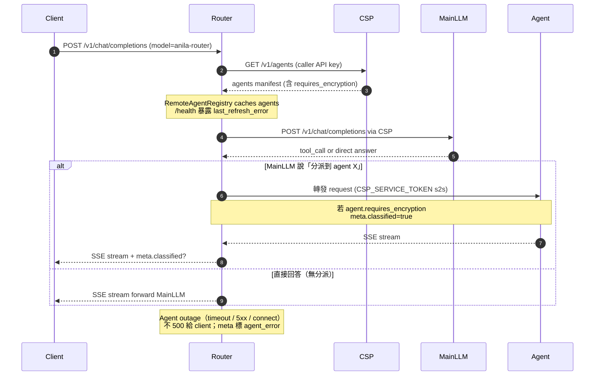

# anila-core-router

**ANILA Router** — OpenAI 相容的自動分派服務。薄殼部署入口，實作在 [`anila-core/src/anila_core/api/router_server.py`](../anila-core/src/anila_core/api/router_server.py)。

對外暴露一個 pseudo-agent `anila-router`：client 把 `model` 欄位設成 `anila-router`，Router 會：

1. 從 CSP `/v1/agents` 動態撈 agent manifest（含 `requires_encryption`），cache 起來。
2. 用 caller 的 API Key 打主 LLM，讓主 LLM 判斷要不要分派到某個 agent。
3. 若決定分派，轉發到 agent 的 `endpoint_url`，並把 agent 的 SSE stream **逐 chunk** 回傳給 caller。
4. 若 agent `requires_encryption`，在 SSE meta 標 `classified=true`，讓上游（CSP + UI）整段對話 one-way latch 為 classified。

> 定位：Router 是「用 ANILA Core runtime foundation 組一個分派服務」的範例實作，不是 core 本身。CSP 才是平台的權威 control + data plane。

---

## 整體運作



<details>
<summary>📄 ASCII 版本（離線 / email / 舊 Markdown renderer）</summary>

```
┌────────────┐
│  Client    │  POST /v1/chat/completions
│  (UI /     │  Authorization: Bearer sk-...
│  OpenAI    │  body.model = "anila-router"
│  SDK)      │
└─────┬──────┘
      │
      ▼
┌───────────────────────────────────────────────────────────┐
│                 anila-core-router (:9000)                 │
│                                                           │
│   ┌──────────────────────────────────────────────────┐    │
│   │ RemoteAgentRegistry                              │    │
│   │  - cache agents from CSP /v1/agents              │    │
│   │  - 定期 refresh；/health 回報 last_refresh_error │    │
│   └────────────────────┬─────────────────────────────┘    │
│                        │                                  │
│                        ▼                                  │
│   ┌──────────────────────────────────────────────────┐    │
│   │ router_server.chat_completions                   │    │
│   │  1. 取訊息 + agents manifest                      │    │
│   │  2. 呼叫主 LLM（透過 CSP /v1/chat/completions）   │    │
│   │  3. 判斷是否需要分派：                             │    │
│   │     - 否 → 直接 SSE forward LLM 回應               │    │
│   │     - 是 → 分派到 agent endpoint_url              │    │
│   │  4. 若 agent.requires_encryption：                │    │
│   │     meta.classified = true                       │    │
│   │  5. 逐 chunk forward agent SSE 給 caller          │    │
│   │  6. Agent outage → structured error trace，        │    │
│   │     不 500                                        │    │
│   └──────────────────────────────────────────────────┘    │
└────────┬────────────────────────────────┬─────────────────┘
         │                                │
         │                                │
         ▼                                ▼
┌──────────────────────┐         ┌──────────────────────────┐
│  CSP (:8000)         │         │  Agent endpoint          │
│  /v1/agents          │         │  (註冊在 CSP 的 agent)    │
│  /v1/chat/completions│         │  - 用 CSP_SERVICE_TOKEN  │
│                      │         │    驗 s2s                 │
└──────────────────────┘         └──────────────────────────┘
```

</details>

---

## 啟動方式

### 方式 1：repo 根 compose（推薦）

```bash
# 於 repo 根
docker compose up -d
# Router: http://localhost:9000
```

Compose 會自動依賴 `csp` healthy 之後才起 `router`。

### 方式 2：單機 uvicorn

需先裝 `anila-core` SDK（從 monorepo 來源安裝，不需要 RAG extras）：

```bash
pip install -e "../anila-core"

export CSP_BASE_URL=http://localhost:8000
export MODEL=gpt-4o-mini      # 或你實際的主模型名

uvicorn main:app --host 0.0.0.0 --port 9000 --log-level info
```

### 方式 3：自行 build Docker image

build context 需設為 repo 根（因為 Dockerfile 會 COPY `anila-core/` 進去）：

```bash
# 於 repo 根
docker build -f anila-core-router/Dockerfile -t anila-core-router .
docker run -p 9000:9000 \
  -e CSP_BASE_URL=http://csp:8000 \
  -e MODEL=gpt-4o-mini \
  anila-core-router
```

---

## 環境變數

| 變數 | 說明 | 預設 |
|---|---|---|
| `CSP_BASE_URL` | myCSPPlatform 基底 URL（容器內網址） | **必填** |
| `MODEL` | 主 LLM 的模型名稱（必須已註冊在 CSP） | `gpt-4o-mini` |

> Router **不**需要自己的 API Key：它用 caller（UI / OpenAI SDK）的 Bearer API Key 回打 CSP data plane。這代表 caller 看得到的 agent 跟 Router 分派得出去的 agent 完全同步於該 API Key 的 allowed_models。

---

## 主要端點

### `POST /v1/chat/completions`

OpenAI 相容介面，把 `model` 設為 `anila-router` 即觸發自動分派：

```bash
curl -N -X POST http://localhost:9000/v1/chat/completions \
  -H "Authorization: Bearer sk-your-api-key" \
  -H "Content-Type: application/json" \
  -d '{
    "model": "anila-router",
    "messages": [{"role": "user", "content": "幫我查陸海空軍懲罰法第 8 條"}],
    "stream": true
  }'
```

其他 `model` 值（例如 `llama3-70b`）會直接 forward 到 CSP，不經分派邏輯。

### `GET /health`

```json
{
  "status": "ok",
  "cached_agents": 3,
  "last_refresh_error": null
}
```

- `cached_agents` — RemoteAgentRegistry 目前快取了幾個 agent。
- `last_refresh_error` — 最近一次從 CSP 撈 agent 清單的錯誤（成功為 `null`）。若長時間非 null，代表 `CSP_BASE_URL` 或 API Key 不對，或 CSP 沒起來。

---

## 程式結構

```
anila-core-router/
├── main.py        # 3 行：app = create_router_app()
├── Dockerfile     # Multi-stage；build context 需為 repo 根
└── README.md      # 本檔

# 實際實作在 anila-core：
anila-core/src/anila_core/api/
├── router_server.py              # create_router_app() + 分派邏輯
├── middleware/auth.py            # CSP_SERVICE_TOKEN 驗證
└── ...

anila-core/src/anila_core/registry/
└── remote_agent_manifest.py      # RemoteAgentRegistry（CSP /v1/agents 快取）

anila-core/src/anila_core/tools/
└── dispatch_tool.py              # agent 分派（含 timeout / 5xx 降級）
```

為什麼 `main.py` 只有 3 行？因為整個「router mode」其實就是一個 app factory：
`create_router_app()` 位於 `anila_core/api/router_server.py`，負責掛 middleware、健康探針、以及 `/v1/chat/completions`。Runtime foundation 與部署入口刻意分離，之後 SDK 會進一步 generalize 成 `build_app(mode="router")`（見 `anila_plan.md` Wave E）。

---

## 錯誤處理（Wave B 強化）

| 情境 | 行為 |
|---|---|
| Agent timeout / 5xx | 不把 500 丟給 caller；記 trace step、SSE meta 標 `agent_error`、回友善訊息 |
| Agent connect error | 同上；Registry 下次 refresh 會把該 agent 標為 unavailable |
| CSP `/v1/agents` 抓失敗 | `RemoteAgentRegistry` 紀錄 `last_refresh_error`；分派時 fallback 為 "Router 直接回答" |
| Middleware import 失敗 | **Fail-fast**（raise），**絕不** silent fallback 成 no-op |

---

## 相關文件

- 平台整體：[repo 根 README](../README.md)
- Runtime foundation（SDK）：[`anila-core/README.md`](../anila-core/README.md)
- **官方 RAG agent template**：[`AgenticRAG/README.md`](../AgenticRAG/README.md)
- CSP 平台：[`myCSPPlatform/README.md`](../myCSPPlatform/README.md)
- UI：[`ANILA_UI/anila-ui/README.md`](../ANILA_UI/anila-ui/README.md)
- 路線圖與決策：[`anila_plan.md`](../anila_plan.md)

---

## Release Notes

### 2026-04-24 — AgenticRAG template 同步

- Cross-reference 敘述更新：`AgenticRAG` 從「sample」改稱「**官方 RAG agent template**」。
- 與 AgenticRAG 的 `CspServiceTokenMiddleware` 載入順序一致：Router 自己也是從 `anila-core/api/middleware/auth.py` 載 CSP middleware，確保跨服務的 s2s 安全邏輯是單一實作。

### Wave B — 錯誤處理硬化（2026-03）

- `RemoteAgentRegistry` 暴露 `last_refresh_error` 到 `/health`（之前 silent fail）
- Agent outage (timeout / 5xx / connect error) **不** 500 給 caller；改 SSE meta 標 `agent_error`，回友善訊息
- Middleware import 失敗 **fail-fast**；絕不 silent fallback 成 no-op

### Wave A — 初版（2026-02）

- `main.py = create_router_app()` 薄殼；所有分派邏輯住在 `anila-core/src/anila_core/api/router_server.py`
- Dockerfile multi-stage build（context 需為 repo 根，會 COPY `anila-core/`）
- `/v1/agents` 快取 + classified latch 傳播
- Router **不**持有自己的 API Key，一律用 caller bearer 回打 CSP（caller 權限 = Router 分派權限）

### Wave E 待辦

- Router mode 收斂進 `anila-core.app_factory.build_app(mode="router")`，讓 `main.py` 變 1 行

---

## License

見 repo 根 [`LICENSE`](../LICENSE)。

---

**Last updated**: 2026-04-24 · **Depends on**: `anila-core` (no `[rag]` extras) · **Talks to**: `myCSPPlatform` + 已註冊 agents
