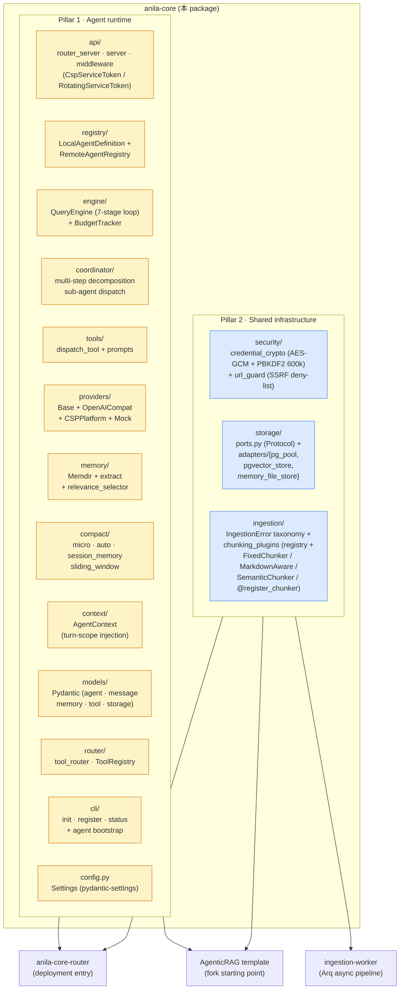

# anila-core

**ANILA Core** — Python agent runtime foundation（SDK）。

這是 ANILA 平台所有 agent 與 Router 共用的 **runtime 基座**。純 runtime，不綁 RAG、不綁特定向量庫、不綁特定模型供應商。RAG 相關的檔案解析、pgvector、向量檢索是 **樣板（AgenticRAG）** 才會用到的能力，透過 optional extras 提供。

- **Router 部署**：只裝 `anila-core`（不加 `[rag]`），image 精簡
- **Agent 開發者**：`pip install "anila-core[rag]"` + fork [`AgenticRAG`](../AgenticRAG/) 作為**官方 RAG agent template** 起點
- **SDK 消費者**：`from anila_core.api.router_server import create_router_app`、`from anila_core.engine.query_engine import QueryEngine` 等

> Repo 根定位請看 [`../README.md`](../README.md)。Agent 開發 workflow 與 RAG template 請看 [`../AgenticRAG/README.md`](../AgenticRAG/README.md)。

---

## 套件邊界

anila-core 同時承擔兩個責任。**Pillar 1（agent runtime）** 是 Router 與每支 agent 服務單一聊天 turn 所需的 in-process 元件；**Pillar 2（shared infrastructure）** 是不專屬於某個 agent process、被 ANILA 後端 fleet（Router、agent、ingestion-worker，以及未來各種 batch worker）共用的基底元件。



<details>
<summary>📄 ASCII 版本（離線 / email / 舊 Markdown renderer）</summary>

```
┌──────────────────────────────────────────────────────────────────┐
│                anila-core (shared platform Python lib)            │
│                                                                   │
│  Pillar 1 — Agent runtime（in-process; Router & agent 共用）      │
│   api/                router_server / server / events /          │
│                       middleware（CSP service-token，含           │
│                       Sprint 8 X RotatingServiceTokenMiddleware）│
│   registry/           LocalAgentDefinition + RemoteAgentRegistry │
│   engine/             QueryEngine 7-stage turn loop +            │
│                       BudgetTracker                              │
│   coordinator/        Multi-worker / multi-step orchestration    │
│   tools/              dispatch_tool + prompts                    │
│   providers/          OpenAICompat + CSPPlatform + Mock          │
│   memory/             Memdir + extract / select / consolidate    │
│   compact/            micro / auto / session_memory / sliding    │
│   context/            AgentContext (turn-scope contextvars)      │
│   models/             pydantic dtos (message / tool / agent /    │
│                       memory / storage)                          │
│   router/             tool_router (ToolRegistry)                 │
│   cli/                init / register / status /                 │
│                       agent bootstrap (Sprint 8 X)               │
│   config.py           Settings via pydantic-settings             │
│                                                                   │
│  Pillar 2 — Shared infrastructure（fleet 共用，含 batch worker）  │
│   security/           credential_crypto (AES-GCM + PBKDF2 600k) +│
│                       url_guard (SSRF deny-list)                 │
│   storage/            ports.py (Protocol) +                       │
│   ├── adapters/                                                  │
│   │     pg_pool.py            asyncpg connection pool            │
│   │     pgvector_store.py     CollectionScopedPgVectorStore      │
│   │     memory_file_store.py  in-memory adapter for tests        │
│   ingestion/          IngestionError + chunking_plugins registry │
│   │     errors.py             ParseError / ChunkError /          │
│   │                           EmbedError / StoreError            │
│   └── chunking_plugins/                                          │
│         base.py              ChunkerStrategy ABC + ChunkResult   │
│         registry.py          @register_chunker + get_chunker     │
│         builtins.py          Fixed / MarkdownAware / Semantic    │
└──────────────────────────────────────────────────────────────────┘
       │                                          │
       │  import                                  │  fork & extend
       ▼                                          ▼
┌──────────────────────┐                ┌────────────────────────┐
│  anila-core-router   │                │   AgenticRAG template  │
│  Pillar 1 + 2 user   │                │   Pillar 1 + 2 user;   │
│  state-file +        │                │   ships its own        │
│  per-credential s2s  │                │   ingestion (parsers, │
└──────────────────────┘                │   docling, OCR, CJK)   │
                                        └────────────────────────┘
                  ▲
                  │  Pillar 2 only
                  │
┌──────────────────────────────────────────────────┐
│ ingestion-worker                                  │
│   Arq + Redis backbone; consumes anila-core's     │
│   chunking_plugins + IngestionError + pg_pool +   │
│   pgvector_store. Does NOT use Pillar 1.          │
└──────────────────────────────────────────────────┘
```

</details>

---

## 安裝

### 從 monorepo 來源安裝（推薦）

```bash
# 於 repo 根
pip install -e "./anila-core"          # 完整 Pillar 1 + Pillar 2
pip install -e "./anila-core[dev]"     # + pytest / ruff / mypy
```

> **`[rag]` extras 已移除**（v0.5.0）：檔案解析、NV-Embed-V2、與 RAG agent 專屬 tool factory 都搬到 [`AgenticRAG`](../AgenticRAG/) template。要做 RAG agent 請 fork AgenticRAG。
>
> 但 `asyncpg` / `pgvector` / `chunking_plugins` 沒走 — 它們是 Pillar 2 共用基礎元件（ingestion-worker 主要使用者）。直接 `pip install -e "./anila-core"` 就會把它們一起裝。

### 從 wheel 安裝（日後 CI 推到內部 PyPI 後）

```bash
pip install anila-core
```

---

## 最小使用範例

### 1. Router 模式（OpenAI-compatible dispatcher）

```python
# main.py
from anila_core.api.router_server import create_router_app

app = create_router_app()
```

```bash
export CSP_BASE_URL=http://localhost:8000
export MODEL=gpt-4o-mini
uvicorn main:app --host 0.0.0.0 --port 9000
```

### 2. QueryEngine 直接跑一輪（不走 FastAPI）

```python
from anila_core.engine.query_engine import QueryConfig, QueryEngine
from anila_core.providers.openai_compat import OpenAICompatProvider
from anila_core.router.tool_router import ToolRegistry
from anila_core.models.message import UserMessage

provider = OpenAICompatProvider(base_url="http://csp:8000/v1", api_key="sk-...")
engine = QueryEngine(provider=provider, tool_registry=ToolRegistry(), config=QueryConfig())

async for delta in engine.run_stream([UserMessage(content="say hi")]):
    print(delta)
```

### 3. 做自己的 agent（fork AgenticRAG template）

細節見 [`../AgenticRAG/README.md`](../AgenticRAG/README.md)。anila-core 提供的 CLI 可以 scaffold：

```bash
anila-core init my-agent   # 用 anila_core/cli/templates/agent-template
cd my-agent
# 開始實作 tools / prompts / endpoints
```

---

## 執行測試

```bash
pip install -e ".[rag,dev]"
pytest                       # 預設 testpaths=["tests"]
pytest --cov=src             # + coverage
```

`tests/` 涵蓋：QueryEngine、Coordinator、Compact、Memory、Registry、Router server、CLI scaffolding、RAG tools、Chunker、Parsers、Ingestion service、Embedding mock、Dispatch tool。

---

## 檔案結構

```
anila-core/
├── pyproject.toml            # name=anila-core, v0.7.0
├── README.md                 # 本檔
├── CHANGELOG.md
├── e2e_smoke.py              # 手動 e2e（需 OPENAI_API_KEY）
├── examples/
│   ├── router-mode/
│   └── simple-agent/
├── tests/                    # pytest（含 test_rotating_middleware）
└── src/
    └── anila_core/
        ├── __init__.py
        ├── config.py
        ├── app_factory.py
        │
        ├── ──── Pillar 1 · agent runtime ────
        ├── api/                   # FastAPI server / events /
        │   ├── server.py          # create_app()
        │   ├── router_server.py   # create_router_app() + 分派邏輯
        │   ├── events.py
        │   └── middleware/
        │       └── auth.py        # CspServiceTokenMiddleware (legacy) +
        │                          # RotatingServiceTokenMiddleware (Sprint 8 X)
        ├── cli/                   # init / register / status / agent bootstrap
        ├── compact/               # micro / auto / session_memory / sliding
        ├── context/               # AgentContext (+ plan_mode / todos / event_emitter)
        ├── coordinator/           # multi-worker / multi-step orchestration
        ├── engine/                # query_engine (7-stage) + budget_tracker
        │                          # + approvals (Sprint 9: pause-resume,
        │                          #              Sprint 11: tool_approval)
        │                          # + handoff (Sprint 10: control transfer)
        │                          # + lifecycle (Sprint 11: RunHooks)
        ├── memory/                # memdir / extract / relevance / consolidation
        │                          # + session / sqlite_session / memory_session
        │                          # (Sprint 9: per-chat conversation persistence)
        ├── models/                # pydantic dtos (+ interrupt, Todo, handoff,
        │                          #                 Sprint 11: ToolPermission)
        ├── post_turn/             # Sprint 9: PromptSuggestion (follow-up chips)
        ├── providers/             # base + openai_compat + cspplatform + mocks
        ├── registry/              # local + remote agent manifest cache
        ├── router/                # tool_router (ToolRegistry, plan-mode gate,
        │                          # handoff detection, Sprint 11: permission gate
        │                          # + bypass_gates)
        ├── tools/                 # dispatch_tool (Sprint 10: stateful + handoff),
        │                          # ask_user, plan_mode, todo_write,
        │                          # agent_as_tool (Sprint 10)
        ├── tracing/               # Sprint 11: Span / Tracer /
        │                          # InMemoryProcessor / TracingHooks
        │
        └── ──── Pillar 2 · shared infrastructure ────
            ├── security/          # credential_crypto + url_guard
            ├── storage/
            │   ├── ports.py       # Protocol interfaces
            │   └── adapters/
            │       ├── pg_pool.py            # asyncpg pool
            │       ├── pgvector_store.py     # CollectionScopedPgVectorStore
            │       └── memory_file_store.py  # tests / dev
            └── ingestion/
                ├── errors.py      # IngestionError / Parse / Chunk /
                │                  # Embed / Store
                └── chunking_plugins/
                    ├── base.py       # ChunkerStrategy ABC + ChunkResult
                    ├── registry.py   # @register_chunker / get_chunker /
                    │                 # list_chunkers
                    └── builtins.py   # FixedChunker /
                                      # MarkdownAwareChunker /
                                      # SemanticChunker
```

> **v0.5.0 boundary 修正（Sprint 8 X 審查後）**：上一版 release notes 寫
> 「`ingestion/`、`storage/adapters/{pg_pool,pgvector_store}` 已從
> anila-core 移除」是過時且不符實情的描述 — 這幾個模組從未真正搬走，
> ingestion-worker 依賴它們提供 chunking_plugins 與 pg / pgvector
> primitives。Sprint 8 X 的決策是**保留**這幾個模組並把它們明確
> 歸類在 Pillar 2「shared infrastructure」，與 Pillar 1 agent runtime
> 並列。anila-core 因此是「ANILA 後端共用 Python lib」，不只是
> agent runtime — `security/` 與這些 ingestion / pg primitives 都有
> 獨立的 fleet 級消費者，跟 agent process 內的元件邊界乾淨。
>
> 真正在 v0.5.0 移除的：`api/{documents,search}.py`、
> `storage/adapters/postgres_store.py`、`providers/embedding_nvidia.py`、
> `engine/rag_preprocessor.py`、`tools/__init__.py` 內 3 個 RAG factory
> （vector_search / keyword_search / read_document）。這些是 RAG-agent
> 專屬路徑，搬到 [`AgenticRAG`](../AgenticRAG/) template；
> ingestion-worker 沒消費過。

---

## 相關文件

- 平台總覽：[`../README.md`](../README.md)
- Router 薄殼部署：[`../anila-core-router/README.md`](../anila-core-router/README.md)
- **官方 RAG agent template**：[`../AgenticRAG/README.md`](../AgenticRAG/README.md)
- CSP 平台：[`../myCSPPlatform/README.md`](../myCSPPlatform/README.md)
- UI：[`../ANILA_UI/anila-ui/README.md`](../ANILA_UI/anila-ui/README.md)
- Runtime TS 參考原本：[`../runtime_logic/README.md`](../runtime_logic/README.md)
- 決策與路線圖：[`../anila_plan.md`](../anila_plan.md)

---

## Release Notes

### 2026-05-02 — v0.10.0 Sprint 11 · Governance & observability

Sprint 11 加治理 + 觀測層在 Sprint 9-10 之上：QueryEngine 暴露同步 lifecycle hooks、in-tree 出 OTel 風格 hierarchical tracing、tools 拿到 per-call permission policy（含互動 ASK 模式）、Router 多輪 loop 支援 streaming。

| 模組 | 來源 | 用途 |
|---|---|---|
| `engine.lifecycle` (`RunHooks` + 9 hook points) | openai-agents `lifecycle.py` | 同步 hook：`on_run_start/end` / `on_agent_start/end` / `on_tool_start/end` / `on_run_paused/resumed` / `on_handoff`；exception 不會中斷 run loop |
| `tracing/` (`Span` / `Tracer` / `InMemoryProcessor` / `TracingHooks`) | openai-agents `tracing/` | OTel-style span tree；`SpanKind` 涵蓋 RUN / AGENT / LLM / TOOL / HANDOFF / INTERRUPT / INTERNAL；`TracingHooks(tracer)` 一行接到 QueryEngine |
| `models.tool.ToolPermission` (ALLOW / DENY / ASK) + `bypass_gates` | claude-code `hooks/toolPermission/` | per-tool 治理閘；ASK 走 Sprint 9 `InterruptItem(kind="tool_approval")`，resume 時實際執行工具 |
| `api.router_server._router_streaming_multi_turn` | Sprint 10 PR 4 + soft-chunk emit | `anila_multi_turn > 1` + `stream: true` 路徑：迭代用 non-stream，最終答案 soft-chunk stream |

新 `engine.approvals.resume_tool_approval(session, registry, interrupt_id, *, approved, comment)` 處理 ASK 模式批准/拒絕；`QueryEngine.resume_from_interrupt` 偵測 `tool_approval` 種類並走這條 helper。`ToolRegistry.execute(..., bypass_gates=True)` 同時跳過 plan-mode gate 跟 permission gate。

44 新測試 / lint clean / mypy 持平 / 5 個 pre-existing failures 不變。完整 hook 觸發順序 / 移轉指引見 [`CHANGELOG.md`](./CHANGELOG.md) v0.10.0。

### 2026-05-02 — v0.9.0 Sprint 10 · Multi-agent control flow

接 Sprint 9 的 Session + Approvals 基礎，補上多 agent 之間的控制流。Router 與個別 agent 不再受限於 single-shot dispatch；agent 能 handoff 給專家、Router 能在一個 user turn 裡串接多次 dispatch、dispatch 本身也變成 stateful（session 與 filtered context 跨越邊界）。

| 模組 | 來源 | 用途 |
|---|---|---|
| `engine.handoff` (`HandoffRequest` / `RunHandoff` / `NoFilter` / `LastNFilter` / `SummaryFilter`) | openai-agents `handoffs/` + `extensions/handoff_filters.py` | 工具回 `HandoffRequest` → run 暫停 → Router 接 → dispatch target with filtered context |
| `tools.dispatch_tool` (新增 `context_messages` / `session_id` / `handoff_meta` + `dispatch_for_handoff`) | openai-agents handoff dispatch path | 跨 agent 帶上下文與 session；CSP 透傳 `anila_*` 擴充欄位 |
| `tools.agent_as_tool` (`make_agent_tool`) | openai-agents `_public_agent.py` `Agent.as_tool()` | 把 `RemoteAgentManifest` 包成 `ToolDefinition`，agent 可同步呼叫專家 |
| `api.router_server` (Session 整合 + `anila_multi_turn` loop + `/v1/sessions/{id}/state`) | openai-agents run loop + Claude Code Router | Router 持有 session、可多輪重新評估、輪詢 user 狀態 |

新 Router 行為：

- **Session-aware**：`POST /v1/chat/completions` 接受 `session_id` / `anila_session_id`（缺則自動產生），response 帶 `X-Anila-Session-Id` header
- **Multi-turn 編排**：opt-in 透過 `anila_multi_turn: <int>` body 欄位（預設 1 = 既有 single-shot）。值 > 1 時 Router 第一輪 dispatch 拿到回應後可（a）綜合答覆 user，或（b）再 `DISPATCH:<other>:<query>` 給另一個 agent，最多 N 輪
- **`GET /v1/sessions/{id}/state`**：UI rehydrate 用，回對話歷史 + pending interrupts
- 內部 `_dispatch_safe` / `_stream_agent_sse` 都會把 `session_id` 透過 `anila_session_id` 擴充欄位帶到目標 agent

`ToolResult` 多 `handoff: HandoffRequest | None` 欄位（鏡像 Sprint 9 的 `interrupt`），`ToolRegistry` 偵測 handoff 結果與 `InterruptItem` 同等對待，`QueryEngine` Stage 4 也會在 handoff 出現時 raise `RunHandoff`。

51 新測試 / lint clean / mypy 持平 / 5 個 pre-existing failures 不變。完整變更與向後相容性 / 移轉指引見 [`CHANGELOG.md`](./CHANGELOG.md) v0.9.0。

### 2026-05-02 — v0.8.0 Sprint 9 · Web 對話 protocol

新增「像 Claude.ai 一樣會對話」需要的 5 個 primitive，全部來自
[`runtime_logic/`](../runtime_logic/) 的 Claude Code + openai-agents
參考實作（去 CLI / 去 TUI，只留 web 前端可 render 的形狀）：

| 模組 | 來源 | 用途 |
|---|---|---|
| `memory.session` (`Session` Protocol + `SqliteSession` + `MemorySession`) | openai-agents `memory/session.py` + `sqlite_session.py` | 一個 chat session 的對話歷史 + pending interrupts |
| `engine.approvals` (`InterruptItem` / `RunPaused` / `resume_with`) | openai-agents `run_internal/approvals.py` | 工具回 `InterruptItem` → run 暫停 → 用戶答 → resume |
| `tools.ask_user` | claude-code `AskUserQuestionTool` | 多選題式中段問答 |
| `tools.plan_mode` (`enter_plan_mode` + `exit_plan_mode`) | claude-code `EnterPlanModeTool` / `ExitPlanModeTool` | 提案 → 批准 → 執行；plan mode 下 `DESTRUCTIVE` 工具被 `ToolRegistry` 阻擋 |
| `tools.todo_write` | claude-code `TodoWriteTool` | 任務看板（恰好一個 in_progress） |
| `post_turn.prompt_suggestion` | claude-code `services/PromptSuggestion/` | turn 結束後 suggest 3 個 follow-up question chip |

`api/server.py` 的 `create_app()` 同步整合：

- 自動 attach `Session`（預設 `SqliteSession` 寫到 `settings.session_db_path`，可用 `session_db_path=` 或完全 override `session_factory=`）
- `RunPaused` 不再當 error，而是 emit `interrupt_requested` SSE + `stream_done.status = "paused"`
- 新 endpoint `POST /sessions/{id}/answer` 接 user 答覆並 stream resumed turn
- 新 endpoint `GET /sessions/{id}/state` snapshot 對話 + pending interrupts（UI rehydrate 用）
- 每次 run 綁一個 `AgentContext`，工具透過 `ctx.event_emitter` 推 SSE，不耦合 transport

新 SSE event types（`api/events.py`）：`interrupt_requested` / `resumed` / `todos_updated` / `follow_ups`。

新增依賴：`aiosqlite>=0.20`（單機部署的預設 Session adapter；多機部署換成 Postgres / Redis 實作）。

109 新測試 / lint clean / mypy 持平 / 5 個 pre-existing failures 不變。完整破壞性變更 / 移轉指引見 [`CHANGELOG.md`](./CHANGELOG.md) v0.8.0。

### 2026-05-01 — v0.7.0 Boundary correction (Sprint 8 X)

**Doc-only correction**（無程式變更）。Sprint 8 X audit 發現 v0.5.0 的「已移除 ingestion/ 與 pg_pool / pgvector_store」描述沒落實 — 這幾個模組從未真正搬走，ingestion-worker 也持續在 import。本版正式承認 anila-core 是 **「ANILA 後端共用 Python lib」**（不只是 agent runtime），並把 module 邊界重畫成兩個 pillar：

- **Pillar 1 · Agent runtime**：api / engine / coordinator / registry / context / tools / router / providers / memory / compact / models / cli / config — Router 與 in-process agent 共用
- **Pillar 2 · Shared infrastructure**：security / storage（含 pg_pool + pgvector_store）/ ingestion（errors + chunking_plugins）— 整個 ANILA 後端 fleet 共用，含 ingestion-worker 與未來各種 batch worker

`__init__.py` docstring 拿掉「RAG orchestration」這條 v0.5.0 之後就不正確的責任宣告，改成兩個 pillar 對應。`__version__` 從 0.1.0 同步到 pyproject.toml 的 0.7.0。詳見 [`CHANGELOG.md`](./CHANGELOG.md)。

### 2026-04-25 — v0.5.0 Boundary cleanup (Sprint 1)

**部分 BREAKING**：anila-core 從「RAG runtime + agent runtime」往「shared lib + agent runtime」方向收斂。詳見 [`CHANGELOG.md`](./CHANGELOG.md)。

實際移除（這些是 RAG-agent 路徑專屬，搬到 [`AgenticRAG`](../AgenticRAG/) template，沒有 fleet 層級消費者）：

- `api/{documents,search}.py`
- `storage/adapters/postgres_store.py`
- `providers/embedding_nvidia.py`
- `engine/rag_preprocessor.py`
- `tools/__init__.py` 內 3 個 RAG factory（vector_search / keyword_search / read_document）
- `pyproject.toml` 的 `[rag]` extras
- `create_app()` 6 個 RAG kwargs；`config.py` 從 ~20 收斂到 8 個欄位

**未移除**（v0.5.0 release notes 寫「移除」是過時宣告，Sprint 8 X 已修正 — 見上方 v0.7.0 條目）：

- `ingestion/`（errors + chunking_plugins）— ingestion-worker 重度依賴
- `storage/adapters/pg_pool.py`、`pgvector_store.py` — ingestion-worker + AgenticRAG 都用

→ Migration：RAG agent 改 fork [`AgenticRAG`](../AgenticRAG/) template。Batch worker（ingestion-worker、未來 PII/scoring/refresh worker）持續直接 import anila-core 的 Pillar 2 共用元件。

### 2026-04-24 — AgenticRAG template 升格同步

- `AgenticRAG/` 從「RAG sample」升格為 **官方 RAG agent template**；本 README 的 cross-reference 敘述統一更新。
- `api/middleware/auth.py` 的 `CspServiceTokenMiddleware` 是 ANILA 生態**唯一權威**的 s2s auth 實作：AgenticRAG template 的 loader 會優先載入這裡的版本，fallback 到 in-package copy。
- `cli/templates/agent-template/` 作為 `anila-core init my-agent` 的 scaffold 起點，與 AgenticRAG template 是**兩層選擇**：前者給「從零做非 RAG agent」的人、後者給「做 RAG agent」的人。

### Wave B — 強化（2026-03）

- `RemoteAgentRegistry.last_refresh_error` 暴露到 Router `/health`（見 `anila-core-router/`）
- Middleware import 失敗改為 **fail-fast**（過去會 silent fallback 成 no-op，已修補）
- `engine/query_engine.py` 加 `_post_turn_hooks` 支援 `preventContinuation` 語意

### Wave A（2026-02）

- 初版 `QueryEngine` 7-stage turn loop（從 `runtime_logic/` TypeScript 參考移植）
- `compact/{micro,auto,sliding_window}` + `memory/extract_memories.py`
- `coordinator/coordinator.py` 多 worker 協調

### 後續路線

- Compact PTL retry + `strip_images_from_messages`（見 [`runtime_logic/README.md`](../runtime_logic/README.md) 移植清單）
- Phase 3+：補 `PostgresMemoryStore` 跟 `MemoryFileStore` 並列為 MemoryStore Protocol 的兩個 impl，讓 production deploy 可選中央化 PG store
- 若未來真的長出 ≥3 個 batch worker 且彼此共用 chunking_plugins，再評估抽出獨立 `anila-shared` package（Sprint 8 X 階段判定 1 個 consumer 就拆 package 是 over-engineering）

---

## License

見 repo 根 [`LICENSE`](../LICENSE)。

---

**Last updated**: 2026-05-01（Sprint 8 X — boundary correction）· **Package**: `anila-core` v0.7.0 · **Consumed by**: `anila-core-router` (P1+P2)、`AgenticRAG` template (P1+P2)、`ingestion-worker` (P2 only)、任何 fork 的 ANILA agent
