# anila-core

**ANILA Core** — Python agent runtime foundation（SDK）。

這是 ANILA 平台所有 agent 與 Router 共用的 **runtime 基座**。純 runtime，不綁 RAG、不綁特定向量庫、不綁特定模型供應商。RAG 相關的檔案解析、pgvector、向量檢索是 **樣板（AgenticRAG）** 才會用到的能力，透過 optional extras 提供。

- **Router 部署**：只裝 `anila-core`（不加 `[rag]`），image 精簡
- **Agent 開發者**：`pip install "anila-core[rag]"` + fork [`AgenticRAG`](../AgenticRAG/) 作為**官方 RAG agent template** 起點
- **SDK 消費者**：`from anila_core.api.router_server import create_router_app`、`from anila_core.engine.query_engine import QueryEngine` 等

> Repo 根定位請看 [`../README.md`](../README.md)。Agent 開發 workflow 與 RAG template 請看 [`../AgenticRAG/README.md`](../AgenticRAG/README.md)。

---

## 套件邊界

```mermaid
flowchart TB
    subgraph core["anila-core (本 package)"]
        direction TB
        api["api/<br/>router_server · server · middleware<br/>(CSP service-token)"]
        registry["registry/<br/>LocalAgentDefinition +<br/>RemoteAgentRegistry"]
        engine["engine/<br/>QueryEngine (7-stage loop)<br/>+ BudgetTracker"]
        coord["coordinator/<br/>multi-step decomposition<br/>sub-agent dispatch"]
        tools["tools/<br/>dispatch_tool + prompts"]
        providers["providers/<br/>Base + OpenAICompat<br/>+ CSPPlatform + Mock"]
        storage["storage/<br/>Protocol (ports.py)<br/>+ MemoryFileStore"]
        memory["memory/<br/>Memdir + extract<br/>+ relevance_selector"]
        compact["compact/<br/>micro · auto · session_memory<br/>sliding_window"]
        ctx["context/<br/>AgentContext<br/>(turn-scope injection)"]
        models["models/<br/>Pydantic (agent · message<br/>memory · tool · storage)"]
        router["router/<br/>tool_router · ToolRegistry"]
        cli["cli/<br/>init · status · register<br/>(含 agent 模板)"]
        config["config.py<br/>Settings (pydantic-settings)"]
    end

    router_svc["anila-core-router<br/>(薄殼部署入口)<br/>main.py uses create_router_app()"]
    ragtmpl["AgenticRAG template<br/>(RAG agent 起點)<br/>pip install 'anila-core rag extras'"]

    core -->|import| router_svc
    core -->|"import + rag extras"| ragtmpl

    classDef optional fill:#dbeafe,stroke:#3b82f6
    class ragtmpl optional
```



<details>
<summary>📄 ASCII 版本（離線 / email / 舊 Markdown renderer）</summary>

```
┌─────────────────────────────────────────────────────────┐
│                    anila-core (本 package)               │
│                                                         │
│   api/             router_server / server / events /    │
│                    middleware（CSP service-token 驗證） │
│                                                         │
│   registry/        LocalAgentDefinition registry +      │
│                    RemoteAgentRegistry（從 CSP /v1/     │
│                    agents 同步 manifest）                │
│                                                         │
│   engine/          QueryEngine（7-stage turn loop）+    │
│                    budget_tracker                        │
│                                                         │
│   coordinator/     Multi-step task decomposition /      │
│                    sub-agent dispatch                    │
│                                                         │
│   tools/           dispatch_tool（agent 分派）+ prompts │
│                                                         │
│   providers/       Abstract base + OpenAICompat +       │
│                    CSPPlatform + mock                    │
│                                                         │
│   storage/         Protocol (ports.py) + in-memory      │
│                    adapter（MemoryFileStore）            │
│                                                         │
│   memory/          Memdir + extract_memories +          │
│                    relevance_selector + consolidation   │
│                                                         │
│   compact/         micro / auto / session_memory /      │
│                    sliding_window                        │
│                                                         │
│   context/         AgentContext（turn-scope 注入）      │
│                                                         │
│   models/          Pydantic models（agent / memory /    │
│                    message / storage / tool）            │
│                                                         │
│   router/          tool_router（ToolRegistry）          │
│                                                         │
│   cli/             `anila-core` dev CLI（init / status /│
│                    register）含 agent 模板              │
│                                                         │
│   config.py        Settings（pydantic-settings，env）   │
└─────────────────────────────────────────────────────────┘
       │                                   │
       │  import                            │  fork & extend
       ▼                                   ▼
┌──────────────────────┐       ┌──────────────────────────┐
│  anila-core-router   │       │   AgenticRAG template    │
│  (薄殼部署入口)       │       │   - api.py (RAG agent)   │
│  main.py:            │       │   - ingestion/ + pgvector│
│    app =             │       │     (591-line parsers,   │
│    create_router_app │       │      docling, OCR, CJK)  │
└──────────────────────┘       │   - 下載作為新 agent 起點 │
                               └──────────────────────────┘
```

</details>

---

## 安裝

### 從 monorepo 來源安裝（推薦）

```bash
# 於 repo 根
pip install -e "./anila-core"          # pure runtime（v0.5.0 後不再有 [rag] extras）
pip install -e "./anila-core[dev]"     # + pytest / ruff / mypy
```

> **v0.5.0 BREAKING**：`[rag]` extras 已**移除**。檔案解析、pgvector、asyncpg、NV-Embed-V2 都搬回 [`AgenticRAG`](../AgenticRAG/) template。
> 要做 RAG agent 請 fork AgenticRAG，不要 install anila-core 的 RAG extras（已不存在）。

### 從 wheel 安裝（日後 CI 推到內部 PyPI 後）

```bash
pip install anila-core
```

---

## 最小使用範例

### 1. Router 模式（OpenAI-compatible dispatcher）

```python
# main.py
from anila_core.api.router_server import create_router_app

app = create_router_app()
```

```bash
export CSP_BASE_URL=http://localhost:8000
export MODEL=gpt-4o-mini
uvicorn main:app --host 0.0.0.0 --port 9000
```

### 2. QueryEngine 直接跑一輪（不走 FastAPI）

```python
from anila_core.engine.query_engine import QueryConfig, QueryEngine
from anila_core.providers.openai_compat import OpenAICompatProvider
from anila_core.router.tool_router import ToolRegistry
from anila_core.models.message import UserMessage

provider = OpenAICompatProvider(base_url="http://csp:8000/v1", api_key="sk-...")
engine = QueryEngine(provider=provider, tool_registry=ToolRegistry(), config=QueryConfig())

async for delta in engine.run_stream([UserMessage(content="say hi")]):
    print(delta)
```

### 3. 做自己的 agent（fork AgenticRAG template）

細節見 [`../AgenticRAG/README.md`](../AgenticRAG/README.md)。anila-core 提供的 CLI 可以 scaffold：

```bash
anila-core init my-agent   # 用 anila_core/cli/templates/agent-template
cd my-agent
# 開始實作 tools / prompts / endpoints
```

---

## 執行測試

```bash
pip install -e ".[rag,dev]"
pytest                       # 預設 testpaths=["tests"]
pytest --cov=src             # + coverage
```

`tests/` 涵蓋：QueryEngine、Coordinator、Compact、Memory、Registry、Router server、CLI scaffolding、RAG tools、Chunker、Parsers、Ingestion service、Embedding mock、Dispatch tool。

---

## 檔案結構

```
anila-core/
├── pyproject.toml            # name=anila-core
├── README.md                 # 本檔
├── e2e_smoke.py              # 手動 e2e（需 OPENAI_API_KEY）
├── src/
│   └── anila_core/
│       ├── __init__.py
│       ├── config.py
│       ├── app_factory.py    # （含 RAG 預設 wiring；Task 3 會拆）
│       ├── api/
│       ├── cli/
│       ├── compact/
│       ├── api/             # FastAPI server + middleware + router_server
│       ├── cli/              # `anila-core init` agent template scaffolder
│       ├── compact/          # L1/L2/L3 history compression
│       ├── coordinator/      # multi-worker coordination
│       ├── engine/           # query_engine（7-stage turn loop）
│       ├── memory/           # memdir / extract / relevance / consolidation
│       ├── models/           # Message / Tool dataclasses
│       ├── providers/        # base + openai_compat + cspplatform + mocks
│       ├── registry/         # remote agent manifest cache
│       ├── router/           # tool router
│       ├── storage/
│       │   ├── ports.py      # Protocol interfaces (KEPT)
│       │   └── adapters/
│       │       └── memory_file_store.py   # MemoryStore impl (KEPT)
│       └── tools/            # dispatch_tool only（其他 RAG tools 在 AgenticRAG）
├── tests/                    # pytest
└── examples/
    ├── router-mode/
    └── simple-agent/
```

> **Sprint 1 cleanup（v0.5.0 BREAKING，2026-04-25）已完成**：`ingestion/`、`api/{documents,search}.py`、`storage/adapters/{pg_pool,pgvector_store,postgres_store}.py`、`providers/embedding_nvidia.py`、`engine/rag_preprocessor.py`、以及 `tools/__init__.py` 內 3 個 RAG factory（vector_search / keyword_search / read_document）全部從 anila-core 移除（總計 −3998 行 RAG dead code）。RAG agent 用 [`AgenticRAG`](../AgenticRAG/) template；100-agent 共用 ingestion 的中央化 service 在 [`docs/ingestion-platform-design.md`](../docs/ingestion-platform-design.md)。詳見 [CHANGELOG.md](./CHANGELOG.md) v0.5.0。

---

## 相關文件

- 平台總覽：[`../README.md`](../README.md)
- Router 薄殼部署：[`../anila-core-router/README.md`](../anila-core-router/README.md)
- **官方 RAG agent template**：[`../AgenticRAG/README.md`](../AgenticRAG/README.md)
- CSP 平台：[`../myCSPPlatform/README.md`](../myCSPPlatform/README.md)
- UI：[`../ANILA_UI/anila-ui/README.md`](../ANILA_UI/anila-ui/README.md)
- Runtime TS 參考原本：[`../runtime_logic/README.md`](../runtime_logic/README.md)
- 決策與路線圖：[`../anila_plan.md`](../anila_plan.md)

---

## Release Notes

### 2026-04-25 — v0.5.0 Boundary cleanup (Sprint 1)

**BREAKING**：anila-core 從「RAG runtime + agent runtime」收斂為純 agent / chat runtime。詳見 [`CHANGELOG.md`](./CHANGELOG.md)。

- 移除 `ingestion/`、`api/{documents,search}.py`、`storage/adapters/{pg_pool,pgvector_store,postgres_store}.py`、`providers/embedding_nvidia.py`、`engine/rag_preprocessor.py`、`tools/__init__.py` 內 3 個 RAG factory
- 移除 `pyproject.toml` 的 `[rag]` extras（這些檔案已不在 anila-core tree 內）
- `create_app()` signature 移除 6 個 RAG kwargs；`config.py` 從 ~20 個欄位收斂到 8 個
- 累計 −3998 行 RAG dead code；166 tests passed，0 regression

→ Migration：RAG agent 改 fork [`AgenticRAG`](../AgenticRAG/) template。

### 2026-04-24 — AgenticRAG template 升格同步

- `AgenticRAG/` 從「RAG sample」升格為 **官方 RAG agent template**；本 README 的 cross-reference 敘述統一更新。
- `api/middleware/auth.py` 的 `CspServiceTokenMiddleware` 是 ANILA 生態**唯一權威**的 s2s auth 實作：AgenticRAG template 的 loader 會優先載入這裡的版本，fallback 到 in-package copy。
- `cli/templates/agent-template/` 作為 `anila-core init my-agent` 的 scaffold 起點，與 AgenticRAG template 是**兩層選擇**：前者給「從零做非 RAG agent」的人、後者給「做 RAG agent」的人。

### Wave B — 強化（2026-03）

- `RemoteAgentRegistry.last_refresh_error` 暴露到 Router `/health`（見 `anila-core-router/`）
- Middleware import 失敗改為 **fail-fast**（過去會 silent fallback 成 no-op，已修補）
- `engine/query_engine.py` 加 `_post_turn_hooks` 支援 `preventContinuation` 語意

### Wave A（2026-02）

- 初版 `QueryEngine` 7-stage turn loop（從 `runtime_logic/` TypeScript 參考移植）
- `compact/{micro,auto,sliding_window}` + `memory/extract_memories.py`
- `coordinator/coordinator.py` 多 worker 協調

### 後續路線

- Compact PTL retry + `strip_images_from_messages`（見 [`runtime_logic/README.md`](../runtime_logic/README.md) 移植清單）
- Phase 3+：補 `PostgresMemoryStore` 跟 `MemoryFileStore` 並列為 MemoryStore Protocol 的兩個 impl，讓 production deploy 可選中央化 PG store
- Day 10 G3 gate：✅ `grep document_chunks anila-core/` = 0 hits（boundary cleanup verified）

---

## License

見 repo 根 [`LICENSE`](../LICENSE)。

---

**Last updated**: 2026-04-24 · **Package**: `anila-core` · **Consumed by**: `anila-core-router`、`AgenticRAG` template、任何 fork 的 ANILA agent
