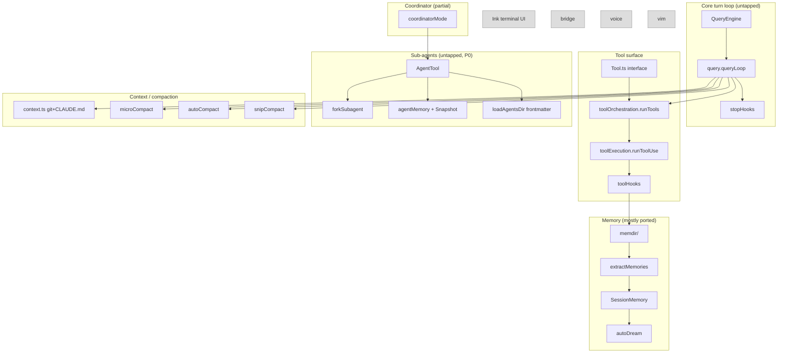

# Claude Code (TypeScript) Source 深度分析 — for anila-agent 移植 backlog

> **目的**：對照 `anila-agent/templete/claude-code-src/` 的 TypeScript source（Anthropic 官方 Claude Code CLI），盤點哪些 design pattern 還沒被 `anila-agent/anila_agent/`（ANILA sub-agent template，Python / openai-agents SDK 為底）移植進來，列出可以借鑑的部分、估工作量、給出 Python port 草案。
>
> **本文不寫程式碼**，純 read + 分析 + 建議；實際 implementation 由後續 PR 處理。

**閱讀順序建議**：先看 §1 簡介、§2 架構俯瞰拿全貌；§4 是報告主體，按 P0 / P1 / P2 排序，每一項可獨立讀。

---

## 1. Claude Code 簡介

### 1.1 它是什麼

Claude Code 是 Anthropic 官方推出的 **AI coding assistant CLI**。User 在 terminal 跑 `claude`，它打開 REPL，使用者用自然語言交付任務，Claude Code 直接在當前 working directory 操作（讀檔、寫檔、跑 shell、跑 git、開 PR）。它的市場定位類似於 Cursor / GitHub Copilot Workspace，但是 **terminal-first**、**file-system-first**、**Anthropic-first**。

從 `anila-agent/templete/claude-code-src/` 拆下的 TypeScript source 顯示它是個約 **35 MB / 數百檔 / 數十萬行** 的 Node.js / Bun 專案。

### 1.2 技術棧

| 維度 | 技術 |
|---|---|
| Runtime | Node.js / Bun（用 `bun:bundle` 的 `feature()` 做 dead code elimination） |
| 語言 | TypeScript（嚴格模式，zod schema-first） |
| 終端 UI | Ink（React-in-terminal） + Yoga layout |
| LLM SDK | `@anthropic-ai/sdk`（first-party，直打 Messages API） |
| 設定驗證 | zod v4 |
| MCP | `@modelcontextprotocol/sdk`（stdio / sse / streaming-http） |
| 觀測 | 內建 perfetto tracing + 自家 analytics（`tengu_*` event） |
| 套件管理 | npm（內含 vendor 目錄） |

### 1.3 與 anila-agent 的關係

`anila-agent` 是 ANILA 平台的 sub-agent template。它的 **runtime base 是 [openai-agents-python SDK](https://github.com/openai/openai-agents-python)**（Agent + Runner），但是 **harness 工程整套從 Claude Code 移植過來**：

| anila-agent module | 來自 Claude Code 哪裡 | 狀態 |
|---|---|---|
| `memory/store.py`, `memory/long_term.py` | `src/memdir/*.ts`（檔案式 4-type memory taxonomy） | 已完整 port |
| `memory/summarizer.py` | `src/services/extractMemories/*.ts` | 已 port（縮減版） |
| `memory/short_term.py` | 包裝 openai-agents `SQLiteSession`（非 Claude Code） | N/A |
| `core/hooks.py` | `src/types/hooks.ts` + `src/utils/hooks.ts`（6 個 hook 事件） | 已 port（僅 callback flavor，缺 command / prompt / http） |
| `core/events.py` | 自家 EventBus（與 Claude Code 對應較弱） | 新寫 |
| `cli/commands.py`, `cli/app.py` | `src/commands.ts` + `src/commands/*` 的 slash command CLI | 已 port（精簡到 ~10 個 slash command） |
| `tools/base.py` | `src/Tool.ts` 的 metadata（is_read_only / is_destructive / requires_confirmation） | 已 port（僅一小部分屬性） |

> **重點**：架構文件（`docs/agent-framework/anila-agent-framework-architecture.md`）把這層 harness 整理成「Middleware + StateMachine + Memory + Provider + Action」5 個 primitive，但是目前 `anila_agent/` 實作只走完 Memory + Hook + 基本 Tool wrapper 三條線，**還有大量 Claude Code 的成熟 pattern 沒被 port**。本文就是要 enumerate 這些 missing pieces。

---

## 2. 架構俯瞰：`src/` 全圖

下圖是 Claude Code 把一個 turn 拆成的 stage（從 `QueryEngine.ts` + `query.ts` 推導出來）；anila-agent 目前用 openai-agents 的 `Runner.run()` 直接黑箱掉這層：

```
┌────────────────────────────────────────────────────────────────────────────────┐
│ QueryEngine.submitMessage()           (1 instance per conversation, N turns)   │
│                                                                                │
│  ┌─ stage 0: processUserInput (slash command? attachment? memory triggers?)    │
│  ├─ stage 1: build systemPrompt + userContext + systemContext (memoized)       │
│  ├─ stage 2: yield 'system' init message (tools, mcp, model, permissions)      │
│  ├─ stage 3: for-await query(messages, ...) ─────┐                             │
│  │                                                │                             │
│  │   ┌─ query.queryLoop iteration ───────────────┘                             │
│  │   │  ├─ token-budget recovery / context-collapse / snip / microcompact      │
│  │   │  ├─ autocompact (proactive summarization)                               │
│  │   │  ├─ call model → stream content blocks                                  │
│  │   │  ├─ collect tool_use blocks                                             │
│  │   │  ├─ runTools (partition concurrency-safe vs unsafe)                     │
│  │   │  │      ├─ canUseTool (permission check)                                │
│  │   │  │      ├─ PreToolUse hooks                                             │
│  │   │  │      ├─ tool.call() with progress streaming                          │
│  │   │  │      ├─ PostToolUse hooks                                            │
│  │   │  ├─ continue loop OR Stop hooks                                         │
│  │   │  ├─ stop hooks (extractMemories / autoDream / promptSuggestion)         │
│  │   │  └─ if all hooks allow → exit                                           │
│  │   └────────────────────────────────────────────                             │
│  ├─ stage 4: yield 'result' SDK message (with cost / usage / denials)          │
│  └─ stage 5: persist transcript                                                │
└────────────────────────────────────────────────────────────────────────────────┘
```

### 2.1 每個 subdir 一句話 + 移植狀態

| 路徑 | 內容 | LOC | 狀態 | 備註 |
|---|---|---:|---|---|
| `src/QueryEngine.ts` | 單一 class 包整個 conversation lifecycle | 1295 | **untapped** | anila-agent 用 openai-agents Runner，缺等價 class |
| `src/query.ts` | 7-stage turn loop（call model → tool → compact → recovery → stop hook） | 1729 | **untapped** | 主體未 port |
| `src/query/config.ts` | QueryConfig（snapshot env / statsig / session） | 46 | untapped | 小但值得抄 pattern |
| `src/query/deps.ts` | 整個 query loop 的依賴注入 hook（callModel / microcompact / autocompact） | 40 | **untapped** | test-friendly 模式 |
| `src/query/stopHooks.ts` | stop hook executor（含 prevent-continuation） | 473 | **partial** | anila summarizer 是 stop 觸發,但缺 prevent-continuation 機制 |
| `src/query/tokenBudget.ts` | +500k token budget continuation tracker | 93 | **untapped** | 小、純函式，極易 port |
| `src/Tool.ts` | Tool interface（30+ 屬性） | 792 | **partial** | anila tools/base.py 只 port 了 3 屬性 |
| `src/Task.ts` | Background task abstraction | 125 | untapped | sub-agent 子系統 |
| `src/tools.ts` | Tool registry / built-in tool list | 389 | untapped | anila 用 openai-agents tool collection |
| `src/tasks.ts` | Task registry | 39 | untapped | |
| `src/commands.ts` | Slash command registry（~80 commands） | 754 | **partial** | anila cli/commands.py 是縮減版 |
| `src/context.ts` | git status / CLAUDE.md / 日期 → systemContext / userContext | 189 | **untapped** | anila 沒有對應的 system-context layer |
| `src/cost-tracker.ts` | totalCost / modelUsage（per session） | 323 | untapped | openai-agents 有 usage 但無 cost |
| `src/history.ts` | 訊息歷史管理 | 464 | untapped | openai-agents 的 Session 涵蓋了一部分 |
| `src/Tool.ts` (ToolUseContext) | turn-scoped state container（abortController, fileStateCache, agentId, queryTracking, etc.） | — | **untapped** | 核心，下面 §4 詳述 |
| `src/memdir/` | 4-type memory taxonomy + scan + LLM-driven recall | 1888 | **已 port** | anila memory/store.py + long_term.py 對齊 |
| `src/coordinator/coordinatorMode.ts` | XML notification + 多 worker 委派 | 369 | **partial** | anila 沒有對應的 coordinator-mode 整套提示 |
| `src/services/compact/` | microcompact / autoCompact / snip / sessionMemoryCompact | ~4500 | **partial** | anila summarizer 只覆蓋了 extractMemories,不含 mid-turn compaction |
| `src/services/extractMemories/` | side-LLM 抽取記憶 | 769 | **已 port** | anila memory/summarizer.py |
| `src/services/SessionMemory/` | 背景 forked subagent 維護 session note | 1026 | untapped | 與 extractMemories 重疊但角度不同 |
| `src/services/autoDream/` | 跨 session 記憶合併 | 550 | **untapped** | 高階記憶整合 |
| `src/services/tools/toolOrchestration.ts` | runTools(concurrency-safe partition + serial fallback) | 188 | **untapped** | 重要 pattern |
| `src/services/tools/toolExecution.ts` | runToolUse（permission / validateInput / call / progress） | 1745 | untapped | |
| `src/services/tools/toolHooks.ts` | per-tool 的 PreToolUse / PostToolUse 串接 | 650 | untapped | |
| `src/services/tools/StreamingToolExecutor.ts` | 串流模式下的 tool dispatch | 530 | untapped | 進階優化 |
| `src/services/policyLimits/` | 組織級政策限制（fetch + cache + poll） | ~300 | untapped | 適合 ANILA platform 多租戶 |
| `src/services/mcp/` | 完整 MCP client + manager + oauth | ~3000 | untapped | openai-agents 內建 MCP，重疊 |
| `src/services/api/withRetry.ts` 等 | retry / fallback model / rate limit | ~600 | untapped | |
| `src/services/AgentSummary/` | sub-agent 完成後的摘要產生 | — | untapped | |
| `src/tools/AgentTool/` | sub-agent dispatch、frontmatter agent loader、fork prompt cache | 6072 | **untapped** | **核心借鑑點**,下面 §4.1 詳述 |
| `src/tools/BashTool/bashSecurity.ts` + `bashPermissions.ts` | command injection 防護 + permission rule grammar | 5213 | untapped | 純 TS 巨大,Python port 工作量高 |
| `src/tools/SkillTool/` | frontmatter markdown → callable skill | 1350 | untapped | architecture v0.2 已標記為 follow-up |
| `src/tools/ToolSearchTool/` | deferred tool lazy-load（system-reminder 內 tool list） | 593 | **untapped** | 對長 tool list / MCP 場景極有價值 |
| `src/tools/TaskCreateTool/`, `TaskOutputTool/`, `TaskStopTool/`, `TaskListTool/` | task lifecycle 的工具側介面 | — | untapped | |
| `src/tools/shared/spawnMultiAgent.ts` | 多 sub-agent 並行 dispatch | — | untapped | |
| `src/tools/BashTool/` 各種 validator | sed / pathValidation / readOnlyValidation / sandbox | ~5000 | untapped | bash 專屬，anila 不一定需要 |
| `src/skills/loadSkillsDir.ts` | YAML frontmatter → Skill / Command 物件 | 1086 | untapped | |
| `src/hooks/` | React hooks (`useXxx.ts`)，**全部是 terminal UI 概念** | — | **不該 port** | |
| `src/ink/`, `src/components/`, `src/screens/`, `src/voice/`, `src/keybindings/`, `src/buddy/`, `src/vim/`, `src/main.tsx`, `src/native-ts/yoga-layout/` | Terminal UI + voice + Vim | — | **不該 port** | anila 服務化用途不合 |
| `src/bridge/` | claude-in-chrome 跨進程 bridge | ~30 檔 | **不該 port** | Claude Code 專屬 |
| `src/assistant/sessionHistory.ts` | KAIROS 模式的 session history | — | 不該 port | feature-gated 實驗線 |
| `src/bootstrap/state.ts` | global runtime state（projectRoot, sessionId, remoteMode...） | — | partial | anila 用 ENV 變數覆蓋 |
| `src/native-ts/file-index/` | 純 TS 的 nucleo 風 fuzzy file index | 370 | **untapped** | 對 ANILA workspace 工具有用 |
| `src/native-ts/color-diff/` | 顏色差 | — | 不該 port | UI 用 |
| `src/plugins/builtinPlugins.ts` | 內建 plugin 註冊 | — | partial | anila 沒有 plugin 概念 |
| `src/server/` | direct connect / 內嵌 server | — | 不該 port | |
| `src/state/` | AppState（client-side React state store） | — | 不該 port | 純 UI |
| `src/upstreamproxy/` | API key / OAuth | — | 不該 port | |
| `src/remote/` | remote session | — | partial | 與 ANILA platform 的 SSE-mode 相關但介面不同 |
| `src/types/` | 共用 type | — | n/a | TypeScript 結構，不直接對應 |
| `src/schemas/hooks.ts` | hook 設定 zod schema | 222 | untapped | command / prompt / http 三種 hook flavor |
| `src/constants/` | 各種常數（XML tag、油 prompt、tool name） | — | partial | anila 對應 prompts 是 markdown |
| `src/services/notifier.ts` 等 | terminal 通知 / 系統匣 | — | 不該 port | |

### 2.2 一張 mermaid 依賴圖

下圖標出主要 module 的依賴關係（節點是要 port 的；灰色是不該 port 的）：



---

## 3. anila-agent 已 port 的 pattern audit

直接對照 `anila_agent/` 跟 Claude Code source。下表把目前 anila Python 程式碼跟對應的 TS source 一條條盤點。

| anila 模組 (Python) | Claude Code 來源 (TS) | port 完成度 | 缺什麼 |
|---|---|---|---|
| `memory/store.py` (`MemdirStore`) | `src/memdir/memdir.ts` + `paths.ts` + `memoryScan.ts` + `memoryTypes.ts` | **~80%** | 缺 `findRelevantMemories.ts` 的 LLM-driven re-rank、缺 `memoryAge.ts`（age decay）、缺 `teamMemPaths.ts`（team-shared memory） |
| `memory/long_term.py` (`LongTermMemory`) | `src/memdir/findRelevantMemories.ts` | **~70%** | LLM recall 邏輯已 port，但 manifest 截斷規則簡化、沒 team memory namespace |
| `memory/summarizer.py` | `src/services/extractMemories/extractMemories.ts` + `prompts.ts` | **~60%** | 沒有 forked agent cache-safe params；沒接 autoDream（跨 session 合併） |
| `memory/short_term.py` | openai-agents `SQLiteSession` | n/a | 與 Claude Code 無對應 |
| `core/hooks.py` (`HookRegistry`, `HookSpec`, `HookEvent`) | `src/types/hooks.ts` + `src/utils/hooks.ts` + `src/schemas/hooks.ts` | **~40%** | 只 port callback hook;**完全沒 port command / prompt / http 三種 hook flavor**；沒 prevent-continuation；沒 hook progress emit；沒 SubagentStart / TaskCompleted / FileChanged / CwdChanged / PermissionDenied 等事件 |
| `core/runner.py` (`AnilaRunner`) | （沒對應）openai-agents `Runner` | **新寫** | 缺 abort 路徑的 fine-grained reason；缺 task budget；缺 token budget continuation |
| `core/events.py` (`EventBus`) | （沒對應）自家 pub/sub | 新寫 | Claude Code 用 React state + RxJS 風 effect 取代 |
| `core/agent.py` (`build_agent`, `AssembledAgent`) | `src/QueryEngine.ts` constructor + `src/tools/AgentTool/loadAgentsDir.ts` | **~30%** | 沒有 frontmatter agent 載入；沒有 builtin agent / custom agent / plugin agent 三類 |
| `tools/base.py` (`anila_tool`, `ToolMetadata`) | `src/Tool.ts` 的 Tool interface | **~10%** | 只 port is_read_only / is_destructive / requires_confirmation / category；缺 isConcurrencySafe / shouldDefer / alwaysLoad / maxResultSizeChars / searchHint / isSearchOrReadCommand / validateInput / preparePermissionMatcher / backfillObservableInput / getActivityDescription / toAutoClassifierInput …… 約 30 個屬性 |
| `tools/registry.py` | `src/tools.ts` 的 tool registry | **~30%** | 只做 import + collection，沒 isEnabled gate、沒 alias、沒 deferred-tool 名單 |
| `tools/rag_tools.py`, `tools/filesystem_tools.py` | （anila 自家） | n/a | 與 Claude Code 工具集無對應 |
| `cli/commands.py`, `cli/app.py`, `cli/renderer.py` | `src/commands.ts` + `src/commands/*` | **~15%** | 只 port `/help` `/clear` `/memory` `/model` `/cost` `/exit` 等 6-7 個；Claude Code 有 ~80 個 slash command |
| `models/openai_compatible.py` | （沒對應，Claude Code 直打 Anthropic） | n/a | |
| `retrieval/*` | （沒對應） | n/a | |

### 3.1 從上表可以看到的 gap pattern

1. **Hook surface 只 port 了 callback flavor** — 完全沒 port command / prompt / http hook（shell script、LLM prompt、HTTP endpoint 三種）。這是 Claude Code 給 ops / SRE 用的核心擴展點。
2. **Tool interface 太瘦** — anila 的 `ToolMetadata` 只有 4 個欄位，Claude Code 的 `Tool` interface 有 30+ 個屬性，其中 `isConcurrencySafe` / `shouldDefer` / `validateInput` / `preparePermissionMatcher` 都是 production-grade tool 系統需要的。
3. **Turn loop 黑箱** — anila 透過 openai-agents `Runner.run()` 跑 tool loop,沒有對應 `QueryEngine` / `query.queryLoop` 的 stage 抽象,這讓 token budget、context compaction、stop hook 等 inter-turn 機制無處插入。
4. **沒 sub-agent dispatch 機制** — Claude Code 的 `AgentTool` + `forkSubagent` 提供 frontmatter agent 載入、prompt-cache-safe fork、worker-coordinator 兩段對話,anila 完全沒有對應物件。
5. **Slash command registry 縮太多** — 大部分 ops command（`/cost`、`/compact`、`/resume`、`/share`、`/init`、`/review`、`/security-review`、`/skills`、`/agents`、`/tasks`）都沒有 port。

---

## 4. 新發現的可借鑑 pattern（報告主體）

每條 finding 給：
- **來源檔 + 函式 / 類別 + 行號**（方便回查）
- **TS 介面 / 概念**
- **對 anila-agent 的價值**
- **Python port 概念草案**
- **預估工作量 + 優先級**

### 4.1 [P0] AgentTool：sub-agent dispatch + 4 種 agent 來源 + frontmatter loader

**來源**：
- `src/tools/AgentTool/AgentTool.tsx`（1397 LOC）— 主 Tool 註冊
- `src/tools/AgentTool/loadAgentsDir.ts:73-130`（`AgentJsonSchema`, `BaseAgentDefinition`）
- `src/tools/AgentTool/runAgent.ts:248`（`runAgent` async generator）
- `src/tools/AgentTool/builtInAgents.ts`（72 LOC）— 內建 worker / explore / plan 等
- `src/tools/AgentTool/agentToolUtils.ts:686`（`resolveAgentTools`）

**TS 概念**：

```ts
// loadAgentsDir.ts:106-133
export type BaseAgentDefinition = {
  agentType: string
  whenToUse: string                      // 給主 agent 看的 description
  tools?: string[]                       // 白名單；'*' = 繼承父 tool pool
  disallowedTools?: string[]
  skills?: string[]                      // 預載的 skill
  mcpServers?: AgentMcpServerSpec[]      // 子 agent 專屬 MCP server
  hooks?: HooksSettings                  // session-scoped hook
  model?: string                         // 'inherit' = 沿用父 model
  effort?: EffortValue                   // low/medium/high/max
  permissionMode?: PermissionMode        // default/acceptEdits/bypassPermissions/plan
  maxTurns?: number
  background?: boolean                   // 在背景 task 跑（不阻塞主對話）
  memory?: 'user' | 'project' | 'local'  // 持久記憶 scope
  isolation?: 'worktree' | 'remote'      // git worktree 隔離 / remote runner
  criticalSystemReminder_EXPERIMENTAL?: string  // 每輪重新注入
  omitClaudeMd?: boolean                 // 跳過 CLAUDE.md
}
```

4 種來源：
1. **BuiltInAgentDefinition** — 寫死在程式碼裡（worker / explore / plan / sub-coordinator）
2. **CustomAgentDefinition** — 從 `.claude/agents/*.md` 讀 YAML frontmatter + body
3. **PluginAgentDefinition** — 從 plugin marketplace 載入
4. **FORK_AGENT**（`forkSubagent.ts:60`）— 隱式 fork，繼承父 conversation 完整 context，prompt cache 100% 命中

**Spawn 流程**（`runAgent.ts:248-866`）：
1. `initializeAgentMcpServers` — 連子 agent 專屬 MCP server
2. `getAgentSystemPrompt` — 用 frontmatter 的 prompt + 父 CLAUDE.md（除非 `omitClaudeMd`）
3. `resolveAgentTools` — 套用 tools / disallowedTools 白黑名單
4. `createSubagentContext` — 建立隔離的 `ToolUseContext`（自己的 abortController, fileStateCache, agentId）
5. 呼叫 `query(...)` 跑一個獨立 turn loop
6. 收集 final output → 包成 `<task-notification>` XML 給父 agent
7. cleanup：disconnect MCP / unregister perfetto trace / clean sidechain transcript

**為什麼對 anila-agent 有價值**：

- ANILA 平台 v0.2 路線圖（架構文件 §4 / 6）明確要把 **multi-agent handoff / coordinator** 推上來;Claude Code 這套是業界目前最完整的 reference,**直接抄抄這個 design 比自己重新想 cheap 很多**。
- frontmatter agent loader 讓使用者可以在 `.anila/agents/foo-bot.md` 寫一個 sub-agent,不用改 Python code 就能擴充。這跟 ANILA platform 「download template 改一改部署」的 UX 完全契合。
- isolation = worktree 機制讓 sub-agent 可以在 git worktree 跑（不污染主 working dir）— 對 CSP 平台的「workspace 隔離」需求對齊。

**Python port 概念草案**：

```
anila_agent/agents/                        ★ 新建 module
├── __init__.py
├── definition.py        AgentDefinition (dataclass, frontmatter shape)
├── loader.py            scan .anila/agents/, parse YAML frontmatter
├── builtin.py           WORKER_AGENT / EXPLORE_AGENT 等內建定義
├── fork.py              forkSubagent 對應 (繼承父 context)
├── tools_resolver.py    白名單 / 黑名單 / '*' 繼承
├── memory.py            persistent agent memory (user/project/local scope)
└── runner.py            spawn_subagent() → openai-agents Runner with bounded scope

anila_agent/tools/
└── agent_tool.py        @anila_tool 包成 callable;呼叫 spawn_subagent
```

並擴充 `core/agent.py`：`build_agent()` 接受 `parent_agent_id`,讓 sub-agent 知道自己是 fork 出來的。

**工作量**：**2-3d**（不含 worktree isolation / persistent agent memory snapshot；那些另算 1d each）
**優先級**：**P0**（與 v0.2 handoff 路線圖直接相關,且 unblock 後續多項 feature）

---

### 4.2 [P0] forkSubagent：byte-identical prompt cache prefix

**來源**：`src/tools/AgentTool/forkSubagent.ts:107-169`（`buildForkedMessages`）

**TS 概念**：

```ts
// forkSubagent.ts:96-105 — for prompt cache sharing, all fork children must
// produce byte-identical API request prefixes.
//
//   buildForkedMessages(directive, assistantMessage):
//     1. Keep the full parent assistant message
//        (all tool_use blocks, thinking, text) — exactly as-is
//     2. Build ONE user message with tool_results for every tool_use:
//        - All tool_results use IDENTICAL placeholder text
//          "Fork started — processing in background"
//        - Append a per-child directive as the final text block
//
//   Result: [...history, assistant(all_tool_uses), user(placeholder_results..., directive)]
//   → Only the final text block differs per child → maximum cache hits
```

並用 `<fork-subagent-boilerplate>` XML tag 標記 fork child 的指示框（`buildChildMessage`,L171）,讓 child agent 知道：
- 你不是 main agent
- 不要再 spawn sub-agent（防止遞迴 fork）
- 用 tools 直接做事,不要 chit-chat
- 修改檔案後 commit 並回報 hash
- Output 用結構化標籤（`Scope:`, `Result:`, `Key files:`, `Files changed:`, `Issues:`）

**為什麼對 anila-agent 有價值**：

- ANILA 上 vLLM gemma4 跑 long-context（KV cache 是長 context 的 selling point;memory note 已標記不要縮 max-model-len）。**Prompt cache 是長 context 部署的關鍵成本控制**,fork 多 sub-agent 時如果不做 byte-identical prefix,每個 worker 都要 re-prefill 一遍,GPU 時間爆炸。
- LiteLLM 過 vLLM 也支援 prompt cache(`extra_body={"cache_control": ...}`);這個 pattern 直接 mapping。
- structured `<fork-subagent-boilerplate>` 的 child prompt 是非常成熟的 anti-pattern 防護（防 child agent 變成 conversational mode）。

**Python port 概念草案**：

```
anila_agent/agents/fork.py
├── FORK_BOILERPLATE_TAG = "fork-subagent-boilerplate"
├── FORK_PLACEHOLDER_RESULT = "Fork started — processing in background"
├── build_forked_messages(directive, parent_assistant_msg) -> list[Message]
├── build_child_message(directive) -> str  # the boilerplate prompt
└── is_in_fork_child(messages) -> bool     # 防遞迴 fork
```

並在 model layer（`models/openai_compatible.py`）加 prompt-cache 標記:在 fork 的 message list 上 set `cache_control={'type': 'ephemeral'}` 給最後一個 cacheable boundary。

**工作量**：**1d**（純資料結構操作 + boilerplate prompt 翻譯）
**優先級**：**P0**（與 4.1 配對,沒這個 fork 的成本不可控）

---

### 4.3 [P0] runTools concurrency partition（read-only 並行 / write 串行）

**來源**：`src/services/tools/toolOrchestration.ts:19-116`（`runTools` + `partitionToolCalls`）

**TS 概念**：

```ts
// toolOrchestration.ts:8-11
function getMaxToolUseConcurrency(): number {
  return parseInt(process.env.CLAUDE_CODE_MAX_TOOL_USE_CONCURRENCY || '', 10) || 10
}

// L91-116 — partition tool calls into batches:
//   1. A single non-read-only tool, OR
//   2. Multiple consecutive read-only tools (concurrency-safe)
//
// Read-only batches run via runToolsConcurrently
// Write batches run via runToolsSerially
// — within a batch, queued contextModifiers are applied after the whole batch
//   (so concurrent reads don't see each other's context updates)
```

關鍵 invariant：tool 的 `isConcurrencySafe(input)` 是 input-aware,例如 `Bash(rm)` 不安全但 `Bash(ls)` 安全（從 `tools/BashTool/commandSemantics.ts` 判斷）。

**為什麼對 anila-agent 有價值**：

- openai-agents 的 `Runner` 預設 tool 是 serial dispatch。對 RAG / multi-source retrieval 場景,LLM 一次 emit 3 個 `search_documents` call,serial 跑就是 3× latency。
- anila 已經有 `is_read_only` metadata,但是沒人在用。把它接到 tool dispatch 階段就立刻有 throughput 收益。
- ANILA platform 的 vLLM endpoint 上,parallel tool call 是直接的延遲改進（vLLM batched inference)。

**Python port 概念草案**：

```python
# anila_agent/core/runner.py 或新建 anila_agent/tools/orchestrator.py

async def run_tools(
    tool_calls: list[ToolCall],
    context: RunContext,
    *,
    max_concurrency: int = 10,
) -> AsyncIterator[ToolResult]:
    """Partition by is_read_only; read-only run via asyncio.gather, others serial."""
    for batch_is_safe, batch in _partition(tool_calls, context):
        if batch_is_safe:
            results = await asyncio.gather(*[_run_one(t, context) for t in batch])
            for r in results:
                yield r
        else:
            for t in batch:
                yield await _run_one(t, context)
```

由於 openai-agents 的 `Runner.run()` 已經內建 tool dispatch,要做這件事需要：
- (A) 在 openai-agents 上層 wrap 一個 `AnilaRunner` 攔截 tool_use(現在 runner.py 已經有雛形,擴充就好);或
- (B) 提交 patch / 用 openai-agents 的 `tool_use_behavior` 客製 hook(較困難）

**工作量**：**2d**（含 unit test 對 `is_read_only` true/false 混合排列的 partition 正確性）
**優先級**：**P0**(throughput improvement 立竿見影,不需要等 v0.2 架構大改）

---

### 4.4 [P0] Hook flavor 擴充：command / prompt / http

**來源**：`src/schemas/hooks.ts:31-150`（`BashCommandHookSchema`, `PromptHookSchema`, `HttpHookSchema`）

**TS 概念**：

Claude Code 的 hook 有 **5 種 flavor**:
1. **command**(shell script,stdin 收 JSON event,stdout 出 JSON decision)— anila **未 port**
2. **prompt**(LLM 評估,`$ARGUMENTS` 代入 event JSON,可指定不同 model)— anila **未 port**
3. **http**(POST 到 URL,headers 可 env var 內插)— anila **未 port**
4. **agent**(以另一個 sub-agent 評估)— anila **未 port**
5. **callback**(in-process function)— anila **已 port**

每種 hook 都有 `if`(permission rule 文法的 matcher,如 `"Bash(git *)"` 只在 Bash 跑 git 時觸發)、`timeout`、`once`、`async`、`asyncRewake`(背景跑、退出碼 2 喚醒模型）等屬性。

**為什麼對 anila-agent 有價值**：

- **command hook** 讓 SRE 不用改 Python 就能掛 audit log、PII 過濾、bandit 安檢、git secrets 檢查 — anila 在企業部署時這個需求非常剛需。
- **http hook** 讓 anila 可以串外部 SIEM / DLP 系統,做 enterprise-grade 安全合規。
- **prompt hook** 是 self-judging pattern 的核心 — 例如「tool 跑完後用小模型評估 tool output 有沒有洩漏 PII」。
- 三者都已經是 production-tested 的契約,anila 直接抄 schema 就能對齊 Claude Code 的 hook ecosystem(那些寫好的 hook script 可以共用)。

**Python port 概念草案**：

```python
# anila_agent/core/hooks.py 擴充

class HookFlavor(str, Enum):
    CALLBACK = "callback"
    COMMAND  = "command"   # shell command via subprocess
    PROMPT   = "prompt"    # LLM evaluation via side model
    HTTP     = "http"      # POST to URL

@dataclass(frozen=True)
class CommandHookSpec(HookSpec):
    flavor: HookFlavor = HookFlavor.COMMAND
    command: str
    shell: Literal["bash", "powershell"] = "bash"
    timeout_sec: int = 30
    if_pattern: str | None = None  # permission rule grammar

@dataclass(frozen=True)
class PromptHookSpec(HookSpec):
    flavor: HookFlavor = HookFlavor.PROMPT
    prompt_template: str             # 含 $ARGUMENTS
    model: str | None = None         # None → default small model

@dataclass(frozen=True)
class HttpHookSpec(HookSpec):
    flavor: HookFlavor = HookFlavor.HTTP
    url: str
    timeout_sec: int = 30
    headers: dict[str, str] = field(default_factory=dict)
    allowed_env_vars: list[str] = field(default_factory=list)
```

並在 `configs/tools.yaml` 擴充 hook DSL:

```yaml
hooks:
  pre_tool_use:
    - type: command
      matcher: "Bash(rm.*)"
      command: /opt/anila/scripts/audit_rm.sh
      timeout: 5
    - type: prompt
      matcher: "search_documents"
      prompt: "Is this query asking for PII? $ARGUMENTS. Answer YES/NO."
      model: gpt-4o-mini
```

**工作量**：**3d**（含 3 種 flavor 的 executor + permission rule grammar parser「Bash(git *)」+ 整合測試)
**優先級**：**P0**(企業部署的硬需求,沒這個 ANILA 內部安全合規無法過關)

---

### 4.5 [P0] ToolUseContext：turn-scoped state container

**來源**：`src/Tool.ts:158-306`（`ToolUseContext` type）

**TS 概念**：

```ts
export type ToolUseContext = {
  abortController: AbortController              // 取消整個 turn
  agentId?: AgentId                              // 區分 main vs sub-agent
  agentType?: string
  appendSystemMessage?: (m: SystemMessage) => void
  contentReplacementState?: ContentReplacementState  // tool result 大小管理
  fileStateCache: FileStateCache                 // 哪些檔案被 Read 過 / 內容 hash
  fileHistoryMakeSnapshot?: (uuid: UUID) => void
  getAppState: () => AppState
  messages: Message[]                            // 當前 turn 的可見 history
  options: {
    tools: Tools
    mainLoopModel: ModelAlias
    thinkingConfig: ThinkingConfig
    mcpClients: MCPServerConnection[]
    agentDefinitions: { activeAgents, allAgents, allowedAgentTypes? }
    isNonInteractiveSession: boolean
    customSystemPrompt?: string
    appendSystemPrompt?: string
    maxBudgetUsd?: number
    theme: Theme
  }
  queryTracking?: QueryChainTracking             // chainId + depth(for tracing)
  readFileState: FileStateCache
  renderedSystemPrompt?: SystemPrompt            // byte-exact for prompt cache
  setAppState: (f: (prev) => AppState) => void
  setInProgressToolUseIDs: ...
  setResponseLength: ...
  setSDKStatus?: (status: SDKStatus) => void
  thinkingConfig?: ThinkingConfig
  updateAttributionState: ...
  updateFileHistoryState: ...
  handleElicitation?: ...                        // MCP -32042 elicitation
  addNotification?: (n: Notification) => void
}
```

這個 context 物件貫穿一個 turn 的所有 tool call,**每個 tool 都拿到同一份**,可以讀寫,但同一個 batch 內 concurrent tool 看到的是 batch-start 的 snapshot(下面 §4.3 partition 的 invariant 來源)。

**為什麼對 anila-agent 有價值**：

- 目前 anila 沒有對應物件,每個 tool 只透過 `function_tool` 拿到 `RunContextWrapper`(openai-agents 提供);裡面只有 user-supplied context,沒有 abortController / fileStateCache / 子 agent ID。
- **沒有 fileStateCache** 表示 Read 一個檔再 Read 同一個檔,LLM 看到的 token 是兩倍 — 對長對話成本很可怕。Claude Code 用這個 cache 做 stale detection:Read → Edit,Edit 前比對 cache,不一致時警告。
- **沒有 queryTracking(chainId + depth)** 表示沒有 trace 多輪 sub-agent 的能力,後面 ANILA tracing 上線會卡。

**Python port 概念草案**：

```python
# anila_agent/core/context.py  (新建)

@dataclass
class AnilaToolContext:
    """Turn-scoped state. Passed to every tool callback. Mutable."""
    abort_event: asyncio.Event
    agent_id: str | None
    agent_type: str | None
    session_id: str
    messages: list[Message]
    file_state_cache: FileStateCache   # path → (mtime, content_hash, last_read)
    query_chain: QueryChain | None     # chain_id + depth
    options: AnilaToolOptions
    add_notification: Callable[[Notification], None] | None
    append_system_message: Callable[[SystemMessage], None] | None
    rendered_system_prompt: str | None   # byte-exact for prompt cache
    cost_accumulator: CostAccumulator

@dataclass
class FileStateCache:
    """{path: FileState}"""
    _entries: dict[Path, FileState]
    def mark_read(self, path: Path, content: bytes) -> None: ...
    def get(self, path: Path) -> FileState | None: ...
    def is_stale(self, path: Path) -> bool: ...
```

並擴充 `core/runner.py` 在 `run()` 開頭建立 context,以 contextvars / RunContextWrapper 傳遞給每個 tool。

**工作量**：**2d**(`AnilaToolContext` 主體 1d + FileStateCache 1d)
**優先級**：**P0**(後續 4.6 / 4.7 / 4.9 都依賴這個 context 的存在）

---

### 4.6 [P1] Token budget + diminishing returns continuation

**來源**：`src/query/tokenBudget.ts`（93 LOC，極小）

**TS 概念**：

```ts
// query/tokenBudget.ts:14-42
const COMPLETION_THRESHOLD = 0.9
const DIMINISHING_THRESHOLD = 500

export function checkTokenBudget(
  tracker, agentId, budget, globalTurnTokens
): TokenBudgetDecision {
  const pct = Math.round((turnTokens / budget) * 100)
  const deltaSinceLastCheck = globalTurnTokens - tracker.lastGlobalTurnTokens

  const isDiminishing =
    tracker.continuationCount >= 3 &&
    deltaSinceLastCheck < DIMINISHING_THRESHOLD &&
    tracker.lastDeltaTokens < DIMINISHING_THRESHOLD

  if (!isDiminishing && turnTokens < budget * 0.9) {
    // 還沒花完 budget 且還有顯著進度 → 注入「請繼續」的 user message,再跑一輪
    return { action: 'continue', nudgeMessage: getBudgetContinuationMessage(...) }
  }
  // 否則 stop
}
```

簡單但聰明:跑到 budget 90% 或 連續 3 輪 delta < 500 tokens 就停。這個機制讓 LLM 在「我大概做完了」跟「還有 5% budget 可以挑骨頭」之間自動收斂。

**為什麼對 anila-agent 有價值**：

- vLLM gemma4 在 ANILA 上是 long-context、低速 model（H100 4 張並列）。**「跑到底」與「適時收手」的決策對 cost / latency 都關鍵**。
- 這份 90 LOC 對應 Python 約 60 LOC,**移植幾乎零成本**,但能加一個 `agent.yaml: token_budget: 50000` 的好用設定。

**Python port 概念草案**：

```python
# anila_agent/core/budget.py  (新建)

@dataclass
class BudgetTracker:
    continuation_count: int = 0
    last_delta_tokens: int = 0
    last_global_turn_tokens: int = 0
    started_at: float = field(default_factory=time.time)

def check_token_budget(
    tracker: BudgetTracker, budget: int | None, current_tokens: int
) -> BudgetDecision: ...
```

接到 `AnilaRunner.run()` 的每輪 callback;當 decision = continue,push 一個 `user` 訊息「Budget 剩 X%，繼續未完事項。」到 session。

**工作量**：**0.5d**(純函式 port + 一個 runner 整合測試)
**優先級**：**P1**(nice-to-have throughput improvement,沒它也能跑)

---

### 4.7 [P1] systemContext / userContext 兩段式 system prompt 組裝

**來源**：`src/context.ts:113-189`(`getSystemContext`, `getUserContext`)

**TS 概念**：

system prompt 不是一個 string,是 **三段拼接**:

1. **defaultSystemPrompt**(或 `customSystemPrompt`)— 一次性、 cacheable
2. **systemContext** — `{ gitStatus, cacheBreaker }`,memoized 整個對話
   - `getGitStatus()` 跑一次 `git status --short` + `git log -n 5` + `git config user.name`,fail open
3. **userContext** — `{ claudeMd, currentDate }`
   - `claudeMd` 是 cwd walk + 父層 CLAUDE.md 拼成
4. **prependUserContext / appendSystemContext**(`utils/api.ts`)— turn 開始時把 systemContext 接到 system prompt 尾、userContext 接到第一個 user message 前

這設計的好處是:**static system prompt 部分 byte-identical → prompt cache hit;動態部分(git status、日期)放在 systemContext,在 cache boundary 之外,改變不會 invalidate 前段。**

**為什麼對 anila-agent 有價值**：

- anila 目前 system prompt 是一整段 markdown(`prompts/system.md`)。**沒有區分 static vs dynamic,vLLM 的 prompt cache 命中率會很差**(每次 currentDate 變動就整段 invalidate)。
- ANILA RAG 場景,把「retrieval result preview」放 userContext、「ingestion collection metadata」放 systemContext,可以 prompt cache 玩到很細。

**Python port 概念草案**：

```python
# anila_agent/core/context_assembly.py  (新建)

@functools.lru_cache(maxsize=1)
def get_system_context() -> dict[str, str]:
    """Memoized per process. Snapshot of git / cache-breaker / env."""
    return {
        "gitStatus": _git_status_oneshot(),
        # 其他動態項
    }

def get_user_context(memdir_index: str | None = None) -> dict[str, str]:
    return {
        "anilaMd": _load_anila_md(cwd()),  # ANILA.md (專案自己決定 filename)
        "currentDate": today_iso(),
        **({"memdirIndex": memdir_index} if memdir_index else {}),
    }

def assemble_system_prompt(
    base: str,                 # prompts/system.md
    system_context: dict[str, str],
) -> str: ...   # 把 system_context 用 <XXX>...</XXX> 包起來接到尾

def prepend_user_context(
    messages: list[Message],
    user_context: dict[str, str],
) -> list[Message]: ...   # 把 user_context 接到第一個 user message 前
```

對齊 LiteLLM 的 prompt cache:在 base + system_context 之間插 cache_control marker。

**工作量**：**1d**(含 git status memoization + ANILA.md cwd walk + cache marker 插入)
**優先級**：**P1**(prompt cache 命中率改善,不過要等 vLLM cache 真的開了再測)

---

### 4.8 [P1] Tool interface 擴充屬性

**來源**：`src/Tool.ts:362-700`(`Tool<Input, Output, P>` 完整介面)

**TS 概念** — 目前 anila 的 `ToolMetadata` 只覆蓋 ~4 個 屬性。Claude Code 的 `Tool` 有 30+:

| TS 屬性 | 作用 | anila 是否 port | 建議 P |
|---|---|---|---|
| `isConcurrencySafe(input)` | 同批可並行 | 否 | P0(已在 §4.3) |
| `isReadOnly(input)` | 讀寫旗標 | 部分(static bool;TS 是 input-aware) | P0 |
| `isDestructive(input)` | 不可逆 | 部分 | P0 |
| `isOpenWorld(input)` | 是否需要網路 | 否 | P1 |
| `shouldDefer` | 是否要靠 ToolSearch 動態載入 | 否 | P1(見 §4.9) |
| `alwaysLoad` | 強制在 turn 1 prompt 內 | 否 | P1 |
| `maxResultSizeChars` | tool result 超過就存檔 | 否 | P1 |
| `searchHint` | ToolSearch 關鍵字輔助 | 否 | P1 |
| `isSearchOrReadCommand(input)` | UI 折疊用 | 否 | P2 |
| `interruptBehavior()` | user 中斷時 cancel/block | 否 | P2 |
| `validateInput(input, ctx)` | 跑 tool 前的 input 驗證(早於 permission) | 否 | P1 |
| `checkPermissions(input, ctx)` | 動態 permission | 否(canUseTool 包外面) | P1 |
| `preparePermissionMatcher(input)` | 把 permission rule pattern 轉成 closure(cache) | 否 | P2 |
| `backfillObservableInput(input)` | tool_use 寫入 transcript 前 mutate(legacy fields)| 否 | P2 |
| `getPath(input)` | tool 操作的檔案路徑(file history 用) | 否 | P2 |
| `getActivityDescription(input)` | UI spinner 「Reading src/foo.ts」 | 否 | P2 |
| `getToolUseSummary(input)` | compact 視圖摘要 | 否 | P2 |
| `toAutoClassifierInput(input)` | 給 yolo 模式安全分類器看的縮版 | 否 | P2 |
| `requiresUserInteraction()` | 是否會跳出 ASK | 否 | P2(架構文件決定不做 ASK) |
| `isMcp` / `isLsp` | tool 來源旗標 | 否 | P1 |
| `mcpInfo` | MCP server/tool 名 | 否 | P1 |
| `strict` | API tool strict mode | 否 | P2 |
| `aliases` | tool 重命名向後相容 | 否 | P2 |
| `inputJSONSchema` | MCP tool 直接給 JSON schema | 否 | P1 |
| `outputSchema` | 結構化 output 驗證 | 否 | P1 |
| `inputsEquivalent(a, b)` | tool dedup 用 | 否 | P2 |
| `renderToolResultMessage` | UI render | n/a | 不該 port(UI) |
| `userFacingName(input)` / `userFacingNameBackgroundColor(input)` | UI | n/a | 不該 port |

**為什麼對 anila-agent 有價值**：

- 缺 `isConcurrencySafe` → 沒 §4.3 的 throughput 收益。
- 缺 `validateInput` → 所有 input 驗證得進 hook,難維護。
- 缺 `maxResultSizeChars` + `getPath` → tool result 一爆就 LLM context 爆,沒有自動存檔 fallback。
- 缺 `shouldDefer` → 一上來 MCP 100 個 tool 全部塞進 prompt(下面 §4.9 處理)。

**Python port 概念草案**：

擴充 `anila_agent/tools/base.py`:

```python
@dataclass(frozen=True)
class ToolMetadata:
    # 既有
    is_read_only: bool = False
    is_destructive: bool = False
    requires_confirmation: bool = False
    category: str = "general"
    # 新增 P0/P1
    is_concurrency_safe: bool | Callable[[dict], bool] = False
    is_open_world: bool = False
    should_defer: bool = False
    always_load: bool = False
    max_result_size_chars: int = 10_000
    search_hint: str | None = None       # ToolSearch 用
    validate_input: Callable[[dict, "AnilaToolContext"], "ValidationResult"] | None = None
    is_mcp: bool = False
    is_lsp: bool = False
    mcp_info: tuple[str, str] | None = None
    input_json_schema: dict | None = None
    output_schema: type | None = None    # pydantic model
```

`@anila_tool(...)` 全部新增對應 keyword 參數。

**工作量**：**1d**(只擴 metadata + decorator + getter,實際使用方在 §4.3 / §4.9 / §4.10 個別 task)
**優先級**：**P0**(底層 metadata 不擴,後面所有 feature 都接不上)

---

### 4.9 [P1] ToolSearch / Deferred tools(MCP 100+ tool 的場景剛需)

**來源**：
- `src/tools/ToolSearchTool/ToolSearchTool.ts`(471 LOC)— Tool 註冊
- `src/tools/ToolSearchTool/prompt.ts:62-108`(`isDeferredTool`)— deferred 規則

**TS 概念**：

```ts
// ToolSearchTool/prompt.ts:62
export function isDeferredTool(tool: Tool): boolean {
  if (tool.alwaysLoad === true) return false              // 強制不 defer
  if (tool.isMcp === true) return true                    // MCP 預設 defer
  if (tool.name === TOOL_SEARCH_TOOL_NAME) return false   // ToolSearch 自己不 defer
  if (FORK_AGENT && tool.name === AGENT_TOOL_NAME && isForkSubagentEnabled()) return false
  return tool.shouldDefer === true
}

// 流程:
// 1. 啟動時把 tool list 分成 visible + deferred 兩半
// 2. visible 的 tool schema 一開始就放進 prompt
// 3. deferred 的只放 tool NAME(不放 schema)在 <system-reminder> 內
// 4. 模型發現要用 deferred tool → 先呼叫 ToolSearch(query="select:Read,Edit")
// 5. ToolSearch 回傳那些 tool 的完整 schema 到 <functions> block
// 6. 接下來那些 tool 才可呼叫
```

對應的 ToolSearch tool 內部:keyword 模糊比對 + `+xxx` 強制要求 substring + `select:` 直接點名。

**為什麼對 anila-agent 有價值**：

- ANILA 平台 RAG 一個 collection 可能有 50+ MCP tools(connector 各種文件系統 / 資料庫 / 第三方 API)。一次塞滿 system prompt 直接吃掉 8-16k input token,且每輪重塞(prompt cache 跨對話命中率不高的話)。
- 用 deferred tools + ToolSearch 可以**只在需要時** load 對應 schema,把 token 省下來給 retrieval context。
- ANILA 平台 v0.3 / v1 預期 MCP server 數量越接越多,這個 pattern 是 scaling 的關鍵。

**Python port 概念草案**：

```
anila_agent/tools/
├── deferred.py        is_deferred_tool() + ToolSearchTool
└── search_index.py    name + searchHint substring/fuzzy search

anila_agent/core/agent.py:
  build_agent() 時把 all_tools 分成 visible + deferred
  visible 給 openai-agents Agent.tools=
  deferred 註冊在 ToolSearchTool 的 closure,SearchTool 動態返回 schema
```

**工作量**：**2-3d**(scoping + ToolSearch tool 本體 + system-reminder 注入機制 + 整合測試)
**優先級**：**P1**(沒有 MCP 不 critical,但 ANILA MCP 一上來就必要)

---

### 4.10 [P1] Stop hook prevent-continuation + multi-flavor support

**來源**：`src/query/stopHooks.ts`(473 LOC,完整 stop hook executor)

**TS 概念**：

```ts
// stopHooks.ts:65-294
async function* handleStopHooks(...): AsyncGenerator<..., StopHookResult> {
  // 1. 跑 PromptSuggestion + extractMemories + autoDream(都 fire-and-forget)
  // 2. 真正的 stop hook executor(generator)
  for await (const result of executeStopHooks(...)) {
    if (result.message) yield result.message
    if (result.blockingError) {
      // 把 hook 訊息以 user message 形式注入(isMeta=true,不給 UI 看)
      blockingErrors.push(createUserMessage({...}))
    }
    if (result.preventContinuation) {
      // ★ 重要:hook 可以「主動阻止 LLM 結束」
      // 例如「測試還沒過,別 stop」
      preventedContinuation = true
      stopReason = result.stopReason || 'Stop hook prevented continuation'
      yield createAttachmentMessage({type: 'hook_stopped_continuation', ...})
    }
  }
  // 3. teammate(coordinator 模式)時加跑 TeammateIdle / TaskCompleted hook
}
```

`preventContinuation` 是 hook 的 super power — 它讓 hook 可以**改變主 loop 是否結束的決定**,不只是 observe/record。

**為什麼對 anila-agent 有價值**：

- anila summarizer 只 fire-and-forget,沒有 prevent-continuation 能力。對 ANILA agent 想做「self-check before final answer」這類 quality gate 是 blocker。
- 例子:「output 沒 citation → 強制再跑一輪 retrieval」。在 architecture 文件 §7 列的 7 個 RAG quality demo 裡,「Citation enforcement」直接靠這個機制做。
- 配合 §4.4 的 multi-flavor hook,可以掛 shell-side 安全 check(`bandit`)、prompt-side(「output 是否承諾未實作的功能」)、http-side(「打 ANILA platform 的 PII detector」)。

**Python port 概念草案**：

```python
# anila_agent/core/hooks.py 擴充 HookResult

@dataclass
class HookResult:
    # 既有
    block: bool = False
    abort: bool = False
    additional_context: str | None = None
    updated_input: dict | None = None
    # 新增
    prevent_continuation: bool = False
    stop_reason: str | None = None
    blocking_error: str | None = None
    hook_event_name: str | None = None  # 給 logging
    duration_ms: int | None = None

# core/runner.py 在 final output 收到後跑 stop hooks:
async def _maybe_continue_after_stop(self, summary: RunSummary) -> RunSummary:
    stop_specs = self.assembled.hook_registry.specs_for(HookEvent.STOP)
    for spec in stop_specs:
        result = await self._execute_hook(spec, ...)
        if result.prevent_continuation:
            # 把 stop_reason 包成 user message 再跑一輪
            return await self.send(result.stop_reason)
    return summary
```

**工作量**：**1d**(基於現有 hooks.py 的擴充)
**優先級**：**P1**(quality gate 機制,RAG 質量 demo 直接相關)

---

### 4.11 [P1] coordinatorMode 的 XML notification 系統

**來源**：`src/coordinator/coordinatorMode.ts`(369 LOC)

**TS 概念**：

```ts
// L116-368 — getCoordinatorSystemPrompt() 內容
// Coordinator(主 agent)、Workers(sub-agent)分工:
//
// 1. Coordinator 用 AgentTool 分派 Worker、SendMessageTool 接續、TaskStopTool 停止
// 2. Worker 結果以 user-role message 回到 coordinator,內含:
//    <task-notification>
//      <task-id>{agentId}</task-id>
//      <status>completed|failed|killed</status>
//      <summary>...</summary>
//      <result>...</result>
//      <usage><total_tokens>...</total_tokens>...</usage>
//    </task-notification>
//
// 3. Coordinator 看到後做 synthesis(不能 lazy delegate)
//    "based on your findings" / "based on the research" → 反 pattern
//    必須具體寫出 file:line + 要改什麼
//
// 4. continue vs spawn 決策表(README-style):
//    | 情境            | continue 或 spawn   |
//    | research → impl(file 重疊) | continue       |
//    | research broad → impl narrow | spawn fresh |
//    | verifying 另一個 worker 寫的 | spawn fresh |
//    | wrong approach 完全錯了    | spawn fresh    |
```

這份 system prompt 本身就是 deliverable — 接近 1000 字的 worker-coordinator 對話 contract。

**為什麼對 anila-agent 有價值**：

- anila 既有的 architecture 文件已經 commit 走 handoff/coordinator 路線(v0.2),但**沒有具體 system prompt design**。Claude Code 這份 prompt + XML notification schema 直接抄 = 一週的設計工作。
- ANILA platform 支援多 agent 的場景下,worker 完成回報 / coordinator synthesis 的 contract 是必填的,而且這份是 production tested 的。

**Python port 概念草案**：

```
anila_agent/coordinator/
├── prompts.py           COORDINATOR_PROMPT_TEMPLATE = """..."""(從 TS 翻譯)
├── notification.py      build_task_notification(task_id, status, summary, result, usage) -> XML str
└── mode.py              is_coordinator_mode() (從 ANILA_COORDINATOR_MODE env / config)
```

注意:Claude Code 的 worker 工具集是 `ASYNC_AGENT_ALLOWED_TOOLS`,anila 要對齊一份精選(read-only retrieval + bash + 可選 write tool 等)。

**工作量**：**1.5d**(prompt 翻譯 + notification 介面 + 整合到 §4.1 的 agent_tool.py)
**優先級**：**P1**(v0.2 的 handoff 直接卡這個,但可以等 §4.1 4.2 落地後再做)

---

### 4.12 [P1] microcompact / autoCompact / snip 三層 context 縮減

**來源**：
- `src/services/compact/microCompact.ts`(530 LOC)— 把 tool result 用 placeholder 取代(cached MC 變體用 cache_control)
- `src/services/compact/autoCompact.ts`(351 LOC)— token 接近上限時主動觸發摘要
- `src/services/compact/compact.ts`(1705 LOC)— 完整 compact 流程
- `src/services/compact/snipCompact.ts`(feature-gated HISTORY_SNIP)— 移除 "zombie" 訊息

**TS 概念**(`microCompact.ts:40-50`):

```ts
// 只 compact 這幾種 tool 的 result(read 為主,write 結果留著):
const COMPACTABLE_TOOLS = new Set<string>([
  FILE_READ_TOOL_NAME,
  ...SHELL_TOOL_NAMES,
  GREP_TOOL_NAME, GLOB_TOOL_NAME,
  WEB_SEARCH_TOOL_NAME, WEB_FETCH_TOOL_NAME,
  FILE_EDIT_TOOL_NAME, FILE_WRITE_TOOL_NAME,
])
```

策略:
- **microcompact** — 局部 tool result 換成 placeholder(`[Old tool result content cleared]`),保留 tool_use_id;對 image 設 `IMAGE_MAX_TOKEN_SIZE = 2000`
- **autocompact** — 接近 token 上限時跑 side-LLM 對「前 N 個 message」做 summarization,產生 compact boundary
- **snip** — 移除已 expired 的 marker / interrupt message

**為什麼對 anila-agent 有價值**：

- vLLM gemma4 的 KV cache 是 selling point(memory 強調不要縮),但**長對話本身會撞 max-model-len**。沒有 compaction 機制就只能等 OOM。
- anila summarizer 只在 stop 時跑(extractMemories 走 memdir),**沒有 mid-turn 的 microcompact / autocompact**。一旦 context 滿,只能 raise error 重啟對話。

**Python port 概念草案**：

```
anila_agent/compact/
├── microcompact.py      把舊 tool result 換成 placeholder
├── autocompact.py       token threshold 觸發,跑 side model 摘要
├── boundary.py          create_compact_boundary_message()
└── thresholds.py        計算何時觸發(配合 model context window 設定)
```

接到 `core/runner.py` 的每輪開頭,在 call model 前先 microcompact / autocompact。

**工作量**：**2-3d**(microcompact 1d、autocompact 1d、整合 + 測試 1d)
**優先級**：**P1**(長對話必要,但是 vLLM 部署 context window 大可暫緩)

---

### 4.13 [P1] StopHook / 各種 lifecycle hook 事件擴充

**來源**：`src/types/hooks.ts:50-166`(syncHookResponseSchema 內列舉的 hookEventName)

**TS 概念** — Claude Code 有 **15+ 種 hook event**:

| Event | 觸發時機 | anila 有對應? |
|---|---|---|
| `PreToolUse` | tool 執行前 | ✅ |
| `PostToolUse` | tool 完成後 | ✅ |
| `PostToolUseFailure` | tool 失敗時 | ❌ |
| `Stop` | agent 產生 final output | ✅ |
| `SubagentStop` | sub-agent 結束 | ❌ |
| `SubagentStart` | sub-agent 開始 | ❌ |
| `SessionStart` | session 開始 | ✅ |
| `UserPromptSubmit` | user 送出新 prompt | ✅ |
| `Setup` | 初始 setup | ❌ |
| `PermissionRequest` | tool 需要 permission | ✅(部分) |
| `PermissionDenied` | permission 被拒 | ❌ |
| `Notification` | UI 通知(可忽略) | n/a |
| `Elicitation` / `ElicitationResult` | MCP -32042 elicit | ❌ |
| `CwdChanged` | 工作目錄改變 | ❌ |
| `FileChanged` | 監聽檔案改變 | ❌ |
| `WorktreeCreate` | git worktree 建立 | ❌ |
| `TaskCompleted` / `TeammateIdle` | coordinator 模式 | ❌ |

**為什麼對 anila-agent 有價值**:
- 把 `SubagentStart` / `SubagentStop` / `PostToolUseFailure` / `PermissionDenied` 加進來,**hook 才能完整觀察 multi-agent 工作流**。
- `FileChanged` watcher 對 ANILA platform 的「文件 ingestion 觸發 re-embed」場景直接對應。
- `Elicitation` 對 MCP 的 OAuth refresh 場景關鍵。

**工作量**：**1d**(列舉 + 對應 callback 簽名 + 觸發點接線)
**優先級**：**P1**(基礎建設,搭配 §4.1 / §4.4 一起做最 efficient)

---

### 4.14 [P1] Cost tracker + per-model usage

**來源**：`src/cost-tracker.ts`(323 LOC)

**TS 概念**:

```ts
// 三個 module-level state(per session):
let totalCost = 0
let totalDurationMs = 0
let modelUsage: Map<ModelAlias, ModelUsage> = ...

export function addToCost(model, usage): void
export function getModelUsage(): Record<ModelAlias, ModelUsage>
export function getTotalCost(): number
export function getTotalAPIDuration(): number

// ModelUsage 包含:
//   inputTokens / outputTokens / cacheCreationInputTokens / cacheReadInputTokens
//   costUsd / numRequests / averageRequestDuration
```

Pricing table 寫在程式碼裡(per model)。

**為什麼對 anila-agent 有價值**:
- anila `/cost` 指令對應的是 openai-agents 的 RunResult.usage,**沒 USD 計價、沒 cache token 區分、沒 per-model 細項**。
- 對企業部署做 chargeback 必填。
- 也讓 §4.6 的 token budget 能在 USD 維度設限(`maxBudgetUsd` 在 QueryEngine 已有)。

**Python port 概念草案**:

```python
# anila_agent/core/cost.py  (新建)

@dataclass
class ModelUsage:
    input_tokens: int = 0
    output_tokens: int = 0
    cache_creation_input_tokens: int = 0
    cache_read_input_tokens: int = 0
    cost_usd: float = 0.0
    num_requests: int = 0
    total_duration_ms: int = 0

class CostAccumulator:
    def __init__(self): self._per_model: dict[str, ModelUsage] = {}
    def add(self, model: str, usage: Usage, duration_ms: int) -> None: ...
    def total_cost_usd(self) -> float: ...
    def get_per_model(self) -> dict[str, ModelUsage]: ...

# pricing 從 configs/pricing.yaml 載入
```

接到 `AnilaToolContext.cost_accumulator`(§4.5)。

**工作量**：**1d**(含 pricing.yaml 設計 + 預設 model 列表 + `/cost` slash command 改寫)
**優先級**：**P1**(企業計價,可漸進補)

---

### 4.15 [P1] Permission rule grammar(`Bash(git *)` 文法)

**來源**：`src/schemas/hooks.ts:19-28`(IfConditionSchema)、`src/utils/permissions/PermissionRule.ts`

**TS 概念**:

Hook 的 `if` 屬性、permission 設定都吃 `"<ToolName>(<pattern>)"` 文法:
- `"Bash(git *)"` — 只在 Bash 跑且 command 開頭是 `git ` 時匹配
- `"Read(*.md)"` — 只在 Read `.md` 檔時
- `"*"` — 全部

Tool 透過 `preparePermissionMatcher(input)` 把 input 預處理成 closure,closure 接 pattern 字串返回 bool。同樣的 pattern 也用在 yolo mode 的安全分類器 / 自動 always-allow 等地方。

**為什麼對 anila-agent 有價值**:
- anila hooks.py 的 matcher 是 regex(`spec.matcher: str = ".*"`),**對使用者寫的 hook 規則不夠直觀**。permission rule grammar 更接近自然語意。
- §4.4 的 command/prompt/http hook 需要這個 grammar 才能對齊 Claude Code 寫好的 hook spec。

**Python port 概念草案**:

```
anila_agent/permissions/
├── rule.py        parse_rule("Bash(git *)") → (tool_name="Bash", pattern="git *")
├── matcher.py     for tool x input, return Callable[[str], bool] (pattern → match?)
└── grammar.py     fnmatch 風,glob-style;同 Claude Code shellQuote-aware Bash version
```

**工作量**：**1.5d**(parser + Bash command-aware 變體 + 整合到 §4.4 的 hook flavor)
**優先級**：**P1**(企業 hook 寫得更舒服的 quality-of-life)

---

### 4.16 [P2] SessionMemory + autoDream(三層記憶 hierarchy)

**來源**：
- `src/services/SessionMemory/sessionMemory.ts`(495 LOC)— per-session 的背景 forked subagent 維護 session note(`<session-id>.md`)
- `src/services/autoDream/autoDream.ts`(324 LOC)— 跨 session 的合併(/dream prompt 跑 background subagent)
- 兩者搭配 memdir(`extractMemories`)組成三層:
  - **session note**:當前 session 的 working memory(forked subagent 跑著維護)
  - **memdir**(已 port):跨 session 的事實記憶(extractMemories 觸發)
  - **dream**:長期合併,當 N session 累積後跑 consolidation prompt

**為什麼對 anila-agent 有價值**:
- anila 既有 memdir,但**沒有 session-level 的 working memory**;長對話內的「我剛剛思考到一半的 plan」會隨對話結束消失。
- autoDream 對 ANILA 平台「使用者長期累積很多 session」的場景對齊(可以提示 user 該整合舊 memory 了)。

**Python port 概念草案**:

```
anila_agent/memory/
├── session_memory.py    open session_note in <ANILA_HOME>/session_memory/<session_id>.md
│                        每 N tool call 跑一次背景 update(extract from messages,write file)
├── auto_dream.py        每 N session(或 X 小時)跑一次 consolidation prompt,合併 memdir
└── consolidation_prompt.md  /dream 的 prompt template
```

**工作量**:**3d**(SessionMemory 1.5d + autoDream 1d + consolidation prompt 設計 0.5d)
**優先級**:**P2**(進階記憶機制,不是 day-1 必要,但對長期使用體驗有差)

---

### 4.17 [P2] file-index(純 TS 的 fuzzy file search)

**來源**：`src/native-ts/file-index/index.ts`(370 LOC)— 純 TS 對 nucleo / fzf-v2 的重新實作

**TS 概念**:

```ts
class FileIndex {
  loadFromFileList(fileList: string[]): void
  search(query: string, limit: number): SearchResult[]
  // score 是 0..1,越小越好;test 檔案 1.05× penalty
}

// 評分常數(approximating fzf-v2 / nucleo bonuses)
const SCORE_MATCH = 16
const BONUS_BOUNDARY = 8
const BONUS_CAMEL = 6
const BONUS_CONSECUTIVE = 4
const BONUS_FIRST_CHAR = 8
const PENALTY_GAP_START = 3
const PENALTY_GAP_EXTENSION = 1
```

**為什麼對 anila-agent 有價值**:
- ANILA 的 RAG retriever 給 chunk 排序,**沒有對應的「file path fuzzy match」工具**。User 問「找 auth 相關的檔案」,目前只能靠 LLM 自己 grep。
- 把這個 port 成 Python 後做成一個 `find_file` tool,**read-only + isConcurrencySafe = true**(吃 §4.3 並行紅利)。

**Python port 概念草案**:

```
anila_agent/tools/file_index.py
└── FileIndex class with loadFromFileList + search(query, limit=20)
   - score 演算法直接抄 TS 版常數
   - 加 thefuzz 或 rapidfuzz 做 fallback 比較
```

包成 `@anila_tool(is_read_only=True, is_concurrency_safe=True, category="filesystem")`。

**工作量**:**1d**(370 LOC TS → ~250 LOC Python;演算法純函式好寫)
**優先級**:**P2**(quality-of-life,非必要)

---

### 4.18 [P2] policyLimits(組織級政策)

**來源**：`src/services/policyLimits/index.ts`(~700 LOC)

**TS 概念**:

- 從 Anthropic API 拉組織 / 訂閱層級的限制(`/policy-limits` endpoint)
- ETag cache + 背景每小時 poll 一次
- Fail open(如果 API 失敗就不限制,記 log)
- 拿來 disable 某些 CLI feature(可能是 mcp / share / 某些 tool)
- 限制資料快取到 `~/.claude/policy-limits.json`

**為什麼對 anila-agent 有價值**:
- ANILA 是企業多租戶平台,**租戶級的 feature 開關 / 額度限制是必填項**。Claude Code 這套是 production reference。
- 跟既有的 RLS / `anila.collection_id` GUC 對齊,可以做 collection-level / tenant-level policy。

**Python port 概念草案**:

```
anila_agent/platform/
├── policy_limits.py    fetch from CSP backend /api/policy-limits/<tenant_id>
                        ETag cache + background poll(asyncio.Task)
                        fail open
└── feature_gates.py    use policy_limits to disable certain tools / commands
```

**工作量**:**2d**(含 ANILA platform backend 加 `/policy-limits` endpoint;假設 schema 對齊 Claude Code)
**優先級**:**P2**(等 ANILA 企業合約需求明確再做)

---

### 4.19 [P2] queryTracking(chainId + depth)分散追蹤

**來源**:`src/Tool.ts:90-93`(QueryChainTracking)、`src/query.ts:347-356`(初始化)

**TS 概念**:

```ts
export type QueryChainTracking = {
  chainId: string  // 整條 query 鏈(含所有 sub-agent)共用
  depth: number    // 第幾層 sub-agent
}

// query.ts:347 — sub-agent 進來時 depth+1
toolUseContext.queryTracking
  ? { chainId, depth: depth + 1 }
  : { chainId: uuid(), depth: 0 }
```

每個 analytics event 都帶 `queryChainId` + `queryDepth`,用來重組「一個 user prompt → main agent → 3 個 sub-agent」的完整 trace tree。

**為什麼對 anila-agent 有價值**:
- ANILA 上線 tracing(OpenTelemetry / 自家 trace store)時,**主 agent + sub-agent 跨 process trace 沒有 chainId 就拼不回來**。
- 也對齊 architecture 文件 §3.1 的 TraceMiddleware 設計(把 trace 當 middleware 而不是另外一個系統)。

**Python port 概念草案**:

```python
# anila_agent/core/context.py 擴充
@dataclass
class QueryChain:
    chain_id: str       # uuid()
    depth: int = 0
    parent_agent_id: str | None = None
```

接到 logger / OpenTelemetry span(用 `chain_id` 當 trace_id 的關聯 baggage)。

**工作量**:**0.5d**(純資料模型 + log enrichment)
**優先級**:**P2**(等 tracing infra 完成後再加)

---

### 4.20 [P2] Slash command 設計擴充(`/cost`、`/compact`、`/resume`、`/share`、`/init`、`/skills`、`/agents`)

**來源**:`src/commands.ts` + `src/commands/*` 子目錄

**TS 概念**:

`Command` 介面(`types/command.ts:175-203`):

```ts
type CommandBase = {
  name: string
  description: string
  isEnabled?: () => boolean
  isHidden?: boolean
  aliases?: string[]
  argumentHint?: string
  whenToUse?: string             // 給 SkillTool 看的詳細場景
  disableModelInvocation?: boolean
  userInvocable?: boolean
  loadedFrom?: 'commands_DEPRECATED' | 'skills' | 'plugin' | 'managed' | 'bundled' | 'mcp'
  kind?: 'workflow'              // workflow-backed,autocomplete 內 badge
  immediate?: boolean            // 不等 stop point 立即執行
  isSensitive?: boolean          // args 在 transcript 內 redact
}

type Command = CommandBase & (PromptCommand | LocalCommand | LocalJSXCommand)
```

3 種 command kind:
- **PromptCommand** — 把 args 注入到一個 prompt template,以該 prompt 開始一個新 turn(`/review`、`/security-review`、`/init`)
- **LocalCommand** — 純 Python/TS 函式直接執行(`/clear`、`/cost`、`/exit`、`/help`)
- **LocalJSXCommand** — 跑出一個 React component 給 UI(`/keybindings`、`/login`)— anila 不該 port

值得 anila port 的 ~10 個:

| Command | 作用 | anila 該 port? | 工作量 |
|---|---|---|---|
| `/cost` | 顯示 session usage / USD | ✅(改寫) | 0.5d |
| `/compact` | 手動觸發 §4.12 的 autocompact | ✅(等 §4.12 落地後) | 0.5d |
| `/resume` | 從歷史 session 恢復 | ✅ | 1d |
| `/share` | 把 session 變成可分享連結 | ❌(平台級,不在 template) | n/a |
| `/init` | 在 cwd 建立 ANILA.md | ✅ | 0.5d |
| `/skills` | 列出 / 重新載入 skills | ✅(等 §4.9 / §4.21 落地後) | 0.5d |
| `/agents` | 列出 sub-agent definitions | ✅(等 §4.1 落地後) | 0.5d |
| `/tasks` | 列出背景 task | ✅(等 §4.22 落地後) | 0.5d |
| `/review` | 程式碼 review prompt | ✅(PromptCommand) | 0.5d |
| `/doctor` | 健康檢查(依賴、API 連線) | ✅ | 1d |
| `/permissions` | 顯示 / 修改 permission rule | ✅(等 §4.15 落地後) | 1d |

**工作量**:**累積 ~5d**,可以拆 PR 漸進補
**優先級**:**P2**(各個獨立、互不阻塞)

---

### 4.21 [P2] Skill loader(frontmatter markdown → callable)

**來源**:`src/skills/loadSkillsDir.ts`(1086 LOC)、`src/tools/SkillTool/SkillTool.ts`(1108 LOC)

**TS 概念**:

從 `.claude/skills/<name>/SKILL.md` 載入,前匹配 YAML frontmatter:
```yaml
---
name: investor-materials
description: Create pitch decks, investor memos...
when-to-use: when the user needs investor-facing documents
allowed-tools: Read, Write, Edit, Bash(git *)
---
（main prompt body）
```

`SkillTool` 提供 `Skill(skill="<name>", args="...")` 介面;model 呼叫後跑對應 SKILL.md 的 prompt + 注入到當前 conversation。

architecture 文件 §3 已標記 v0.2 用 frontmatter loader 把 Skill 變成 `SYNC_TOOL Action`。

**為什麼對 anila-agent 有價值**:
- ANILA 平台 v1 規劃讓 user 上傳 skill / template,frontmatter → tool 是業界標準介面。
- 跟 ANILA 文件 ingestion 邏輯對齊(都是「frontmatter + body」)。

**Python port 概念草案**:

```
anila_agent/skills/
├── definition.py        SkillDefinition (dataclass for frontmatter)
├── loader.py            scan_skill_dirs() → list[SkillDefinition]
├── tool.py              SkillTool(skill_name, args)
└── prompts.py           build_skill_prompt(skill: SkillDefinition, args: str) -> str
```

**工作量**:**2-3d**(loader 1d + SkillTool 1d + 整合)
**優先級**:**P2**(v1 平台功能,可等)

---

### 4.22 [P2] Task / background task(`tasks/`)

**來源**:`src/Task.ts`(125 LOC,介面)、`src/tasks/LocalAgentTask/`、`src/tasks/LocalShellTask/`、`src/tasks/DreamTask/`、`src/tasks/RemoteAgentTask/`

**TS 概念**:

Task 是「跑很長、可以被殺、output 寫檔」的工作單位:
- `LocalAgentTask` — 本地起一個 sub-agent
- `LocalShellTask` — 跑 long-running shell command
- `DreamTask` — autoDream consolidation
- `RemoteAgentTask` — 跑在 remote runner

跟 architecture 文件 §2 的 `ActionKind.BG_TASK` 對應。

**為什麼對 anila-agent 有價值**:
- ANILA 上有 long-running ingestion job、long-running RAG batch query 等場景,需要 background task 模型。
- v0.2 的 `BG_TASK` Action 落地就靠這個。

**工作量**:**3-5d**(整套 task lifecycle + 4 種 task type 中至少 LocalAgentTask + LocalShellTask)
**優先級**:**P2**(v0.2 才該動)

---

### 4.23 [P2] 5+ 額外 untapped patterns(輕量條目)

| Pattern | 來源 | 為什麼有用 | 工作量 |
|---|---|---|---|
| **`maxResultSizeChars` + 結果存檔** | `src/utils/toolResultStorage.ts` | tool result 過大時存到 `.anila/tool-results/<uuid>.txt`,LLM 看到 preview + path | 1d |
| **`pendingToolUseSummary`** | `src/services/toolUseSummary/toolUseSummaryGenerator.ts` | tool sequence 太多時讓 small model 摘成一段 | 1d |
| **`fileHistorySnapshot`** | `src/utils/fileHistory.ts` | 每次 user message 前對 cwd 拍快照,讓 `/rewind` 可用 | 1.5d |
| **`bashCommandHelpers` + heredoc / shellQuote** | `src/utils/bash/*.ts` | 安全 parse Bash command(處理 heredoc / pipe / 反引號) | 2d |
| **`autoCompactBoundary` 訊息** | `src/services/compact/grouping.ts` | 標記 compact 邊界,讓 resume 跨 boundary 不會壞 | 0.5d |
| **`stripSignatureBlocks`** | `src/utils/messages.ts` | 從 message content 移除 sig block(thinking signature 等)用在 cache-safe re-render | 0.5d |
| **`AbortController` with reason** | 整個 `src/Tool.ts` 的 abortController 信號傳遞 | turn 中斷可以帶 reason("user cancelled" / "max_budget" / "stop_hook"),anila 目前都 raise 一個泛型 exception | 1d |
| **`logEvent('tengu_*', metadata)` 標準化分析事件** | `src/services/analytics/*` | 把 anila 既有的 print() / logger.info() 改成結構化 event,送到 ANILA analytics | 2d |
| **`getInMemoryErrors()` ring buffer** | `src/utils/log.js` | 把最後 100 個 error 留在記憶體;`/doctor` 跟 result 訊息可以撈 | 0.5d |

---

## 5. 不該 port 的部分 — 確認 + 補充

`anila-agent/README.md` 已點名的「terminal UI / CLI / voice 等不該 port」,本次 deep dive 確認 + 補充以下範圍:

### 5.1 Terminal UI 整套(全部不 port)

- `src/ink/`(Ink runtime + 自家 patch)
- `src/components/`(React component)
- `src/screens/`(全頁畫面)
- `src/hooks/`(99% 是 React `useXxx`,跟 anila Python hook 是同名異物;不可混淆)
- `src/state/`(client-side AppState)
- `src/context/`(React Context provider,**注意:跟 `src/context.ts` 不同東西**;後者已建議 port)
- `src/keybindings/`
- `src/native-ts/yoga-layout/`(layout 演算法)
- `src/native-ts/color-diff/`
- `src/main.tsx`、`src/replLauncher.tsx`、`src/dialogLaunchers.tsx`

**理由**:anila 是 HTTP/SSE-mode service(architecture 文件 §0 明確);沒有 terminal renderer。

### 5.2 Voice / Vim / Buddy / IDE 整合(全部不 port)

- `src/voice/`
- `src/services/voice.ts`、`voiceStreamSTT.ts`、`voiceKeyterms.ts`
- `src/vim/`
- `src/buddy/`
- `src/commands/ide/`、`src/commands/chrome/`、`src/services/lsp/`

**理由**:UX features,跟 server-side agent runtime 無關。

### 5.3 Bridge / Remote / Server / Upstream Proxy(全部不 port)

- `src/bridge/`(claude-in-chrome 跨 process bridge,~30 檔)
- `src/remote/`(remote session resume,跟 ANILA platform 自家 remote 不對齊)
- `src/server/`(direct connect server)
- `src/upstreamproxy/`(OAuth proxy)

**理由**:都是 Claude Code 為了支援自家 desktop / mobile / chrome 等 client 寫的 transport 層;anila 走 ANILA platform 的 API gateway。

### 5.4 Bootstrap / Setup / Migrations(部分不 port)

- `src/bootstrap/state.ts` — Claude Code 全域單例 store(projectRoot, sessionId, remoteMode...);anila 用 env var + DI,**不該整段 port,但概念可參考**
- `src/migrations/` — Claude Code 自家 schema migration;anila 不適用
- `src/projectOnboardingState.ts` — onboarding UI flow,不 port
- `src/setup.ts` — UI 設定流程,不 port

### 5.5 Realtime / Analytics / Plugins(條件不 port)

- `src/services/analytics/`(`tengu_*` events 傳到 Anthropic 自家)— anila 該寫自己的 analytics(送到 ANILA platform);**結構可參考但 endpoint 一定要換**
- `src/services/api/claudeAiLimits*.ts`(Claude.ai 訂閱限制)— 跟 ANILA 訂閱層級不同
- `src/services/oauth/`(Anthropic OAuth)— ANILA 走 platform service token
- `src/plugins/`(plugin marketplace)— ANILA 還沒有 plugin 概念,v1 才考慮
- `src/services/mcpServerApproval.tsx`(MCP approval UI)— UI 不 port,但 approval logic 是 hook surface,該整合進 hook system

### 5.6 Feature-gated 實驗線(完全跳過)

- `src/assistant/`(KAIROS 模式,Anthropic 內部實驗)
- `src/commands/bridge/`、`src/commands/voice/`、`src/commands/desktop/`、`src/commands/chrome/`
- 任何用 `feature('FOO')` gate 且 Anthropic 內部專屬的 module

---

## 6. TypeScript → Python 移植時的常見 gotcha

### 6.1 async generator vs async iterator

Claude Code 大量用 `async function* foo(): AsyncGenerator<Yield, Return>`(yield 中間訊息 + 最後 return 一個 terminal 值)。Python 沒有等價物 — `async def gen()` 加 `yield` 只能 return None。

**對策**:
- 拆成「yield events 的 async iterator」+「side-channel 的 final result」(透過 `asyncio.Future` 或 mutable closure)
- 或包成一個 `AsyncIterator[Event | TerminalEvent]`,在 stream 結尾 yield 一個特殊 sentinel event
- openai-agents 自家是用 `RunResultStreaming` 物件,把 events 跟 final result 都掛在同一個 object 上;anila 可以延用這個 pattern

### 6.2 prompt cache 對應的 Python SDK 介面

Claude Code 用 `@anthropic-ai/sdk` 直接設 `cache_control: { type: 'ephemeral' }` 在 message block 上。anila 走 openai-agents + LiteLLM,對應 API:

- **LiteLLM**:`messages=[{ "role": ..., "content": [..., { "cache_control": {"type": "ephemeral"} }]}]` — 但只有特定 provider(Anthropic / Bedrock claude / VertexAI claude)支援
- **vLLM**:vLLM 0.6+ 有 `--enable-prefix-caching` 啟動旗標,但**只在 prefix 完全相同時才 hit**;沒有 explicit `cache_control` API。對 anila 來說,這代表 §4.2(byte-identical fork prefix)、§4.7(static system context vs dynamic)這些 pattern 在 vLLM 部署上**仍然有效**,只是不需要在 message payload 顯式標記
- **openai-agents SDK 本身**:沒有原生 cache_control 介面,需要 fall back 到 LiteLLM 的 model-specific config

**Gotcha**:**ANILA 自家 gateway** 若是純 vLLM,prompt-cache 機制全靠「請求 prefix bytes 一致」;這個檢驗點要寫整合測試。

### 6.3 TypeScript hook 訊號 → Python callback

Claude Code 的 hook 系統有兩個「位置」:
1. **Tool 內部**:`tool.checkPermissions(input, ctx)` 返回 `{ behavior: 'allow' | 'deny' | 'ask' }`
2. **外部 hook**:`PreToolUse hook` 透過 schema return `{ permissionDecision: ... }`

兩者匯合在 `hooks/useCanUseTool.tsx` 的 `canUseTool` callable。**Python port 要小心區分 tool-self-check vs external-hook-check**,不要把兩者混進同一個函式 — Claude Code 自己分了,有理由。

### 6.4 zod schema → pydantic

`zod/v4` schema 直接對應 pydantic v2,但有兩個踩雷:

- **`z.lazy(() => ...)`** → 用在 schema 之間互相引用避免 circular。pydantic 用 `Annotated[..., Field(...)]` + `__forward_arg__` 或 `TYPE_CHECKING + model_rebuild()`
- **`z.discriminatedUnion('type', [...])`** → pydantic v2 的 `Field(discriminator='type')` + `Annotated[Union[...], Field(discriminator='type')]`

### 6.5 React `memoize` from lodash-es

Claude Code 大量用 `memoize(asyncFn)` 把昂貴 async 操作 cache 一輩子(per process)。Python 對應 `functools.lru_cache`,但**注意 async 函式不能直接被 `lru_cache` 包**(會 cache 到 coroutine object,只能 await 一次)。

**對策**:
- 用 `async-cache` 或 `aiocache.cached(ttl=...)` 第三方套件
- 或自己寫一個 `async_lru_cache`,cache 的是 awaited 完的 value

### 6.6 feature() dead code elimination

`bun:bundle` 的 `feature('XYZ')` 在 build 時被替換為 `true/false`,然後 dead code elimination 把整個 branch 拔掉。Python 沒有 build step,所以 `if feature(...):` 是 **runtime check**;不能用同樣的方式做 dead code(會留下 import dependency)。

**對策**:
- 用 `if ENABLE_XYZ: from module import ...`(lazy import)
- 或全部 import,**runtime feature flag 走 env var**(像 anila 既有的 `ANILA_AUTO_MEMORY`)

### 6.7 `AbortController` → asyncio cancel

Claude Code 全套 abortController 信號傳給 fetch + setTimeout + 各種 sleep。Python 對應 `asyncio.Event` 或 `asyncio.CancelledError`。

**Gotcha**:Python 的 `asyncio.Task.cancel()` 會 raise `CancelledError`,**這個 exception 必須往上 propagate**,不能 except + continue(會 leak resource)。Claude Code TS 版用 `signal.aborted` boolean check,**這套不能直接搬**,要改寫成 try/finally + 檢查 cancellation。

### 6.8 `randomUUID()` from crypto → `uuid.uuid4()`

直接對應,但 Python `uuid.uuid4()` 是 `UUID` object,要 `str(uuid.uuid4())` 才是字串。Claude Code 大量假設 uuid 是 string。

### 6.9 TS `Set` / `Map` → Python `set` / `dict`

注意 Claude Code 常用 `Set<string>` 做 "I've seen this id" 的 dedup。Python `set` 對 dataclass instance 預設不可 hash(`@dataclass(frozen=True)` 才可)。Hook spec、Tool 實例若要進 set,要記得 `frozen=True`。

### 6.10 String width / `stringWidth`(處理 CJK)

Claude Code 用 `src/ink/stringWidth.ts` 算東亞字元寬度(用於 terminal layout)。Python 對應 `wcwidth.wcswidth()`。

**Anila 用途**:若要 port skill 列表內的 `formatCommandsWithinBudget`,需要這個。對應套件:`pip install wcwidth`。

---

## 7. Port 優先順序總表(可直接當 sprint plan 用)

| # | Pattern | P | 工作量 | 依賴 |
|---:|---|---|---:|---|
| 4.1 | AgentTool / sub-agent dispatch | **P0** | 2-3d | §4.5 |
| 4.2 | forkSubagent byte-identical prefix | **P0** | 1d | §4.1 |
| 4.3 | runTools concurrency partition | **P0** | 2d | §4.5, §4.8 |
| 4.4 | Hook flavor 擴充(command/prompt/http) | **P0** | 3d | §4.15 |
| 4.5 | AnilaToolContext / FileStateCache | **P0** | 2d | — |
| 4.8 | Tool interface 屬性擴充 | **P0** | 1d | — |
| | **— P0 小計** | | **11-13d** | |
| 4.6 | Token budget continuation | P1 | 0.5d | — |
| 4.7 | systemContext / userContext 兩段 | P1 | 1d | §4.5 |
| 4.9 | ToolSearch / deferred tools | P1 | 2-3d | §4.8 |
| 4.10 | Stop hook prevent-continuation | P1 | 1d | §4.4 |
| 4.11 | coordinatorMode XML notification | P1 | 1.5d | §4.1 §4.2 |
| 4.12 | microcompact / autoCompact / snip | P1 | 2-3d | §4.5 |
| 4.13 | Hook event 擴充(SubagentStart 等) | P1 | 1d | §4.4 |
| 4.14 | Cost tracker + USD pricing | P1 | 1d | §4.5 |
| 4.15 | Permission rule grammar | P1 | 1.5d | — |
| | **— P1 小計** | | **11.5-13d** | |
| 4.16 | SessionMemory + autoDream | P2 | 3d | §4.1(forked subagent) |
| 4.17 | file-index fuzzy file search | P2 | 1d | §4.8 |
| 4.18 | policyLimits 組織政策 | P2 | 2d | ANILA platform 配合 |
| 4.19 | queryTracking chainId/depth | P2 | 0.5d | tracing infra |
| 4.20 | Slash command 漸進補(10 個) | P2 | ~5d | 各 feature |
| 4.21 | Skill loader frontmatter | P2 | 2-3d | §4.8 |
| 4.22 | Task / background task | P2 | 3-5d | §4.1 §4.5 |
| 4.23 | 9 個小 patterns | P2 | ~10d | 各自獨立 |
| | **— P2 小計** | | **26.5-29.5d** | |
| | **總計** | | **49-55.5d** | (~10 週 1 人 full-time) |

> **建議**:把 P0 7 條當一個 sprint(2 週,11-13 工作日),其中 §4.5 / §4.8 是「擴 metadata」做基底,先行;再做 §4.1 / §4.2 拉起 sub-agent 路;最後 §4.3 / §4.4 把 throughput + hook 補完。

---

## 8. 結論 + 對 anila-agent v0.2 / v1 路線圖的建議

### 8.1 三大觀察

1. **anila-agent 目前 ~2800 LOC 的 Python harness 已經把 memdir / summarizer / 部分 hook / 部分 slash command port 到位**;但對照 Claude Code 整套 source(~35MB / ~數十萬 LOC TS),**真正涵蓋的是「memory 子系統」這一塊**,turn loop / tool surface / sub-agent / hook flavor / compaction 都還是 openai-agents 的黑箱或自家 ad-hoc 實作。
2. **架構文件(v0.1 architecture)**設計了 Middleware / StateMachine / Memory / Provider / Action 5 個 primitive,**但實作只走完 Memory + Hook 兩個**。其他 3 個 primitive 對應的 Claude Code 來源都還在 untapped 列表(StateMachine = `query.queryLoop`;Action.handler 串接 middleware = `runToolUse` + `toolHooks`;Provider 已部分由 LiteLLM 蓋住)。
3. **最大缺口是 sub-agent dispatch(§4.1)**和 **tool surface 太瘦(§4.8)**。前者擋住 v0.2 的 handoff/coordinator 整條路線;後者導致 §4.3 / §4.9 / §4.12 都沒地基建。

### 8.2 給後續 PR 的建議排序

按依賴拉直後實際可做的順序(每個 PR 約 1-3d):

1. **PR-1**:§4.5 + §4.8 — 擴 ToolContext + Tool metadata(基底擴張)
2. **PR-2**:§4.3 — runTools concurrency partition(throughput 立即收益)
3. **PR-3**:§4.4 + §4.15 — Hook flavor 擴充(command/prompt/http + permission rule grammar)
4. **PR-4**:§4.1 + §4.2 — AgentTool + forkSubagent(unblock v0.2 handoff)
5. **PR-5**:§4.10 + §4.13 — Stop hook prevent-continuation + lifecycle event 擴充
6. **PR-6**:§4.11 — coordinatorMode XML notification(配 §4.1)
7. **PR-7**:§4.7 + §4.6 — systemContext / userContext + token budget(prompt cache + 收尾自動化)
8. **PR-8**:§4.14 — cost tracker
9. **PR-9**:§4.12 — microcompact / autoCompact / snip
10. **PR-10**:§4.9 — ToolSearch / deferred tools(等 MCP 上線後再做也行)

**P2 條目**可以散落到 v1 / v1.5 sprint,不必排在一個連續週期。

### 8.3 必須在 PR 內驗證的事

- **§4.2 prompt cache** 在 vLLM 上實測命中率(無 explicit cache_control,只能靠 prefix bytes 一致)
- **§4.3 concurrency partition** 對 ANILA 既有 retriever benchmark 提升幅度
- **§4.4 hook flavor** 跟既有 callback hook 的相容性(不能 break)
- **§4.1 sub-agent dispatch** 在 openai-agents Runner 上是否能順利包(Runner.run() 黑箱有沒有干擾)

---

**Last updated**: 2026-05-26 · **By**: ANILA 平台分析 (claude-code-src deep dive subagent)
