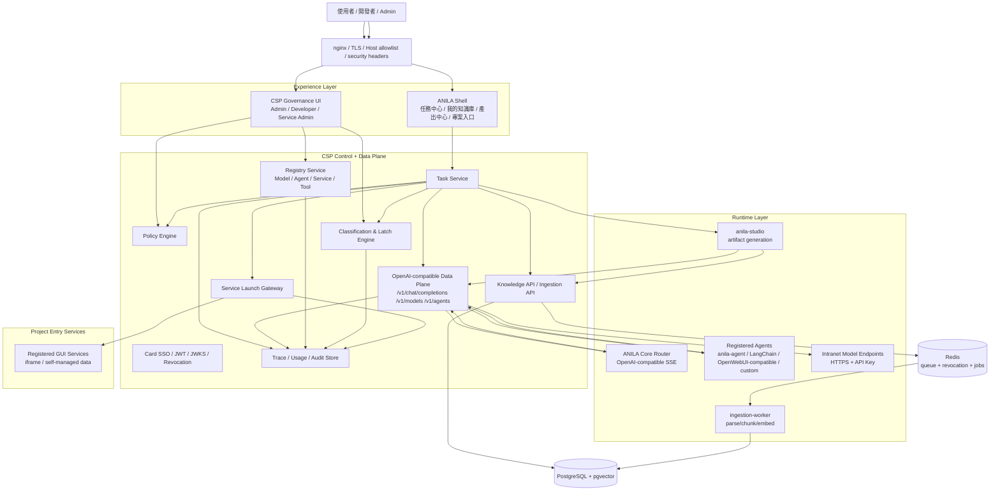

> ⚠ **2026-08-01 P2.1 契約更新**：下文若仍描述 `csk-`／`bsk-`／`X-CSP-Service-Token`／
> `CSP_SERVICE_TOKEN` 作為 agent 派工身分，該段已過時。現行＝5 分鐘派工 JWT＋JWKS 驗簽
> （開發者不領鑰匙；三級接入見 `docs/guides/developer-guide.md`）。
> 歷史段落未逐字改寫，以免破壞 redesign 文件結構。

# 02. System Architecture

> Status: draft v0.1  
> Purpose: 定義新 ANILA 的服務拓樸、依賴方向、保留 / 重構 / 刪除策略。  
> Principle: 不重寫成熟能力；將既有 Runtime-first、CSP Data Plane、Agent Registry、Studio extraction、RLS ingestion 轉成可治理的新架構。  
> 取證基準：現況（Repo evidence）以 `origin/prod-intranet-card`（v1.2.0 系）為準；本機工作樹與其分歧時以 origin 為準。目標設計與現況相左時，一律以目標為準，現況段落僅作遷移起點對照。

---

## 1. Target Topology



> ✅ MVP 決策（2026-07-02 拍板）：拓撲圖中的 **Task Service、Policy Engine、
> Service Launch Gateway 在 MVP 階段先實作在 CSP service 內**（同一
> FastAPI app），但以 module boundary 分開（獨立 package／router／service
> module，禁止跨模組直接 import 內部實作）；**v1.1 後再評估是否抽成獨立
> service**。理由：一人開發成本——新 repo 開場即拆多服務會把工程量花在
> 部署與 IPC 上，而非核心能力。圖中方框是邏輯邊界，不是部署邊界。

---

## 2. 現有實作應保留

| 現有實作 | 保留理由 | 新專案定位 |
|---|---|---|
| `myCSPPlatform` FastAPI | 已同時具 Control Plane / Data Plane、JWT、API Key、model/agent proxy、usage、audit、ingestion | CSP authoritative store |
| `model_registry` | 已是模型 endpoint SSOT | 升級為 `ModelEndpoint` |
| `agents` 表 | 已有 endpoint agent、approval、permission、requires_encryption、runtime_config | 升級為 Full Trace Agent Registry |
| `proxy_service.py` | 已處理 model/agent header 分離、service token cache、usage、SSE、SSRF guard | 保留為 Data Plane Gateway 核心 |
| `/v1/models` / `/v1/agents` / `/v1/chat/completions` | 已與 OpenAI-compatible 生態相容 | 保留並擴充 trace/classification |
| `anila-core` QueryEngine / Coordinator / memory / compact | 已被規劃為 runtime foundation，不應重寫 | Router / Agent SDK 底座 |
| `anila-core-router` | OpenAI-compatible Router deployment | 保留為任務分派 runtime |
| `anila-studio` extraction | 已抽出為獨立 artifact service | 保留但統一 job persistence |
| ingestion-worker + pgvector + RLS | 已有 parse/chunk/embed/RLS | 保留並補 snapshot/version |
| `platform_links` + `service_access_grants` | 已有服務入口與授權雛形 | 升級成 Service Registry |
| `classified.js` / conversation latch | 已有單向閂鎖 invariant | 升級成五級分類與核准降級 |

---

## 3. 應重構

| 區域 | 問題 | 重構方向 |
|---|---|---|
| Task / Conversation | 現有主軸偏 conversation / OpenAI payload | 建立 `Task` 為 application core |
| Classified latch | 現有是 boolean `classified` | 改為五級 `classification_level` + event log |
| Agent trace | UI 支援 `anila.spans`，但 backend trace store 不完整 | 建立 Full Trace Protocol + TraceSpan table |
| Agent registry | 目前可註冊 endpoint agent，但欄位偏 MVP | 加 runtime_type、audit_level、classification_ceiling、version |
| Studio jobs | 五類 pipeline 的 persistence 模型不一致 | 統一 `ArtifactJob` / `ArtifactVersion` |
| Service links | `platform_links` 是 link，不是完整 GUI Service | 擴充 manifest、launch token、audit callback |
| API Key 語彙 | CSK 對開發者不直觀 | UI 改稱 Integration Key / Service Client |
| Knowledge source | citation 與 source snapshot 不完整 | 新增 `SourceSnapshot` / stable citation |
| Policy | 權限檢查散在 helper/service | 建立 `PolicyDecision` 物件與事件 |

---

## 4. 應刪除或降級

| 內容 | 處理 |
|---|---|
| OpenWebUI 作為驗證主流程 | 刪除正式依賴；只保留 migration guide |
| 使用者可見 ANILALM / Studio / CSP 獨立品牌 | 降級為 ANILA 內部模組語彙 |
| Agent marketplace 語意 | 不做；只做 Registry + 任務能力 |
| 無 trace 的 agent / tool | 不進正式任務 |
| model endpoint API Key 直接交給 Agent | 禁止，統一經 CSP Proxy |
| boolean `requires_encryption` 作為長期分類模型 | 保留 migration bridge，長期改為 classification policy |

---

## 5. Layering Rules

```text
Experience Layer
  可依賴 Application contracts
  不可直接呼叫 Model / Agent endpoint

Application Layer
  Task Service / Policy / Source Snapshot / Artifact orchestration
  可呼叫 CSP Data Plane / Knowledge / Studio / Launch Gateway
  不可直接讀 runtime endpoint secret

Governance Layer
  Registry / Identity / Policy / Audit / Trace / Classification
  是所有正式 flow 的必經控制面

Runtime Layer
  Router / Agent / Model / Worker / Studio
  不得自稱產品入口
  不得自行決定最終權限

Infrastructure Layer
  DB / Redis / Object storage / nginx / model hosts
  不得滲透使用者語意
```

---

## 6. Repo Blueprint

建議新專案採 monorepo，但強化邊界。

```text
anila/
├── apps/
│   ├── anila-shell/              # React/Vue shell: runtime user entry
│   └── csp-governance-ui/        # Admin/developer/service-admin console
│
├── services/
│   ├── csp/                      # FastAPI Control + Data Plane
│   ├── task-service/             # 可先在 csp 內，後期再抽出
│   ├── anila-core-router/        # Router deployment
│   ├── anila-studio/             # Artifact generation
│   ├── ingestion-worker/         # async jobs
│   └── service-launch-gateway/   # 可先在 csp 內，後期再抽出
│
├── packages/
│   ├── anila-core/               # runtime SDK
│   ├── anila-agent/              # official agent template / SDK adapter
│   ├── anila-trace-sdk/          # Full Trace client
│   ├── anila-contracts/          # OpenAPI / JSON Schema / event schemas
│   └── anila-ui-kit/
│
├── docs/
│   ├── 00-product-constitution.md
│   └── ...
│
├── infra/
│   ├── docker/
│   ├── nginx/
│   ├── migrations/
│   └── deployment/
│
└── tests/
    ├── contract/
    ├── e2e/
    ├── security/
    └── migration/
```

MVP 可不物理拆出 `task-service` 與 `service-launch-gateway`，但 package/module boundary 必須先建立。

---

## 7. Runtime Call Invariants

### 模型呼叫

```text
Task / Router / Agent
→ CSP /v1/chat/completions
→ ModelEndpoint
```

禁止：

```text
Agent → ModelEndpoint
UI → ModelEndpoint
Router → ModelEndpoint
```

### Agent 呼叫

```text
Task / Router
→ CSP /v1/chat/completions model=<agent_id>
→ Registered Agent endpoint
→ Agent 回報 trace events
→ Agent 內部 LLM 呼叫仍回 CSP
```

### Studio

```text
Task
→ Studio job
→ Studio 透過 CSP search / proxy_chat
→ ArtifactVersion
→ Trace/Audit
```

### GUI Service

```text
ANILA Project Entry
→ Service Launch Gateway
→ Policy / Launch Token
→ iframe GUI Service
→ Audit Callback / Trace Callback
```

---

## 8. Failure Model

| 失敗 | 標準行為 |
|---|---|
| CSP down | 系統 fail closed |
| Redis revocation down | 高機敏路徑 fail closed；一般路徑視安全政策 |
| Model timeout | task run failed，可 retry |
| Agent no trace | 正式任務 blocked；開發模式允許 |
| Service iframe blocked | launch failed，audit |
| Classification violation | policy deny，不派發 runtime |
| Studio restart | job 不應丟失；重構後由 persisted job store 恢復 |

---

## 9. Observability

必備：

- `trace_id` 貫穿 task / proxy / router / agent / model / studio / service。
- `task_id` 貫穿正式任務。
- `span_id` / `parent_span_id` 建立 Full Trace tree。
- `audit_event_id` 記錄治理操作與政策判斷。
- `usage_record_id` 記錄成本 / token / duration。
- `classification_event_id` 記錄分類升級 / 降級申請。

---

## 10. Repo evidence / 現況補齊

### Current compose topology

root `docker-compose.yml` 是目前完整 stack，project name 為 `anila-platform`。外部入口只有 nginx `80`、`443`、`4443`；CSP、Router、Studio、worker、模型服務不直接開 host port。主要服務與責任：

- `csp-db`：PostgreSQL + pgvector，host 只綁 `127.0.0.1:5433:5432`。
- `csp`：build `myCSPPlatform/docker/Dockerfile`，啟動 FastAPI Control + Data Plane，使用 runtime DB role `csp_app` 與 migration superuser 分離。
- `redis`：revocation cache、Arq queue、job coordination。
- `ingestion-worker`：無 HTTP port，跑 Arq functions `ingest_document`、`evaluate_strategies`、`reresolve_collection_relations`。
- `router`：build `anila-core-router`，OpenAI-compatible task router，內部 expose `9000`。
- `anila-studio`：FastAPI artifact service，內部 expose `8100`，使用 CSP JWKS / revocation API / Redis。
- `pptx-renderer`、`anilalm`、`anila-ui`：artifact renderer 與兩個前端 experience。
- `nginx`：唯一對外 edge。

root compose 也仍包含冷存或 branch-sensitive 的 `codeserver`、`n8n`、`gitlab` 入口，且 `AUTO_REGISTER_LINKS` 會 seed ANILA LM、Code Server、n8n、GitLab、MLSteam 等 link。新專案不可整包照搬，需先決定哪些服務是正式產品、哪些只是部署環境工具。

`docker-compose-dev.yml` 是隔離 dev stack，project name 為 `anila-platform-dev`，使用 `8080/8443/9443`、DB `127.0.0.1:5533`、`share-dev/`、`*-dev` volumes、`anila-dev-net`。它開啟 dev-only endpoint flexibility，例如 `ANILA_ALLOW_HTTP_ENDPOINT=1`、`ANILA_ALLOW_PRIVATE_ENDPOINT=1`，並有 image-generator 相關 auto registration。這些不能被視為 prod hardening baseline。

`models/docker-compose.yml` 是獨立 project `anila-models`，只加入 external network `anila-models-net`，不開 host port。服務包含 `gpt-oss-20b` TensorRT-LLM、`gemma4` vLLM、`nv-embed-triton`、`nv-embed-proxy`、`flux2-dev`、`flux2-dev-agent`。平台 stack 透過 external network 呼叫模型 stack；這個分離策略應保留。

### nginx routes

`myCSPPlatform/docker/nginx.conf` 是現有 edge contract：

- port `80`：redirect HTTPS。
- port `443`：CSP / Vue 管理入口、`/api`、`/v1`、`/v2`、Studio API family、`/anila/`（同源 ANILA runtime UI 主要入口）、`/anilalm`、`/n8n`、`/gitlab`、`/codeserver`、`/router`。
- `443` 的 `/anila/` 同源入口（origin commit `a06c0cb`）：裸 `/anila` 由 exact-match `location = /anila` 回 301 補尾斜線，`location /anila/` 帶尾斜線前綴 proxy 到 `anila_ui_static`（`nginx.conf` ~:400-414）；SPA 以 Vite `base='/anila/'` 建置，compose `anila-ui` build arg `BASE_PATH: ${ANILA_UI_BASE_PATH:-/anila/}`（`docker-compose.yml` ~:397-406）。同源讓 CSP 登入 cookie 自然共用。
- port `4443`：ANILA runtime UI 的 legacy / 替代入口，同時 proxy `/api/auth`、`/api`、`/v1`、`/v2`、`/router`、Studio API family、uploads 與其他 registered paths。
- 已知不一致：`docker-compose-dev.yml` 的 `anila-ui` build 不帶 `BASE_PATH`（~:302-308，SPA 以 base `'/'` 建置），但 dev stack 掛的是同一份 `nginx.conf`（~:333）——dev 環境的 `/anila/` route 與 SPA base 對不上，重新設計時應收斂。
- `/api/(studio|reports|mindmaps|infographics|datatables)/` 轉 `anila-studio`，timeout / buffer 比一般 API 長。
- `/router/` 轉 `router` 並 strip prefix，SSE 相關 buffering disabled。
- `/v1` / `/v2` 走 CSP Data Plane，streaming route 關閉 proxy buffering。

新架構可保留「單一 nginx edge + CSP data plane + 同源 runtime UI subpath（`4443` 作 legacy secondary port）」的安全邊界，但 route 命名要配合 ANILA Shell 收斂，避免使用者看到多品牌 path。

### Router entrypoint 與成熟度

`anila-core-router/main.py` 是 deployment wrapper：`app = create_router_app()`，實際 Router 實作在 `anila-core/src/anila_core/api/router_server.py`。但下列部署層邏輯住在 wrapper `main.py`（~:74-347）本身，不在 `create_router_app()` 內（與 doc 10 §17.1 的歸屬一致）：

- primary model 透過 CSP `/api/models/router-primary` refresh（`_refresh_primary`），無 primary 時 `/v1/chat/completions` 由 middleware 直接回 503 fail closed。
- service token 三優先序解析：state file → bootstrap token → legacy `CSP_SERVICE_TOKEN` env fallback。

`create_router_app()` 現況包含：

- `/health`、`/v1/models`、`/v1/chat/completions`、`/v1/sessions/{session_id}/state`、`/v1/sessions/{session_id}/answer`。
- 從 CSP `/v1/agents` 讀 agent manifest，組 routing prompt。
- 支援 OpenAI-compatible SSE、named `event:` passthrough、`anila.*` metadata、session/resume、handoff chain、classified override。
- Router dispatch 透過 CSP proxy 呼叫 agent endpoint，不直接拿模型 secret。

結論：Router 已可作新架構 Runtime Layer seed，但正式化前要補 task-centric trace store、Full Trace event persistence、classification policy hook，以及移除 legacy service token fallback 的 prod 風險。

### Downstream identity 契約（§7 call invariants 的現況佐證）

CSP 出向呼叫已有明確的身分下傳契約（`myCSPPlatform/backend/app/services/proxy_service.py`，origin commit `80f60d4`）：

- 對 **agent** 的呼叫由 `build_agent_headers()` 注入 `X-CSP-Service-Token` + `X-ANILA-User-Id` / `X-ANILA-User-Email`。`X-ANILA-User-Id` 在 origin 上是**員編**，由 `downstream_identity()` 解析（card 分支 `user.username` 即員編；非 card 帳號回 `None`，直接省略 header 而非偽造身分）。
- 對 **model gateway** 的呼叫由 `build_model_gateway_headers()` 只帶員編 `X-ANILA-User-Id`，刻意不帶 service token 與 email / groups——builder 由「目的地」決定而非 caller flag，model gateway 永遠拿不到 CSP service token。
- `X-ANILA-User-Groups` 有 plumbing（`build_agent_headers` 的 `user_groups` 參數），但目前沒有任何正式 call site 傳入（僅測試檔使用），屬 dead plumbing；重新設計時應正式接上或移除。

### `anila-core` 可移植性

`anila-core` 是共用 runtime package，不是常駐服務。現有可移植資產包含：

- `QueryEngine`：七階段 turn loop，涵蓋 pre-process、API call、completion check、tool execution、attachments、limit check、continue / stop；支援 hooks、budget、tools、pause / resume / handoff。
- `Coordinator`：建立在 `QueryEngine` 上的 task decomposer，讀取任務後平行執行 read-only workers、序列執行 write workers；目前是 runtime pattern，不是獨立 service。
- `api/server.py`：可包裝 provider / tool registry 成 FastAPI app，提供 `/chat`、`/agentic-chat`、session state / answer、compact、health。
- storage adapters：`PgPool` 與 `CollectionScopedPgVectorStore`，後者使用 collection-scoped RLS 與 `halfvec(4000)` embedding。
- ingestion primitives、security helpers、memory / compact / tool registry。

因此新專案應把 `anila-core` 當 packages/runtime foundation 移植，避免把 QueryEngine / Coordinator 邏輯複製到 CSP service 內。缺口是：目前 trace / policy / classification 不是 `anila-core` 的硬 contract——但並非從零開始：`anila-core` 已內建 `tracing` module（`src/anila_core/tracing/`：tracer / span / processor / hooks），Router 也已對外發 `anila.trace` SSE 事件（`router_server.py`）。重新設計應以這些既有資產為基礎升級成硬 contract，而非另起爐灶。

### Studio job service 共通化

`anila-studio/app/main.py` 啟動 JWKS 與 revocation cache；cache 未 ready 時 readiness 失敗，這個 fail-closed 行為應保留。它掛載五類 router：slides、reports、mindmaps、infographics、datatables。

五類 job service 可抽出的最小共用介面：

```ts
ArtifactJob {
  id: string
  owner_user_id: number
  collection_id?: number
  type: "slides" | "report" | "mindmap" | "infographic" | "datatable"
  status: "queued" | "running" | "completed" | "failed"
  progress: number
  message?: string
  result_metadata?: object
  artifact_files: ArtifactFile[]
  error?: { code: string; message: string }
  created_at: string
  updated_at: string
  expires_at?: string
}
```

現況差異：

- slides / mindmaps 主要把 bytes 存在 in-memory job record。
- reports / infographics / datatables 會把產物寫到 artifacts dir，但 job 狀態仍在 process memory。
- 各 service 有各自 `_jobs` dict、max jobs、stale cleanup、download endpoint。

因此 `anila-studio` 可以保留 pipeline 與 API 分工，但 job persistence 必須統一到 DB 或 Redis-backed store，否則不符合 failure model 中「Studio restart job 不應丟失」。

### ingestion worker

`ingestion-worker/src/ingestion_worker/main.py` 是 Arq entrypoint。startup 會開 `PgPool` 與 `Embedder` 放入 worker context；shutdown 會關閉 pool / embedder；`WorkerSettings.functions` 包含 `ingest_document`、`evaluate_strategies`、`reresolve_collection_relations`。`max_tries=3`、`job_timeout=300`、`keep_result=3600`。

`settings.py` 證明 worker 是 infrastructure worker，不是 API service：

- `DATABASE_URL` 必須用 `csp_app` role，RLS enforced。
- `EMBEDDING_BASE_URL` 預期 OpenAI-compatible `/v1`，root compose 目前走 CSP `/v1/embeddings`，讓 CSP 記 token usage。
- `embedding_dim=4000` 對齊 `document_chunks.embedding halfvec(4000)`。
- VLM image caption、LLM relation extraction、similarity edges 都是可開關的 best-effort enrichment。

新架構應保留 worker 的 async pipeline 與 collection-scoped DB access；新增 SourceSnapshot / versioning 時，應在 worker 成功寫入 chunks 後建立 snapshot-ready metadata，而不是讓前端直讀 live chunks。

### prod deploy script 可移植性

`scripts/deploy-prod.sh` 是目前 prod branch runbook，不是可直接搬到新專案的 generic deploy library。它會：

- 限制只能在 `prod-intranet-card`、`prod-public-passwd`、`prod-military-passwd` 執行。
- 檢查 Docker / docker compose v2。
- fail-loud 檢查 `CSP_SERVICE_TOKEN`、`INTERNAL_PLATFORM_API_KEY`、`CSP_SECRET_KEY` / `SECRET_KEY`，並拒絕 `changeme` / `placeholder` / `example`。
- 檢查 `anila-models-net` 與必要模型容器 health。
- 建立 `share/uploads/flux`。
- `deploy` 會 build、`docker compose up -d`、等待核心服務 healthy、再 smoke test nginx `/health`、CSP internal `/health`、anila-studio `/health`、CSP revocation API。

可移植的是 preflight 思維、secret fail-loud、models-stack 先決條件、health + smoke verify；不可直接移植的是 branch name、服務清單、flux path、dev/cold service assumptions。新專案應將這些檢查拆成 deployment profile，而不是複製單支腳本。
