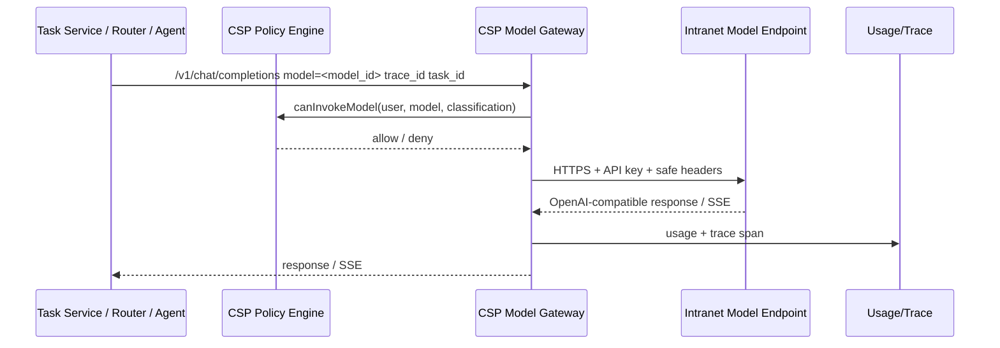

> ⚠ **2026-08-01 P2.1 契約更新**：下文若仍描述 `csk-`／`bsk-`／`X-CSP-Service-Token`／
> `CSP_SERVICE_TOKEN` 作為 agent 派工身分，該段已過時。現行＝5 分鐘派工 JWT＋JWKS 驗簽
> （開發者不領鑰匙；三級接入見 `docs/guides/developer-guide.md`）。
> 歷史段落未逐字改寫，以免破壞 redesign 文件結構。

# 04. Model Gateway Design

> Status: draft v0.1  
> Purpose: 定義院內不同主機模型的註冊、路由、API Key、權限、分類限制與 usage trace。  
> Scope: 僅考慮同內網不同機器上的模型，通訊使用 HTTPS + API Key。  
> 取證基準：現況（Repo evidence）以 `origin/prod-intranet-card`（v1.2.0 系）為準；本機工作樹與其分歧時以 origin 為準。目標設計與現況相左時，一律以目標為準，現況段落僅作遷移起點對照。

---

## 1. Design Decision

所有模型呼叫必須經 CSP Data Plane / Model Gateway。

```text
ANILA UI / Task Service / Router / Agent
        |
        v
CSP /v1/chat/completions or /v1/embeddings
        |
        v
ModelEndpoint HTTPS + API Key
```

禁止：

```text
Agent 直接呼叫 ModelEndpoint
Router 直接呼叫 ModelEndpoint
UI 直接呼叫 ModelEndpoint
開發者把模型 API Key 寫進 agent.py
```

---

## 2. ModelEndpoint

沿用既有 `model_registry`，將語意 formalize：

```ts
ModelEndpoint {
  id: string
  name: string
  display_name: string
  endpoint_url: string
  api_version: "v1" | "v2"
  model_type: "llm" | "embedding" | "vlm" | "image" | "reranker"
  protocol: "openai_compatible" | "custom_adapter"
  network_zone: "intranet"
  api_key_secret_ref: string
  classification_ceiling: ClassificationLevel
  owner_department_id?: number
  is_active: boolean
  health_status: "unknown" | "healthy" | "degraded" | "unhealthy" | "disabled"  // 對齊 §9 五態；現況字彙見 §9 現況對照
  supports_streaming: boolean
  supports_json_schema: boolean
  supports_tools: boolean
  created_at: string
  updated_at: string
}
```

---

## 3. API Key Handling

### Current usable design

既有 proxy service 已有模型 gateway key 注入點：

```text
MODEL_GATEWAY_API_KEY
```

並且模型呼叫與 Agent dispatch 的 header 已被分離。

### 現況 header 快照（origin/prod-intranet-card；與 03 §4 逐字一致）

```http
# CSP → Agent dispatch（build_agent_headers）
X-CSP-Service-Token: <csk- per-agent 憑證；無 DB 憑證時退回 legacy CSP_SERVICE_TOKEN>
X-ANILA-User-Id: <員編；downstream_identity() 驗 6–9 碼數字，非卡片帳號 fail-safe 省略、不偽造，請求照常放行>
X-ANILA-User-Email: <email>

# CSP → Model gateway（build_model_gateway_headers + _apply_gateway_auth）
Authorization: Bearer <MODEL_GATEWAY_API_KEY>
X-ANILA-User-Id: <員編；同上省略規則>
```

- 模型呼叫**只**帶 gateway bearer key + `X-ANILA-User-Id`，永遠不帶 `X-CSP-Service-Token`、email/groups；任何狀態下都沒有 trace header 送往模型。
- `X-ANILA-User-Groups`：`build_agent_headers` 留有參數管線，但**沒有任何呼叫點傳入** —— dead plumbing，現況線上永遠不會送出。
- 入向（/v1 資料面）：CSP 只讀 `X-ANILA-Conversation-Id` 與 `X-ANILA-Trace-Id`（落入 usage 歸因欄位，不轉發為出向 header）。
- `X-ANILA-Task-Id`、`X-ANILA-Classification-Level`：目標新增，現況程式碼任何地方都不存在。

### New rule

1. `MODEL_GATEWAY_API_KEY` 不再是全域唯一長期設計。
2. 每個 `ModelEndpoint` 對應 secret ref。
3. MVP 可保留全域 env var 作 fallback。
4. UI 只顯示 secret 狀態，不顯示 plaintext。

---

## 4. Model Invocation Flow



---

## 5. Classification Rule

```ts
allow if task.classification_level <= model.classification_ceiling
deny otherwise
```

範例：

| Task 分類 | Model ceiling | 結果 |
|---|---|---|
| 無機密 | 營業秘密 | allow |
| 機密 | 機密 | allow |
| 極機密 | 機密 | deny |
| 絕對機密 | 極機密 | deny |

---

## 6. OpenAI-compatible Surface

保留：

```text
GET  /v1/models
POST /v1/chat/completions
POST /v1/embeddings
```

要求：

- `GET /v1/models` 只回傳 caller 有權限且 classification ceiling 可用的模型。
- `POST /v1/chat/completions` 必須接受（**目標新增**：接受 `X-ANILA-Task-Id` 與 `X-ANILA-Classification-Level` 現況不存在；現況入向只讀 `X-ANILA-Conversation-Id` 與 `X-ANILA-Trace-Id` 作 usage 歸因，見 §3 現況快照與 03 §4）：
  - `X-ANILA-Task-Id`
  - `X-ANILA-Trace-Id`
  - `X-ANILA-Classification-Level`
- streaming 必須攔截 usage 或估算 usage。
- 下游不送 `anila.meta` 時，CSP 補 default meta。

---

## 7. Usage Accounting

每次模型呼叫產生：

```ts
UsageRecord {
  task_id
  trace_id
  model_id
  user_id
  department_id
  request_type: "chat" | "embedding" | "image" | "reranker"
  prompt_tokens
  completion_tokens
  total_tokens
  duration_ms
  status
}
```

若下游不回 usage：

1. CSP 估算 prompt / completion tokens。
2. usage record 標記 `estimated=true`。（**目標新增**：伺服端估算現況真實存在 —— 串流與非串流路徑都有 fallback —— 但只留 log warning，資料上與上游回報的 usage 無從區分；`token_usage` 沒有 estimated 欄位。）
3. audit 不視為失敗，但 dashboard 應能區分。

> 現況對照：目標 `UsageRecord` 約七成已存在 —— `token_usage` 已有
> `request_type`（chat / embedding / judge）、`caller_agent_id` / `caller_client_id`
> 歸因欄位（皆配 partial index），rollup 端點也已有 per-agent
> （`/api/usage/agents/{id}`）、`/api/usage/by-base-model`、`/api/usage/by-client`。
> `UsageRecord` 應定位為「擴充既有 token_usage」而非重造。已知缺口：
> **非串流 agent 轉送現況完全不寫 usage row**（程式內註記為 pre-existing gap）。

---

## 8. Security Guards

保留並強化（既有）：

- Endpoint registration-time SSRF validation。
- Call-time SSRF re-validation，防 DNS rebinding。
- Trusted hosts allowlist（env `ANILA_TRUSTED_HOSTS` ∪ DB `/api/trusted-hosts`；命中即跳過**所有** host 檢查，但 scheme 檢查仍先行）。
- HTTPS required（**預設開啟而非絕對**：見下方 TLS 小節的 relaxation flags；實際內網部署必須開 allow-http 才接得上 MLSteam agent）。
- No service credential to model gateway。
- No user email/groups to model endpoint unless explicit policy permits（現況已成立：`build_model_gateway_headers` 只送 `X-ANILA-User-Id`，見 §3）。

目標新增：

- API key secret envelope。（現況：模型 gateway key 是 **plaintext env var** `MODEL_GATEWAY_API_KEY`（`config.py`），模型 key 沒有任何 envelope / secret_ref；AES-GCM `enc::v1::` envelope 只用在 `csk-` / `bsk-` 服務憑證與 ingestion LLM 憑證。`secret_ref` 為目標新增。）
- Classification ceiling check before outbound call。（現況**不存在任何出向前的分類檢查**：現有機制是布林 `requires_encryption` + 單向 conversation latch，只在呼叫前後標記 metadata 與鎖定對話分類狀態，**從不 deny 出向呼叫**。）

### TLS / 信任鏈（現況）

內網模型 gateway 走 https，信任鏈由 CSPKI（中科院 PKI）承載，現況接線如下：

- `.env` 的 `ANILA_MODEL_CA_FILE` 在 compose（origin `docker-compose.yml`）映為 csp 容器的
  `SSL_CERT_FILE: ${ANILA_MODEL_CA_FILE-}`，指向 CSPKI bundle
  （`cspki_ca_bundle.pem`，與卡片登入驗章同一條憑證鏈）。
- ⚠ `SSL_CERT_FILE` 是「**取代**」整個系統信任庫，不是疊加：指到空檔/壞檔時
  csp 的**所有**出向 https 都會 X509 驗證失敗（`CERTIFICATE_VERIFY_FAILED`），不只模型呼叫。
- gateway 必須以 **FQDN** 註冊、不能用 raw IP：憑證主機名比對會失敗，
  且 SSRF guard 預設擋私網 IP。
- Relaxation flags 真實存在且部署會用到：`ANILA_ALLOW_HTTP_ENDPOINT=1`／
  `ANILA_ALLOW_PRIVATE_ENDPOINT=1`（anila-core `url_guard`，每次呼叫即時讀取）。
  真實內網部署**必須**開 allow-http，因為 MLSteam agent endpoint 是純 http NodePort。
- Trusted hosts（env ∪ DB）命中即跳過所有 host 檢查（deny list、私網 IP、
  single-label、DNS 解析），但 scheme 檢查仍先套用。

### Production ModelEndpoint invariant（✅ 已拍板：v0.2 起為硬規則）

```text
- production model endpoint 必須 HTTPS
- 必須有 API Key 或等價 gateway secret
- 不允許透過 ANILA_ALLOW_HTTP_ENDPOINT 放寬 production model endpoint
- ANILA_ALLOW_HTTP_ENDPOINT 僅能用於 dev 或 agent endpoint transition，
  不適用於 production model endpoint
```

HTTP 例外只保留給：dev／local、agent endpoint 過渡期（trusted host + CSP proxy
+ 顯式部署例外，如 MLSteam 純 http NodePort）、特定 trusted internal tool。

> ⚠ 工程備註（**目標新增**）：現況 `url_guard` 的 `ANILA_ALLOW_HTTP_ENDPOINT`
> 是**全域旗標，不分 model / agent**——內網為了 agent endpoint 開旗標時，
> model endpoint 也一併被放寬。要落實上述 invariant，必須把旗標按端點類型
> 分域（如 `ANILA_ALLOW_HTTP_AGENT_ENDPOINT`，或在 model 註冊/呼叫路徑上
> 對 `model_type != "agent"` 強制拒收 http），這是一項工程改動，不是文件宣告。

因此「HTTPS required」對 **agent endpoint** 是 default-on 的預設強制（可依上述
例外顯式放寬並留於部署設定可稽核）；對 **production model endpoint** 是
**絕對不變量**，不接受旗標放寬。

---

## 9. Health Checks

目標路由（**目標新增**）：

```text
GET /api/models/{id}/health
POST /api/models/{id}/test
```

現況對照：model 實際只有 `POST /api/models/{model_id}/health-check`
（沒有 GET `/health`、沒有 `/test`）；agent 則有
`POST /api/agents/{id}/health-check` 與 `POST /api/agents/{id}/test-connection`。

Health state（目標，五態）：

```text
unknown
healthy
degraded
unhealthy
disabled
```

現況對照：model `health_status` 實際字彙是 `online / connecting / offline`；
agent 欄位 default `unknown`（欄位註解寫 unknown/healthy/unhealthy），但 health
loop 實際寫入的是 model 字彙（online/connecting/offline）—— 字彙收斂是遷移的
一部分（另見 §11）。

Health check 不應攜帶真實使用者資料。

---

## 10. Migration From Current Implementation

### Keep

- `model_registry`
- `proxy_service.proxy_request`
- `proxy_service.proxy_stream`
- `_apply_gateway_auth`
- `build_model_gateway_headers`
- `/v1/models`
- `/v1/chat/completions`
- usage_writer / token_usage
- SSRF guard

### Refactor

- `MODEL_GATEWAY_API_KEY` → per-model secret ref。
- `requires_encryption` → classification ceiling/policy。
- `ModelRegistry.model_type == "agent"` 的混合語意 → 盡量分出 AgentDefinition，但可保留 compatibility resolver。
- add `PolicyDecision` before invocation。
- add Full Trace spans around model calls。

### Remove

- Any direct model endpoint call from Router / Agent templates。
- Any UI path that can manually configure model endpoint outside CSP。

---

## 11. Repo evidence / 現況補齊

### `model_registry` 現有欄位

`myCSPPlatform/backend/app/models/model_registry.py` 目前欄位為：

```text
id
name
display_name
model_type              # llm / vlm / embedding / agent
endpoint_url
api_version             # v1 / v2
is_active
is_router_primary
health_status           # online / connecting / offline
health_checked_at
is_internal
description
context_window
base_model_id
created_at
updated_at
```

對照本檔第 2 節的目標 schema，現況尚未有：

```text
protocol
api_key_secret_ref
classification_ceiling
owner_department_id
allowed_task_types
supports_streaming
supports_json_schema
supports_tools
```

`requires_encryption` 曾在 migration `0005_add_requires_encryption.py` 加到
`model_registry` 與 `agents`，但 `0007_drop_model_requires_encryption.py`
已從 `model_registry` 移除，只保留 Agent 的 `requires_encryption` migration bridge。

### 相關 migration / 關聯

目前可直接對應的 migration：

```text
0001_initial_schema.py              # 建立 model_registry 初版
0005_add_requires_encryption.py     # 曾加 model/agent requires_encryption
0007_drop_model_requires_encryption.py
0008_add_is_router_primary.py       # router primary partial unique index
0033_add_model_registry_is_internal.py
```

`myCSPPlatform/backend/app/services/startup_migrations.py` 另外會補齊
`health_status`、`health_checked_at`、`context_window`、`base_model_id`、
`is_internal`、`updated_at` 等欄位，支援既有資料庫零停機補欄位。

現有關聯：

- `Agent.base_model_id -> model_registry.id`。
- `ModelRegistry.base_model_id -> model_registry.id`，可表示 derived model / agent-like row。
- `TokenUsage.model_id -> model_registry.id`。
- `UserModelPermission` / `ApiKeyModelPermission` 由 model permission service 使用。

### Endpoint base URL pattern

`endpoint_url` 是管理者註冊的完整上游 base URL，現有註解與範例多為
OpenAI-compatible base，常見結尾包含 `/v1`：

```text
http://vllm:8000/v1
http://gemma4:8000/v1
http://nv-embed-proxy:8000/v1
```

`myCSPPlatform/backend/app/services/proxy_service.py` 在組合
`endpoint_path` 時會處理重複版號：

- `endpoint_url` 以 `/v1` 結尾且 `endpoint_path` 是 `/v1/...` 時，先去掉尾端 `/v1`。
- `endpoint_url` 以 `/v2` 結尾且 `endpoint_path` 是 `/v2/...` 時同理。

因此現況支援「註冊 URL 已含 `/v1`」與「註冊 URL 不含 `/v1`」兩種形態。
`is_internal` 只作為 UI/顯示提示與內網模型標記；真正的出向限制仍靠 SSRF guard
與 `ANILA_TRUSTED_HOSTS`。

### `/v1/embeddings` flow

`myCSPPlatform/backend/app/api/proxy.py` 已提供：

```text
POST /v1/embeddings
POST /v2/embeddings
```

流程與 chat model proxy 共用 `proxy_request(...)`：

1. `get_caller` 驗 `sk-*` API key 或 JWT/cookie。
2. `_resolve_model(...)` 檢查 model registry 與 caller 權限。
3. 呼叫 `proxy_request(model=..., endpoint_path="/v1/embeddings")`。
4. `proxy_request` 以 `endpoint_path` 或 `model.model_type == "embedding"`
   將 `request_type` 標為 `embedding`。
5. 寫入 `token_usage`，並保留 `conversation_id` / `trace_id` 欄位。

結論：`/v1/embeddings` 與 chat 目前共用同一條 model proxy / usage flow；
差異是 endpoint path 與 `request_type="embedding"`。

### `MODEL_GATEWAY_API_KEY`

`myCSPPlatform/backend/app/config.py` 定義：

```text
MODEL_GATEWAY_API_KEY
```

`myCSPPlatform/backend/app/services/proxy_service.py` 的 `_apply_gateway_auth`
只在 model 呼叫使用，且不覆蓋既有 `Authorization`：

```text
Authorization: Bearer <MODEL_GATEWAY_API_KEY>
```

同檔 `proxy_request(...)` 明確判斷 `model.model_type != "agent"` 才注入 gateway key；
Agent dispatch 使用 `X-CSP-Service-Token` 與 `X-ANILA-*` identity headers，
不把模型 gateway key 外流給 Agent。

### Model health checker

`myCSPPlatform/backend/app/services/health_checker.py` 實作現有背景 loop：

- `start_health_checker()` 由 `myCSPPlatform/backend/app/main.py` startup 啟動。
- `_health_check_loop()` 定期檢查所有 active models。
- `check_model_health(...)` 依序 probe：
  - `/health`
  - `/v1/models`
  - `/`
- 狀態值為：
  - `online`
  - `connecting`
  - `offline`
- probe 前會再跑 `validate_outbound_url(...)`，避免 TOCTOU / DNS rebinding。
- model offline 時 upsert `health:model:{id}` alert，online 時 resolve。

同檔還有 `_agent_health_check_loop()`，會檢查 approved agents 並寫入
`health:agent:{id}` alert；Agent DB 欄位註解使用 `unknown` / `healthy` /
`unhealthy`，但 loop 實際寫入的是 `online` / `connecting` / `offline`，這是後續
schema formalize 時要收斂的差異。
