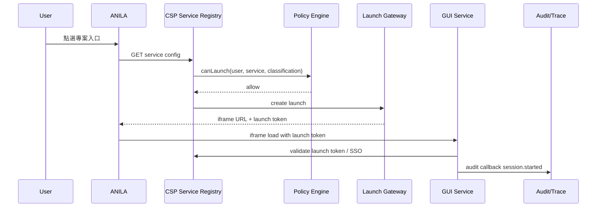

# 07. Registered GUI Service Platform

> Status: draft v0.1  
> Purpose: 定義其他小組具有 GUI 的服務如何註冊為 ANILA「專案入口」。  
> Decisions: 其他服務支援院內憑證卡 SSO、自己處理自己的資料、允許 iframe、可成為專案入口、有 Admin 權限者可自行上架。  
> 取證基準：現況（Repo evidence）以 `origin/prod-intranet-card`（v1.2.0 系）為準；本機工作樹與其分歧時以 origin 為準。目標設計與現況相左時，一律以目標為準，現況段落僅作遷移起點對照。

---

## 1. Core Concept

其他小組的 GUI 服務不被 ANILA 吃進程式碼，也不成為 ANILA 之外的平行入口。它們註冊為：

```text
Registered GUI Service / Project Entry
```

使用者從 ANILA 進入：

```text
ANILA → 專案入口 → Service Launch Gateway → iframe / service session
```

---

## 2. Build on Existing Platform Links

既有 `platform_links` 已有：

- name
- url
- icon
- description
- sort_order
- active flag
- public/private
- required_roles

既有 `service_access_grants` 已有：

- user grant
- department grant
- soft revoke
- audit-friendly grant model
- default deny access algorithm

新設計應保留這些，升級為完整 Service Registry。

---

## 3. RegisteredService Schema

```ts
RegisteredService {
  id: string
  name: string
  slug: string
  description?: string
  icon?: string

  owner_department_id: number
  owner_admin_user_id: number
  service_admin_user_ids: number[]

  service_type:
    | "project_portal"
    | "analysis_gui"
    | "artifact_tool"
    | "data_system"
    | "workflow_system"

  project_entry: boolean
  project_id?: string

  entry_url: string
  allowed_origins: string[]
  launch_mode: "iframe" | "new_tab"
  iframe_allowed: boolean

  sso_mode: "card_sso" | "oidc" | "launch_jwt"
  supports_launch_token: boolean

  data_ownership: "self_managed"
  data_ingress: string[]
  data_egress: string[]

  healthcheck_url?: string
  audit_callback_url?: string
  trace_callback_url?: string

  classification_ceiling: ClassificationLevel
  required_roles: string[]
  is_public: boolean
  is_active: boolean

  // v0.2（✅ 已拍板）：解 env seed vs DB 的 source-of-truth 衝突（見 §15.1）
  config_source: "db" | "env_seeded"
  env_seed_key?: string          // env_seeded 時對應的 AUTO_REGISTER_LINKS 項目鍵
  db_editable_fields: string[]   // env_seeded 服務中仍允許 UI 編輯的欄位（如 is_active、sort_order）
  last_seeded_at?: string

  created_at: string
  updated_at: string
}
```

Source-of-truth 規則（✅ 已拍板 2026-07-02）：

```text
env_seeded service：
- 適合系統內建入口（ANILA LM、GitLab、n8n、MLSteam 等）。
- UI 可顯示，但不可直接修改 env-owned 欄位（顯示鎖定標記）；
  修改需回到 deployment env，重啟後由 seed 重新同步。
- db_editable_fields 白名單內的欄位（如 is_active）為 admin-sticky，seed 不覆蓋。

db service：
- 適合其他小組自助上架服務。
- 由 Service Registry UI 管理，為唯一事實來源。
- 重啟時不得被 AUTO_REGISTER_LINKS 覆蓋（seed 只 upsert config_source="env_seeded" 的 row）。
```

> 「service admin」定位（現況對照）：`service_admin_user_ids` 是掛在
> `RegisteredService` 上的 per-service 指派欄位（目標新增），**不是**全域
> role。現況全域 role enum 只有 `owner` / `admin` / `user` / `developer`
> （`models/user.py`、`schemas/platform_link.py` 的 `_ALLOWED_ROLES`），
> 沒有 `service_admin` 這個 role 值；redesign 不應把它加進全域 enum，
> 而是維持 per-service 名單。

---

## 4. Service Manifest

服務上架時可填表，也可提供 manifest：

```http
GET /.well-known/anila-service.json
```

```json
{
  "service_id": "material-analysis",
  "name": "材料分析專案入口",
  "version": "1.0.0",
  "service_type": "analysis_gui",
  "entry_url": "https://material.local/app",
  "launch_mode": "iframe",
  "sso_mode": "card_sso",
  "supports_launch_token": true,
  "data_ownership": "self_managed",
  "classification": {
    "ceiling": "機密"
  },
  "audit": {
    "callback_url": "https://material.local/anila/audit-events",
    "events": ["session.started", "file.uploaded", "analysis.completed"]
  }
}
```

---

## 5. Launch Flow



---

## 6. Launch Token

短效 JWT，由 CSP 簽發：

```json
{
  "iss": "anila-csp",
  "aud": "material-analysis",
  "launch_id": "launch_123",
  "service_id": "material-analysis",
  "user_id": 12,
  "employee_id": "123456",
  "department_id": 5,
  "roles": ["user"],
  "task_id": "task_123",
  "trace_id": "trace_123",
  "classification_level": "營業秘密",
  "source_snapshot_id": "snap_123",
  "iat": 1780000000,
  "exp": 1780000600
}
```

### Rules

- TTL 建議 5–10 分鐘。
- 單次使用或短時 reuse 由 policy 決定。
- 不包含模型 API Key。
- 不包含長期 user JWT。
- service 必須驗 `aud`、`iss`、`exp`、signature。
- launch token 不等於 service 的長期登入 session；service 可換成自己的 session。

---

## 7. iframe Security

ANILA 允許 iframe，但必須註冊。

### CSP headers

Service must provide compatible headers:

```http
Content-Security-Policy: frame-ancestors 'self' https://anila.local
X-Frame-Options: unset or SAMEORIGIN only if same-site
```

ANILA shell 端：

- 只允許 registry 中的 service origin。
- iframe sandbox 預設：

```html
sandbox="allow-scripts allow-forms allow-same-origin allow-downloads"
```

視服務需求 ADR 增加：

```text
allow-popups
allow-modals
```

---

## 8. SSO

服務支援院內憑證卡登入。兩種模式：

> 現況基礎（`origin/prod-intranet-card` 已落地、可運作，非從零 port）：
> CSP 已有完整卡登子系統 —— `services/card_auth.py`（CMS/PKCS#7 真驗章：
> 簽章驗證 + CSPKI 憑證鏈 + nonce 綁定）、`services/card_auth_service.py`
> （challenge/nonce 簽發與卡使用者 resolve）、`services/cspki_ca_bundle.pem`
> （釘死信任錨）、`api/auth_providers.py` + `models/auth_provider.py`
> （auth-provider metadata）、`REQUIRE_CARD_LOGIN_ONLY` 內網鎖
> （含 owner break-glass 帳密通道），以及整合測試
> （`tests/test_card_auth.py`、`test_card_endpoints.py`、
> `test_intranet_lockdown.py`）。本節的 Shared Card SSO 是在這套既有實作
> 之上疊加 launch token 信任鏈（目標新增），不是「另行 port」卡登。

### Mode A: Shared Card SSO via CSP Launch Token

Service 信任 CSP launch token，建立自己的 session。

優點：

- 使用者只在 ANILA 登入。
- Service 不需要重跑讀卡。
- audit 可關聯 `launch_id`。

### Mode B: Service 自己跑院內 SSO

ANILA launch 後，service 仍可要求自己的 card SSO。

適用：

- 高機敏服務。
- 服務本身已有不可改的認證流程。

規則：

- 即使 service 自己 SSO，也必須保留 ANILA `launch_id`。
- Service 必須回報 launch/session audit。

---

## 9. Self-managed Data

服務自己處理資料，但 ANILA 需要知道資料流分類。

Service manifest 必填：

```text
data_ownership = self_managed
data_ingress = uploaded_file | task_result | manual_input | none
data_egress = artifact | report | table | none
classification_ceiling
```

ANILA 不直接讀 service DB，除非服務另外提供 API contract。

---

## 10. Audit Callback

```http
POST /api/services/{service_id}/audit-callbacks
Authorization: Bearer <service integration key>
```

```json
{
  "launch_id": "launch_123",
  "trace_id": "trace_123",
  "event_type": "analysis.completed",
  "timestamp": "2026-07-01T00:00:00Z",
  "actor": {
    "employee_id": "123456"
  },
  "resource": {
    "type": "service_analysis",
    "id": "analysis_789"
  },
  "classification_level": "機密",
  "metadata": {
    "duration_ms": 10333
  }
}
```

---

## 11. Service Admin Self-Onboarding

其他小組有 Admin 權限者可自行上架服務。這裡的「Admin 權限」指的是平台
全域 admin tier（現況唯一的 admin 概念）；「service admin」則是服務上架後
掛在該服務 `service_admin_user_ids` 的 per-service 名單（見 §3 note），
兩者不可混用。

### Workflow

```text
Create Service Draft
→ Fill manifest
→ Validate URL / SSO / iframe / health
→ Policy check
→ Activate
```

若 service classification ceiling >= 機密，建議額外需要安全審核；但使用者目前決策是有 Admin 權限者可上架，因此至少要：

- 所有動作 audit。
- 默認 private。
- Access grants default deny。
- Classification policy enforce。
- 可被 owner/admin disable。

---

## 12. Access Control

保留既有演算法：

```text
1. service active
2. admin/owner bypass
3. role gate
4. public bypass
5. user/department active grant
```

> ✅ 已拍板（2026-07-02）：**保留 step 2 的 admin/owner 全域 bypass**。
> 平台 admin/owner 可跨越 per-service admin 邊界（無視
> `service_admin_user_ids` 與 grant 設定，可見並可管理所有 active 服務）；
> `service_admin_user_ids` 定位為「授權下放」，不是對平台 admin 的排他邊界。
> 與現況 `can_access_link` 的 superuser-sees-everything 設計一致。
> 跨界管理操作一律寫入 audit log 供追溯。

新增：

```text
6. classification clearance check
7. project membership check
8. service launch policy check
```

---

## 13. Task Integration

Project Entry 可以被 Task 觸發：

```ts
Task {
  task_type: "launch_service"
  selected_service_id: "material-analysis"
  source_snapshot_id?: string
}
```

Service 可回傳：

- artifact ref
- service result summary
- audit events
- trace spans

---

## 14. Migration

### Keep

- `platform_links`
- `service_access_grants`
- `access_control.py`
- audit event on link CRUD
- default deny grants

### Refactor

- `PlatformLink` → `RegisteredService`
- `url` → `entry_url`
- add launch token, SSO mode, iframe config
- add owner department and service admin
- add audit callback
- add classification ceiling

### Remove

- 裸 link 作為正式專案入口。
- 無 audit callback 的高機敏 GUI service。
- 未註冊 origin iframe。

---

## 15. Repo evidence / 現況補齊

### 15.1 `platform_links` 現況

權威後端目前是 `myCSPPlatform/backend/app/models/platform_link.py`、
`schemas/platform_link.py`、`api/platform_links.py`：

- 欄位只有 `name`、`url`、`icon`、`description`、`sort_order`、
  `is_active`、`is_public`、`required_roles` 與時間戳。
- `required_roles` schema 只允許 `owner`、`admin`、`user`、`developer`；
  CSP 前端 checkbox 目前顯示 `admin`、`developer`、`user`。
- API 為 `GET/POST/PUT /api/platform-links`、soft deactivate、
  `/{id}/purge`；新增、更新、停用、永久刪除都有 audit log。
- `myCSPPlatform/frontend/src/views/PlatformLinksView.vue` 是既有管理 UI；
  支援新增、編輯、停用、重新啟用與永久刪除 platform link。
- `AUTO_REGISTER_LINKS` 由 `myCSPPlatform/backend/app/services/auto_seed.py`
  寫入，只處理既有欄位；root compose 目前可自動註冊 ANILA LM、
  Code Server、n8n、GitLab、MLSteam 等入口。
- ⚠ source-of-truth 衝突（設計待解）：`AUTO_REGISTER_LINKS` 的 seed 是
  **每次重啟都會 re-sync 的 idempotent upsert** —— 對既有 row 會把
  `url`、`icon`、`description`、`sort_order`、`is_public`、`required_roles`
  全部重新同步成 env 值（env 贏）；只有 `is_active` 不碰（admin 手動停用
  不會被重啟蓋回，admin > env）。也就是 admin 在 UI 改的其他欄位活不過
  下一次重啟。（✅ 已拍板 2026-07-02：以 `RegisteredService.config_source`
  「env_seeded / db」二分解決——env_seeded 欄位 UI 唯讀、db service 不受
  seed 覆蓋，規則見 §3 schema 後的 Source-of-truth 規則區塊。）
- audit 注意：`DELETE /api/platform-links/{id}/purge` 走
  `service_access_grants.platform_link_id` 的 `ondelete=CASCADE` 連坐刪除
  grant rows；audit 只記 link 本身的 purge，grant rows 消失無獨立軌跡。
  升級成 RegisteredService 時要考慮授權歷史的保存。

目前沒有 `slug`、`owner_department_id`、`service_admin_user_ids`、
`service_type`、`project_entry`、`allowed_origins`、`launch_mode`、
`iframe_allowed`、`sso_mode`、`supports_launch_token`、`healthcheck_url`、
`audit_callback_url`、`trace_callback_url`、`classification_ceiling`。
因此本檔的 `RegisteredService` 是對 `platform_links` 的 additive
upgrade，不是現有 schema。

### 15.2 `service_access_grants` 現況

`service_access_grants` 已存在 migration、API 與前端 UI：

- Migration:
  `myCSPPlatform/backend/migrations/versions/0012_add_service_access_control.py`
  建立 `service_access_grants`，含 user grant / department grant XOR check、
  soft revoke、active grant partial unique indexes；同時為
  `platform_links` 加上 `required_roles`。
- Migration:
  `0013_add_platform_link_is_public.py` 加上 `platform_links.is_public`，
  既有連結 backfill 為公開，新建預設非公開。
- Model/schema/API:
  `models/service_access_grant.py`、`schemas/service_access_grant.py`、
  `api/service_access_grants.py`。
- API:
  `GET /api/service-access-grants` 支援依 user、department、platform link
  過濾；`POST` 建立 grant；`DELETE /{grant_id}` soft revoke。
- UI:
  `myCSPPlatform/frontend/src/views/ServiceAccessView.vue` 支援用 user 或
  department 授權，列出 active grants 並可撤銷。權限粒度目前是二元 grant，
  沒有 read/write/admin 等 service-scoped role。

### 15.3 Access control algorithm

實際演算法在 `myCSPPlatform/backend/app/services/access_control.py`。
`can_access_link`（`services/access_control.py:63`）的順序是：

1. `is_active` 必須為 true。
2. `admin` / `owner` 透過 `is_admin_tier` bypass。
3. 若 `required_roles` 非空，user role 必須命中。
4. 若 `is_public=true`，放行。
5. 否則查 active user grant 或 department grant。

`accessible_links_for` 會先取 user / department grant set 後做同樣判斷。
這表示現況已支援 default-deny private link，但還沒有 per-service launch
policy、classification ceiling、origin allow-list 或 iframe session policy。

### 15.4 nginx / iframe / path prefix

`myCSPPlatform/docker/nginx.conf` 目前是靜態 reverse proxy：

- 443 入口包含 `/anila/`（ANILA runtime UI，同源入口）、`/anilalm`、
  `/codeserver`、`/n8n`、`/gitlab/`、`/api/*`、`/v1`、`/v2`、`/router/`、
  `/uploads/` 等固定路徑。
- ANILA UI 已從 4443 搬到 443 同源 subpath `/anila/`（帶尾斜線的
  `location /anila/` 精準前綴；origin commit `a06c0cb`，本機工作樹對應
  `c4ef8af`/`c4c28a2`）。同源 = CSP 登入 cookie 自然共用、SSO 零設定。
- 4443 在 origin 上保留為舊書籤/深連結 listener：UI 路徑（`/anila`、`/`）
  一律 302 轉址回 443 `/anila`，API location 維持原樣。本機工作樹版本則仍在
  4443 root `location /` 直接 serve UI —— 分歧處依取證基準以 origin 為準。
- 已有 path-prefix proxy 能力，但不是 registry-driven route。
- Response header 目前含 `X-Frame-Options SAMEORIGIN` 與
  `Content-Security-Policy frame-ancestors 'self'`；nginx 註解提到若要
  iframe GitLab/n8n，之後需補 `frame-src` whitelist。

結論：repo 已有固定 path prefix proxy，尚未有依 `platform_links` 動態產生
iframe route、allowed origin、sandbox、launch gateway 或 per-service CSP
header 的能力。

### 15.5 Card SSO / JWKS / OIDC 可共用程度

分支定位（重要）：本機這個名為 `prod-intranet-card` 的工作樹其實是
main 系內容 —— 已與 origin 分歧、落後 `origin/prod-intranet-card` 約
92 個 commit，且**不含任何卡登程式碼**：本機的 `api/auth.py` 是純帳密
auth，本機 migration `0035_drop_sso_and_local_password_disabled.py` 移除了
`auth_providers`、`external_identities` 與 `users.local_password_disabled`。

現況權威來源（source of record）是 `origin/prod-intranet-card`
（v1.2.0 系），其上**已有**完整卡登子系統：

- `api/auth.py` 含 `/card/challenge`、`/card/verify`、
  `/card/complete-registration`，以及 OIDC `/oidc/{provider_id}/start` 與
  `/callback` route；帳密 login 在 `REQUIRE_CARD_LOGIN_ONLY` 下只留
  owner break-glass。
- `services/card_auth.py`（CMS/PKCS#7 驗章 + CSPKI 憑證鏈 + nonce 綁定）、
  `services/card_auth_service.py`、`services/cspki_ca_bundle.pem`。
- `api/auth_providers.py` / `models/auth_provider.py`（auth-provider
  metadata；origin 的 `0040_align_auth_provider_schema.py` 已對齊 schema）。
- 整合測試：`tests/test_card_auth.py`、`test_card_endpoints.py`、
  `test_intranet_lockdown.py`。

`api/jwks.py` 的 `/.well-known/jwks.json`（CSP RS256 public JWKS，供
`anila-studio` 這類下游服務本地驗 JWT）兩邊皆有，是 Registered GUI
Service 驗 launch token 的既有基礎。

結論：Registered GUI Service 的 card SSO / OIDC metadata **不需要
「另行 port」** —— 直接以 origin 既有卡登 + auth provider 實作為基礎即可；
目標新增的部分是 launch token 的 audience/issuer、service callback 與
token exchange 契約（見 §6、§8）。
