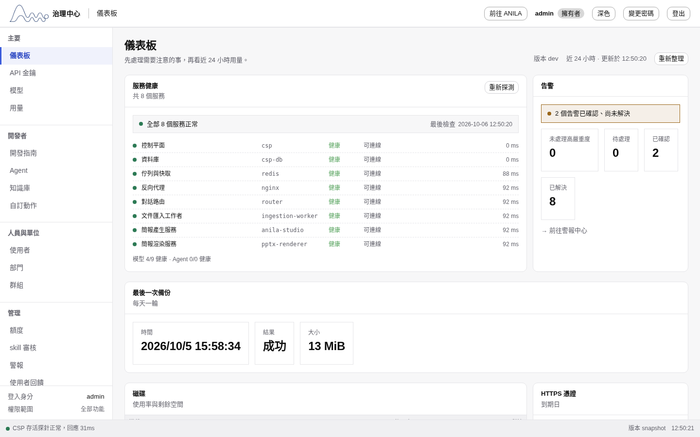
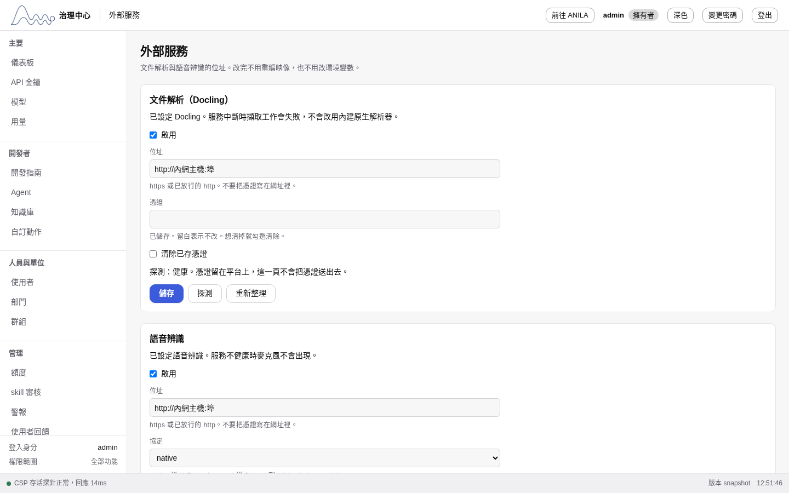

# 第一次安裝

在一台還沒有 ANILA 的內網主機上，從出貨包裝好平台並登入。之後的更新與回復見 [`UPDATE.md`](UPDATE.md)。

本文照 2026-09-30 在演練機 `172.16.120.35` 從零實裝的過程寫成，每一步都實際跑過。那次演練撞到的問題都已修進腳本，列在文末。

---

## 0. 需要什麼

| 項目 | 說明 |
|---|---|
| 出貨包 | 開發機打包產生的 `anila-YYYY.MM.DD-N.tar.gz`，約 4 GB。還要有打包結束時印出的 SHA256 |
| 主機 | Linux，Docker 與 docker compose 2.17 以上。跑預檢的帳號要能用 `docker`（通常在 `docker` 群組）；安裝與更新一律 `sudo` |
| sudo | 安裝、更新、回復都用 `sudo` 執行。平台的上傳與附件目錄屬於服務帳號，一般帳號做不了更新前的檔案快照 |
| 磁碟 | 安裝根目錄的上層（預檢檢查 `dirname /opt/anila`）與 Docker 存放目錄各留約出貨包的四倍，最少 20 GB（預檢取兩者較大；出貨包約 4 GB） |
| 模型 | 模型不在出貨包裡，由模型主機提供。安裝完才在治理中心登錄 |

---

## 1. 在開發機打包

工作目錄必須乾淨（`git status` 沒有變更）。在 repo 根目錄：

```bash
bash scripts/release/build-release.sh
```

有快取時約 20 分鐘，第一次或清過快取時更久。結束時印出：

```
<SHA256>  dist/releases/anila-YYYY.MM.DD-N.tar.gz
✓ 已產出 …
```

把 SHA256 抄下來，和壓縮檔一起帶進內網。

> 打包用隔離的 buildx builder `anila-pkg` 直接輸出映像，不經本機 Docker。
> 這台開發機的賽門鐵克 IDS 會弄壞本機 Docker 的映像層，舊的 `docker save` 做法會失敗。
> 清磁碟時若刪了 `buildx_buildkit_anila-pkg0_state`，只是快取沒了，下次打包會重建。

---

## 2. 主機準備（每台做一次）

把出貨包放到主機上，例如 `~/anila-YYYY.MM.DD-N.tar.gz`，先核對 SHA256：

```bash
sha256sum ~/anila-YYYY.MM.DD-N.tar.gz     # 要和打包時印出的值一樣
```

解開出貨包，跑預檢：

```bash
sudo mkdir -p /opt/anila
sudo tar -xzf ~/anila-YYYY.MM.DD-N.tar.gz -C /opt/anila
sudo bash /opt/anila/anila-YYYY.MM.DD-N/preflight.sh ~/anila-YYYY.MM.DD-N.tar.gz
```

預檢不改任何東西。每一條 `✗` 都附上要執行的指令，處理完再跑一次，直到最後一行是「全部通過」。

### 443 被別的服務佔用時

安裝與更新都固定先聽 443。443 沒人在聽，或已經是 `anila-nginx`，就用 443，不必事先寫埠。被別的程式佔用，或與 ANILA 的 HTTP、UI 埠相同，就自動改聽下一個空埠，從 8443 到 8450，不詢問。選中的埠寫進 `/opt/anila/state/.env` 的 `NGINX_HTTPS_PORT`（權限 600）。443 之後空出來，下一次安裝或更新會改回 443。

預檢看到 443 被佔用只會提醒，不會因此失敗。8443-8450 也都被佔用時，安裝才會停下。改走其他埠之後，網址要帶埠，例如 `https://<主機>:8443/`。

---

## 3. 第一次安裝

```bash
sudo bash /opt/anila/anila-YYYY.MM.DD-N/anila-update.sh /opt/anila/anila-YYYY.MM.DD-N
```

它先問站台名稱。HTTPS 埠固定先聽 443，被佔用才自動改走其他埠（見上一節）。

```
站台名稱 ANILA_HOST（院內這台的名稱或 IP）：
```

輸入同仁在瀏覽器要打的名稱或 IP。之後依序會看到：

| 階段 | 畫面 | 時間（演練機） |
|---|---|---|
| 核對 | 清單逐檔核對（`sha256sum -c` 的 `OK` 行）、`這台還沒有在跑的平台，略過公告與更新前備份` | 數秒 |
| 準備 | 問完站台名稱後寫站台設定、簽自簽憑證、產 JWT、對齊檔案所有權 | 數秒 |
| 載入映像 | 每個封存一行 `Loaded image: anila-bundle/…`（`images.tsv` 有 15 個相異封存） | 約 10 分鐘 |
| 密鑰 | `已產生密鑰，寫在 /opt/anila/state/generated-secrets.txt`，下一行是 `sudo cat`。畫面沒有密鑰內容 | 數秒 |
| 憑證 | `沒有現成的 TLS 憑證，先簽一張…的自簽憑證` | 數秒 |
| JWT | `已產生 JWT 簽章金鑰` | 數秒 |
| 埠 | `443 無法使用，HTTPS 埠自動改為 NNNN`，或 `HTTPS 埠改回 443` | 數秒 |
| 啟動 | 建網路、volume、容器，等資料庫與 CSP 健康；成功時印 `服務健康，CSP /health 正常` | 約 3 分鐘 |
| 入口 | `✓ 入口已開啟，登入頁回應 200` | |
| 完成 | `✓ 更新完成：none → YYYY.MM.DD-N` | |

`/opt/anila/state/generated-secrets.txt`（權限 600，root 執行時擁有者是 root）存著管理員密碼、`CSP_DB_PASSWORD`、`CSP_APP_DB_PASSWORD`、`SECRET_KEY` 與 code-server 密碼。畫面不印這些值。用安裝結束時印出的 `sudo cat /opt/anila/state/generated-secrets.txt` 讀，抄進密碼管理器。這個檔可以留著，也可以刪掉。

### 中途失敗時

照原樣再跑同一行指令。演練時第一次停在 JWT 那一步，修好後直接重跑就裝完了，不必先清任何東西。已產生的密鑰與憑證會沿用，不會重生。

失敗原因看畫面最後幾行，以及：

```bash
sudo cat /opt/anila/state/operations.log
sudo docker compose -f /opt/anila/current/compose.yaml -f /opt/anila/current/.anila-images.yml -p anila logs --tail 80 csp
```

---

## 4. 驗證

```bash
H=https://<主機>[:埠]
for p in / /anila/ /anilalm/ /asr/health /router/health; do
  printf '%-16s ' "$p"; curl -sk -o /dev/null -w '%{http_code} %{content_type}\n' "$H$p"
done
docker ps --filter name=anila- --format '{{.Names}}\t{{.Status}}'
```

`docker ps` 只列出運行中的容器。`csp-credential-dirs` 的標籤是 `anila.oneshot=true`，初始化做完就退出，不會出現在上面；`docker ps -a` 要看到它是 `Exited (0)` 才算正常（非 0 代表初始化失敗，健康檢查會擋下）。

演練機的結果（這就是正常）：

| 路徑 | 結果 |
|---|---|
| `/` | `200 text/html`（治理中心） |
| `/anila/` | `200 text/html`（同仁用的平台） |
| `/anilalm/` | `200 text/html` |
| `/asr/health` | `200 application/json` |
| `/router/health` | `200 application/json` |

看內容類型，不要只看 200：打錯的路徑也會回 `200 text/html`。平台自己的入口檢查（`entry_ready`）打的是 `/login`，同樣要 200。
`/asr/health` 還有一個例外：解碼端要等下面第 5 節第 4 步設定，在那之前它會回 503 + JSON（麥克風不出現），設定完才是 200。
運行中的容器不含 `csp-credential-dirs`（它已正常結束）。其餘服務應是 Up 或 healthy；`docker ps --filter name=anila-` 會列出 `anila-nginx` 與 `anila-<服務>-1`。

### 用管理員帳號登入

平台是插卡登入（安裝時寫死 `ANILA_AUTH_MODE=card-only`）。這個模式只放行 owner 用帳密登入，第一次播種的 `admin` 就是 owner，其他帳號填帳密一律收到 404。第一次沒有任何人註冊過，用管理員帳號進去：

1. 開 `https://<主機>[:埠]/login?show_alternatives=1`
2. 點「**其他登入方式**」，帳號密碼欄位才會出現
3. 帳號 `admin`，密碼是 `generated-secrets.txt` 裡的 `ADMIN_PASSWORD`

登入後會進 ANILA。治理中心在 ANILA 側欄；治理中心頂端的「前往 ANILA」可以回來。
治理中心儀表板應顯示這一版的版本號、服務健康全綠、最後一次備份成功。



---

## 5. 初始設定（登入後，依序）

安裝完的平台沒有任何模型與單位。以下每一項在畫面上都會標「需設定」或給空清單，不會靜默壞掉。

0. **信任主機**：內網模型與外部服務都在私有 IP，要先在治理中心「信任主機」加入每一台的 IP（例如模型主機、文件解析、語音解碼端）。沒加的話，註冊模型或設定外部服務會被拒絕。安裝時已開 `ANILA_ALLOW_PRIVATE_ENDPOINT`、`ANILA_ALLOW_HTTP_ENDPOINT`、`ANILA_ALLOW_HTTP_AGENT_ENDPOINT`、`ANILA_ALLOW_GRPC_ENDPOINT`。入向 Host 白名單不用另外設：`ALLOWED_HOSTS` 由安裝時輸入的 `ANILA_HOST` 推出來，compose 直接寫死 `${ANILA_HOST:?...},localhost,127.0.0.1,::1,csp,router,anila-studio,asr-gateway,ingestion-worker,ip-literal`。
   csp 開機時會用 `host allow-list: ENFORCED — N host(s)…` 或 `host allow-list: DISABLED` 其中一種字樣記一行（`docker logs <csp 容器> 2>&1 | grep "host allow-list:"`）；兩者都沒有代表開機沒走到那裡。
1. **模型**：治理中心「模型」→「註冊模型」，登錄模型主機提供的端點。然後在同一頁「模型角色」指定七個角色（畫面標籤）：主路由模型、平台嵌入模型、簡報模型、生圖模型、視覺模型、摘要模型、知識庫對話模型。沒指定主路由時，同仁只要沒在對話裡另選已授權的模型，第一個問題就會失敗（Router 只在未明確選模型時擋 `POST /v1/chat/completions`）。指定主路由時，若這顆模型還沒有有效的全院授權，而且操作者可以管理該模型的授權，平台會在同一筆交易裡建立「全院」授權並寫稽核，再完成指定。沒有授權管理權限時，到該模型的授權設定加入「全院」。
2. **單位**：治理中心「部門」建立單位清單。人資沒有這個人的單位時，同仁插卡仍要自己選；清單是空的就選不到。
3. **卡片首次擁有者**：把負責核准同仁的人的員工編號填進 `.env`（權限 600，用 `sudo` 編輯），再重建 CSP：
   ```bash
   cd /opt/anila/current
   # 編輯 /opt/anila/state/.env 的 CARD_INITIAL_OWNERS=員編1,員編2
   sudo docker compose -f compose.yaml -f .anila-images.yml -p anila up -d --no-build --pull never csp
   ```
4. **外部服務**：治理中心「外部服務」填文件解析（docling）與語音解碼端的位址。沒填時匯入用內建解析器、麥克風不出現。改完不用重編映像。


5. **HTTPS 憑證**：把院內正式憑證放到 `/opt/anila/state/certs/server.crt` 與 `server.key`（覆蓋自簽的那張），再重建入口：
   ```bash
   cd /opt/anila/current
   sudo docker compose -f compose.yaml -f .anila-images.yml -p anila up -d --no-build --pull never --force-recreate nginx
   ```
6. **人資資料庫**：治理中心「人資資料庫」填主機、埠、服務名稱、帳號、密碼與資料表，並啟用。Oracle 主機要先加到「信任主機」。兩個開關預設打開：人資有職稱的人成為自己單位的單位管理員，也取得降密審批權。要限特定職稱時，在「只限這些職稱」填上；留空表示任何職稱都算。沒填連線時，同仁第一次刷卡仍自己選單位。

code-server 與 n8n 的映像已載入，預設不啟動。要用時的指令在安裝結束時會印出，也寫在 [`UPDATE.md`](UPDATE.md)。

---

## 6. 目錄

| 路徑 | 內容 |
|---|---|
| `/opt/anila/current` | 指向目前版本的原始碼與 compose（`versions/<版本>`） |
| `/opt/anila/state/.env` | 設定與密鑰（600）。每個版本目錄的 `.env` 都連到這裡 |
| `/opt/anila/state/secrets/` | JWT 簽章金鑰 |
| `/opt/anila/state/certs/` | HTTPS 憑證 |
| `/opt/anila/state/share/` | 上傳檔、附件、更新前備份 |
| `/opt/anila/state/operations.log` | 每次更新、回復、認領的成功與失敗紀錄（600；第一次安裝記成 `none → 版本` 的 update） |
| `/var/lib/anila/install-anchor` | 安裝記錄（600）。存在時，更新只能對同一個根目錄與專案，也不會被改寫 |

---

## 附錄：2026-09-30 演練撞到並已修正的問題

第一次在另一台主機從零實跑打包與安裝。以下每一項在那之前都只被替身測試過。

| # | 問題 | 修正 |
|---|---|---|
| 1 | 443 被別的服務佔用時，入口檢查仍打 443，會把健康的安裝判成失敗 | 入口檢查跟 `NGINX_HTTPS_PORT` 走 |
| 2 | 打包從乾淨檢出建置，沒有 `.env`，compose 一開始就停 | 建置時給佔位值（不進映像） |
| 3 | 打包退回 `docker save`，會被賽門鐵克 IDS 弄壞 | 改回隔離 buildx builder 直接輸出 tar |
| 4 | 主機用 containerd 儲存時，載入後的映像 ID 與清單不同，每張都被拒 | 清單同時記兩種 ID，對上其一即可 |
| 5 | 映像私鑰掃描誤判 OpenSSL、Python 套件原始碼裡的標頭字串 | 標頭後要有金鑰內容才算；經 DeepSeek 安全審查補齊 PGP、SSH2、單行等寫法 |
| 6 | 上游套件自帶的測試金鑰在映像層裡 | 在帶進來的同一層刪掉；執行時需要的（gnutls 自我測試、ssh2 偵測金鑰）以路徑加雜湊放行 |
| 7 | 逐層掃描對 n8n 要跑七小時以上 | 每層只解一次；約 4 分鐘 |
| 8 | 原始碼封存只要出現「PRIVATE KEY」字樣就拒絕 | 用與映像掃描同一套規則 |
| 9 | 產生 JWT 時找開發機才有的映像名 `anila-csp:latest` | 改用載入時標的 `anila/csp:running` |
| 10 | 安裝程式把密鑰印在畫面上，導到檔案就留在檔裡 | 只寫進 `generated-secrets.txt`（600），畫面只印路徑與 `sudo cat` |

2026-10-01 在同一台演練「更新」（09.30-14 → 10.01-1），又撞到三個，都只有真的更新失敗才會走到：

| # | 問題 | 修正 |
|---|---|---|
| 11 | 更新前打包 studio 成品用的輔助映像名是開發機才有的 `anila-csp:latest` | 改用 `anila/csp:running` |
| 12 | 一般帳號讀不到服務帳號的上傳／附件目錄，檔案快照少一半卻沒停 | 安裝與更新改用 sudo；停服務前先檢查讀不讀得到；快照不完整就停 |
| 13 | 失敗後自動回復，服務都健康了卻等滿 300 秒、入口不開，平台整個連不上 | 健康判斷裡不帶數字的 `return` 在 EXIT trap 中回傳進 trap 前的結束碼；全部改明寫 |
