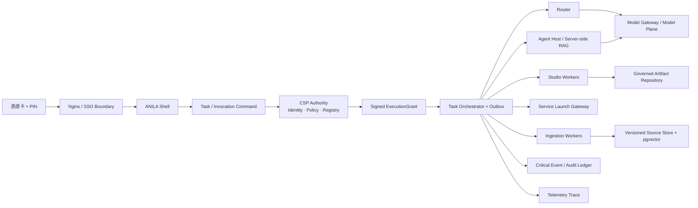

# ANILA `prod-intranet-card` 完整專案分析與決策建議

- 分析日期：2026-07-10
- 程式碼基準：`origin/prod-intranet-card@2d1bf08a99142109e28e41de8362e205749f08e8`
- 主要部署情境：中科院 NCSIST 內網、SSO／自然人憑證卡登入、可離線部署
- 分析方式：以實際程式碼、Compose、Nginx、migration、測試與執行入口為主；README 僅作意圖參考，不假設與現況完全一致。除產品北極星及先前明確允許的 Router 分析外，未以其他 docs 作為現況證據。

## 一、先給結論

ANILA 不需要推倒重寫，也不應再把重點放在「多加幾個 Agent、模型或工具」。目前最有價值的部分已經存在：憑證卡 CMS 驗證、CSP 治理資料模型、五級分類、Task／Trace／Artifact schema、RLS、SSRF guard、Ingestion、Studio 與 Service Registry。

真正問題是：**控制平面的概念比正式執行路徑成熟，但這些控制還不是不可繞過的系統不變式。**

現在的 ANILA 比較像「同一個 monorepo 內的多個能力型產品」：Shell、ANILA LM、治理 UI、Studio、Router、官方 RAG Agent、FLUX、Code Server、n8n、GitLab 各自可工作，但沒有共同遵守同一個 Task、身分 assurance、分類、SourceSnapshot、Artifact 與 Critical Event 交易契約。

因此我的正式判斷是：

| 問題 | 結論 |
|---|---|
| ANILA／anila-core 值不值得繼續投資 | 值得，但應「縮核、立約、接線」，不是繼續膨脹成 God Package |
| 附圖式 Agentic 流程能不能做 | 能；SSE parser、interrupt、todo、tool、span 元件已存在，但正式 UI 尚未接線，也未持久化成可恢復執行狀態 |
| `anila-agent` SDK 是否扎實 | 作為 Silver RAG starter 有中等成熟度；作為通用、正式、可治理 Agent SDK 尚不成立 |
| Ingestion 是否完善 | parser／chunk／embedding／hybrid search／relation／evaluation 的功能廣度高；交易可靠性、分類、快照可重現性與營運閉環不足 |
| `prod-intranet-card` 是否已可視為正式機敏 production | **No-Go**；可作受控「無機密」pilot 基礎，完成 P0 並通過正式驗收後才應處理機敏資料 |

最合理的產品定位不是另一個 ChatGPT、NotebookLM 或 Agent 市集，而是：

> **ANILA 是中科院內網的受治理任務工作空間。使用者只看見一個 ANILA；每一次正式工作都能回答誰做、用什麼來源、經過什麼政策、由誰／哪個模型執行、產出什麼、屬於哪個分級，以及是否可重現。**

## 二、這次實際看到的專案規模

排除 docs 與 reference-only `runtime_logic` 後，repo 仍約有：

- `services/`：552 個 tracked files。
- `packages/`：319 個 tracked files。
- `apps/`：230 個 tracked files。
- `infra/`：92 個 tracked files。
- 主要程式／設定約 16 萬行。
- 約 291 個測試檔，但分布不均，且沒有 repo-level CI pipeline。
- 正式 `infra/compose/platform.yml` 組裝 14 個服務：CSP DB、CSP、Redis、Ingestion Worker、Router、Nginx、PPTX Renderer、Studio、FLUX Agent、ANILA LM、ANILA Shell、Code Server、n8n、GitLab。
- CSP 本身約 28,109 行 Python、54 個 ORM table、222 個 HTTP route decorators、54 份 migration；再把所有 orchestration 責任同步塞進 CSP，會加深單點與變更風險。

另外，`prod-intranet-card` 與 `main` 在目前 tips 的程式碼幾乎相同；排除 docs／README 後，實際差異主要只剩 `.env.example`。正式分支把：

- `ANILA_ALLOW_DEV_SECRET=0`
- `ANILA_ALLOW_HTTP_ENDPOINT=0`
- `ENABLE_CARD_LOGIN=true`
- `REQUIRE_CARD_LOGIN_ONLY=true`

設為正式姿態。

這有一個重要含義：**中科院正式部署身份目前主要由可變環境設定決定，不是由不可變 release artifact 決定。** 長期不應把 branch name 當安全控制；應改成經簽章的 deployment profile、image digest、policy assertions 與 release attestation。

## 三、成熟度總覽

| 分域 | 程式碼能力 | 正式接線／營運 | 判斷 |
|---|---:|---:|---|
| 憑證卡密碼學 | 中高 | 中低 | CMS、CA chain、效期、nonce binding 有實作；session assurance、one-time、撤銷不足 |
| CSP 治理資料模型 | 中高 | 中低 | schema 很完整，但多條執行路徑可繞過或 fail-open |
| Task／Run orchestration | 中 | 低 | 有狀態模型，缺 submit/cancel/resume/events/recovery 與終態收斂 |
| Agentic UI | 中 | 低 | 元件與 event parser 已存在，正式 callsite 未接 |
| anila-core | 中高（library 素材） | 中低（正式主腦） | 能力多，但 package 邊界過寬、正式 consumer 不一致 |
| anila-agent | 中（RAG starter） | 低（通用 SDK） | 有安全與 RAG 基底，缺正式 host/runtime contract |
| Ingestion | 中高（功能） | 中低（可靠性／治理） | breadth 強，transaction、classification、snapshot、ops 弱 |
| Studio／Artifact | 中高（產出種類） | 低（durability） | 產出能力多，檔案、job、清單尚非 durable SSOT |
| Service Registry／專案入口 | 中（schema） | 低（實際 launch） | UI、seed、launch contract 存在阻斷錯誤與旁路 |
| 模型與 GPU 平面 | 中 | 中低 | 多種 backend 可用，但 ownership、gateway、GPU topology 未收斂 |
| 離線 release／DR／CI | 低至中 | 低 | 有部署腳本，但缺件、無簽章、無 CI、restore drill 不完整 |

## 四、我建議的整體架構判斷

### 4.1 不要再把 `anila-core` 視為一顆包辦一切的「主大腦」

ANILA 應有四種不同責任：

- CSP：身分、治理、權威資料與政策來源。
- Task Orchestrator：任務生命週期、重試、取消、resume、recovery。
- Router：基於能力、政策與上下文作 route decision。
- Agent／Worker：執行工具、RAG、Studio、Ingestion 或外部 Service。

`anila-core` 現在同時含 runtime、Router、memory、ingestion、storage、security、workspace、tools、CLI、compact、post-turn 與 API host。`packages/anila-core/src/anila_core/api/router_server.py` 超過 2,600 行；`build_app()` 卻只建立空的 `ToolRegistry`（`packages/anila-core/src/anila_core/app_factory.py:35-60`）。`RuntimeConfigPoller` 在正式 host 沒有 consumer，主要只在自身測試中出現。

而且 core 內已經有一個具七階段 loop、budget、tool、pause/resume、handoff 與 lifecycle hooks 的 `QueryEngine`（`packages/anila-core/src/anila_core/engine/query_engine.py:1-148`），正式 Router 卻完全沒有使用它，而是另寫一個大型狀態機，以 `DISPATCH:<agent>:<query>` 文字加 regex 決策。這是最明確的「雙大腦」：不是缺引擎，而是正式入口與既有引擎各自演化。

因此「強化 anila-core」的正確含義應是：

1. 先凍結新增能力。
2. 抽出穩定 contracts／security／runtime ports。
3. 讓正式 Router、Agent Host、Ingestion、Studio 真的共用這些 contract。
4. 對無 production consumer 的 compact、post-turn、filesystem memory、runtime poller 等能力設 sunset gate。

建議逐步切成：

- `anila-contracts`：Invocation、Task/Run/Event、Artifact、Trace、Classification schemas。
- `anila-security`：service auth、credential crypto、JWT verifier、SSRF guard。
- `anila-runtime`：tool loop、approval、cancel、resume、Session port。
- `anila-ingestion`：parser、chunker、citation／relation primitives。
- `anila-agent-sdk`：純 contracts 與 adapters。
- `anila-agent-host`：HTTP/SSE host、session、HITL、conformance。
- `anila-rag-agent`：官方 reference Agent，不再冒充 generic SDK。

這應以 compatibility facade 漸進抽離，不建議一次大重寫。

### 4.2 CSP 要保留權威，但不能繼續長成同步 God Service

邏輯不變式可以描述為：

```text
AuthSession
  → InvocationCommand
  → Policy / Classification Gate
  → Task / Run / StepEvent
  → Agent / Model / Service / Studio execution
  → Artifact / Memory
  → Critical Event Ledger + Trace
```

但實作上不應是一條由 CSP 同步控制、任何一步失敗就拖垮整體的線性 pipeline。Policy 與 classification 應在每個資料跨界點反覆檢查；audit critical events 與可丟失的 telemetry trace 也必須分開。

建議採 V2 Strangler：

1. `InvocationCommand` 在 CSP／Task API 內交易式建立。
2. 同一 DB transaction 寫 transactional outbox。
3. Policy 核准後簽發短效、不可竄改的 `ExecutionGrant`，包含 task/run/trace/source snapshot/classification/auth assurance/target/expiry。
4. Router、Agent Host、Studio、Ingestion 只接受有效 Grant。
5. worker 以 idempotency key 消費，將 critical events 寫入 outbox／ledger。
6. UI 從持久化 Task Event projection 顯示進度；SSE 只是傳輸方式，不是唯一真相。



## 五、產品面：現在不是四個入口，而是四個沒有共享交易的區域

### 5.1 任務中心仍是「聊天優先、Task 可失敗」

Shell 在 Task 建立失敗時明確降級成無 Task 模式（`apps/anila-shell/src/runtime/tasks.js:18-62`），正式聊天照常派發。Task ID 又只放 React conversation state（`apps/anila-shell/src/app.jsx:434-451`）；Conversation API 沒回傳 active Task，重新整理後下一句可能再建一個 Task。

TaskRun 完成時只關閉 Run，沒有可靠地把 Task 收斂到 completed／failed／cancelled（`services/csp/app/modules/tasks/service.py:322-348`；`services/csp/app/services/proxy/task_link.py:201-235`）。Task API 也只有 create/list/get/runs，沒有 submit、cancel、resume、events、wait。

正式模式應改成：

- 無 Task 就不得派發；只有明確標記的 sandbox 才能 taskless。
- Conversation server response 必須帶 active task/run/trace。
- 每個 Run 終態必須交易式收斂 Task。
- orphan/stuck run 有 heartbeat、lease 與 reconciler。

### 5.2 附圖式 Agentic 流程可以做，但現在是「零件存在、產品沒接線」

Shell 已經有：

- `anila.interrupt_requested`
- `anila.resumed`
- `anila.todos_updated`
- `anila.tool_call_started`
- `anila.tool_call_finished`
- `anila.spans`
- session ID 與 resume helper

證據在 `apps/anila-shell/src/runtime/sse.js:32-85`、`apps/anila-shell/src/agentic.jsx`、`apps/anila-shell/src/toolExecution.jsx`。但 `app.jsx` 的正式 streaming callsites 沒有接入 interrupt、todo、tool、spans、session callbacks。

不必重做 UI；應建立單一 `TaskExecutionState` reducer，將每個 plan step、tool call、approval、handoff、artifact、retry、terminal result 持久化。頁面重整或服務重啟後，UI 由 event projection 還原，而不是依賴當下 SSE。

在「單 Agent 可取消、可 resume、可重啟恢復、可產出 artifact」通過前，應暫停自由式 multi-agent／swarm 擴張。

### 5.3 ANILA LM 應變成 ANILA 的知識／產出模組，而不是另一個產品

ANILA LM 目前有自己的 auth store、artifact store、workspace flow 與 UI chrome。它把 access/refresh JWT 持久化到 `localStorage`（`apps/anilalm/src/store/auth.ts:27-31, 103-109`），與 Shell／Governance 的 cookie-first 方向不一致；artifact 也存到不分使用者的 `anilalm:artifacts`（`apps/anilalm/src/store/artifacts.ts:5-8, 37-98`），登出未清除此 store。

在共用憑證卡工作站，這會造成 token 與前一位使用者產出殘留風險。應統一：

- 同一 HttpOnly cookie + CSRF auth adapter。
- 同一 Shell chrome 與 TaskContext。
- 「ANILA LM」改為「我的知識庫／產出中心」模組名稱。
- browser localStorage 只作短期、user-scoped、無敏感內容 cache。

## 六、身分、憑證卡與信任邊界

### 6.1 值得保留的部分

卡片 path 不是假 SSO。Backend 實際驗證 CMS signature、message digest、nonce eContent、signer cert、釘選 CA chain 與有效期（`services/csp/app/services/card_auth.py:118-390`）。Cookie 使用 HttpOnly／Secure，card-only posture 下可採 Strict；RS256／JWKS、CSRF、token revocation infrastructure 與 startup secret checks 也有良好素材。

### 6.2 正式阻斷

1. 卡片、密碼、OIDC 最終都呼叫相同 `create_tokens(user)`；JWT 只有 `sub/username/role/token_version`，沒有 `sid/jti/amr/acr/auth_time/credential_id/break_glass`（`services/csp/app/services/auth_service.py:55-66`）。下游無法區分實體卡 + PIN 與 owner 密碼。
2. card-only 仍永久允許 owner 密碼登入（`services/csp/app/api/auth/password.py:90-173`），不是受時限、雙人核准的 break-glass。
3. challenge 與 registration token 是 stateless JWT，沒有 JTI consume store；同一 challenge + signature 在 TTL 內可重放（`services/csp/app/services/card_auth_service.py:64-151`）。
4. 程式明示不做 CRL／OCSP；也沒有 cert fingerprint／serial lifecycle、換卡與離職停權閉環（`services/csp/app/services/card_auth.py:30-31`）。
5. `_finalize_login()` 設 HttpOnly cookie 後又把 access/refresh token 回在 JSON（`services/csp/app/api/auth/_common.py:43-51`）；refresh 沒有 token family、rotation reuse detection。
6. `CARD_DEV_SKIP_NONCE_BINDING` 沒有 production startup hard gate；`cht/` 與部分測試又含看似真實的員編／卡號／固定簽章測材，應以 synthetic CA 重建並評估 history 清理。

建議建立 server-side `AuthSession`：卡片 session 寫入 `amr=["hwk","pin"]`、`acr`、`auth_time`、credential fingerprint、`sid/jti`；break-glass 是獨立短效 session，雙人核准、來源限制、用後旋轉並寫 critical audit。

## 七、分類、分享、記憶、快照與稽核

### 7.1 五級分類 schema 存在，但有數條 fail-open 路徑

- Public share 仍看 legacy `classified` boolean；此 boolean 只在 level ≥ 機密時為 true，因此「營業秘密」仍可能建立未登入分享 token（`services/csp/app/services/conversation_service.py:374-400`；`services/csp/app/api/public_share.py:41-73`）。`ENABLE_PUBLIC_SHARE` 預設為 true，正式 compose 沒明確關閉。
- Proxy 在分類傳遞失敗時 log 後繼續 dispatch；ceiling 對 invalid／missing 回 `UNCLASSIFIED`，target 沒 ceiling 直接放行（`services/csp/app/services/proxy/ceiling.py:44-84`）。
- `UserFact` 沒五級分類或來源 provenance；機密對話抽出的 facts 可能成為無分類 memory，再以 system prompt 層級注入其他 Agent／模型（`services/csp/app/models/user_memory.py:41-139`；`services/csp/app/services/memory_service.py:311-377, 523-595`）。這同時造成分類洗白與 stored prompt injection。

正式內網應立即關閉 unauthenticated public share；unknown／invalid classification 一律拒絕或視為最高等級。Memory 必須保存來源、分類、Task／Artifact／Conversation provenance，且 recalled data 明確標為 untrusted context，不能升格成平台指令。

### 7.2 SourceSnapshot 與 Citation 目前不是可重現證據

`SourceSnapshot` schema 有 `document_ids/chunk_ids/document_versions/retrieval_queries/content_hash/payload_ref`，但正式寫入程式只在 Task 建立時放 `collection_ids` 與分類（`services/csp/app/modules/tasks/service.py:160-195`）。全 repo 未看到 production path 填入實際檢索的 chunk、版本、hash；`Citation` ORM 也只有測試建立，正式 ANILA LM citations 是塞在 message metadata。

因此現在的查詢仍讀 live chunks；文件刪除或重建 index 後，過去回答無法以同一來源重現。正式 SourceSnapshot 應在 retrieval 後 seal：

- query normalization 與 retrieval query。
- collection/document/version/content hash。
- exact chunk IDs、score、quote span。
- embedding model／index version／reranker version。
- 最高分類與 policy decision。
- immutable snapshot hash。

### 7.3 Trace 不能代替合規 audit

Router、官方 Agent、Studio 的 trace sender 多為 drop-and-log；CSP audit 也是 fail-soft，普通可變資料表。正式要求的 Full Trace 必須分兩層：

- Critical Event Ledger：身份、政策、分類、approval、tool mutation、artifact/export、terminal state，不可遺失，transactional outbox + append-only/tamper-evident。
- Telemetry Trace：模型 span、latency、token、debug；可以 sampling，但遺失須有 gap marker。

目前正式 Compose 未設定 Router `ANILA_TRACE_ENDPOINT`，Router 預設 trace 是 no-op；session DB 預設 `./.anila/sessions.db` 又沒有 volume，container recreate 後 resume ownership 會消失。

## 八、`anila-agent` 與 Agent 開發者轉型標準

`anila-agent` 的優點包括 OpenAI Agents SDK 精確 pin、air-gap 下關閉預設 OpenAI tracing、CSP HTTP retrieval、service-token 驗證、policy guardrail、grounding、per-user memory 基底。

但正式 wrapper 只取最後一則 user message、沒有把 Session 傳入 `run_once()`、強制 collection id、`/v1/models` 只是 legacy manifest，沒有 HTTP cancel／resume／HITL／idempotency／step events。`runtime/runstate.py` 還示範呼叫不存在的 `run_once_state()`。因此它的正確定位是「官方 Silver RAG reference agent」，不是已完成的通用 SDK。

對 Agent 開發者，應用一份可測的轉型契約，而不是口頭要求：

| 契約 | 最低要求 |
|---|---|
| Manifest | agent id/version/capabilities/classification ceiling/tool permissions/event versions/readiness |
| Inbound auth | per-service credential 或 CSP signed grant；禁止全 fleet 共用 secret |
| Invocation | 必帶 task_id/run_id/trace_id/source_snapshot_id/classification/auth assurance/idempotency key |
| Event | run.started、plan.updated、retrieval、tool started/finished、approval.requested、artifact.created、usage、completed/failed |
| Lifecycle | cancel、pause、resume、timeout、restart recovery |
| Data | 不直連 CSP DB；經 CSP API／正式 ports；所有 retrieval 有 snapshot/citation |
| Artifact | 檔案先寫 Artifact Repository，再回傳 artifact/version id；不得回 public filesystem URL |
| Trace/Audit | Full Trace 本地 spool + retry；critical events 必 ack |
| Health | liveness、readiness、dependency health、manifest/conformance endpoint |
| 測試 | 官方 conformance harness 全過才可進 approval；auto-seed 只能 pending，不能 approved |

## 九、Ingestion：能力很廣，但還不是 production 閉環

### 9.1 值得保留

- content hash 去重、50 MB cap、ZIP path/size 防護。
- 多 parser、OCR／VLM caption 選項、hierarchical／semantic 等 chunker。
- embedding、pgvector + RLS、hybrid search、parent-child retrieval。
- cross-document citation、LLM relation、similarity relation。
- chunking evaluation 與 judge scoring。
- structured `IngestionError` taxonomy、job progress SSE、失敗重送入口。

這些說明 Ingestion 不是半成品 demo；其「功能 breadth」是全專案較強的一塊。

### 9.2 P0 缺口

1. 初次 upload 先 commit document，再 enqueue，最後才建立 `ingestion_jobs`（`services/csp/app/api/ingestion/documents.py:270-321`）。Redis enqueue 失敗會留下 pending orphan；worker 也可能在 job row commit 前完成，造成狀態永遠 queued。應改 transactional outbox／DB-first job identity。
2. Worker 重試政策固定 `max_tries=3`，連 non-retryable error 也重跑（`services/ingestion-worker/src/ingestion_worker/main.py:14-21, 63-72`）。parents／leaves 分開 insert，沒有 replace/upsert transaction；partial write 後重試會撞 unique，counter 也可能重複累加（`handlers.py:769-827`；`pgvector_store.py:106-190, 289-348`）。
3. `_update_job()` 更新失敗直接吞掉（`handlers.py:620-649`），沒有 orphan reconciler、DLQ、worker heartbeat／healthcheck。
4. Collection／Document 雖有分類欄，但 create/response/UI 沒分類；新 collection 預設無機密，document 上傳不可靠地繼承 collection，chunk write/search response 也沒有完整分類 chain。
5. SourceSnapshot 不 seal 實際 document/chunk/version；搜尋永遠讀 live index，無法重現。
6. Upload 只信 request MIME／副檔名，未看到 quarantine、magic-byte validation 或離線 malware scanner；正式 parser/LibreOffice 邊界需要內容掃描。
7. Redis `--appendonly no`；queue 與 job projection 在 crash 後可遺失。
8. Collection 可宣告 embedding model/dimension，但 worker 使用 global model/dimension，缺 enqueue 前後的一致性 hard check。
9. 大量 chunks 以單一 embedding batch 處理；50 MB 文件可能遇到 endpoint payload/OOM，需 bounded batches、checkpoint 與 resume。

### 9.3 其他會讓資料逐漸失真的問題

- `bytes_stored` 沒有被正式更新；delete 不會可靠減少 collection counters，原始 blob／derived images 的清理也不完整。
- `document_ids` filter 是在全 collection top-k 搜尋後才於 Python 過濾；指定文件的最佳 chunk 若沒進全域 top-k，會錯誤回空。
- archived collection 仍可 upload／reprocess，只在 search 時拒絕，並非真正封存。
- 正式 image 安裝 parser `[rag]`，但 PPTX／XLSX 依賴的 Docling 與掃描 PDF OCR 沒在 production compose 形成可保證能力。
- Collection 目前只有 owner/admin，沒有 project／department／organization grant；產品聲稱的專案／組織來源尚無實際 ACL 模型。

### 9.4 Ingestion 目標流

```text
Upload Intent
→ quarantine + magic/MIME/malware scan
→ DB transaction: document version + ingest command + outbox
→ durable queue
→ parse checkpoint
→ bounded chunk/embed batches
→ staging index
→ atomic version switch + counters
→ relation jobs
→ seal SourceSnapshot / provenance
→ searchable readiness
```

每個 stage 需有 idempotency、lease、heartbeat、retryable taxonomy、DLQ、補償與 reconciler。Collection scope 也要從 owner-only 擴成 personal／project／organization grants，而不是先把共享能力塞在前端。

## 十、Studio、Artifact 與產出中心

Studio 有 Slides、Report、Mindmap、Infographic、Datatable 五類 pipeline，PPTX renderer 也有 CJK、payload cap、path traversal 等實作，值得保留。

但五套 job manager 主要用 `asyncio.create_task()` 與 process memory；Redis 只存 status projection。Slides `pptx_bytes` 只在 RAM，每 user 最多 8 筆、1 小時清除；process restart 後 status 可能仍在，download 卻 404（`services/anila-studio/app/services/studio_job_service.py:54-149`；`services/anila-studio/app/services/job_store.py:54-87`；`services/anila-studio/app/api/studio.py:824-872`）。

正式 Artifact Service 不應只管 metadata，必須同時成為 physical bytes authority：

- content-addressed blob、hash、size、MIME。
- owner/grant、Task／Snapshot binding、classification。
- version、retention、delete、export policy。
- authenticated download 或極短效 signed URL。
- Studio durable queue、lease、checkpoint、orphan reconciliation。
- artifact registration 以 outbox 保證，不得 report 失敗後靜默吞掉。

## 十一、專案入口與 Service Registry

Service Registry 的 schema、classification ceiling、launch claim 方向正確，但正式接線有多個阻斷：

- Governance UI 建立服務送 `url`，Backend 必填 `entry_url`，create 會 422、update endpoint 不會真的改 URL（`apps/csp-governance-ui/src/views/PlatformLinksView.vue:380-397`；`services/csp/app/schemas/registered_service.py:49-65`）。UI 還呼叫不存在的 purge／GET audit-callback APIs。
- Compose auto-seed 的 ANILA／ANILA LM／Code Server／n8n／GitLab 多為 relative URL，Launch API 只接受 absolute HTTP(S)，Shell 又優先走 Registry launch；多數卡片會 launch 400（`infra/compose/platform.yml:133-140`；`services/csp/app/services/auto_seed.py:50-89`；`services/csp/app/api/services.py:110-140`）。
- Launch JWT 放 URL query、10 分鐘可重放，`consumed_at` 未實作；Task 可省略、classification 可由 caller 自報。
- `/codeserver`、`/n8n`、`/gitlab` 仍可直接開，完全繞過 Registry、Task、classification 與 CSP SSO。

目標應是 one-time launch code + back-channel exchange + service session。所有 direct path 都需 `auth_request`／OIDC／Launch BFF；沒有合法 launch session 就拒絕。Project Entry 必須承接目前 Task、SourceSnapshot、Trace 與分類。

## 十二、模型、Router 與 FLUX

目前至少存在三套 model calling abstraction：anila-core provider、官方 Agent 的 OpenAI Agents SDK model、CSP proxy 自己的 httpx path。官方 Agent 還可依自身 model config 直連 endpoint，繞過 CSP Model Gateway；Registry 的 base model／ceiling 因而不一定能約束真實執行。

CSP Gateway 本身有值得保留的安全骨架：呼叫前再做 SSRF／TOCTOU 驗證、Agent/Model 分流 headers、per-model secret、retry、usage 與 Task attribution。不過 model admission 只看 active/permission，不看真實 readiness；health checker 又把任何 `<500`（包括 401/403）視為 healthy。它尚缺 per-model concurrency、load shedding、circuit breaker、deadline 與同分類 fallback。

FLUX 又同時在 platform compose 與 models compose 部署一份 `flux2-dev-agent`，同掛 `anila-models-net` 且 alias 相同、backend 不同。CSP 連 `http://flux2-dev-agent:8000` 時可能命中不同容器。應明確由一個 stack 擁有 Agent adapter，model stack 只擁有 image backend。

此外：

- image-generator 由 env auto-seed 成 approved，繞過 Full Trace approval。
- FLUX Agent inbound 無正式 service auth，生成圖走公開 `/uploads/flux`，無 owner／Task／分類／expiry。
- 預設 air-gap bundle 未包含 platform compose 所需的 FLUX Agent image，但 deploy 使用 `--no-build`。
- repo README 宣告 FLUX.2-dev 為 BFL Non-Commercial；正式啟用前需法務確認，不能由工程自行假設可用。
- model groups 有 GPU index 重疊風險，啟動整組時可能讓兩個大型模型競爭同一 GPU。

預設 topology 的衝突是具體的：trial group 同時讓 `gpt-oss-20b` 與 FLUX 使用 GPU 2；intranet group 同時讓 `gemma4` 與 `gpt-oss-120b` 使用 GPU 3（`infra/models/docker-compose.yml:49-50, 111-112, 238-270, 414-434`；`infra/deployment/intranet/model-serve.sh:26-27`）。正式部署應改用可驗證的 topology manifest，啟動前檢查 GPU UUID、VRAM budget 與互斥條件。

短期應建立一個 Model Gateway authority：所有正式 Agent 經 gateway 取得 provider；Registry target、classification ceiling、usage、health 與實際 endpoint 一致。對需要直連的特殊服務，必須由 signed ExecutionGrant 明示例外。

## 十三、正式部署與營運

### 13.1 目前最直接的阻斷

1. CSP runtime 同時拿 `csp_app` URL 與 PostgreSQL superuser migration URL；RCE 可直接繞過 RLS。Migration 要拆成一次性 job，runtime 不得持有 superuser credential。
2. Alembic 失敗時 CSP catch-all 後 `Base.metadata.create_all()` 繼續啟動（`services/csp/app/main.py:106-114`）；正式環境應 fail-stop。
3. Code Server 把整個 repo 可寫掛入，只遮 `.env` 與 TLS key；正式 deploy 產生的 `secrets/jwt-private.pem` 未遮，取得 Code Server 密碼即可簽 owner JWT（`infra/compose/platform.yml:485-508`；`infra/deployment/scripts/deploy-prod.sh:233-248`）。
4. 14 個服務大多共用 default network；Redis 無 auth/TLS/AOF，工具服務可橫向碰 DB／queue。
5. Air-gap bundle 沒有完整 compose image closure；checksum 與 tar 同包、缺 checksum 時仍繼續，沒有可信 release signature、SBOM、digest pinning。
6. Deploy 對分支錯誤、CSP unhealthy、Nginx 不通多為 warning，最後仍印部署完成；沒有 card、Router、ingestion、Studio artifact、service launch、restore smoke。
7. Repo 沒有 GitHub/GitLab/Jenkins CI workflow。ANILA LM 與 Governance UI 甚至沒有 test script。
8. 備份只覆蓋部分 DB／env／JWT；uploads 要額外 flag，n8n／GitLab 不完整，restore 主要只處理 DB，沒有自動 restore drill、PITR、異機／加密備份。

### 13.2 建議的正式 release gate

- clean tree + exact commit + signed tag。
- `prod-intranet-card` posture assertions 或更好的 signed intranet profile。
- image digest lock、SBOM、漏洞掃描、license inventory。
- offline bundle detached signature；缺簽章直接停止。
- migration dry run + backup + restore rehearsal。
- compose image closure test。
- card challenge／replay／revoked-card smoke。
- Task→Router/Agent→Trace→Artifact E2E。
- ingestion upload→index→snapshot→search→delete/replay E2E。
- restart／crash recovery、queue durability、artifact download E2E。
- 任一必要服務失敗，deploy 非零退出，不宣告完成。

## 十四、程式碼品質與額外發現

### 14.1 測試數量不低，但缺「組合後的真實契約」

Card crypto、Router、Agent、Studio、CSP 各自有不少 unit tests；但實際抽樣顯示「大量測試」不等於 release gate：

| 範圍 | 實際結果 | 解讀 |
|---|---|---|
| anila-core 全套 | 770 passed、6 failed、7 skipped | Router signature contract、hierarchical chunker、Windows/scaffold 測試有 drift |
| anila-core ruff | 22 errors | 宣告有 lint 設定，但未形成 gate |
| anila-core strict mypy | 99 errors／26 files | 型別契約未閉合 |
| anila-agent ruff | passed | 局部品質較整齊 |
| anila-agent strict mypy | 66 errors／26 files | strict 設定沒有實際守門 |
| ingestion-worker | 146 passed | helper/unit breadth 佳，但測試明載未覆蓋完整 `ingest_document` pipeline |
| core ingestion focused | 48 passed、1 failed | parent/leaf 重構後 contract/test drift |
| PostgreSQL RLS focused | 6 skipped | 無 integration DB，正式 RLS 未在本次環境驗證 |
| Card crypto/RS256/startup security core | 36 passed | 密碼學核心有基礎 |
| broader card/cookie/docs suite | 53 passed、12 failed | 10 個固定 CMS/nonce endpoint tests 與 2 個 docs-gating tests 漂移 |

Core package version 也有三個真相：`pyproject.toml` 是 `0.14.0`、`anila_core.__version__` 是 `0.7.0`、Router FastAPI version 是 `0.1.0`。Router Dockerfile 用 `pip install .`，沒有消費已存在的 `uv.lock`，正式 build 並不可重現。

最需要的不是再加 isolated unit test，而是：

- frontend OpenAPI generated clients／contract tests。
- compose seed→list→launch E2E。
- Task/source snapshot/citation/artifact E2E。
- worker partial failure／retry／crash／restart tests。
- signed air-gap fresh install + restore test。
- formal security posture test。

### 14.2 大型 god files 與 tracked scraps 增加維護成本

- `apps/anila-shell/src/app.jsx` 約 2,600 行。
- `packages/anila-core/src/anila_core/api/router_server.py` 約 2,600 行。
- `services/pptx-renderer/server.js` 約 1,700 行。
- Governance／Studio／Ingestion 也有多個 800–1,400 行檔案。
- `scraps/` 仍 tracked 約 9,000 行舊 UI／backup；`myCSPPlatform` 只剩 0-byte `.codex`；`cht/` 是獨立測試 harness。

建議先建立 contract 與 E2E，再按 bounded context 拆檔；不要先做純機械重構。`scraps`、舊品牌、真實測材應移到受控 archive 或完全移除，避免維護與資訊暴露。

### 14.3 分支不是安全邊界

因為 main 與 prod code 幾乎相同，未來最佳模式是單一 code line + 多個簽章 deployment profile，而不是六條長期 branch 人工 cherry-pick。短期仍以 `prod-intranet-card` 作 SSOT，但要加自動 patch parity、posture assertion 與 release manifest。

## 十五、保留、整併、停止

### 保留並強化

- Card CMS／CA／nonce server verification。
- CSP 作為 identity、policy、registry、classification authority。
- RLS、credential crypto、SSRF guard、JWKS／revocation。
- Task／TaskRun、Artifact／Version／Export、Agent approval 的資料模型。
- Shell 四入口骨架與 Agentic UI 元件。
- Ingestion parser/chunker/search/evaluation 能力。
- Studio 五類產出與 PPTX renderer。
- CSP HTTP retrieval boundary。

### 整併／收斂

- Shell、ANILA LM、Governance 的 auth 與 TaskContext。
- 三套 provider/model call abstraction。
- CSP/core/official Agent 的 InvocationContext。
- Task run、Agent run、Studio job、Ingestion job 的 event envelope。
- 多套 long-term memory 與 classification policy。
- Artifact metadata 與 physical blob authority。
- PlatformLink 與 RegisteredService。
- 五套 Studio in-process job manager。
- FLUX Agent 唯一 ownership。
- per-service credentials、service auth middleware。

### 立即停止或凍結

- 正式環境 unauthenticated public share／public uploads。
- taskless 正式 execution。
- localStorage token／artifact SSOT。
- auto-seed approved Agent。
- URL query launch JWT。
- production `create_all` fallback。
- Code Server 掛整個 repo。
- Code Server／n8n／GitLab 預設隨正式平台啟動。
- 新增 Agent 類型、Artifact 類型、memory 功能與自由 multi-agent，直到單 Agent 主流程可恢復。
- 把 `anila-agent` 宣稱為通用 SDK。
- 未接線模組繼續擴充。

## 十六、建議路線圖

以下假設至少有 2 名 backend、2 名 frontend、1 名 platform/SRE、1 名 QA/security；人力較少時應延長，不應壓縮 gate。

### Gate 0：0–4 週，正式環境止血

- 關閉 public share、public uploads、Code Server／n8n／GitLab 正式 default profile。
- 拆 migration job／runtime DB credential；migration fail-stop。
- 修 Code Server secret exposure、Docker network segmentation。
- card challenge JTI consume、revocation/denylist、break-glass gate。
- Browser cookie-only；移除 JSON/browser refresh token 與 ANILA LM localStorage token。
- 修 air-gap image closure、signature、digest、deploy fail-closed。
- 建最小 CI：backend tests、三個 frontend build/typecheck、contract smoke。

**出口條件：** 沒有未登入資料 path；卡片 replay 被拒；fresh air-gap install 可重複；migration/health 失敗會停止。

### Gate 1：第 2–3 個月，建立單一產品交易

- Task mandatory、server-side Task hydration、terminal convergence。
- InvocationCommand + ExecutionGrant + outbox。
- Agentic event reducer 與持久化 StepEvent。
- Router session durable、trace endpoint／spool 正式啟用。
- Server-side RAG；Browser 不再自行拼 prompt。
- Seal SourceSnapshot、正式寫 Citation。
- Artifact Repository + authenticated download。
- Studio durable worker、checkpoint、outbox。

**出口條件：** 從任務中心切到知識／產出／專案入口仍是同一 Task、Snapshot、分類與 Trace；重啟後可續跑或明確失敗。

### Gate 2：第 3–6 個月，能力平台化

- 抽 `anila-contracts/security/runtime`，保留 compatibility facade。
- `anila-agent-sdk`／`anila-agent-host`／reference Agent 分離。
- Agent conformance harness 與 approval gate。
- Ingestion outbox、staging index、atomic switch、DLQ、reconciler、分類繼承。
- personal/project/organization knowledge scope。
- Service Launch one-time exchange、direct route 全面收口。
- Model Gateway authority、FLUX ownership 與 GPU topology 收斂。

**出口條件：** 新 Agent 不需改 CSP/Router 即可接入，且 conformance／classification／trace／restart tests 全過。

### Gate 3：第 6–12 個月，正式營運成熟

- HA／容量規劃、SLO、metrics、alerting、central logs。
- Audit ledger hash chain／簽章匯出／WORM sink。
- backup/PITR/異機 restore drill、RTO/RPO 驗證。
- offline dependency mirror、SBOM/CVE/license gate。
- 分級模型容量與 failover。
- 治理營運工作台：stuck Tasks、trace gaps、artifact failures、declassification、service callback、Agent approval。
- 只有通過以上條件後，才引入受控 multi-agent／planner-worker。

## 十七、正式 Go／No-Go 驗收標準

至少要同時滿足：

1. 所有正式 action 都有有效 AuthSession、Task、Run、Trace。
2. 每個 Task 最終必為 completed／failed／cancelled；無永久 running orphan。
3. classification unknown／propagation failure 一律 fail-closed。
4. 每個 retrieval 可重現 exact source version/chunk/citation。
5. 每個 artifact 有 owner、Task、Snapshot、classification、version、hash。
6. Browser 不持久化 access/refresh token 或跨使用者 artifact。
7. 直接開 tool/service URL 無合法 session 一律拒絕。
8. 卡片 challenge 不可重放；撤銷卡／離職人員不可登入。
9. Agent／Studio／Ingestion 在 restart 後可 resume、retry 或確定終止。
10. Full Trace 若遺失有 gap marker；critical audit event 不可 drop。
11. Fresh air-gap bundle 可完整啟動所有必要服務，image、config、SBOM、簽章可驗證。
12. Restore drill、RTO/RPO、容量與故障演練通過。
13. Repo CI 對正式分支自動執行 build、unit、contract、E2E、security posture 與 deploy smoke。

## 十八、最終取捨

ANILA 現在最不缺的是功能想法，最缺的是「任何人都繞不過的共同交易」。

所以我不建議下一季再做新的 Agent、市集、更多模型、更多產出類型或更自由的多 Agent。應把工程資源集中在五條主幹：

1. AuthSession／憑證卡 assurance。
2. Task／Run／Event orchestration。
3. Classification／SourceSnapshot／Citation。
4. Artifact durability／export governance。
5. Signed release／restart recovery／audit ledger。

完成這五條後，ANILA 會從「很多能力放在一起」變成真正有中科院部署價值的受治理 AI 工作平台。若不先完成，即使 Router 更聰明、Agent 更多、UI 更像附圖，風險與操作斷裂只會一起放大。
