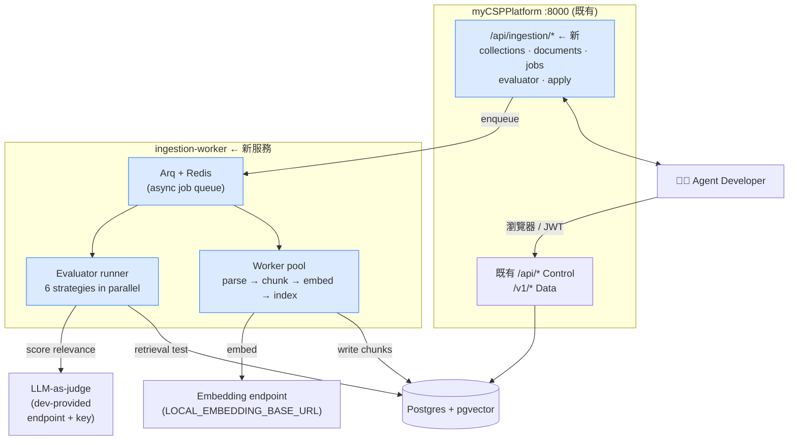
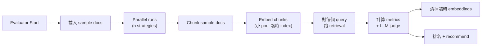
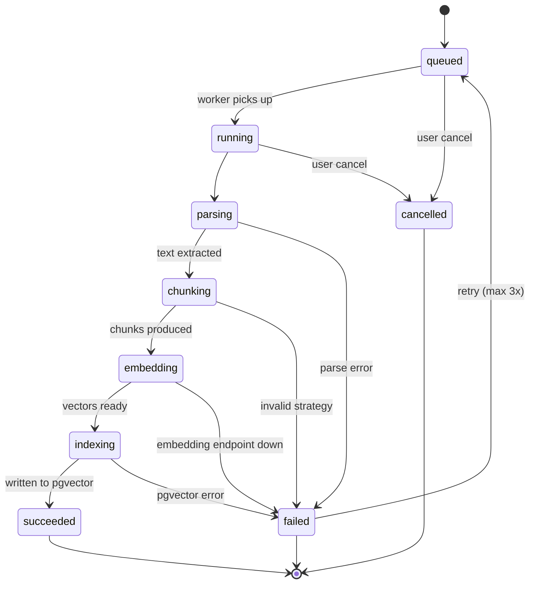

# ANILA Ingestion Platform — Design Doc v0.1

**Status**: Draft for review
**Date**: 2026-04-24
**Author**: ANILA 平台團隊
**Reviewers**: (待指派)
**Target delivery**: 3 × 2-week sprints after sign-off

---

## 1. 動機與定位

### 1.1 現況問題

平台目前已有 **~10 個 agent**（含 AgenticRAG 與各 fork 變體），規劃一年內擴張到 **~100 個全院 agent**。在現況架構下，每個 agent 開發者都要：

- 自己連 pgvector、自己寫 schema migration
- 自己跑 `index_documents.py` 或等效 CLI 處理文件
- 自己選 chunking strategy（通常是「預設就好」，沒有 benchmark）
- 自己管 embedding endpoint、重試、錯誤處理
- 自己處理檔案上傳 UI（如果有）

**這會撞到三道牆**：
1. **不可擴展**：100 個 agent × 每人 2 週摸 pgvector = 4 人年的重複工
2. **不可控**：平台無從 audit「誰上傳了什麼到哪」；機敏資料洩漏時無 trace
3. **不可優化**：每個 dev 靠直覺挑 chunking，沒有 data 證據；檢索品質天差地遠

### 1.2 本 Design 要解的事

提供 **Ingestion-as-a-Service**：

- Dev 在 CSP UI 的「Knowledge Collections」分頁上傳檔案、選 chunking、看 embed 進度
- Chunking 有 6 種 built-in preset + plug-in interface 讓未來擴充
- **Chunking Evaluator**：上傳 sample docs + eval queries → 跑所有 strategies → data 證據挑最佳
- 資料 per-agent 嚴格隔離（機敏 guarantee）
- LLM-as-judge 的 LLM 由 dev 自選 + 自帶 API key（平台不替 dev 背付費）

### 1.3 明確排除

- ❌ Dev 上傳任意 Python code 跑在平台 infra（gVisor sandboxing 成本 > 收益；改走 chunking evaluator 這條路）
- ❌ 跨 agent collection 共享（機敏隔離要求）
- ❌ Token / chunk / storage quota（組內使用不限制，per 你的決策）
- ❌ 多租戶 pgvector cluster（單一 pg cluster + `agent_id` filter 夠用至 100 agent × 10M chunks）

---

## 2. 架構總覽



### 2.1 為什麼拆 `ingestion-worker` 服務？

把 ingestion 放 FastAPI request handler 裡會要命：

- 100 頁繁中 PDF 的完整處理 ≈ 1-3 分鐘（parse + chunk + embed 800 chunks × NV-Embed 延遲）
- Chunking Evaluator 跑 6 strategies ≈ 5-10 分鐘
- 10 個 dev 同時送 = CSP FastAPI worker 全部卡住、整個 control plane 掛掉

獨立 worker 給我們：
- 背景 async（dev UI 看進度條而非阻塞）
- Horizontal scale（Redis queue 天然支援多 worker）
- 失敗重試 / dead letter 機制
- Ingestion 慢不會影響 CSP control plane

### 2.2 技術選型

| 層面 | 選 | 理由 |
|---|---|---|
| Job queue | **Arq** (https://github.com/samuelcolvin/arq) | async-native、FastAPI 作者寫的、依賴只有 Redis、無 Celery 的 broker hell |
| Queue broker | **Redis 7** | CSP 部署已有 PostgreSQL，加 Redis 成本低；advisory lock 做 idempotency |
| Worker runtime | Python 3.11 + asyncio | 跟 anila-core 一致；用 `anila-core.ingestion` primitives |
| Deployment | Docker container + compose service `ingestion-worker` | 跟 CSP 一起跑，共享 Postgres 網路 |

---

## 3. 資料 Schema

### 3.1 CSP 新增 tables（Alembic migration `0012`）

```sql
-- 每個 agent 的 ingestion collection（一個 agent 可以多個 collection，例如「法規」「SOP」分開）
CREATE TABLE ingestion_collections (
    id                    BIGSERIAL PRIMARY KEY,
    agent_id              BIGINT NOT NULL REFERENCES agents(id) ON DELETE CASCADE,
    name                  TEXT NOT NULL,
    description           TEXT,
    chunking_config       JSONB NOT NULL,
        -- { "strategy": "hierarchical", "max_leaf_tokens": 1024, "overlap_tokens": 64, ... }
    embedding_model       TEXT NOT NULL,
        -- 通常 = platform default (nvidia/NV-embed-V2)，可 override
    embedding_dim         INT NOT NULL,
    status                TEXT NOT NULL DEFAULT 'active',
        -- active / archived / indexing / failed
    document_count        INT NOT NULL DEFAULT 0,
    chunk_count           INT NOT NULL DEFAULT 0,
    bytes_stored          BIGINT NOT NULL DEFAULT 0,
    created_by            BIGINT NOT NULL REFERENCES users(id),
    created_at            TIMESTAMPTZ NOT NULL DEFAULT now(),
    updated_at            TIMESTAMPTZ NOT NULL DEFAULT now(),
    UNIQUE (agent_id, name)
);

CREATE INDEX idx_collections_agent ON ingestion_collections(agent_id);

-- 每一個上傳的文件
CREATE TABLE ingestion_documents (
    id                    BIGSERIAL PRIMARY KEY,
    collection_id         BIGINT NOT NULL REFERENCES ingestion_collections(id) ON DELETE CASCADE,
    filename              TEXT NOT NULL,
    sha256                CHAR(64) NOT NULL,   -- dedup within collection
    mime_type             TEXT,
    bytes                 BIGINT,
    status                TEXT NOT NULL DEFAULT 'pending',
        -- pending / parsing / chunking / embedding / indexed / failed
    chunk_count           INT DEFAULT 0,
    error_message         TEXT,
    uploaded_by           BIGINT REFERENCES users(id),
    uploaded_at           TIMESTAMPTZ NOT NULL DEFAULT now(),
    indexed_at            TIMESTAMPTZ,
    UNIQUE (collection_id, sha256)
);

CREATE INDEX idx_documents_collection_status ON ingestion_documents(collection_id, status);

-- Async ingestion jobs (Arq 的 job 也記錄到這，方便 UI 看進度)
CREATE TABLE ingestion_jobs (
    id                    BIGSERIAL PRIMARY KEY,
    arq_job_id            TEXT UNIQUE,   -- Arq 內部 job id
    collection_id         BIGINT NOT NULL REFERENCES ingestion_collections(id) ON DELETE CASCADE,
    document_id           BIGINT REFERENCES ingestion_documents(id),   -- NULL for batch
    job_type              TEXT NOT NULL,   -- ingest / reindex / evaluate / apply_strategy
    status                TEXT NOT NULL DEFAULT 'queued',
        -- queued / running / succeeded / failed / cancelled
    progress_pct          SMALLINT DEFAULT 0,
    progress_message      TEXT,
    error_message         TEXT,
    enqueued_by           BIGINT REFERENCES users(id),
    enqueued_at           TIMESTAMPTZ NOT NULL DEFAULT now(),
    started_at            TIMESTAMPTZ,
    completed_at          TIMESTAMPTZ
);

CREATE INDEX idx_jobs_collection_status ON ingestion_jobs(collection_id, status);

-- Chunking Evaluator runs
CREATE TABLE ingestion_eval_runs (
    id                    BIGSERIAL PRIMARY KEY,
    collection_id         BIGINT NOT NULL REFERENCES ingestion_collections(id) ON DELETE CASCADE,
    name                  TEXT NOT NULL,
    sample_document_ids   BIGINT[] NOT NULL,
    strategies_tried      JSONB NOT NULL,
        -- [{ "name": "hierarchical", "params": {...} }, ...]
    queries               JSONB NOT NULL,
        -- [{ "query": "...", "expected_doc_id": N, "expected_chunk_id": "...", "source": "manual|llm_synth|judge_only" }, ...]
    judge_llm_config      JSONB NOT NULL,
        -- { "endpoint": "...", "model": "...", "api_key_ref": "csp_user_key:123" }
    status                TEXT NOT NULL DEFAULT 'queued',
    results               JSONB,
        -- { "strategy": { "hit_at_1": 0.72, "hit_at_5": 0.91, "mrr": 0.81, "ndcg_10": 0.85, "avg_chunk_tokens": 512, "ingest_seconds": 45 }, ... }
    recommended_strategy  TEXT,
    created_by            BIGINT REFERENCES users(id),
    created_at            TIMESTAMPTZ NOT NULL DEFAULT now(),
    completed_at          TIMESTAMPTZ
);

-- Dev 提供的 LLM-as-judge credentials（加密儲存）
CREATE TABLE agent_llm_credentials (
    id                    BIGSERIAL PRIMARY KEY,
    agent_id              BIGINT NOT NULL REFERENCES agents(id) ON DELETE CASCADE,
    name                  TEXT NOT NULL,
    endpoint_url          TEXT NOT NULL,
    model_name            TEXT NOT NULL,
    api_key_encrypted     BYTEA NOT NULL,   -- AES-256-GCM，key = CSP_SECRET_KEY derived
    api_key_nonce         BYTEA NOT NULL,
    last_used_at          TIMESTAMPTZ,
    created_by            BIGINT REFERENCES users(id),
    created_at            TIMESTAMPTZ NOT NULL DEFAULT now(),
    UNIQUE (agent_id, name)
);
```

### 3.2 pgvector 資料表（per-collection physical isolation optional）

```sql
-- 所有 agent 共享同一張 document_chunks，靠 (agent_id, collection_id) 做 logical filter
CREATE TABLE document_chunks (
    id                    BIGSERIAL PRIMARY KEY,
    collection_id         BIGINT NOT NULL REFERENCES ingestion_collections(id) ON DELETE CASCADE,
    agent_id              BIGINT NOT NULL,   -- denormalized from collections，for fast filter
    document_id           BIGINT NOT NULL REFERENCES ingestion_documents(id) ON DELETE CASCADE,
    chunk_key             TEXT NOT NULL,     -- hierarchical id, e.g. "doc123/ch1/sec2/para5"
    content               TEXT NOT NULL,
    embedding             vector(4096) NOT NULL,
    metadata              JSONB,             -- heading_path / page / parent_content / etc.
    token_count           INT,
    created_at            TIMESTAMPTZ NOT NULL DEFAULT now(),
    UNIQUE (collection_id, chunk_key)
);

-- 強制 retrieval 一定走 agent_id 的 partial index
CREATE INDEX idx_chunks_agent_retrieval ON document_chunks
    USING ivfflat (embedding vector_cosine_ops)
    WITH (lists = 100);

CREATE INDEX idx_chunks_agent_collection ON document_chunks(agent_id, collection_id);

-- Keyword search index (hybrid)
CREATE INDEX idx_chunks_content_fts ON document_chunks
    USING gin (to_tsvector('simple', content));
```

### 3.3 機敏隔離強制：middleware 層 agent_id filter injection

Agent query pgvector 時：

```python
# anila_core.storage.adapters.pgvector_store (新增)
class AgentScopedPgVectorStore:
    def __init__(self, pool, agent_id: int):
        self._pool = pool
        self._agent_id = agent_id   # 從 CspServiceTokenMiddleware 注入

    async def similarity_search(self, query_embedding, k=5, collection_id=None):
        # agent_id filter 強制注入，dev 的 code 無法繞過
        where = ["agent_id = $1"]
        args = [self._agent_id]
        if collection_id:
            where.append(f"collection_id = ${len(args) + 1}")
            args.append(collection_id)

        sql = f"""
            SELECT content, metadata, 1 - (embedding <=> $2) AS similarity
            FROM document_chunks
            WHERE {' AND '.join(where)}
            ORDER BY embedding <=> $2
            LIMIT {k};
        """
        ...
```

Dev 拿不到未綁 agent_id 的 store object。這層保證是 **機敏隔離的 enforcement 點**。

---

## 4. API Contract

### 4.1 Collection 管理

```http
POST /api/ingestion/collections
Content-Type: application/json
Authorization: Bearer <jwt>

{
  "agent_id": 42,
  "name": "legal-regulations",
  "description": "陸海空軍懲罰法、國軍要則",
  "chunking_config": {
    "strategy": "hierarchical",
    "params": { "max_leaf_tokens": 1024, "overlap_tokens": 64 }
  },
  "embedding_model": "nvidia/NV-embed-V2"
}

→ 201 Created
{ "id": 17, "agent_id": 42, "name": "legal-regulations", ... }
```

```http
GET /api/ingestion/collections?agent_id=42
→ 200 [ { "id": 17, ..., "document_count": 34, "chunk_count": 2981 } ]
```

```http
DELETE /api/ingestion/collections/{id}
→ 202 Accepted  (enqueue cascade delete job)
```

### 4.2 文件上傳（單檔 / 資料夾 zip）

```http
POST /api/ingestion/collections/{id}/documents
Content-Type: multipart/form-data

files=@doc1.pdf
files=@doc2.docx
files=@folder.zip
preserve_folder_structure=true

→ 202 Accepted
{
  "accepted": 3,
  "rejected": 0,
  "jobs": [
    { "job_id": 1001, "document_id": 501, "filename": "doc1.pdf", "status": "queued" },
    { "job_id": 1002, "document_id": 502, "filename": "doc2.docx", "status": "queued" },
    { "job_id": 1003, "document_id": 503, "filename": "folder.zip", "status": "queued", "note": "zip will be expanded" }
  ]
}
```

### 4.3 Job 進度查詢（UI polling 用）

```http
GET /api/ingestion/jobs/{job_id}
→ 200
{
  "id": 1001,
  "status": "running",
  "progress_pct": 47,
  "progress_message": "embedding chunks 235/500",
  "started_at": "2026-04-24T10:22:15Z"
}
```

或 SSE 串流（避免 polling）：

```http
GET /api/ingestion/jobs/{job_id}/stream
→ 200 Content-Type: text/event-stream

data: {"status": "parsing", "progress_pct": 10}
data: {"status": "chunking", "progress_pct": 25, "chunks_so_far": 156}
data: {"status": "embedding", "progress_pct": 47, "chunks_embedded": 235}
data: {"status": "succeeded", "progress_pct": 100, "total_chunks": 500}
```

### 4.4 Chunking Evaluator

**Step 1 — 啟動 eval**：
```http
POST /api/ingestion/collections/{id}/evaluator
{
  "name": "baseline vs semantic chunker",
  "sample_document_ids": [501, 502, 503],
  "strategies": [
    { "name": "hierarchical", "params": {} },
    { "name": "fixed", "params": { "size": 512, "overlap": 64 } },
    { "name": "fixed", "params": { "size": 1024, "overlap": 128 } },
    { "name": "markdown-aware", "params": {} },
    { "name": "pdf-page", "params": {} },
    { "name": "cjk-sentence", "params": {} }
  ],
  "queries": [
    { "query": "記過的條件", "expected_doc_id": 501, "source": "manual" },
    { "query": "第八條是什麼", "expected_doc_id": 501, "expected_chunk_key": "doc501/art8", "source": "manual" }
  ],
  "synth_queries_count": 50,
  "judge_llm_credential_id": 7
}

→ 202 Accepted
{ "eval_run_id": 33, "status": "queued", "estimated_seconds": 480 }
```

**Step 2 — 看結果**：
```http
GET /api/ingestion/evaluator/{run_id}/results
→ 200
{
  "status": "completed",
  "results": [
    {
      "strategy": "hierarchical",
      "metrics": {
        "hit_at_1": 0.72,
        "hit_at_5": 0.91,
        "mrr": 0.81,
        "ndcg_10": 0.85,
        "llm_judge_relevance_avg": 2.4,
        "avg_chunk_tokens": 487,
        "chunks_per_doc": 31,
        "ingest_seconds_per_doc": 1.2
      },
      "rank": 1
    },
    { "strategy": "fixed-1024", "metrics": {...}, "rank": 2 },
    ...
  ],
  "recommended_strategy": "hierarchical",
  "per_query_breakdown_url": "/api/ingestion/evaluator/33/queries"
}
```

**Step 3 — 套用**：
```http
POST /api/ingestion/evaluator/{run_id}/apply
{ "reindex_existing_documents": true }
→ 202 Accepted
{ "job_id": 1099, "message": "Reindexing 34 documents with strategy=hierarchical" }
```

### 4.5 LLM Credentials（dev 自帶的 judge LLM）

```http
POST /api/ingestion/agents/{agent_id}/llm-credentials
{
  "name": "openai-gpt4-judge",
  "endpoint_url": "https://api.openai.com/v1",
  "model_name": "gpt-4-turbo",
  "api_key": "sk-..."
}
→ 201 { "id": 7, "api_key": null }   # 只回 id，key 不 echo 回來
```

---

## 5. Chunking Plug-in Interface

### 5.1 核心抽象

```python
# anila_core.ingestion.chunking_plugins.base
from abc import ABC, abstractmethod
from dataclasses import dataclass
from typing import Any

@dataclass
class ChunkResult:
    content: str
    metadata: dict[str, Any]
    token_count: int
    chunk_key: str   # hierarchical id

class ChunkerStrategy(ABC):
    """Base class for all chunking strategies.

    Subclasses register themselves via @register_chunker decorator.
    """

    name: str                          # e.g. "hierarchical", "fixed"
    display_name: str                  # e.g. "Hierarchical (heading tree)"
    default_params: dict[str, Any]
    param_schema: dict[str, Any]       # JSON schema for UI form generation

    @abstractmethod
    def chunk(
        self,
        document_text: str,
        metadata: dict[str, Any],
        params: dict[str, Any],
    ) -> list[ChunkResult]:
        """Chunk one document. Must be deterministic given same input."""
        ...

    def estimate_chunks(self, document_text: str, params: dict[str, Any]) -> int:
        """Fast estimate for UI preview (default: rough token count / avg_size)."""
        return len(document_text) // (params.get("size", 1024) * 4)
```

### 5.2 Registration

```python
# anila_core.ingestion.chunking_plugins
from functools import wraps

_REGISTRY: dict[str, type[ChunkerStrategy]] = {}

def register_chunker(cls: type[ChunkerStrategy]) -> type[ChunkerStrategy]:
    if cls.name in _REGISTRY:
        raise ValueError(f"Chunker '{cls.name}' already registered")
    _REGISTRY[cls.name] = cls
    return cls

def get_chunker(name: str, params: dict) -> ChunkerStrategy:
    if name not in _REGISTRY:
        raise KeyError(f"Unknown chunker: {name}. Available: {list(_REGISTRY)}")
    return _REGISTRY[name](**params)

def list_chunkers() -> list[dict]:
    return [
        {"name": cls.name, "display_name": cls.display_name, "param_schema": cls.param_schema}
        for cls in _REGISTRY.values()
    ]
```

### 5.3 6 個 built-in strategies

```python
# anila_core.ingestion.chunking_plugins.builtins

@register_chunker
class HierarchicalChunker(ChunkerStrategy):
    name = "hierarchical"
    display_name = "Hierarchical (heading tree)"
    default_params = {"max_leaf_tokens": 1024, "overlap_tokens": 64}
    param_schema = {
        "type": "object",
        "properties": {
            "max_leaf_tokens": {"type": "integer", "minimum": 128, "maximum": 8192},
            "overlap_tokens": {"type": "integer", "minimum": 0, "maximum": 512},
        },
    }
    def chunk(self, text, metadata, params):
        # 既有實作 — 搬自 anila_core.ingestion.chunker.HierarchicalChunker
        ...

@register_chunker
class FixedChunker(ChunkerStrategy):
    name = "fixed"
    display_name = "Fixed-size (token-based)"
    default_params = {"size": 1024, "overlap": 128}
    ...

@register_chunker
class MarkdownAwareChunker(ChunkerStrategy):
    name = "markdown-aware"
    display_name = "Markdown-aware (headings + code blocks)"
    ...

@register_chunker
class PdfPageChunker(ChunkerStrategy):
    name = "pdf-page"
    display_name = "PDF page boundaries"
    ...

@register_chunker
class CjkSentenceChunker(ChunkerStrategy):
    name = "cjk-sentence"
    display_name = "CJK sentence-aware"
    default_params = {"target_tokens": 512, "sentence_merge": True}
    ...

@register_chunker
class SemanticChunker(ChunkerStrategy):
    name = "semantic"
    display_name = "Semantic boundaries (embedding distance)"
    default_params = {"breakpoint_percentile": 85, "min_chunk_tokens": 256}
    # 需要 embedding callback，見實作
    ...
```

### 5.4 Third-party plug-in（future）

```python
# 自己的 package agentic_rag_custom/chunkers.py
from anila_core.ingestion.chunking_plugins import register_chunker, ChunkerStrategy

@register_chunker
class LegalClauseChunker(ChunkerStrategy):
    """切法律條文，保留「第 X 條 X 項」結構。"""
    name = "legal-clause"
    display_name = "Legal clause boundaries"
    ...
```

`pip install agentic-rag-custom` 後自動 register。Dev UI 看到這個 strategy 就多一個選項。

---

## 6. Chunking Evaluator 工作流詳解

### 6.1 Pipeline



### 6.2 Metrics 計算

| Metric | 定義 | 需要什麼 |
|---|---|---|
| **Hit@k** | Top-k 結果中有包含 expected 的比例 | manual 或 synth 的 golden set |
| **MRR** | Mean Reciprocal Rank | 同上 |
| **NDCG@10** | Normalized Discounted Cumulative Gain | 同上 + graded relevance（0-3 分） |
| **LLM-judge relevance** | LLM 對每個 retrieved chunk 給 0-3 分，取平均 | dev-provided LLM endpoint + key |
| **Avg chunk tokens** | 每個 chunk 的 token 數中位數 | - |
| **Chunks per doc** | 每份文件平均切幾個 chunk | - |
| **Ingest seconds per doc** | Ingestion 時間（含 chunk + embed） | - |

最終分數：`0.4 * hit_at_5 + 0.3 * mrr + 0.3 * llm_judge_avg_normalized`，權重可調。

### 6.3 Golden set 的三種來源（dev 可混用）

**A. Manual queries（最準，dev 輸入）**
```json
{ "query": "記過的條件", "expected_doc_id": 501, "expected_chunk_key": "doc501/art23/sec2", "source": "manual" }
```

**B. Synthetic queries（零成本，LLM 反生）**
對每份 sample doc，用 dev-provided LLM 生 3-5 題：
```
System: 根據以下文件片段，生成 3 題可以從此片段回答的繁中問題。
Document excerpt: ...
Output JSON: [{"query": "...", "answer_hint": "..."}]
```
→ 每題自動關聯其來源 doc_id + chunk_key

**C. LLM-as-judge only（無 golden，只靠 judge）**
Dev 只提供 query 不提供 expected：
```
System: 評估以下 chunk 對 query 的 relevance（0=無關, 3=完全回答）
Query: "記過的條件"
Chunk: "第二十三條 記過 3 次視同記大過..."
Output: {"score": 3, "reason": "..."}
```
只能算 LLM judge metric，無法算 Hit/MRR。

### 6.4 LLM-as-judge 的成本與穩健性

- 單次 eval run：~50 queries × 6 strategies × top-5 = 1500 judge calls
- 若用 GPT-4 級 LLM ~$0.02/call → ~$30/run（dev 付）
- 若用地端 llama 70b → ~免費但慢（~20 分鐘）
- 建議預設 temperature=0 + few-shot 固定評分量表避免 judge drift

---

## 7. Dev UI Wireframe

### 7.1 新分頁「Knowledge Collections」（在 Developer Console 內）

```
╔═══════════════════════════════════════════════════════════════════╗
║ [My Agents] [Knowledge Collections] [LLM Credentials] [Usage]    ║
╟───────────────────────────────────────────────────────────────────╢
║ Agent: [my-legal-rag ▾]                      [+ New Collection]  ║
╟───────────────────────────────────────────────────────────────────╢
║ ┌─────────────────────────────────────────────────────────────┐   ║
║ │ 📚 legal-regulations                                        │   ║
║ │    陸海空軍懲罰法、國軍要則                                  │   ║
║ │    34 docs · 2,981 chunks · 147 MB                          │   ║
║ │    Strategy: hierarchical (1024/64)                          │   ║
║ │    [Upload] [Evaluate] [Reindex] [Settings] [Delete]        │   ║
║ └─────────────────────────────────────────────────────────────┘   ║
║ ┌─────────────────────────────────────────────────────────────┐   ║
║ │ 📚 internal-sop        (indexing: 12/45 docs...)            │   ║
║ │    ...                                                      │   ║
║ └─────────────────────────────────────────────────────────────┘   ║
╚═══════════════════════════════════════════════════════════════════╝
```

### 7.2 Upload dialog

```
╔══════════════════════════════════════════════╗
║ Upload to: legal-regulations                 ║
╟──────────────────────────────────────────────╢
║  Drag files here, or [browse]                ║
║  [📄 contract-v3.pdf  2.4 MB    ✕]          ║
║  [📄 sop-manual.docx  540 KB    ✕]           ║
║  [📦 policy-folder.zip 18 MB    ✕]           ║
║                                              ║
║  ☐ Preserve folder structure (zip only)      ║
║  ☐ Deduplicate by SHA-256                    ║
║                                              ║
║                [Cancel]   [Upload 3 files]   ║
╚══════════════════════════════════════════════╝
```

### 7.3 Evaluator wizard

```
Step 1/4 — Sample documents
  ☑ contract-v3.pdf
  ☑ sop-manual.docx
  ☐ ... (23 more)         [Select all] [Select 10 random]

Step 2/4 — Eval queries
  ┌──────────────────────────────────────────────┐
  │ Query                    │ Expected source   │
  ├──────────────────────────────────────────────┤
  │ 記過的條件               │ contract-v3.pdf   │
  │ 第八條是什麼              │ [auto-detect ▾]   │
  │ [+ Add query]                                │
  └──────────────────────────────────────────────┘
  ☑ Also generate 50 synthetic queries (LLM reverse-gen)
  ☑ Use LLM-as-judge for graded relevance

Step 3/4 — Strategies to compare
  ☑ hierarchical (default params)
  ☑ fixed-size 512      [Edit params]
  ☑ fixed-size 1024     [Edit params]
  ☑ markdown-aware
  ☑ pdf-page
  ☑ cjk-sentence
  ☐ semantic            (requires embedding-based split)

Step 4/4 — Judge LLM
  ○ Use my openai-gpt4-judge         [$0.02/call × ~1500 = ~$30]
  ○ Use my local-llama-70b           [Free, ~20 min]
  ● [+ Add new LLM credential]

                              [Cancel]  [Start Eval (~8 min)]
```

### 7.4 Results page

```
Eval run #33 — "baseline vs semantic chunker"   Completed · 7m 42s
━━━━━━━━━━━━━━━━━━━━━━━━━━━━━━━━━━━━━━━━━━━━━━━━━━━━━━━━━━━━━━━━━
Recommended: hierarchical  ✓ [Apply to collection]

┌──────────────────┬──────┬──────┬──────┬──────────┬──────────┬────────┐
│ Strategy         │Hit@1 │Hit@5 │ MRR  │Judge avg │Chunks/Doc│Ingest/s│
├──────────────────┼──────┼──────┼──────┼──────────┼──────────┼────────┤
│ hierarchical 🏆  │ 0.72 │ 0.91 │ 0.81 │   2.4    │    31    │  1.2   │
│ fixed-1024       │ 0.64 │ 0.88 │ 0.74 │   2.1    │    18    │  0.8   │
│ cjk-sentence     │ 0.61 │ 0.85 │ 0.71 │   2.3    │    52    │  1.5   │
│ markdown-aware   │ 0.58 │ 0.82 │ 0.68 │   2.0    │    24    │  1.0   │
│ pdf-page         │ 0.55 │ 0.79 │ 0.63 │   1.9    │    12    │  0.6   │
│ fixed-512        │ 0.53 │ 0.81 │ 0.65 │   1.8    │    38    │  1.1   │
└──────────────────┴──────┴──────┴──────┴──────────┴──────────┴────────┘

[View per-query breakdown]  [Export CSV]  [Re-run with new queries]
```

---

## 8. Job State Machine



**Retry 規則**：
- Parse failure → 不重試（檔案壞了不會變好）
- Embedding failure → 重試 3 次 w/ exponential backoff（通常是 transient）
- pgvector failure → 重試 3 次
- Unknown failure → 1 次 + dead letter

---

## 9. Sprint Plan（6 週交付）

### Sprint 1（2 週）— Foundation

**Goal**: 有最小可用的 ingestion API（不含 evaluator、不含 UI）

- [ ] Alembic migration `0012`（4 張新 table）
- [ ] `anila_core.ingestion.chunking_plugins` 基礎抽象 + registry + 3 個 built-in strategies（hierarchical / fixed / markdown-aware）
- [ ] CSP `/api/ingestion/collections` CRUD（同步 API，不含 job queue）
- [ ] `ingestion-worker` 基礎骨架（Arq + Redis + 1 個 handler: `ingest_document`）
- [ ] Docker Compose 加入 `redis` + `ingestion-worker` service
- [ ] `document_chunks` pgvector schema + `AgentScopedPgVectorStore`
- [ ] pytest 整合測試：上傳 1 PDF → 7 秒內看到 chunks in pgvector

**Deliverable**：CLI / curl 可以 create collection、upload 1 file、query chunks

### Sprint 2（2 週）— Async & More Strategies

**Goal**: 完整的 async pipeline + 6 個 strategies + 基本 UI

- [ ] 剩下 3 個 chunkers（pdf-page / cjk-sentence / semantic）
- [ ] `POST /api/ingestion/.../documents` multipart + zip 展開
- [ ] Job 進度 SSE endpoint
- [ ] CSP Developer UI 新分頁「Knowledge Collections」
- [ ] Upload dialog + job progress list + collection CRUD UI
- [ ] `agent_llm_credentials` table + CRUD + AES-256-GCM 加密儲存
- [ ] E2E smoke test：UI 上傳 → 看到進度 → done → agent 能檢索

**Deliverable**：一般 dev 可以完全透過 UI 完成 collection 建立與文件上傳

### Sprint 3（2 週）— Evaluator

**Goal**: Chunking Evaluator + apply workflow

- [ ] `ingestion_eval_runs` table
- [ ] Evaluator job handler（parallel strategies）
- [ ] Synthetic query generation（LLM 反生）
- [ ] LLM-as-judge scoring
- [ ] Metrics aggregation（Hit@k / MRR / NDCG / judge avg）
- [ ] Apply workflow（reindex with chosen strategy）
- [ ] Evaluator UI wizard 4 steps + results page + per-query breakdown
- [ ] Load test：5 個 dev 同時跑 eval → 確認 queue throughput

**Deliverable**：Dev 按一個 button 就能選出最佳 chunking strategy，從頭到尾 UI 完成

---

## 10. 風險與 Mitigation

| 風險 | 嚴重度 | Mitigation |
|---|---|---|
| Dev 的 LLM API Key 洩漏 | 🔴 高 | AES-256-GCM 加密儲存；僅 ingestion-worker 能解密；audit log 所有使用 |
| 100 agent × 大量 doc = pgvector 容量爆炸 | 🟡 中 | 監控 `pg_database_size`；加 storage quota warning（不限制 only warn）；預留 partition by agent_id 路徑 |
| IVFFlat index 在 10M+ rows 變慢 | 🟡 中 | Sprint 4 evaluate 換 HNSW index（`pgvector` 0.5+）|
| Evaluator 跑太久 dev 等到睡著 | 🟡 中 | 預設只用 20 queries × 6 strategies，估 5-10 min；提供「fast mode」= 10 queries × 3 strategies |
| LLM-judge drift（同樣 chunk 不同分數） | 🟡 中 | temperature=0 + few-shot 量表 + 每題 judge 3 次取中位數 |
| 機敏資料跨 agent 洩漏 | 🔴 高 | `AgentScopedPgVectorStore` 強制 filter；pytest 專門寫 "agent A 無法查到 agent B 的 chunk" 測試 |
| Dev 誤刪別 agent 的 collection | 🔴 高 | API 層 verify `agent.owner_user_id == caller.user_id` 或 caller 是 admin |

---

## 11. Open Questions for Kickoff

這些不影響 sprint 1 起步，但 sprint 2 前需要回答：

1. **Redis 部署**：獨立 `redis` 容器，還是用 CSP 已有的（若有）？預估記憶體 512 MB 夠用
2. **ingestion-worker 副本數**：預設 1，流量起來要不要 auto-scale？100 agent 預估峰值 ~5 concurrent jobs
3. **Evaluator 的 LLM judge 成本**：組內 dev 自付還是 CSP 代付？若代付要加 usage tracking
4. **Reindex 時舊 chunks 處理**：原地 replace、還是保留舊的 + 新版本並存（A/B test 機會）？
5. **Delete collection 是 soft 還是 hard**？soft-delete 30 天後才清 pgvector？

---

## 12. 非目標（Out of Scope v0.1）

留給 v0.2+：

- 🔮 Real-time document sync（Confluence/SharePoint webhook 自動同步）
- 🔮 Multi-modal（圖片單獨 search、audio transcript）
- 🔮 Cross-agent federated search（需要機敏 label 系統先做）
- 🔮 Chunking strategy 熱插拔（目前要重啟 worker 才 load 新 plug-in）
- 🔮 Golden set 的版本控制（query set 變動時比較 eval 結果的方法）
- 🔮 Fine-tune embedding model（per-domain adaptation）

---

**Last updated**: 2026-04-24 · **Next review**: Sprint 1 kickoff
