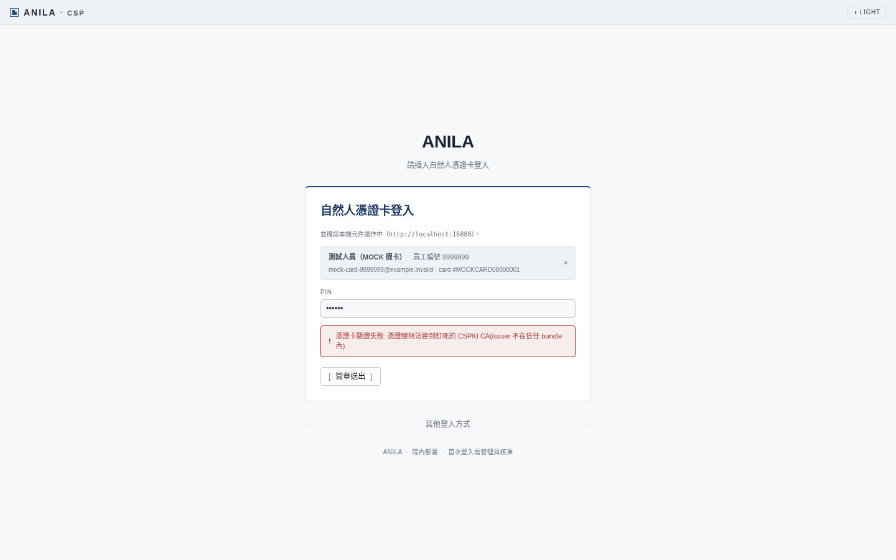
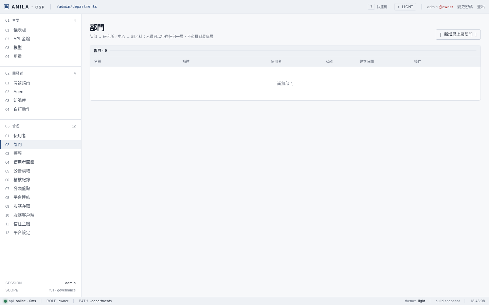
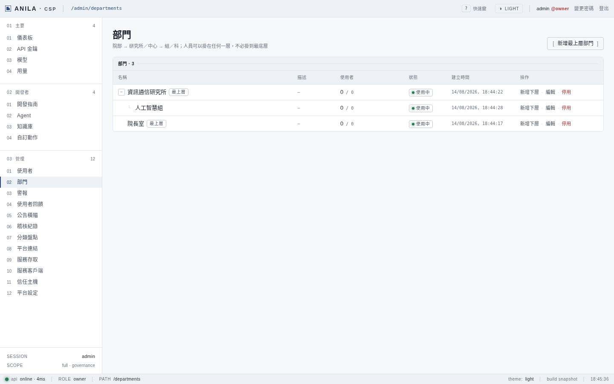
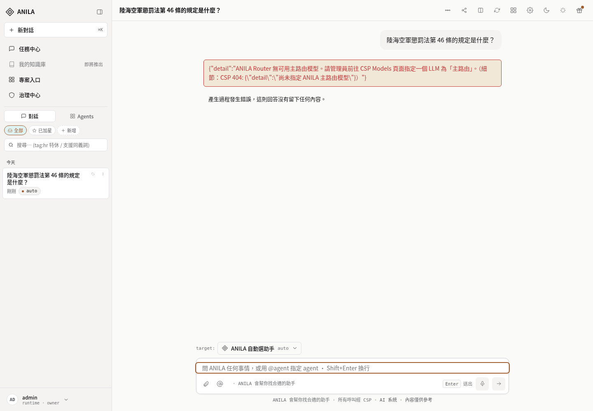

# 內網部署實戰教學（第 8 段產出）

> **在動手之前讀這一份。** 它不是操作步驟，是**一次真實演練的經驗**。
>
> 🔴 **本敘事跑的是 `Ref=v2.0.1-622-g72c655c3-dirty` 的包——那是演練包，不具備出貨資格。**
> 出貨日的包會是**乾淨 tag**，差異見 §4。
> （這個章是按我們自己剛立的機械判準蓋的：`MANIFEST.txt` 的 `Ref` 欄位就是包的身分。
> **規矩不能只管別人。**）

---

## 0. 這份是什麼、不是什麼

| | |
|---|---|
| **是** | 一次從零部署的**敘事**：先發生什麼、哪裡看起來對其實不對、我們撞到什麼 |
| **不是** | 操作程序。**權威程序是 [`intranet-deployment-runbook.md`](./intranet-deployment-runbook.md)** |
| **不是** | 初裝必要步驟的清單。**那份是 [`first-install-rehearsal.md`](./first-install-rehearsal.md)** |

**為什麼要分開**：三份文件講同一組命令，三個月後會漂成三份都不可信
（`AGENTS.md` 就是前例）。
👉 **這份只講「經驗」，指令一律指過去，不重述。**
👉 **演練撞到失效，改 runbook 原文，不改這一份。**

### 讀完你應該知道的三件事

1. **「所有容器健康」不是可以開放給人用的意思。** 從零裝好之後，
   使用者做的第一件事——插卡註冊、問第一個問題——**都還會撞牆**，
   因為有幾個步驟只有人做得了（§2）。
2. **這套系統的失敗方式，多半是安靜的。** 不是紅字，是綠字
   （「已有 ⋯⋯」＝那一步被跳過了）。看到綠色不代表發生了事情。
3. **有些事在這台機器上永遠驗不到**，那是設計決定的，不是我們偷懶（§4.4 的天花板表）。

---

## 🟢 你當初問的三件，演練的答案

| 你問的 | 答案 |
|---|---|
| **能不能乾淨地把服務起起來** | ✅ **可以**。load → `.env` 生成 → keypair **真的生成** → alembic 從 `0001` 建到 head → 種子 → **16 容器健康** → 三個入口都綠 |
| **https 憑證行不行得通** | ✅ **CSPKI 出向鏈實測接通**（斷言 `SSL_CERT_FILE` 真的指到 `/etc/anila/pki/model-ca.pem`，不是空字串）。⚠ TLS 憑證抽取這一步是**本機環境限制**（沒有 `server.pfx`）；`.15` 上有，照 §2 的作答表答 `y` 即可 |
| **卡登能不能用** | ⚠ **從零組態下「正確地失敗」**——假卡的測試 CA 被拒，**這正是驗章釘死真 CSPKI 的證據**。**全鏈綠燈只能在 `.15` 驗**（§4.4） |

---

## 1. 演練實跡（2026-08-14）

### 1.1 備份與拆除

1. **備份**：`pg_dump` 9M ＋ secrets 可讀檔 ＋ `.env`（收進 private-audits），雜湊清單 8 條。
   ⚠ **`pg_dump` 要用容器超級帳號 `csp`**——`csp_app` 因為 RLS **dump 不出東西**。
2. **拆除**：`down -v`（四個 volume 全滅）→ 逐一 `rmi` 交付清單 15 顆。
   （ISO42001 專案零波及。）

### 1.2 從零重建

3. **載入第一擊 → 撞牆**：`INTRANET-LOAD.sh` 直接死在 **digest 之牆**（發現 #1）。
   修法：tag-only 覆蓋檔 ＋ 載入驗證改認 tag → 重生成 → **15/15 ✓**。
4. **清除五類**：刪 jwt keypair、model-ca、`.env`；**`dev-card-ca` 保留**（E 類，本機唯一能測卡登的路）。
5. **deploy 腳本跑了四次才過**，每一次都撞到不同的東西：
   - ① `share/pki` 被 docker 以 root 預建 → 權限死（發現 #3，`rmdir` 解）
   - ② `.env.example` 帶著 `CARD_INITIAL_OWNERS` 佔位值 → **多出一題確認，把答案行吃掉**（發現 #6）
   - ③ 非互動餵答**錯位三次**——因為**互動提問樹會隨環境狀態變化**（發現 #5）
   - ④ 改用**環境變數遞值**＋狀態對齊才過。
     👉 **無人值守的正解是 env 遞值，不是餵答案行。**

   `[1/7]`～`[5/7]` 過，**keypair 真的生成了**——這就是 A 類刪除的意義（見初裝章 §1）。

   🔴 然後 `[6/7]` 死在一個到現在還沒解釋的地方（發現 #7）：

   > **`SECRET_KEY` 明明在 `.env` 裡、位元組乾淨，`compose` 整檔讀不到，切片卻讀得到，
   > 而且行為隨切片位置飄。**
   >
   > **實務解法（照做即可）**：`SECRET_KEY` 與 `CSP_SECRET_KEY` **雙行同值**。
   > 疑似 compose v2.36.2 的 dotenv 邊角 bug，已立 follow-up，**但不擋部署**。

6. **起棧**：把正確旗標全帶上（`-p` ／ asr profile ／ CPU overlay ／ digest 覆蓋——
   這是發現 #8 的正確形，deploy 腳本目前的裸 compose 缺這些）
   → 16 容器 → alembic `0001` → head → 種子。
   路上還撿到三個：ASR token 缺（#9）、GPU 預設值打到 CPU 主機（#11）、
   cht mock 讀卡機的正確起法（#12）。
7. **驗證**：C 類斷言過、三個入口綠、owner API 路徑實跑
   （`login → CSRF → set-router-primary`，這就是初裝第五件）。
   ⚠ `/anilalm/` 回 503「尚未開放」是刻意的發行閘、不是故障——見 `anilalm-release-gate.md`，別當故障去修。

### 1.3 第一次以人的身分走進去

前面都是機器對機器。這一段是**用瀏覽器，像使用者一樣走一遍**——
四件事裡有兩件撞牆：

**① 插卡——被擋下來，而且擋得對。**
假卡偵測得到（測試人員／員編 9999999），PIN 也收，簽章送出後回：

> 憑證卡驗證失敗: 憑證鏈無法連到釘死的 CSPKI CA（issuer 不在信任 bundle 內）

🟢 這是**好消息**：它證明卡登驗章真的釘死在 CSPKI，假 CA 過不了。
🔴 但它同時說明一件必須知道的事：**從零的正式組態下，這台機器沒有任何一條卡登路徑**。
（詳見初裝章 §2.6。）

**② 改走破窗（owner 帳密）——後端有效，畫面上的入口卻沒出現。**
這一條在當時那個映像上失效，而**它是卡登壞掉時唯一的回頭路**。
👉 已列為**出貨日必驗**（§4.3）。

**③ 建立單位——順利，樹狀結構正常。**

從零的平台是這樣的（**0 筆**，而三千人插卡都會卡在這裡，這就是 F-3）：

建好三個示範單位之後（院長室、資訊通信研究所，人工智慧組**掛在研究所底下**）：

⚠ 我第一次沒掛上父層，查證後是**我的操作問題，不是平台缺陷**——寫在這裡是因為
**「我以為是 bug」本身就是演練會發生的事**，而正確的反應是先查自己。

**④ 問第一個問題——失敗。**
用的是擁有者當初踩到問題截斷的那一句：「陸海空軍懲罰法第 46 條的規定是什麼？」

- ✅ **問句沒有被截斷**——「第 46 條」完整送達，那個修復是成立的。
- 🔴 但回來的是「**無可用主路由模型**」：系統確實自動註冊了兩顆模型，
  **但沒有任何一顆被指定為「主路由」**（發現 #13）。

> **「模型有註冊」不等於「問得出東西」——中間還有一個必須人工做的動作。**

這條後來成為初裝必要步驟的**第五件**。

⚠ 上面那張截圖同時是 **F-7**（發現 #14）的證據：**畫面上那一大串是原始 JSON**，
還帶著沒解開的巢狀跳脫。**訊息的內容是對的**（它明說了要去哪裡設定主路由），
**要修的是呈現，不是內容**。

### 1.4 收官

本機復原（主線現碼重建 ＋ 舊 `.env` ＋ DB dump 回灌）、digest 包三閘定版
（sol 兩輪跨家審 ＋ 七條驗收）、合併 `07893c7b`。

🔴 **回灌 DB 前要先 `CREATE ROLE csp_app`**——虛擬庫少這個角色，
會噴 **123 條 GRANT/RLS 錯誤**。已補進備份還原文件。

---

## 2. 初裝必要步驟（五件）

**不在這裡重述。** 完整內容、每一件漏掉的症狀、以及五類「存在就跳過」的陷阱，
全部在 👉 **[`first-install-rehearsal.md`](./first-install-rehearsal.md)**。

這裡只留一句提醒：

> **那五件的共同點是，漏掉之後系統看起來完全正常。**
> 沒有一件會在啟動時被擋下來，症狀全部出現在「使用者開始用」的那一刻。

---

## 3. 這次演練撞到的 16 條

> 完整對表（含每條的處置與歸宿）：`~/anila-deliverables/rehearsal-findings-20260814.md`

| # | 發現 | 歸宿 |
|---|---|---|
| 1 | digest-pin 過不了 `docker load`（RepoDigests 是 pull 的產物） | ✅ 已修合併 `07893c7b` |
| 2 | 「從零」有**五類繞過點**（靜默跳過／預設即跳過／無聲降級／包內預載／mock CA） | ✅ 初裝章 §1 |
| 3 | `share/pki` 被 docker 以 root 預建 → 權限死 | 修復包佇列 |
| 4 | 本機無 `server.pfx`、gateway key 空值 | ✅ 替換清單 |
| 5 | 互動提問樹**隨環境狀態變化**，非互動餵答錯位三次 | 修復包佇列（文件） |
| 6 | `.env.example` 帶佔位 owner → 多一題確認 | 同上 |
| 7 | **`SECRET_KEY` 解析謎**：整檔讀不到、切片讀得到 | 雙行別名解；謎立 follow-up |
| 8 | deploy 腳本的裸 compose 缺 `-p` ／ profile ／ CPU overlay ／ digest 覆蓋 | 修復包佇列 |
| 9 | 七把 secret 漏了 `ASR_DECODER_TOKEN`（decoder 拒絕裸跑＝**正確的安全行為**） | 第八把入生成器 |
| 10 | 演練包比主線落後三個合併 | ✅ 出貨日程序＋Ref 機械判準 |
| 11 | `.env.example` 的 ASR 預設是 GPU 值，CPU 主機必撞 | ✅ 本機已改；文件佇列 |
| 12 | cht mock 讀卡機裸起會吃到舊映像 | ✅ 教學（本機專屬） |
| 13 | **全新平台第一問必死**：模型有註冊但無主路由 | ✅ 初裝章 §2.5 |
| 14 | 錯誤把**原始 JSON** 吐給使用者；日期 DD/MM/YYYY | **F-7**（UI 佇列） |
| 15 | **正式姿態與本機可測性互斥**（假 CA 被拒 ＋ SSRF 擋私網位址） | ✅ 初裝章 §0 |
| 16 | **CHECKSUMS 缺失 → 完整性檢查無聲蒸發、exit 0** | ✅ 已修合併 `07893c7b` |

### 演練也「順路修好」的

- **還原 DB 前先 `CREATE ROLE csp_app`**（否則 123 條 GRANT/RLS 靜默失敗）→ 已進備份還原文件。
- **Ref 閘**：演練包不得不知不覺上正式機。sol 兩輪跨家審（修掉 describe 樣式過寬、
  MANIFEST 缺失無聲退出），七條驗收含 **①b（前閘會遮住後閘，要越過第一道才證明得了第二道）**。

---

## 4. 出貨日程序

### 4.1 六步

1. **凍結並打 tag**：全部合併收齊後，在 `restart/from-redesign` 打 **annotated tag**。
   ⚠ **別取成 describe 形**（`vX-N-g<hex>`）——那會被 loader 判成演練包。
   此後**任何改動＝重新走一次本程序**。
2. **從乾淨 tag 重建全量**：worktree checkout tag → `build-and-export`（15 顆，兩道閘門）
   → **`MANIFEST` 的 `Ref` 必須是乾淨 tag**。
3. **演練最終包**：對出貨包本體跑一次完整載入（七條驗收的正面組）＋ §4.3 的必驗項。
4. **標註只能在 `.15` 驗的四項**（§4.4），**不留白**。
5. **帶進氣隙的東西**：出貨包目錄（含 `CHECKSUMS` ／ `MANIFEST` ／ `INTRANET-LOAD` ／ overrides）
   ＋ `server.pfx`（IT）＋ gateway API key（`.12` 簽發）＋ 擁有者真實員編 ＋ 正式單位清單。
   🔴 **絕不帶**：`dev-card-ca`、`CARD_*` 的本機值、七把本機 secret。
6. **`.15` 上**：照 runbook §2（tag 制）→ `INTRANET-LOAD`（三閘全過＝綠）
   → 初裝五件（TLS 抽取答 `y` ／ secret 重生答 `n` ／ keypair ／ CA 斷言 ／ owner→單位→主路由）
   → 四項現場驗。

### 4.2 🔴 包的身分：機械判準

**演練包與出貨包長得一模一樣**，唯一的差別在 `MANIFEST.txt` 的 `Ref` 欄位：

| `Ref` 形狀 | 是什麼 | loader 行為 |
|---|---|---|
| **乾淨 tag** | 出貨包 | 照常載入 |
| `-dirty` ／ describe 形 ／ 裸 hash | **演練包** | **拒絕**，要載得帶 `ALLOW_REHEARSAL_BUNDLE=1` |

📌 **分界從「記憶」變成「grep 得到」，再變成「程式擋得住」。**

### 4.3 🔴 必驗項（不能只在清單上打勾）

> 📌 **本節只列「出貨日當天要親手驗的」。凍結前的完整殘項清單在
> [`docs/archive/PRE-TAG-RESIDUALS-2026-08-15.md`](../archive/PRE-TAG-RESIDUALS-2026-08-15.md)**
> ——那份逐項標了擋不擋 tag、要在重建映像之前落地的有哪些、以及要擁有者決定的四件。
> ⚠ **打 tag 之前先開那一份**；本節的必驗項是它的子集，**不是它的替代品**。
> （這一行存在的理由：同一天我們才因為「治理中心測試套件不在專案宣告的基線裡」立了 F-10——
> **一份沒有被任何流程指向的清單，跟一個沒有被宣告的測試套件，是同一個形狀。**）

> ⚠ **2026-08-15 修訂：第 1、2 項原本只驗「入口」，那驗不出 F-1。**
> 舊版寫的是「`?show_alternatives=1` 要真的出現帳密欄位」——
> **F-1 存在的情況下那條也會通過**：帳密欄位確實出現、破窗確實能用，
> 然後管理員點到旁邊那顆「註冊」，拿到一句英文 `Not Found`。
> **入口不等於行為**，這正是 F-1 被誤判為已關的原因。

| # | 項目 | 判準 | 為什麼它在這裡 |
|---|---|---|---|
| **1a** | 破窗**還在** | `/login?show_alternatives=1` → **帳密欄位必須出現、且真的登得進去** | 卡登壞掉時**唯一的回頭路**。演練映像上**失效過** |
| **1b** | 破窗**沒有藏過頭** | 同上；**這一條是防止「修 F-1 時順手多藏一塊」** | 🔴 **藏過頭＝把回頭路一起藏掉**：那是拿一個難看的錯誤訊息，換一個進不去的平台 |
| **2** | 破窗下**沒有會導向英文錯誤的控制項** | 註冊區塊**不存在**，或存在但錯誤訊息**已在地化** | F-1 本體。⚠ **不得靠「再藏一層」達成**——上一輪就是這樣才被誤判為已關 |
| **3** | 包的 `Ref` 是乾淨 tag | 見 §4.2 | 演練包與出貨包長得一模一樣 |

🔴 **1a 與 1b 是一對，缺一不可**：只驗 1a，會漏掉 F-1；只驗 2，會讓人用「全部藏掉」交差。
**兩個方向都要走一次。**

#### ⚠ 1a 的「真的登得進去」——執行者與防退化

**這一步在 `.15` 首次安裝上是做得到的**，理由在碼裡：
`auto_seed.py:110-114` 只在 **owner 帳號不存在時**建立它，密碼取自當下的 `ADMIN_PASSWORD`。
**首次安裝正是「帳號不存在」的那一次**——所以 `.env` 裡的值**就是**能登入的密碼。

> ⚠ 已知的漂移（`ADMIN_PASSWORD` 改了但 DB 不變）**只發生在帳號已存在的重跑**。
> **首裝不受影響**，重跑才要用密碼管理器裡的那一份。

**執行者：做首次安裝的那個人**（平台管理員／擁有者本人）。

🔴 **防退化：這一格要留下產物，不是打勾。**

| 結果 | 要留下什麼 |
|---|---|
| 成功 | 登入後畫面右上顯示的**角色**（應為 `owner`），或登入請求的 **HTTP 狀態** |
| 做不到 | **寫「未執行」＋原因**，⚠ **不准留白、不准打勾** |

**理由**：勾選框可以用「欄位出現了」交差，**產物不行**。
🔴 這正是 F-1 的形狀——**一條執行不了的驗收條件，會退化成它旁邊那條做得到的**，
而檢查表上仍然顯示通過。**指定執行者＋要求產物，是讓那個退化發不出聲音變成發得出聲音。**

### 4.4 天花板：這四項**只能在 `.15` 驗**

**不是漏做，是本機驗不到。留白會被下一手讀成漏做，所以要標。**

| 項目 | 本機為什麼驗不到 |
|---|---|
| 卡片登入全鏈 | 假卡的測試 CA 不在釘死的 CSPKI bundle 內（**這是防護生效的證據**） |
| 完整問答／檢索徽章 | 模型 gateway 在內網 |
| 模型 health 綠燈 | 同上，本機必然 unhealthy |
| agent 呼叫 | 從零平台 0 個 agent，且端點在內網 |

⚠ **反過來也成立**：**如果這四項有任何一項在本機竟然「過了」，先懷疑組態被鬆綁了。**
本機能刷卡登入，就表示 `.env` 不是正式姿態。

---

## 5. 卡住的時候

| 症狀 | 去哪 |
|---|---|
| 起不來、模型不通、卡登失敗、同事卡在 pending | runbook **§6 Troubleshooting** |
| 「容器全綠但使用者進不來」 | 先 reload nginx（recreate 過就要 reload），runbook §3.1d 有完整的自救路徑 |
| 不確定某一步是不是真的執行了 | 初裝章 §1 的五類「存在就跳過」 |
| `[6/7]` 卡在 secret 讀不到 | §1.2 的第 5 點：`SECRET_KEY` ＋ `CSP_SECRET_KEY` **雙行同值** |

> **最後一句**：這個系統的問題**幾乎不會用紅字告訴你**。
> 遇到「跑完了但好像沒發生什麼」，那通常不是錯覺。

---

## 待補輸入

| # | 事項 | 卡在誰 |
|---|---|---|
| 1 | 全院正式單位清單、首頁連結清單 | 擁有者 |

### 截圖（擁有者已裁：篩選後入 repo）

**14 張裡選了 4 張**進 `docs/runbooks/images/rehearsal-2026-08-14/`（共 308K）：
卡登被拒、零單位、單位建立完成、錯誤原始 JSON。
其餘 10 張是過程態（PIN 輸入中、表單打開、聊天空畫面等），**對讀者沒有增量**，留在 repo 外。

> ⚠ **關於「遮蔽」：逐張檢視之後，我認為這四張沒有需要遮蔽的東西，理由要寫清楚。**
>
> 我當初提報時說「F-7 那張拍到洩內部結構的字串」——**那句話混淆了兩件事**：
> - **產品對使用者洩內部結構**（`CSP 404` 出現在一般使用者的畫面上）＝ 真的是缺陷，F-7 在修。
> - **對這個 PUBLIC repo 而言是不是機密** ＝ **不是**。`CSP` 這個服務名、它的路由、
>   它的錯誤處理，**整份原始碼本來就在這個 repo 裡**。
>
> 四張截圖裡沒有金鑰、沒有 token、沒有內網 IP 或主機名、沒有真實人員資料
> （卡片是 `MOCK 假卡`、員編 `9999999`、信箱 `@example.invalid`）。
> **遮一個已經公開的服務名，是做給自己看的動作，不會讓任何人更安全。**
>
> 📌 這條保留在文件裡，是因為**下一次有人要放截圖時會問同一個問題**：
> 判準是「**這張圖洩漏了 repo 以外的東西嗎**」，不是「這張圖看起來敏感嗎」。
