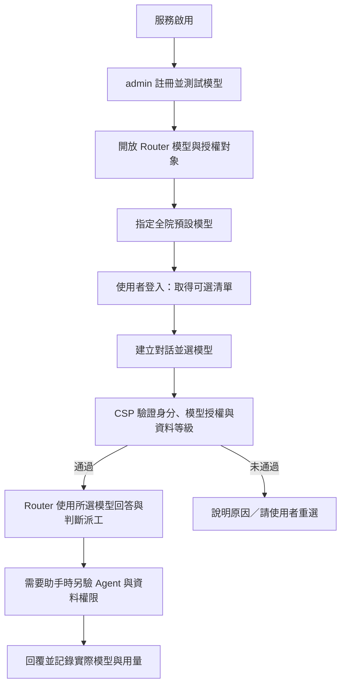

# ANILA 全院 Router 模型選擇 Implementation Plan

> **For agentic workers:** 使用 superpowers:executing-plans 逐包執行；派工與審查依專案 AGENTS.md 的角色規則，不自行開新 session。步驟以核取方塊追蹤。

**Goal:** admin 管理全院約 6000 人可用的 Router 模型，使用者自行選擇每段對話的 Router 模型；平台統計用量，不新增額度限制。

**Architecture:** CSP 統一管理授權、對話選擇與用量；ANILA Router 使用每次請求已驗證的模型設定，繼續負責回答與助手派工。模型供應端金鑰留在 CSP，Router 沿用呼叫者身分，無須人工發放萬用金鑰。

**Tech Stack:** 現有 FastAPI、SQLAlchemy/Alembic、PostgreSQL、React ANILA Shell、Vue 治理中心與 anila-core Router。

**Spec:** 本文件「一、需求與決策」記錄 2026-09-11 使用者確認的方向；既有資料／助手權限仍依 SYSTEM-MAP.md。PLAN.md 僅登錄本案狀態。

**狀態:** 規劃完成、尚未實作或部署。盤點基準為 main `a3b662f7ff1fc5dc983710247c0ef3ed78c99d76`。本文的新增欄位、API 與測試名稱均為待實作契約。

## Global Constraints

- 本次不新增個人／部門額度、預算、超額拒絕、商業計費、併發配額或排隊系統。用量僅供統計，不能成為新的拒絕條件。
- 既有 timeout、防濫用與基礎設施保護不因本案自動移除；執行前盤點既有 API key 配額，不能宣稱原有系統完全無限制。
- 全員仍走 Router；選模型不等於繞過 Router 直連供應端。
- 模型權限不授予 Agent／知識庫／對話存取權，密等限制持續生效。
- 不以共享管理員 sk- 代表 6000 人；上游 LiteLLM key 不可回送 CSP 當使用者身分。
- 本次授權是寫計畫。實作、提交、推送、部署與正式發行不是本文已完成事項。
- 新模型預設不開放；admin 指定授權對象後可直接出現在選單，不必替 Router 再發金鑰。
- UI 使用繁體中文與台灣用語；模型 ID、內部位址與 token 不放進一般使用者選單。

## 一、需求與決策

### 1. 使用流程



### 2. 管理 6000 人的方式

| 層級 | 規則 | 維護方式 |
| --- | --- | --- |
| 全院基本 | 所有有效院內使用者自動取得 | 每模型一條全院授權，不建立 6000 條複本 |
| 部門 | 該部門成員取得，可明確勾選包含子部門 | 復用現有部門樹；預設只含本部門 |
| 專案群組 | 跨部門群組成員取得 | 最小化群組與成員管理；不新增通用 IAM 引擎 |
| 個別例外 | 指定使用者取得，可設定到期日 | 少量例外；到期依請求時間判定，不依賴清理排程 |
| 全院停用 | 模型停用優先於任何授權 | 停止新模型呼叫，保留歷史資料 |

有效範圍是有效帳號的全院、部門、群組與個別授權聯集，再套用模型啟用與 Router 適用條件。移除個別授權不會否定仍有效的全院授權；UI 要顯示授權來源，避免誤認已撤權。本版不做逐人 deny 規則。

院內部門／身分來源尚未實測，不承諾已具自動同步。先復用已存在的登入身分更新與部門資料；平台管理的專案群組提供成員增刪。人事／目錄自動同步介接另列範圍，不能讓第一版依賴不存在的介接。

### 3. 選擇與預設

- 治理中心將「設為主要」改為「可用於 Router」與「設為全院預設」兩個不同設定。
- 只有適合聊天與路由的已啟用模型可開放；embedding、ASR、image、Agent 與 `anila-router` 入口本身不能成為 Router 基礎模型。
- 全院預設須具全院授權且可用於 Router；啟用對外服務前至少設定一個。設定操作原子化，避免多個預設。
- 新對話未指定模型時使用全院預設並持久化；沒有有效預設時要求選擇，不能任意挑第一筆。
- 第一版以「每段對話」為選擇單位，不增加個人跨對話偏好設定。
- 已有對話不隨全院預設變更而換模型。使用者可在回合之間改選，從下一回合生效；正在執行的回合與待續接的 Agent session 維持原模型快照。
- 權限撤銷、模型停用或刪除後，歷史仍可讀；下一次呼叫明確要求重選，不靜默換模型。
- 健康狀態是提示；短暫降級不等同永久撤權。呼叫失敗顯示可重試／重選，不偷偷 fallback。
- `ANILA 自動選助手` 是 Router 服務入口；聊天畫面顯示「對話模型：GLM／Qwen」，避免把服務入口混列成可選基礎模型。

### 4. 用量統計，沒有新額度限制

| 統計 | 定義 |
| --- | --- |
| 使用者回合數 | 一次送出算一個回合，與內部推論次數分開 |
| 實際模型呼叫數 | Router 判斷、整合回答、Agent 的真實推論分別計數 |
| Token | prompt、completion、total；上游未回傳時標示估算或未知 |
| 分析維度 | 時間、實際模型、使用者、呼叫時部門、來源與成功／失敗 |
| 使用者視圖 | 本人用量，不顯示剩餘額度／超額提示 |
| 管理員視圖 | 全院／部門／模型彙總、使用人數、延遲與錯誤；沿用既有查閱權限 |

同一回合可能有多次真實推論，應累計；CSP → Router 的外層代理不能把相同 token 再計一次。模型名稱與部門採呼叫時快照，調職／改名不改寫歷史。舊資料不猜測來源，標為歷史紀錄；無法完整去重的舊區間與新版口徑分開。

## 二、現況差距（已讀碼）

| 路徑 | 現況與修改目的 |
| --- | --- |
| `services/csp/app/services/api_key_service.py` | `is_router_primary` 目前直接放行；需把預設與授權分離 |
| `services/csp/app/services/auto_seed.py` | 已建立 `anila-router` 平台入口；不需另建同名服務 |
| `services/csp/app/services/proxy/headers.py`、`proxy/service.py`、`app/api/proxy.py` | 平台入口目前可繼承模型 gateway key；需與呼叫者轉送路徑分離 |
| `services/anila-core-router/main.py` | `_apply_primary()` 寫共用 `settings.model`；需解除每位使用者依賴全域主模型的行為 |
| `packages/anila-core/src/anila_core/api/router_server.py` | 涵蓋路由、派工、整合與 resume；所有相關呼叫須使用請求／回合模型快照 |
| `services/csp/app/models/conversation.py`、`app/api/conversations.py` | 需增加對話 Router 模型選擇與回合版本控制；schema 目前在 API 模組內 |
| `services/csp/app/models/user.py`、`department.py` | 已有使用者模型授權與部門樹；復用，不另建人員目錄 |
| `services/csp/app/models/token_usage.py`、`services/usage_writer.py`、`services/usage_service.py` | 已有模型／人員／部門／trace 欄位；需補口徑、來源與去重 |
| `apps/anila-shell/src/app.jsx`、`chat.jsx`、`runtime/api.js`、`runtime/conversations.js` | 對話 UI 與持久化入口；加入模型選擇及回合快照 |
| `apps/csp-governance-ui/src/views/ModelsView.vue` | 模型開放對象、預設與平台入口金鑰文案 |

盤點時根目錄 `CLAUDE.md` 不存在；執行者以現行原始碼、SYSTEM-MAP.md、PLAN.md 為依據，不按舊架構敘述補造檔案。

## 三、待凍結的實作契約

以下是本計畫的具體實作提案；L3 契約包需檢查與既有 API 相容後凍結，再開平行工作。

### 資料

- `model_registry.router_enabled: bool`：預設 false；復用 `is_router_primary` 作唯一全院預設標記，移除它的權限 bypass。
- 新 `router_model_grants`：`model_id`、`scope_type`（all／department／group／user）、可空的 `department_id/group_id/user_id`、`include_descendants`、`expires_at`、建立者與時間。DB check constraint 保證 scope 只有對應 FK；唯一索引防重複有效規則。
- 新 `model_access_groups` 與 `model_access_group_members`：名稱、有效狀態、使用者 FK、唯一群組成員約束；不與服務存取 grant 混用。
- `conversations.router_model_id`（nullable FK，刪除 RESTRICT）、`router_selection_version`（integer）：由伺服器保存；每回合另保存模型 ID／名稱快照。模型退役優先軟停用，歷史不可消失。
- 每個實際推論配置伺服器產生的 `invocation_id`；重試使用新 attempt ID，同一寫入重送則使用同一 ID。usage 追加 `usage_kind`（inference／router_transport）、`token_source`（reported／estimated／unknown）、`outcome` 與快照欄位；`invocation_id` 唯一索引用於新資料去重，舊資料可空。

### API 與 Router

```json
GET /api/router-models
{
  "models": [{"id": 3, "name": "glm-example", "display_name": "GLM", "health_status": "healthy"}],
  "default_model_id": 3
}

PUT /api/conversations/{id}/router-model
{"router_model_id": 3, "expected_version": 0}

POST /v1/chat/completions
{"model": "anila-router", "router_model": "glm-example", "messages": [], "stream": true}
```

- 上述清單接受與 data plane 一致的 cookie/JWT/API key 身分，只回可用模型，不回 endpoint／secret。回傳的 default 不在 caller 範圍內時為 null。
- 使用現有 conversation 關聯方式；有 conversation 時以 DB 選擇為準，body 指定值衝突回 409。無 conversation 的 SDK 請求以 `router_model` 指定，省略則解析已授權預設。
- 未登入 401；無模型權限 403；對話不存在或不屬 caller 404；模型停用、需要重選或版本衝突 409；沒有可用預設且未選模型 409。維持既有上游錯誤處理，串流開始後以既有錯誤事件回覆。
- 在既有 Models API 增加 `router_enabled` 欄位，新增 `GET/PUT /api/models/{id}/router-grants`（一次原子替換規則）、`PUT /api/router-models/default`（`model_id`）。新增 `/api/model-access-groups` CRUD 及 `PUT /api/model-access-groups/{id}/members`（`user_ids`）。寫入限現有 admin-tier，CSRF 與稽核必須走既有機制；一般使用者不能改授權。
- 使用統一 `resolve_router_model(db, caller, conversation_id, requested_name)` 解析與驗權，回傳 immutable `RouterModelSelection(model_id, model_name, selection_version)`。
- 供應端真實模型呼叫仍由 CSP 最後驗權；模型 metadata／選單快取不可取代出向授權。DB 更新提交後的新呼叫不得沿用已撤權快取。
- API key 路徑保留 key scope，不因全院開放而擴張既有受限 key；以使用者 Router 授權和 key 授權交集決定基礎模型。`anila-router` 入口可用不代表任意模型可用。一般使用者 cookie 流程無須領 key。
- 模型公開授權可復用到一般模型權限檢查；現有 system／內部 worker 的合法路徑保留且獨立測試，不能把一般使用者提升成 system。
- `/v1` 與既有 `/router/v1` 入口必須走同一模型解析／驗權契約；保留相容 URL，不能留下直打 Router 就跳過檢查的入口。
- Router 的每次模型呼叫顯式帶入 `model_name`；不得修改共享 `settings.model`、共享 client.model 或只用全域 TTL 快取當使用者選擇。初次判斷、直接回答、派工後整合、重試、續答使用同一回合快照。
- Agent 自身可用專用模型，不強制改成 Router 所選模型；實際模型分別記錄，不誤標。

### 身分與端點

沿用原始已驗證 caller JWT／CSP sk-，只轉送至部署設定固定的 Router endpoint。不能僅憑可編輯模型名稱／`is_internal` 就把 caller token 送往任意 URL。入口改址須符合部署設定；不符合則拒絕轉送。SSRF 驗證與禁止不受信任 redirect 同時生效。

Router 回呼 CSP 沿用該 caller，CSP 再解析實際供應端模型金鑰。健康探測與匿名 metadata 不攜帶 caller token。移除平台入口模型金鑰欄，歷史手填 key 不參與選擇；撤銷 Lab workaround key 需確認沒有其他消費者後才進行。

## 四、實作順序與交付包

整體 L3（公開契約、身分及持久資料變更）。每包先建立下列行為的失敗測試，再最小實作、跑測試與檢查實際 diff；不因本計畫自動 commit。契約先由 Astra 檢查一次，普通實作凍結後由 GLM review、Qwen 獨立整合驗收，正式 release 再走既定簽核。

### P0：凍結契約與相容路徑

**Files:** 本文件、`SYSTEM-MAP.md`、`PLAN.md`；讀 `infra/nginx/anila.conf`、`infra/compose/platform.yml`、`services/csp/app/middleware/caller.py`。

**Interfaces:** 產出上節 API、授權優先序、immutable selection 與統計口徑；後續所有包共同使用。

- [ ] 列出 `/v1`、`/router/v1`、session answer、重生／分支、Agent 回呼與內部 worker 的身分和資料流。
- [ ] 確認現有 key scope、部門來源、API 配額與 usage 寫入位置，記錄需要保留的既有行為。
- [ ] 凍結完整請求／回應與錯誤範例，更新 SYSTEM-MAP.md 的規格；Astra 檢查原始契約與敏感端點轉送邊界。

### P1：授權與資料遷移

**Files:** 新 `services/csp/app/models/router_model_grant.py`、`model_access_group.py`、`services/router_model_policy.py`、`schemas/router_model.py`、`api/router_models.py`；修改 `models/model_registry.py`、`models/__init__.py`、`services/api_key_service.py`、`api/router.py`；新增 migration（執行時接當前 Alembic head，不在計畫預占 revision）。

**Interfaces:** 產出 `RouterModelSelection`、`resolve_router_model` 與上述清單／grant／group API；消費既有 Caller、User、Department。

- [ ] 新增 `tests/test_router_model_policy.py`：全院、部門與子部門開關、群組、個別過期、多來源聯集、停用、無效帳號、受限 sk- 均有正反案例。
- [ ] 實作對應資料表、索引、FK、check constraints 與管理 API；所有授權寫入落稽核，不建立每人全院授權複本。
- [ ] 既有主要真實 LLM 轉成 router_enabled＋全院 grant＋預設；其它既有模型不自動全院公開。舊個別授權對 Router 適用的真實 LLM 遷移為個別 grant；保留其它用途權限。若舊 primary 指向入口自身則報設定錯誤，禁止遞迴。
- [ ] 使用 PostgreSQL 驗全新升級與舊資料升級；migration 只跑一次的副作用不放進每次啟動的 seed，以免覆蓋 admin 之後修改。

### P2：每段對話保存模型

**Files:** `services/csp/app/models/conversation.py`、`models/message.py`、`api/conversations.py`、`services/conversation_service.py`；新 `tests/test_conversation_router_model.py` 與 migration。

**Interfaces:** 消費 P1 resolver；產出模型選擇更新 API、對話回傳欄位及回合模型快照。

- [ ] 測試新對話採預設、指定模型、跨使用者 404、過期版本 409、改預設不改舊對話、撤權後重選與重生分支。
- [ ] 使用版本 compare-and-swap 更新選擇；同時送出／換模型時在回合建立交易中固定快照。模型選擇不修改舊 message 的真實模型標示。
- [ ] 舊對話初始 selection 為 null；下一回合明確解析並保存預設，UI 告知；不得猜測舊回合曾用模型。續接中的 Agent session 由原 run 快照決定。

### P3：Router 個別模型與平台身分轉送

**Files:** `services/csp/app/api/proxy.py`、`services/proxy/headers.py`、`services/proxy/service.py`、`services/auto_seed.py`；`services/anila-core-router/main.py`；`packages/anila-core/src/anila_core/api/router_server.py` 及其實際模型呼叫 helpers。

**Interfaces:** 消費 P1/P2 selection；真實推論傳 `model_name`，入口仍為 `anila-router`；下游只收到供應端自己的 key。

- [ ] 新增 `services/csp/tests/test_router_model_forwarding.py`、`packages/anila-core/tests/test_router_request_model.py`；擴充 `services/anila-core-router/tests/test_primary_gate.py`。
- [ ] 測試 cookie、JWT、CSP sk- 的 streaming／nonstream，global gateway key 存在及入口誤存 key 時仍正確；任意改址、缺 caller、redirect 不能外送 caller token。
- [ ] 修改全域 primary gate：已明確選到合法模型不因全域預設缺失而被擋；省略選擇才走預設解析。Router 不接受前端宣稱的已授權旗標。
- [ ] 並行交錯 A=GLM、B=Qwen，含多輪、派工整合、重試與 resume；以 mock transport 捕捉每次實際出向 model 和 caller，確認全程不串線。
- [ ] 搜尋所有 `settings.model`／primary cache 消費者，逐一確認只作預設或已改為 request scope，不遺漏重生和續答。

### P4：治理中心與對話平台

**Files:** `apps/csp-governance-ui/src/views/ModelsView.vue`、`stores/models.js`、`api/models.js`；新 `views/ModelAccessGroupsView.vue` 與路由；`apps/anila-shell/src/app.jsx`、`chat.jsx`、`runtime/api.js`、`runtime/conversations.js`；新 `components/RouterModelPicker.jsx`。

**Interfaces:** 消費 P1 清單、grant、group、default API 與 P2 對話選擇 API，不自行計算權限。

- [ ] 治理模型頁顯示 Router 適用、開放對象、授權來源、預設；提供選全院／部門／群組／個人的操作，個別例外可填到期日，完全不設額度欄位。
- [ ] 群組頁提供名稱與成員搜尋／增刪；人員查詢分頁，不一次下載 6000 人與所有權限。
- [ ] 對話頁加入 picker，顯示可用模型、預設與健康提示；送出中鎖定本回合，模型停用／撤權提示重選。
- [ ] `anila-router` 列標示平台入口／免另設金鑰；隱藏入口的 gateway 金鑰、設為基礎主模型等無效操作。
- [ ] 新增 `src/__tests__/routerModelPicker.test.jsx`：清單、選擇保存、重新整理、多分頁衝突、撤權；跑 Shell 測試及 Shell／治理中心 production build。

### P5：用量統計與去重

**Files:** `services/csp/app/models/token_usage.py`、`services/usage_writer.py`、`services/usage_service.py`、`services/proxy/usage.py`、`api/usage.py`、`schemas/token_usage.py`；治理中心 `stores/usage.js`、`api/usage.js` 及既有用量視圖；ANILA 既有本人用量區。

**Interfaces:** 消費 P3 的 run／invocation 與模型快照；產出按人員、部門、實際模型與日期聚合，資料來源品質可辨識。

- [ ] 新增 `tests/test_router_usage_accounting.py`：外層代理不重複加 token、兩次真實推論計兩次、寫入重試冪等、串流中止、上游無 usage、失敗與 Agent 專用模型。
- [ ] 新增 invocation 唯一索引與新舊口徑分界；保留 transport 診斷事件但不納入 inference token 總額。不能只拿整回合 trace ID 去重而抹掉真實多次推論。
- [ ] 統計以呼叫時部門快照呈現；依現有可見範圍過濾，使用者只能讀本人；管理員跨院聚合與單位管理員範圍各有反驗。
- [ ] 實作模型／部門／時間篩選與本人用量；不回傳 remaining_quota、budget 或 over_limit，也不把累積 token 接進拒絕邏輯。

### P6：獨立整合、6000 人資料規模與本機驗證

**Files:** 新 `services/csp/tests/test_router_model_selection_e2e.py`、`docs/qa/router-model-selection-acceptance.md`；證據存專案任務資料夾，不含憑證。

**Interfaces:** 串起 P1–P5；GLM 檢查凍結 diff，Qwen 建獨立 fixture 與驗收。

- [ ] 在隔離測試 DB 建 6000 個合成帳號、部門樹、跨部門群組與到期例外；不變更真實人員資料。
- [ ] 批次驗所有帳號有效模型集合；記錄 policy query 數量及 p50/p95 時間，確認不逐人寫全院 grant、不隨總人數產生 N+1、不一次回傳全院人員。
- [ ] 並行 mock E2E 驗 50 個請求至少兩種模型，設定 5 分鐘 job timeout；這是選擇隔離測試，不宣稱可承載 6000 人同時推論。
- [ ] 本機以兩個一般使用者瀏覽器 session 分別選 GLM／Qwen，完成真實登入→選擇保存→串流回答→助手派工→回合記錄→用量報表；另驗撤權、換預設、新增開放模型與 session 續答。
- [ ] 存 HTTP 結果、實際 model、run ID、usage 聚合比對與截圖；容器健康、選單存在或 mock 綠燈均不能代替端到端驗收。

### P7：部署文件、升級與回復

**Files:** `docs/runbooks/from-zero-lab-2026-09-10.md`、`SYSTEM-MAP.md`、`PLAN.md`、本計畫及驗收文件。

- [ ] 從零操作改為：啟用服務→註冊模型與上游 key→開放對象→全院預設→一般使用者選模型；移除手動給 anila-router 發 CSP key 的標準步驟，保留歷史 workaround 註記。
- [ ] 升級前備份 DB 與部署設定；驗舊 primary、既有權限、歷史對話與 usage 的 migration。新功能開放前完成驗收，避免新舊 Router 同時寫不同選擇語意。
- [ ] 回復優先停用新選擇功能並保留 additive schema／歷史；若舊程式 primary bypass 會放大新版權限，禁止直接回退公開服務，先維護模式再還原已驗證 DB／映像備份並說明資料時間點。
- [ ] 更新出貨 SHA、映像與驗收證據；本次改動後舊掃描不得充當新版本證明，正式發行沿用既有 P2.6 與部署規則。不執行 `anila-restart`。

## 五、測試執行與完成判定

待上述測試檔建立後，在現有測試環境執行；PostgreSQL integration 沒跑要列未驗證，不能以 SQLite 取代。

```bash
# workdir: services/csp
python -m pytest tests/test_router_model_policy.py tests/test_conversation_router_model.py tests/test_router_model_forwarding.py tests/test_router_usage_accounting.py tests/test_platform_router_model.py tests/test_model_gateway_hardening.py tests/test_proxy_jwt_path.py -q
# workdir: packages/anila-core
python -m pytest tests/test_router_request_model.py -q
# workdir: services/anila-core-router
python -m pytest tests/test_primary_gate.py -q
# workdir: apps/anila-shell
npm test
npm run build
# workdir: apps/csp-governance-ui
npm run build
```

核心測試行為（測試 fixture 需以真實 handler／transport 建立，不寫純鏡像實作測試）：

```python
# 並行結果必須檢查實際 transport 捕捉值，不只檢查 UI label。
assert observed_models_by_user[user_a.id] == {glm.name}
assert observed_models_by_user[user_b.id] == {qwen.name}
# 同一回合實際兩次推論，各 100 token；外層 transport 不再加 200。
assert aggregate.inference_calls == 2
assert aggregate.total_tokens == 200
# 撤權後的新請求必須在出向前拒絕。
assert denied_response.status_code == 403
assert upstream_calls_after_revoke == []
```

完成須同時滿足：

- [ ] admin 能用全院／部門／群組管理 6000 人授權，新增開放模型不需另發 Router key。
- [ ] 一般使用者看見且只能使用自己可用的模型；舊 primary bypass 已被明確授權取代。
- [ ] 多人並行、分頁、回合與 Agent resume 均不串模型／身分。
- [ ] 用量可按實際模型與部門核對，無重複 token、無假零值、無新額度限制。
- [ ] GLM review 與 Qwen 獨立 E2E 有可讀產物；空回覆或未完成不算通過。
- [ ] 全新部署與升級演練、從零文件、實際 SHA 與後續 release gate 狀態均有證據。

**長期維護責任：** 模型開放規則、群組成員、請求級選擇契約與用量口徑；復用既有帳號／部門／稽核，不另建配額或排隊服務。
