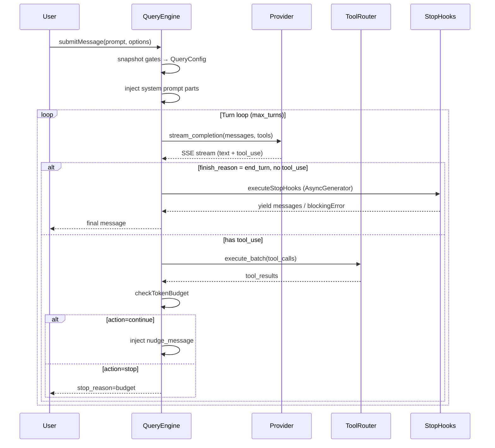
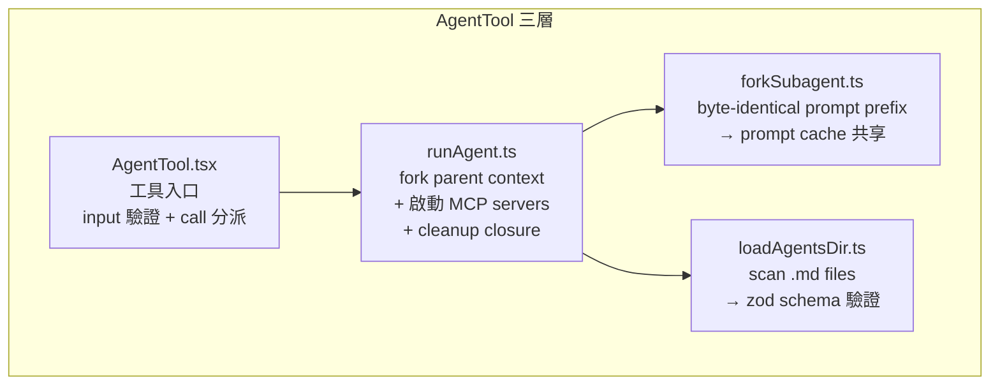
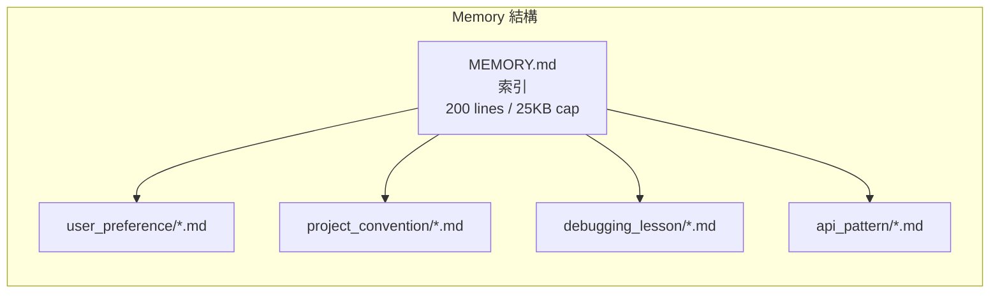
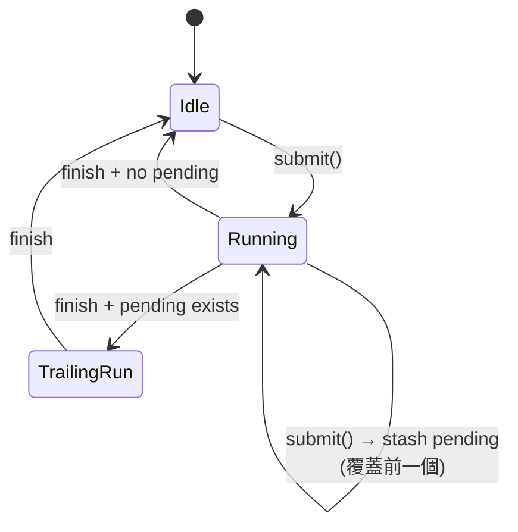

# runtime_logic — Agent Runtime 參考代碼（TypeScript）

> **定位**：本目錄存放一份**成熟的 agent runtime TypeScript 實作快照**，以「參考材料」身份納入 ANILA。它**不是 ANILA runtime 的執行碼**（執行碼在 `anila-core/`，是 Python），而是用來對照、借鑑、移植其架構模式的「設計原本」。
>
> **身份對照**：
> - 執行時用的 Python runtime → `D:/ANILA/anila-core/`
> - RAG sample agent 樣板 → `D:/ANILA/AgenticRAG/`
> - Router 服務 → `D:/ANILA/anila-core-router/`
> - **本目錄** → 唯一用途是「讀它、參考它、把好的設計翻譯成 Python 放進 `anila-core/`」
>
> ⚠️ **`src/` 與 `vendor/` 已由 `.gitignore` 排除**，不會進 repo。只有本 README 被追蹤。原始碼在本機維護，作者自行管理副本。

---

## 為什麼要保留整份 TypeScript 原始碼（在本機）

這份 runtime 在真實迭代中把一堆**看起來很小但實際上很重要**的邊緣案例寫得扎實：

- Prompt cache 共享的 byte-identical fork prefix
- Compact 本身撞到 token limit 時的 PTL（Prompt Too Long）降級
- 背景 memory 萃取在 user 連續送訊時的 trailing-run coalescing
- Stop hook 可以阻止繼續生成（`preventContinuation`）
- Tool-as-folder 的 UI / prompt / constants / logic 分離

這些東西在一般 SDK docs 看不到，只有讀原始碼能學。所以我們**本機整份保留**，作為 `anila-core/` 日後要補強時的一手資料。

---

## 目錄結構（僅本機存在，供參考）

```
runtime_logic/
├── src/                            # ← gitignored
│   ├── QueryEngine.ts              # 主引擎：一個 conversation 一個 engine
│   ├── Task.ts                     # Task 抽象：TaskType union + TaskStatus
│   ├── Tool.ts                     # Tool 契約 + ToolUseContext
│   ├── tools.ts                    # 工具註冊表（feature-gated）
│   ├── commands.ts                 # slash commands
│   ├── query/
│   │   ├── config.ts               # QueryConfig（immutable snapshot per query）
│   │   ├── deps.ts                 # QueryDeps（DI: callModel/compact/uuid）
│   │   ├── stopHooks.ts            # handleStopHooks (AsyncGenerator)
│   │   └── tokenBudget.ts          # BudgetTracker + diminishing returns
│   ├── coordinator/
│   │   └── coordinatorMode.ts      # 多 worker 編排模式的 system prompt
│   ├── tools/
│   │   └── AgentTool/
│   │       ├── AgentTool.tsx       # 工具定義（call → runAgent）
│   │       ├── runAgent.ts         # 實際 fork + 執行 subagent
│   │       ├── forkSubagent.ts     # byte-identical prefix fork
│   │       └── loadAgentsDir.ts    # agent markdown 掃描（zod schema）
│   ├── skills/
│   │   ├── loadSkillsDir.ts        # LoadedFrom taxonomy
│   │   └── bundledSkills.ts        # 內建 skill registry
│   ├── memdir/
│   │   ├── memdir.ts               # MEMORY.md 入口 + 200 line / 25KB caps
│   │   └── memoryTypes.ts          # 4-type taxonomy 的 prompt 片段
│   ├── services/
│   │   ├── compact/compact.ts      # micro/auto/session + PTL retry
│   │   ├── extractMemories/        # 背景 memory 萃取（trailing-run）
│   │   └── SessionMemory/          # 對話摘要 → session memory
│   └── hooks/
│       └── toolPermission/         # PermissionContext（5 種 source）
├── vendor/                         # ← gitignored
└── README.md                       # ← 你正在讀的檔（唯一進 repo 的檔）
```

---

## 核心子系統

### 1. QueryEngine — 一個 conversation 一個 engine

**檔案**：`src/QueryEngine.ts`

每個 conversation 配一個 `QueryEngine` instance。每次使用者送訊息，呼叫 `submitMessage()`，回傳一個 `AsyncGenerator<SDKMessage>`。State 跨 turn 持久化，由 engine 管理。



**關鍵設計：**
- `QueryConfig`（`query/config.ts`）是 **immutable snapshot**，每次 `submitMessage()` 進入時拍一次。跟 mutable per-turn state 分離，未來可以把 turn loop 抽成 pure reducer `(state, event, config) → newState`。
- `QueryDeps`（`query/deps.ts`）注入 `callModel / microcompact / autocompact / uuid`，測試時可以 mock，production 走 `productionDeps()`。

### 2. Tool 契約 — Tool-as-folder

**檔案**：`src/Tool.ts`、`src/tools/*/`

每個 Tool 是一個**資料夾**（不是一個檔案）：

```
tools/FileReadTool/
├── FileReadTool.ts       # 主邏輯：call() / validateInput() / isEnabled
├── UI.tsx                # 結果顯示 React 元件
├── prompt.ts             # 工具描述（給 LLM 看的 prompt）
├── constants.ts          # 工具名稱等常數
└── utils/                # 局部輔助函式
```

**`ToolUseContext`** 是一個有 50+ 欄位的「context object」，每次 tool 呼叫時傳入：
- `abortController`、`agentId`、`messageId`、`setAppState`、`readFileState`、`toolPermissionContext`、`options`（mainLoopModel / tools / ...）等等
- `DeepImmutable<T>` 包裝避免 tool 直接改 shared state

**工具註冊**（`tools.ts`）：
- `getAllBaseTools()` 列出約 40 個內建工具
- 每個工具可以用 `feature('...')` gate 掉（bundle 編譯時決定）
- 範例：`BashTool`, `GlobTool`, `GrepTool`, `FileRead/Edit/Write`, `AgentTool`, `SkillTool`, `WebFetch`, `TodoWrite`, `TaskStop`, `AskUserQuestion`, `SendMessage`, `Monitor`, `Cron`, ...

### 3. Task 類型聯集

**檔案**：`src/Task.ts`、`src/tasks/types.ts`

```typescript
export type TaskType =
  | 'local_bash'          // bash 前景/背景命令
  | 'local_agent'         // 本機 subagent（via AgentTool）
  | 'remote_agent'        // 遠端 agent（via MCP / HTTP）
  | 'in_process_teammate' // 同進程 teammate agent
  | 'local_workflow'      // Workflow tool
  | 'monitor_mcp'         // MCP 長連線監控
  | 'dream'               // 閒置時背景思考

export type TaskStatus =
  | 'pending' | 'running' | 'completed' | 'failed' | 'killed'
```

Task ID = `type-specific-letter` + 8 chars base36（`36^8 ≈ 2.8 trillion`，抗 symlink brute-force）。

`isBackgroundTask` 是 type guard，用來區分長期 task vs 單發 call。

### 4. AgentTool — Subagent 與 Fork

**檔案**：`src/tools/AgentTool/*.ts`

三個檔案各司其職：



**`forkSubagent.ts` 的關鍵**：所有子 worker 的 API request **前綴必須 byte-identical**（只差最後一個 text block），這樣 LLM provider 端的 prompt cache 才會共享。差一個空白都會破掉 cache。

**Agent-as-markdown**（`loadAgentsDir.ts`）：每個 agent 是一個 `.md` 檔，frontmatter 用 zod schema 驗證：

```yaml
---
description: 做什麼的
tools: [Read, Grep, Bash]
disallowedTools: [Write]
model: inherit | <model-id>
permissionMode: default | bubble | strict
mcpServers: [...]
hooks: [...]
skills: [...]
memory: user | project | local
background: false
isolation: none | worktree | remote
---
<system-prompt body>
```

### 5. Skills — Frontmatter + Lazy Content

**檔案**：`src/skills/*.ts`

**`LoadedFrom` taxonomy**：
```typescript
type LoadedFrom =
  | 'bundled'     // 編譯進 binary
  | 'managed'     // 遠端 CDN 下載
  | 'user'        // ~/<tool-config-dir>/skills/
  | 'project'     // <repo>/.skills/
  | 'plugin'      // plugin 貢獻的
  | 'mcp'         // MCP server 貢獻的
```

**Token 估算只看 frontmatter**（`name` + `description` + `whenToUse`）。Skill body 是 **lazy-loaded**：模型決定要用這個 skill → 才讀 body 注入 context。

**Symlink dedup**：用 `realpath` 得到 file identity，避免兩個 symlink 指向同一個檔時重複載入。

### 6. Memdir — 4-Type Memory Taxonomy

**檔案**：`src/memdir/*.ts`



**4 種 memory type**（`memoryTypes.ts`）：
- `user_preference`：使用者的偏好、風格
- `project_convention`：專案的 pattern、架構決策
- `debugging_lesson`：debug 過程的 root cause、解法
- `api_pattern`：API 使用模式、版本 gotcha

**`MEMORY.md`** 是輕量索引（200 lines / 25KB cap），不直接存 memory 內容。每個 memory 是獨立 `.md` 檔，MEMORY.md 只放一行指標：`- [Title](file.md) - hook`。

### 7. ExtractMemories — Trailing-Run Coalescing

**檔案**：`src/services/extractMemories/extractMemories.ts`

背景 memory 萃取的精巧設計（**值得 100% 移植**）：



**關鍵行為**：
1. **Cursor tracking**：只處理 `lastMemoryMessageUuid` 之後的新訊息
2. **Subagent guard**：`context.toolUseContext.agentId` 有值 → skip（只有 main agent 才萃取）
3. **Main-agent mutual exclusion**：如果 main agent 這個 turn 已經寫過 memory file → 推進 cursor 直接跳過
4. **Trailing-run coalescing**：執行中有新呼叫 → stash（覆蓋舊的），結束後用最新 context 跑一次 trailing run
5. **Drain**：process shutdown 前 `drainPendingExtraction(timeout=60_000)` 等所有 in-flight + trailing 完成
6. **Forked agent 權限**：只能用 Read/Grep/Glob + read-only Bash + `Edit/Write` 限制在 memory 目錄內

### 8. SessionMemory — 自動摘要

**檔案**：`src/services/SessionMemory/sessionMemory.ts`

跟 ExtractMemories 不同：
- ExtractMemories → 保存「跨 session 持久」的 memory（user 習慣、專案慣例）
- SessionMemory → 目前 conversation 的摘要，主要給 compact 用

**觸發條件**（AND）：
- 已達 `minimumTokensBetweenUpdate`（token 閾值）
- 已達 `toolCallsBetweenUpdates`（tool call 閾值）
- **OR** token 閾值達到 + last turn 沒有 tool_use（「自然 breakpoint」）

### 9. Compact — 三種模式 + PTL Retry

**檔案**：`src/services/compact/compact.ts`

三種 compact：
| 模式 | 觸發 | 行為 |
|------|------|------|
| `autoCompact` | context window 即將滿 | 全對話摘要成一段 |
| `microCompact` | 每個 turn 結束 | 壓單一 tool_use 的大 output |
| `session_memory` | 排程 | 維護 conversation summary |

**關鍵常數**：
```typescript
POST_COMPACT_TOKEN_BUDGET = 50_000             // 壓縮後的 budget
POST_COMPACT_MAX_TOKENS_PER_SKILL = 5_000      // 每個 skill 最多保留
POST_COMPACT_SKILLS_TOKEN_BUDGET = 25_000      // skills 加總 budget
MAX_PTL_RETRIES = 3                             // PTL retry 次數
```

**PTL（Prompt Too Long）retry**：Compact request 本身送 API 時如果回 `invalid_request_error: prompt is too long`，會 `truncateHeadForPTLRetry()` 丟掉最舊訊息再重送，最多 3 次。

**`stripImagesFromMessages`**：送 compact 請求前移除所有 image block（image tokens 特別肥，且 compact summary 不需要）。

**`stripReinjectedAttachments`**：post-compact 後某些系統會重新注入 skill_discovery 清單，需要去掉重複。

### 10. Coordinator Mode — 多 Worker 編排

**檔案**：`src/coordinator/coordinatorMode.ts`

`isCoordinatorMode()` 由 `feature('COORDINATOR_MODE')` + env flag 控制。

`getCoordinatorSystemPrompt()` 是一份 250 行的 prompt，定義協調者角色：
- 用 `AgentTool` 並行派發任務給 worker
- `SendMessage` 延續已完成 worker 的對話
- `TaskStop` 停止執行中 worker
- Worker 結果格式：`<task-notification task-id="..." status="..." summary="...">result</task-notification>`
- Phase 結構：**research → synthesis → implementation → verification**
- **synthesize spec（不是「based on your findings」）**：絕對避免把理解外包給 worker
- 給出 continue-vs-spawn decision matrix 決定何時延續 worker、何時開新 worker

### 11. Stop Hooks — AsyncGenerator

**檔案**：`src/query/stopHooks.ts`

`handleStopHooks()` 是 AsyncGenerator，依序 yield：
1. Job classifier
2. Extract memories（forked agent）
3. Auto dream（feature-gated 閒置思考）
4. `executeStopHooks`（user 自訂 PostStop hook）
5. Teammate 專屬：`TaskCompletedHooks` + `TeammateIdleHooks`

任何 hook 可以回傳：
- `yield messages`：插入訊息但繼續
- `blockingError`：中止整個 flow
- `preventContinuation`：阻止下一輪繼續（對 continuation loop 特別重要）

### 12. Permission System

**檔案**：`src/hooks/toolPermission/PermissionContext.ts`

每次 tool call 都經過 permission check，decision source 有 5 種：

```typescript
type PermissionApprovalSource =
  | { type: 'hook'; permanent?: boolean }
  | { type: 'user'; permanent: boolean }
  | { type: 'classifier' }                    // bash auto-approval

type PermissionRejectionSource =
  | { type: 'hook' }
  | { type: 'user_abort' }
  | { type: 'user_reject'; hasFeedback: boolean }
```

`createResolveOnce()` 處理 race condition：user 和 classifier 可能同時 resolve，用 `claim()` 做 atomic check-and-mark。

---

## 用法：當你要移植某個模式到 `anila-core/`

### Step 1：先讀對應 TS 檔

| 要做的事 | 先讀這個檔 |
|---------|----------|
| Turn loop 優化 | `src/QueryEngine.ts` + `src/query/config.ts` |
| 加 budget 邏輯 | `src/query/tokenBudget.ts` |
| Fork subagent | `src/tools/AgentTool/{forkSubagent,runAgent}.ts` |
| Agent 定義格式 | `src/tools/AgentTool/loadAgentsDir.ts`（zod schema） |
| 背景 memory 萃取 | `src/services/extractMemories/extractMemories.ts` |
| Compact 邏輯 | `src/services/compact/compact.ts` |
| Permission 決策 | `src/hooks/toolPermission/PermissionContext.ts` |
| Coordinator prompt | `src/coordinator/coordinatorMode.ts` |

### Step 2：翻譯到 Python 時的對應

| TypeScript | Python (anila-core) |
|-----------|---------------------|
| `AsyncGenerator<T>` | `AsyncIterator[T]` via `async def` + `yield` |
| `zod schema` | `pydantic.BaseModel` 或 `dataclass` + 手寫驗證 |
| `AsyncLocalStorage` | `contextvars.ContextVar` |
| `Set<Promise<void>>` 追蹤 | `set[asyncio.Task]` + `add_done_callback` |
| `Promise.race([x, timeout])` | `asyncio.wait_for(x, timeout=...)` |
| `feature('FLAG')` | `config.py` flag 或 `os.environ.get(...)` |
| `bundle` compile-time | Python 沒有；改 runtime check |
| React `useState` | 不用移植（UI only） |
| `DeepImmutable<T>` | `dataclass(frozen=True)` 或 protocol |

### Step 3：明確**不要**移植的東西

這些是 CLI-only，不屬於 runtime SDK 職責：

- `src/ink/`、`src/vim/`、`src/buddy/`、`src/voice/` — terminal UI
- 所有 `src/hooks/use*.ts` 是 React hooks（除了 `toolPermission/`）
- `src/screens/`、`src/components/` — terminal 元件
- `src/keybindings/` — 鍵盤快捷鍵
- `src/upstreamproxy/` — CLI 專用的 proxy 邏輯

---

## 已移植到 `anila-core/` 的模式（截至今日）

| 模式 | 來源 TS | 目前 Python 位置 |
|------|---------|-----------------|
| QueryEngine 7-stage turn loop | `QueryEngine.ts` | `engine/query_engine.py` |
| BudgetTracker + diminishing returns | `query/tokenBudget.ts` | `engine/budget_tracker.py` |
| Post-turn hooks + drain | `query/stopHooks.ts` | `engine/query_engine.py` (`_post_turn_hooks`) |
| AgentContext fork (subagent) | `AsyncLocalStorage` | `context/agent_context.py` |
| ExtractMemories + cursor tracking | `services/extractMemories/` | `memory/extract_memories.py` |
| ExtractMemories subagent guard | 同上 | 同上（`context.is_forked` check）|
| ExtractMemories trailing-run coalescing | 同上 | 同上（`_pending` + `submit()` + `drain()`）|
| AutoCompact + buffer reservation | `services/compact/autoCompact.ts` | `compact/auto_compact.py` |
| SessionMemory | `services/SessionMemory/` | `compact/session_memory.py` |
| MicroCompact | `services/compact/microCompact.ts` | `compact/micro_compact.py` |
| Coordinator mode XML notifications | `coordinator/coordinatorMode.ts` | `coordinator/coordinator.py` |
| Memdir 4-type taxonomy | `memdir/memoryTypes.ts` | `memory/memdir.py` |

## 建議尚未移植但值得動手的

1. **Compact PTL retry** — `truncateHeadForPTLRetry` + `MAX_PTL_RETRIES=3`，要補進 `compact/auto_compact.py` 的實際執行路徑
2. **`strip_images_from_messages`** — 送 compact API 前清理 image block（Python 目前還沒做）
3. **Post-compact token budgets** — `POST_COMPACT_TOKEN_BUDGET` 等常數需要在 compact 後端生效
4. **Fork byte-identical prompt prefix** — `coordinator/coordinator.py` 現在是直接 fork context；要改成用一個共同的前綴 builder，讓 worker 共享 prompt cache
5. **Stop hook `preventContinuation`** — 目前 post-turn hooks 只能記 log，沒辦法阻止 budget nudge 繼續。補進 `engine/query_engine.py` 的 budget 決策路徑
6. **Permission 決策系統** — anila-core 目前沒有 permission system；未來如果要做 agent 互呼或 remote tool execution 需要類似 `PermissionContext` 的 decision source taxonomy
7. **Agent-as-markdown loader** — anila-core 目前 agent 定義是程式化的 `AgentDefinition`；要支援 `<agents-dir>/*.md` + pydantic schema 才好讓使用者擴充

## 參考：完整 Tool 列表

`getAllBaseTools()`（`src/tools.ts`）列出的內建工具，給移植者參考：

```
AgentTool, BashTool, GlobTool, GrepTool, ExitPlanModeV2Tool,
FileReadTool, FileEditTool, FileWriteTool, NotebookEditTool,
WebFetchTool, WebSearchTool, TodoWriteTool, TaskStopTool,
AskUserQuestionTool, SkillTool, EnterPlanModeTool, SendMessageTool,
TeamCreateTool, TeamDeleteTool, REPLTool,
WorkflowTool, SleepTool, CronTool, RemoteTriggerTool, MonitorTool,
BriefTool, SendUserFileTool, PushNotificationTool, SubscribePRTool,
PowerShellTool, SnipTool, [dynamic] MCP tools
```

---

## 使用注意

這份 TypeScript 原始碼在 `.gitignore` 排除之下僅存在於本機副本，**僅作為本專案內部架構參考**。移植成 Python 時務必**用自己的實作重寫**，避免逐字複製原文。模式（pattern）與介面（interface）可以借鑑；具體 code 字串不可以。
